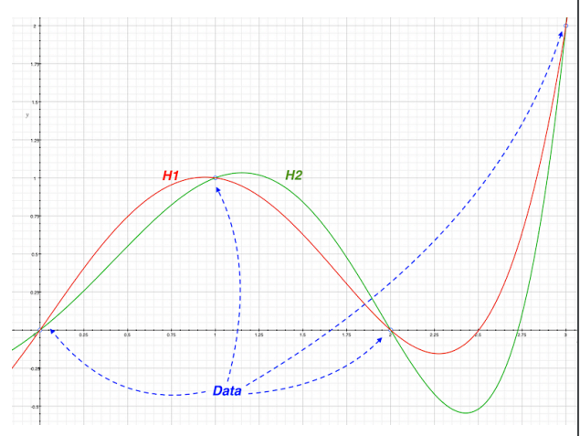

# Scientific Goals, Methods and Knowledge

TODO

# Philosophy of Science

TODO

# Scientific Method

TODO

# Methodology

TODO

# Logic

## Logically and Physically Impossbile

- physically impossible: incosistent with laws of nature.
- logically impossible: incosistent with the laws of logic (e.g. a square is a circle).

## Soundness

An argument is sound if it is both valid in form and its premises are true. An argument is valid even if all the premises are true but the conclusion is false. The structure is what is important here.

# Inference

## Deduction

We call an inference deductive if the conclussion necessarily follows from the premises. The truth of the premises guarantees the truth of the conclusion. To believe the premises is to believe the conclusion. Deductive arguments are explicative, you do not learn anything from a deductive argument.

### Truth Preserving

Deduction is truth preserving because it is not logically possible for its premises to be true while its conclusion is false (premises **entail** the conclusion). Remember the conclusion still may be false.

### Falacy of Affirming the Consequent

- all bankers are rich
- Tim is rich
- therefore Tim is a banker

This is a wrong deductive argument (all rich are not bankers, but all bankers are rich). Thus:

- all bankers are rich
- Tim is a banker
- therefore tim is rich

This is a good deductive argument.

### Modus Ponens | Modus Tollens

Modus ponens and Modus tollens are rules of inference in deductive reasoning. Deduction is top-down logic because we reach a particular conclusion from general premises. Conversely, bottom-up logic takes us from specific cases to a general conclusion.

Modus ponens means "method of putting by placing" or **affirming the antecedent**. Its pattern is:
- $P \to Q, P => Q$ ($P$ implies $Q$. $P$ is true. Therefore $Q$ is also true).
- If $P$ (antecedent), then $Q$ (consequent). $P$ (affirming the antecedent or "putting by placing"). Therefore $Q$.

Modus tollens means "method of removing by taking away" or denying the consequent. Its pattern is:
- $P \to Q, \overline{Q} => \overline{P}$
- P implies Q. Q is false. Therefore P is also false.

### Examples

1. Deductively valid but not sound:
   1. All fruits are green (false)
   2. Carrots are fruits (false)
   3. Therefore carrots are green (false)
2. Deductively valid with false premises and a true conclusion:
   1. All fruits are green (false)
   2. Cabbages are fruits (false)
   3. Therefore cabbages are green (true)
3. Deductively invalid but otherwise persuasive:
   1. If the car is broken, it would not move
   2. The car does not move
   3. Therefore the car is broken
4. Deductively invalid (denying the antecedent):
   1. If the car is broken, it would not move
   2. The car is not broken
   3. Therefore it moves

## Induction

Inductive inferences are **ampliative** - conclusions go beyond what is contained in their premises. It is logically possible for premises be true, but conclusion is false. Conclusions can be still wrong if infinetely many examples confirm otherwise. **Premises do not entail the conclusion**.

In induction, we go from specific examples to general conclusion instead of going from general examples to specific conclusion.

### Strong | Weak

An inductive argument is strong iff the truth of its premises make conclusion significantly more likely to be true. Conversely, it is weak iff the truth of its premises make its conclusion only slightly more likely to be true.

### Example

- The first five eggs in the box were good.
- All the eggs have the same best-before date stamped on them.
- Therefore the next egg will be good too.

### Principle of Induction

Principle of induction consists of two parts:

- When a thing of a certain sort A has been found to be associated with a thing of a certain other sort B, and has never been found dissociated from a thing of the sort B, the greater the number of cases in which A and B have been associated, the greater is the probability that they will be associated in a fresh case in which one of them is known to be present.
- Under the same circumstances, a sufficient number of cases of association will make the probability of a fresh association nearly a certainty, and will make it approach certainty without limit.

As just stated, the principle applies only to the verification of our expectation in a **single** fresh instance. But we want also to know that there is a probability in favour of the general law that things of the sort A are always associated with things of the sort B, provided a sufficient number of cases of association are known, and no cases of failure of association are known. The probability of the general law is obviously less than the probability of the particular case, since if the general law is true, the particular case must also be true, whereas the particular case may be true without the general law being true. Nevertheless the probability of the general law is increased by repetitions, just as the probability of the particular case is. We may therefore repeat the two parts of our principle as regards the general law, thus:
- The greater the number of cases in which a thing of the sort A has been
found associated with a thing of the sort B, the more probable it is (if no
cases of failure of association are known) that A is always associated with B;
- Under the same circumstances, a sufficient number of cases of the
association of A with B will make it nearly certain that A is always associated
with B, and will make this general law approach certainty without limit.

It should be noted that probability is always relative to certain data. In our case, the data are merely the known cases of coexistence of A and B.

Inductive principle is at any rate not capable of being disproved by an appeal to experience. It is equally incapable of being proved by an appeal to experience.

The general principles of science, such as the belief in the reign of law, and the belief that every event must have a cause, are as completely dependent upon the inductive principle as are the beliefs of daily life. All such general principles are believed because mankind have found innumerable instances of their truth and no instances of their falsehood. But this affords no evidence for their truth in the future, unless the inductive principle is assumed.

# Scientific Inference

- Partial data can misrepresent the underlying phenomena that shapes the data.
- Induction weaknesses: Inductive inferences are ampliative, and their conclusions could be totally wrong even if infinitely many examples confirm them. This ampliative factor has also an amplifying effect over the partial data (or
information) from which we infer a conclusion.

## Monotonicity

Monotonic inference: Adding more premises to an argument allows you to
derive all the same conclusions as you could with fewer premises: 
$$A \to p \text{( conclusion $p$ follows from a set of premises $A$)}$$
$$A \cup B \to p \text{ also holds (conclusion $p$ also follows from $A \cup B$)}$$

Conversely, reasoning is non-monotonic when a conclusion supported by a
set of premises can be retracted in the light of new information.
- Medical diagnosis fits very well under such definition.

## Defeasible Reasoning

Defeasible reasoning allows for reasoning with default assumptions, which can be overridden or defeated by additional information.  It is a subset of non-monotonic reasoning that focuses on reasoning with default assumptions that can be overridden by specific conditions or exceptions. Involves a specific framework with a distinction between strict rules (default assumptions) and defeasible rules (rules that can be overridden), as I mentioned in the previous response.

Deals with tentative relationships between premises and conclusions In real-world, reasoning conflicts arise. For example, we may conclude that Tweety flies knowing that it is a bird.
However, we can retract this inference when we learn that it is actually a
penguin. Is indeed a bird, but it cannot fly.

  

Defeasible reasoning is not exempt from limitations, requiring
from causal information to properly derive conclusions under
certain scenarios. In the real-world, reasoning conflicts arise.

  

## Induction in science

Whenever scientists move from limited data to general conclusions scientists are
reasoning inductively. In inductively valid arguments, the (joint) truth of the premises is very likely (but not
necessarily) sufficient for the truth of the conclusion.

- Justification **with** an inference rule: Justifying the conclusion by pointing to the premise and the inference rule.
Inference rules justify conclusions.
- Justification **of** an inference rule: What makes X a good inductive inference? Why not choosing other
parameters? The choice of a particular inference rule must be justified

## Hume's Problem of Induction

We use induction to justify our statements, but how do we
justify induction itself?
Hume argues that we cannot make a causal
inference just by a priori means. For Hume, whenever we make inductive inferences we presuppose
the uniformity of nature. For him, the mere act that you can imagine a world where nature behaves differently, lead us to believe
that we cannot prove if the uniformity assumption is true, because a slight possibility exists from things to
behave differently (at some level).

It concerns specific inductive inferences. Particularly **enumerative** **induction**.
- “All observed instances of A have been B” and “The next instance of A will be B”.

Reasoning:
1. Every inference is either inductive or deductive.
2. To justify an inductive inference rule I, this rule must be inferred from some premises.
3. Is not possible to infer the rule I deductively, because there are no necessary connection between past
and future inferences.
4. Therefore, the rule I must be inferred inductively.
5. When inferring I inductively, we must invoke another inductive inference rule J to justify this induction.
But then, how do we justify J? … [infinite regress].

A workaround is to either deny that science relies on induction (Popper) or to
find a different interpretation of justification (Coherentism).

- A conclusion reached from data may not hold in a different place or at a
different time.
- Consequently, a model built based on data can become invalid over time or at
a different place.
- Data alone is not enough.

## Coherentism

Coherentism states that a claim is the more justified the more it forms a coherent system with other beliefs or claims one accepts.
Perhaps the inductive inference rules are not the foundations, but together with good inductive practices they may form a coherent system.

## Abduction

Formulation: Given evidence $E$ and candidate explanations $H_1,…, H_n$ of $E$, infer
the truth of that $H_i$ which best explains $E$.

- The cheese in the larder has disappeared, apart from a few crumbs.
Scratching noises were heard coming from the larder last night.
Therefore, the cheese was eaten by a mouse (need prior knowledge that mice like cheese).

## The Hypothetico-deductive (H-D) Method

Reminder of Scientific Method:
- Observe
- pose a Question
- guess a Hypothesis H
- Test H
- make Theory

The Hypothetico-deductive Method:
1. Propose Hypothesis H
2. Deduce observable consequences $\{C_i\}$ from H
3. Test. Look for evidence that conflicts with the predicted $\{C_i\}$ in order to disprove H
4. If $\{C_i\}$ is false, infer that H is false, reformualte H
5. If $\{C_i\}$ is true, icrease confidence in H

## Good Hypothesis

- Scope, parsimony (simple over complex)…
- The hypothesis must be either true or false (i.e. testable and falsifiable):
   - e.g. “Boiling point of a liquid increases with increase in pressure”
   - It must be possible to gather evidence that will reject the hypothesis if it is indeed false.
- The hypothesis must not be a tautology, i.e. H is not necessarily true or false.
   - e.g. bachelors are unmarried (in English bachelor means “a man who is not and has never been marriedF”)
- Should be informed by previous theories or observations and logical reasoning.
- H must be positive. We need to make a positive statement about the existence of an effect
rather than stating that a relationship or effect does not exist.
- It should have some generality (e.g. “things of certain type…”)
- The consequences must be directly observable or with the help of
measurements (e.g thermometer, microscope, X-ray, etc).
- Deduction must be valid.
- The consequences must be relevant for the hypothesis

## Falsification and Falsificationism | Popper

**Falsifiability** is a quality of a hypothesis or a theory. Is the quality of a hypothesis to be
proven wrong. 

**Falsification** is the observation that an implication of a hypothesis is not true which
implies the falsity of the hypothesis. Hypothesis can only be falsified if they are falsifiable.

Popper thought that science was and should be deductive, and
therefore that the lack of justification for inductive inferences was
not as damaging for science.

In a falsifiable theory or hypothesis there must exist an observable
situation that acts as potential falsifier of the theory or hypothesis.
Such falsifier is used as evidence against T or H (e.g. all swans are white, but there exist black swan, which contradicts it).

But, “all men are mortal” is not falsifiable. We would need a man to be immortal but that’s a never ending status that cannot be tested.
On the other side “all men are immortal” is a falsifiable proposition,
since “a dead man” would contradict it

Newton's law of gravitation is falsifiable by “The brick fell upwards
when released”.

Popper argues that scientific theories should be able to be tested and
potentially proven false. For him, science should attempt to disprove
a theory, instead of continually support theoretical hypotheses.

We get:
- Asymmetry between confirmation and falsification
   - Propose falsifiable hypotheses.
   - Try to falsify these hypotheses with observable evidence.
   - Reject any falsified hypothesis as false.
   - Never accept any hypothesis as true. Consider non-falsified hypothesesas “not-rejected yet”.
- Although a scientific theory can never be proved true by a finite
amount of data, it can be proved false, or refuted by a single experiment

**Critics**: Asymmetry is an illusion, because whenever we refute a universal
statement we thereby verify its negation
- If we refute: “All apples are green” == “There is no non-green Apple”
We automatically verify the hypothesis "There is a non-green apple”

Going from “this piece of metal does not conduct electricity” to
“it is false that all pieces of metal conduct is electricity” is a
deductive inference. The premise entails the conclusion.

Limitations:
- Popper’s view of science is very limiting.
- It does not reflect the actual scientific practice.
- It does not allow to distinguish between non-falsified hypotheses.
- Popper says: “Obtaining evidence in favour of a given theory is
generally easy”
   - Such corroboration should count scientifically only if it is the positive result of
a genuinely risky prediction, which might conceivably have been false (Eddington Expeditions about Einstein's prediction).

## Auxiliary Hypotheses

Falsificationism ignores that every observation is a consequence
of previous theories, and requires the acceptance of some other
hypothesis. It is unclear which theory is falsified. Is it the one that is being
studied or the one behind the observation we are conducting?
- Galileo Galilei and his reports of mountains on the moon
and Jupiter satellites. Philosophers such as Cesare Cremonini
who refused to look through the telescope, argued that the
instrument itself might have introduced artefacts, producing a
visual illusion.

Hypothesis: “this liquid contains 3 substances” does not entail any
direct observable consequence.
- We might use distillation or chromatography to test such
hypothesis but this requires relying on **auxiliary hypotheses**.
(e.g. does the machine work properly?)

## Duhem-Quine Thesis

We never test a single hypothesis alone, but only in conjunction
with various auxiliary hypotheses. To falsify a hypothesis we must be confident that the responsible for falsity of the
consequence are not the auxiliary hypotheses but the main hypothesis

Changes in H-D Method:
1. Propose Hypothesis H
2. Deduce observable consequences $\{C_i\}$ from H **in conjunction with auxiliary hypotheses $AH_j$**
3. Test. Look for evidence that conflicts with the predicted $\{C_i\}$ in order to disprove H
4. If $\{C_i\}$ is false, infer that $H \& \{AH_j\}$ is false, reformualte H
5. If $\{C_i\}$ is true, icrease confidence in $H \& \{AH_j\}$

## Ad-hoc Modification

An ad-hoc hypothesis is added to a theory to save it from being falsified. A
modification is considered ad-hoc if it reduces the falsifiability of the
hypothesis in question
-  phlogiston theory

## Confirmation

Confirmation is the act of using evidence to justify increasing the confidence in the
hypothesis. It is not based on deductively valid inferences. In the HD method we identify
some consequence C that is an implication of hypothesis H.
- H implies C, then if H is true, we conclude that C is also true. (by M. Ponens)
- If C is false, we conclude that H is false too. (by M. Tollens)
- However, M. Ponens & M. Tollens do not tell us what to conclude if C is true.
There is no valid deductive inference for the case where H implies C and C is true.
(affirming the consequent!)
- Instead, the employed rule must amplify the information contained in the premises
 to infer the conclusions (inductive inferences)

- Confirmation requires inductive inferences 
- Such inferences are fallible 
- Fallibity comes in degrees
- Degrees are affected by the kind and quality of the evidence
- If observation O confirms hypothesis H, then $P(H|O) > P(H|\lnot O)$

## Bayesians vs Frequentists

Frequentist learning only depends on the given data
- Frequentists interpret the probabilities as the frequencies of repeatable observable events.
- The frequentist computes the probability of result or data D given hypothesis H is true.
- $P(D|H)$

Bayesian learning is performed by the prior belief as well as the given data.
- Bayesian approach focus on the probability of hypothesis H when the result of data D occurs.
- P(H|D)

### Problem of Underestimation

The compatibility issue: Many hypotheses are compatible with any given observation. This
is called the problem of underdetermination.

ML models can fit available data, and yet we have to
decide which model/solution is best.
- Solutions include validation with external data.
- Choice based on non-epistemic values (e.g. making
money, making society more fair, etc)
- And many others.

  

