# Graphs

$G(V,E)$ - graph, $V$ - verticies, $E$ - edges ($ab \ne ba$).

## Directed Graph

$G(V,E)$ is a pair with $V$ - a set and $E$ - a subset of $V \times V$ ($\times$ - cartesian product: $A × B = B × A$, only if $A = B$).

Example:

$V = \{ 1,2,3\}, E = \{ (1,2), (1,1) \}$

Representation:

  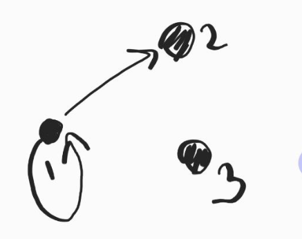

Terminology here:

- $(1,1)$ - loop
- $1,2$ are adjacent
- $1,3$ are independent

## Simple Graph

We say $G=(V,E)$ is simple if $E \subseteq V \times V \setminus \{ (i,i), i \in V \}$

Example:

$V = \{1,2,3\}, E=\{(1,2), (1,3), (2,3)\}$

  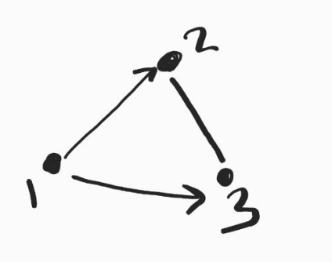

## Weighted Graph

A weighted graph (directed) $G=(V,E,f)$ is the couple $(V,E)$ and $f$ with $f:E \to A$, with $A$ an arbitrary set. $f$ is called **weight function** ($f$ maps $E$ to some number).

Example:

$V = \{1,2,3,4\}, E=\{(1,2), (1,3), (1,1)\}$\
$f: (1,2) \to 0.5, (1,3) \to 1, (1,1) \to 0$

  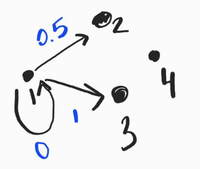

## Multigraph

We say $G=(V,E,f)$ is multigraph (directed) if $G$ is a graph (directed) with $f:E \to \mathbb{N}$. $f$ is called **multiplicity function**.

$V = \{1,2,3\}, E=\{(1,1), (1,2)\}$\
$f: (1,1) \to 1, (1,2) \to 2$

  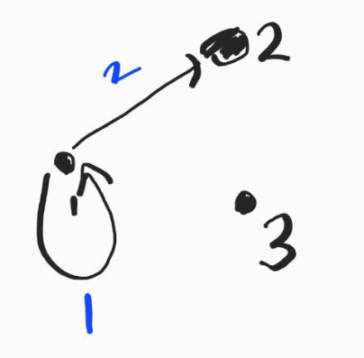

## Undirected Graph

We say $G=(V,E)$ is an undirected graph if $G$ can be represented as $(V,E)$ with $E \subseteq \{\{u,v\}|u,v \in V\}$ ($ab = ba$)

Example:

$V = \{1,2,3\}, E=\{(1,1), (1,2)\}$

  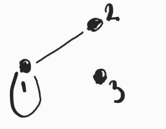

## Degree of a Vertex

The degree of $u \in V$, $deg_G(u), G=(V,E)$ - undirected graph, is:

$deg_G(u) = |v \in V | \{u,v\} \in E|$

Example:

$V = \{1,2,3\}, E=\{\{1,1\}, \{1,2\}, \{1,3\}\}$

$deg_G(1) = 3$

### Proposition

Let $G=(V,E)$ be a simple undirected graph. Then:

$$\sum_{v \in V}deg_G(v) = 2|E|$$

$\sum_{v \in V}deg_G(v) = \sum_{v \in V}\{\{u,v\}|\{u,v\} \in E\} = 2|E|$

For non-simple graph: $\sum_{v \in V}deg_G(v) = 2|E| - N_{loops}$

## Handshaking Lemma

The number of guests who shook hands with odd number of people is even.

Proof:

$V=\{guests\}$ - set of guests\
$\{v,u\} \in E$ s.t. $v$ and $u$ shook hands.

The graph $G$ is simple and undirected. Thus:

$2|E| = \sum_{v \in V}deg_G(v) = \sum_{e \in V}deg_G(e) + \sum_{o \in V}deg_G(o)$, where $e$ - guests who shook hands with even number of people, $o$ - guests who shook hands with odd number of people.

We know $2|E|$ is even, $\sum_{e \in V}deg_G(e)$ is even, $=> \sum_{o \in V}deg_G(o)$ is even.

## Isomorphism

Let $G=(V,E)$ and $G'=(V',E')$ be simple undirected graphs. A **bijection** $f:V\to V'$ is isomorphism between $V$ and $V'$ if $\forall u,v \in V$, $\{u,v\} \in E$: $\{f(u), f(v) \} \in E'$

Example:\
$V = \{1,2,3\}, E=\{\{1,2\}\}$\
$V' = \{4,5,6\}, E'=\{\{4,5\}\}$\
$f: 1\to4, 2\to5,3\to6$\
Since $\{f(1)=4,f(2)=5\} \in E' => G$ and $G'$ are isomorphic.

  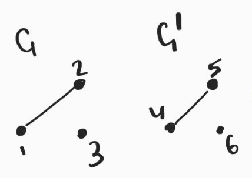

## Subgraph

Let $G=(V,E)$ be undirected simple graph. Let $G'=(V',E')$ be a graph. $G'$ is a subgraph of $G$ if $V' \subseteq V, E' \subseteq E$.

Example:

  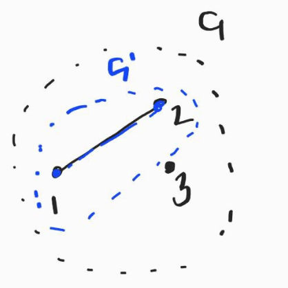

## Induced Subgraph

Let $G=(V,E)$ be undirected simple graph. Let $G'=(V',E')$ be a graph, subgraph of $G$. We say $G'$ is induced subgraph of $G$ if $\forall v', u' \in V'$ s.t. $\{u',v'\} \in E$ and $\{u',v'\} \in E'$

Example:

  

## Spanning

A graph $G' = (V', E')$ is a spanning subgraph of $G = (V, E)$ if $G'$ is a subgraph of $G$ with $V = V'$ that satisfies the condition $\forall v \in V, \exists e \in E'$ s.t. $v \in e$. Hence, a spanning subgraph of $G$ is a subgraph of $G$ whose edges 'span' the vertices of $G$ ($G'(V',E')$ is spanning if $V'=V$ and $E'$ is a subset of $E$)

  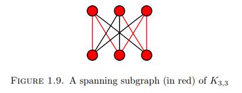

  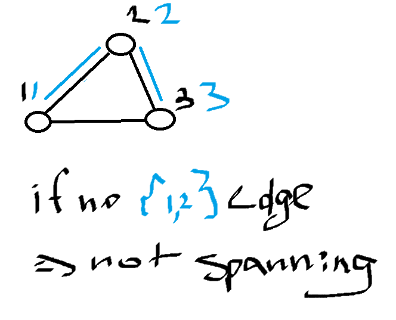

## Complete

Graph $G$ is complete graph (denote $K_n$) if $V=\{v_1, ..., v_n\}$ and $E=\{\{v_i, v_j\}, i,j \in \{1,...,n\}$ and $i\ne j\}$

Example:

$V = \{1,2,3,4\}$\
$E = \{\{1,2\}, \{1,3\}, \{1,4\}, \{2,3\},\{2,4\}, \{3,4\}\}$\
$K_4$\

  

## Cycle

$G$ s.u.g. We say the cycle (denoted as $C_n$) is the graph s.t. $V=\{v_1,...,v_n\}, E=\{\{v_i, v_{i+1}\}|i=1,...,n-1\} \bigcup \{v_n, v_1\}$\
Example:\
$V = \{1,2,3\}$\
$E = \{\{1,2\}, \{2,3\}, \{3,1\}\}$\
$C_3$\

  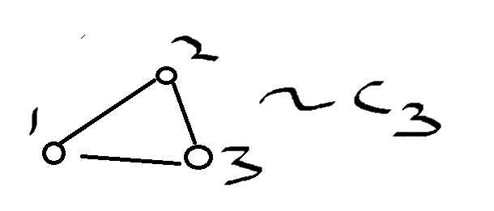

## Path

$G$ s.u.g. We say $G$ is the path (denoted as $P_n$) if $V=\{v_1,...,v_n\}, E=\{\{v_i, v_{i+1}\}, i=1,...,n\}$ (cycle without $\{v_n, v_1\}$).

Let $G=(V,E)$ be s.u.g. We say there is a path from $u$ to $v$, $u,v \in V$ in $G$ if $\exists$ a subgraph $G'$ s.t. $G'$ is isomorph to the path of length $n$ and $u, v \in V(G')$. We say the same for cycles $C_n$

## Walk

$n$-length of $P_n$. Walk from $v_1, ..., v_n$ is $\{v_1, \{v_1, v_2\}, \{v_2, v_3\}, ..., v_n\}$

### Path vs Walk vs Tour

1. Path:
- A *path* in a graph is a sequence of vertices in which each vertex is connected to the next one by an edge.
- The vertices and edges in a path are distinct, meaning no vertex or edge is repeated.
- Paths can be of any length, including zero (a path from a vertex to itself) or one (a path with a single edge).
- Paths are directed, meaning they follow the direction of edges if the graph is a directed graph, or they can be undirected in the case of an undirected graph.

2. Walk:
- A *walk* in a graph is a sequence of vertices and edges in which you can repeat vertices and edges.
- It's less restrictive than a path, as it allows for revisiting the same vertex or using the same edge multiple times.
- A walk can be a path if no vertex or edge is repeated, but it can also involve revisiting vertices and edges.
- Walks can be directed or undirected.

3. Tour:
- A *tour* is a specific type of walk in a graph where you start and end at the same vertex, forming a closed loop.
- In a tour, every vertex is visited exactly once, except for the starting and ending vertex, which are the same.
- If the tour covers each edge exactly once, it's called an Eulerian tour.
- If it covers each vertex exactly once and returns to the starting vertex, it's called a Hamiltonian tour.
- Tours can be directed or undirected, depending on the type of graph.

## Bipartite

$G=(V,E)$ is bipartite if $V=V_1 \bigcup V_2$ for some sets $V_1$ and $V_2$ and $E \subseteq V_1 \times V_2$ ($V_1$ and $V_2$ are disjoint) (a graph whose vertices can be divided into two independent sets, $U$ and $V$ such that every edge $(u, v)$ either connects a vertex from $U$ to $V$ or a vertex from $V$ to $U$).

  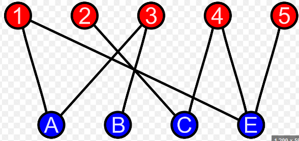

Let $G=(V,E)$ s.u.g. $G$ is bipartite iff. there is no cycle of odd length in $G$.

## Bipartite Complete

Let $V$ and $V'$ - two sets (disjoint) with $|V| = n, |V'| = m$. Then the complete bipartite graph $K_{m,n}$ is s.u.g. with $V(K_{m,n})=V\bigcup V', E=\{\{u,v\}|u \in V, v \in V'\}$ (map from $V$ to $V'$). $V$ and $V'$ are the ports of $K_{m,n}$.

Example:\
$V = \{1,2\}, V'=\{3,4\}, E=\{\{1,3\},\{1,4\}, \{2,4\}, \{2,3\}\}$\
$K_{2,2}$\

  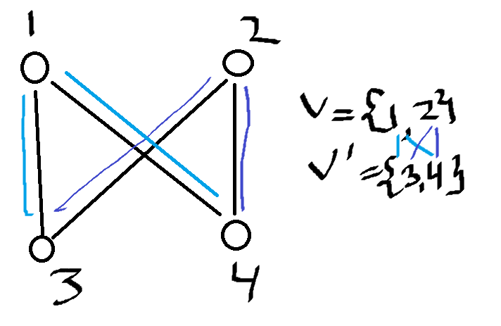

## Connected

A graph $G$ is connected if for any $u \neq v \in V(G)$, there is a path from $u$ to $v$.

## Distance

$G=(V,E)$ s.u.g. Distance $d_G(v,u): \{u,v\}, u,v \in V$ and $u \ne v \to$ length of the shortest path between $u$ and $v$.

$d_G: \{\{u,v\}, u \ne v, u,v \in V\} \to \mathbb{N}$\
$\{u,v\} \to n \in \mathbb{N}$, $n$ - length of the shortest path from $u$ and $v$.

## Degree of a Sequence | Score

The degree sequence of $G=(V,E)$ s.u.g. is (a **score** of $G$): $(deg_G(v_1), ..., deg_G(v_n))$ with $V=\{v_1, ..., v_n\}$

## Score Theorem

Let $n\ge1$ and degree sequence $C=(C_1, ..., C_n), C_1 \le...\le C_n$. Let degree sequence $C' = (C'_1, ..., C'_{n-1})$ s.t.:
$$C'_i = \begin{cases} C_i && 1 \le i \le n - C_n - 1 \\ C_i - 1 && n - C_n \le i \le n - 1\end{cases}$$

Then $G'$ s.u.g. has degree sequence $C' \iff \exists G$ s.u.g. s.t. $C$ is the degree sequence of $G$.

## Eulerian Tour

Let $G=(V,E)$ s.u.g. An Eulerian Tour is a Walk $T=\{v_0,e_1,v_1,...,e_n,v_0\}$ s.t. $E=\{e_i|i=n\}$ and $e_i\ne e_j \forall i=j, (v_1,...v_n) = V$. Allows to go back to vertex **without repeating an edge**. Traverses **all edges and verticies**.

  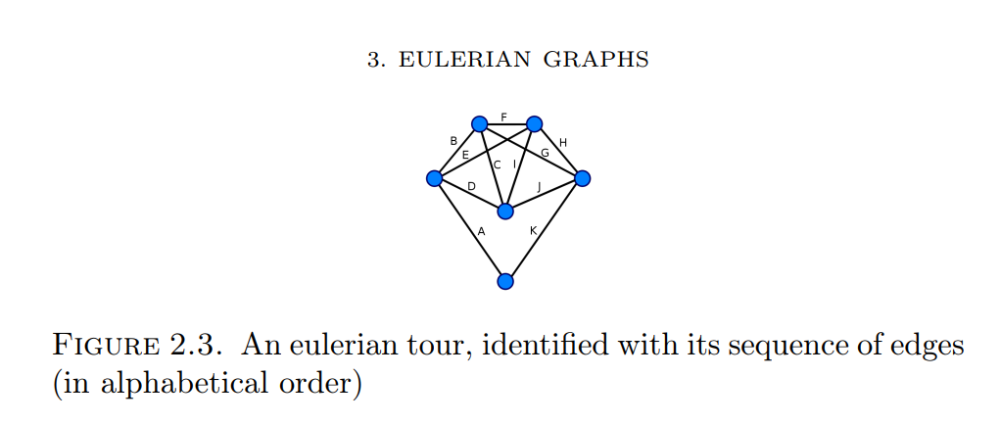

We say $G$ is Eulerian if it admits an Eulerian Tour.\
Adding loops does not change anything about the existence of Eulerian Tour. We can generalize it to u.g.\
A Tour is a Walk between two verticies that are the same.

### Proposition

Let $G=(V,E)$ s.u.g. $G$ is Eulerian $\iff G$ is connected and $deg_G(v_i)$ is even $\forall v_i \in V$

  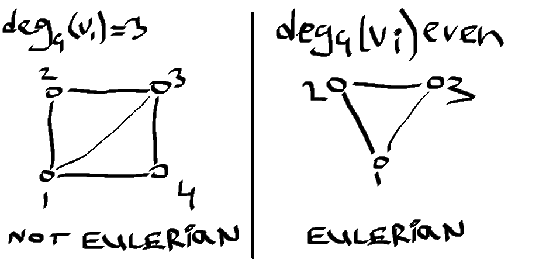

**Proof**:\
(*Necessity*) Let $T = (v_0, e_1,..., e_t, v_o)$ be an eulerian tour in $G$. Each time a vertex $v$ appears in the tour, it has an 'ingoing' vertex and 'outgoing' vertex in the tour. Hence, since every edge appears once and only once in the tour, each vertex has an even degree.\
(*Sufficiency*) Let $G=(V,E)$ be a connected simple graph whose verticies have even degree. Let $T=(v_0,e_1,...,e_m,v_m)$ be a tour (should probably be a walk or a path here, not tour) in $G$ of longest possible length. We  prove that (1) $v_m=v_0$ and (2) $E = \{e_i | i \in \{1, ..., m\}\}$
1) If $v_m \ne v_0$ then $v_0$ is connected to an odd number of edges of $T$. Since the degree of $v_0$ is even, there is an $e \in E \setminus E(T)$.By appending $e$ to the tour $T$, we obtain a tour in $G$ which is strictly longer than $T$, and get a contradiction.
2) First prove that $V(T) = V$. Since $G$ is connected, there is a vertex $v \in V \setminus V(T)$ and a $k \in \{1,...,m\}$ s.t. $e = \{v, v_k\} \in E$. It follows that $(v,e_{k+1}, v_{k+1},..., v_m, e_1, v_1,...,e_k,v_k)$ is a tour in $G$ which is strictly longer that $T$, we get a contradiction.

Then, we prove that $E(T) = E$. Otherwise, let $e = \{v_l, v_k\} \in E \setminus E(T)$ with $l < k$. Then $\{v_l, e_{l+1},..., e_k, v_k, e_{k+1},...,v_m,e_1,...,v_l,e,v_k\}$ is a tour in $G$ which is strictly longer than $T$, we get a contradiction.

### Könisberg’s Bridge Problem

Problem: is it possible to find a walk in the city where we cross every bridge once only.

  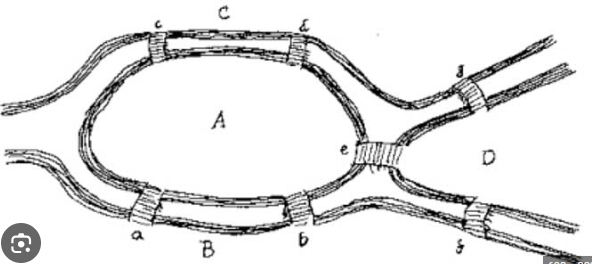

It is impossible to find a continuous route that would cross each bridge once and return to the starting point if more than two land masses had an odd number of bridges connecting to them.

### Hierholzer Algorithm | Find an Eulerian Tour

1. Pick any $v \in V(G)$.
2. Construct a Path with no repeated edge from $v$ to $v$ (no way to get stuck because of the even degrees of the verticies)
3. Pick $v' \in V$ s.t. $\{v', v''\}$ does not belong to the path, but $v'$ belongs to it.
4. Build Tour from $v'$ to $v'$ using only edges that are not used already.
5. Iterate $\to$ get Eulerian Tour.

## Inner Degree | Outer Degree

Let $G=(V,E)$ a s.d.g.(**simple** directed graph). We define $\forall v \in V, deg_{-}(v) = \{v' \in V | (v, v') \in E\}$ (all edges leave $v$, outer degree), $deg_{+}(v) = \{v' \in V | (v', v) \in E\}$ (all edges arrive in $v$, inner degree)

## Eulerian Tour for Directed Graph

Let $G=(V,E)$ s.d.g. An Eulerian Tour in $G$ is a sequence $(v_0, e_1,..., e_n, v_0)$ where $V=\{v_0,...,v_n\}$, $e_i=(v_{i-1}, v_i), \forall i\ne j, e_i \ne e_j$ and $E=\{e_1, ..., e_n\}$

Let $G=(V,E)$ a s.d.g. $G$ is Eulerian $\iff$ $G$ is connected and $deg_{-}(v)=deg_+(v) \forall v \in V$

## Hamiltonian Tour

Let $G=(V,E)$ a s.u.g. A Hamiltonian Tour is a sequence $(v_0, e_1, v_1,...,e_n, v_0)$ s.t. $V=\{v_0,...,v_n\}$ and $v_i\ne v_j \forall i\ne j$ and $e_i \in E \space \forall i$ (same as Eulerian Tour but do not pass through the same vertex, not edge, or it is an Eulerian Tour for verticies).

### Traveling Salesman Problem

Have cities, roads between cities. Have distances of roads. Goal: find shortes path that goes through all the cities and come back to the starting city and does not go through the same city twice = finding a Hamiltonian Tour.

### Definition

Let $G=(V,E)$ s.u.g. and $S \subseteq V$. Let define $G-S=(V',E')$ the graph s.t. $V' = V /S$ and $E' = \{\{v,u\} \in E|v, u \in V'\}$

### Proposition

Let $G=(V,E)$ a s.u.g. and $S \subseteq V$ a non-empty set. If $G$ is Hamiltonian, i.e. has a Hamiltonian Tour, then the number of connected components in $G-S$ is at most $|S|$ (cardinatility of $S$).

**Proof**:\
Let $C$ be an hamiltonian cycle in $G$. Let $k$ be the number of connected components of $G-S$.\
If $k=1$ the result is trivial.\
Assume $k>1$. Let $G_1,...,G_k$ be connected components of $G-S$. For any $i \in \{1,...,k\}$, we define $u_i$ and $v_i$ as the last vertex of $C$ that belongs to $G_i$ and its direct successor in $C$, respectively.\
We prove that $\{v_1,...,v_k\} \subseteq S$. Assume $v_1 \nsubseteq S$. Then $v_1 \in V(G-S)$ and $(u_1, v_1) \in E(G-S)$ (this edge is in $E$ since it appears in cycle $C$). Since $u_1 \in G_1$, we have $v_1 \in G_1$, a contradiction.

### Proposition

Let $G = (V,E)$ a s.u.g with $|V| \ge 3$. If $\forall v \in V, deg_G(v) \ge \frac{|V|}{2}, G$ is Hamiltonian.

## Tree

Let $G=(V,E)$ a s.u.g. $G$ is a tree if $G$ is **connected** and if there are **no cycles** in $G$.

### Proposition | End Vertex

Let $G = (V,E)$ a s.u.g. $|V| \ge 2$:
1. $G$ is a tree $\iff $G$ has atleast 2 end verticies.
2. $G$ is a tree $\iff G-v$ is a tree $\forall v \in V$ s.t. $deg_G(v) = 1$ (end vertex).

#### Proof

1. If $G$ is a tree and there is less than 2 end verticies, then:\
Let $P$ be the path of largest length\
There exist an endpoint of this path, last vertex of $P$, connected to one of the vericies in $P$, then we have a contradiction, then there is a cycle (if vertex connected not to an element in $P$, then $P$ is not a path of largest length).

2. $<=$ if $G-v$ is a tree, adding $v$ will yield another tree.\
$=>$ no cycle in $G$ (clear)\
Connectiveness: if we pick $v_1$ and $v_2$, $v_1, v_2 \neq v$ in $G$, $\exists$ path $P$ with a starting point $v_1$ and endpoint $v_2$\
But $deg(u) \space \forall u \in P \space \ge2 \space \forall u \ne v_1, v_2 => \forall u \in P u \ne v => OK$

## Proposition

If $G=(V,E)$ s.u.g. Then the following are equivalent:
1. $G$ is a tree
2. $\forall v_1, v_2 \in V \exists$ unique path $P$ between $v_1, v_2$
3. $G$ is connected and $G - e := (V, E \setminus e)$ is not connected $\forall e \in E$
4. $G$ contains no cycle and $G+e:=(V,E \cup e)$ has a cycle $\forall e=\{v_1, v_2\} \notin E, v_1,v_2 \in V$
5. $G$ is connected and $|V| = |E| + 1$

**Proof**:

1. $1 \iff 2$: No cycle $=$ unicity of P (if have two ways to define paths between verticies, then we have a cycle). both graphs are connected, because there is a path between $v_1$ and $v_2$
2. $2 \iff 3$: connected $\iff$ $\exists$ path $P$ between $v_1, v_2$. unicity of $P$ $\iff (V, E\setminus e)$ is not connected (unique path = remove edge, graph becomes unconnected).
3. $1 \iff 4$: let add edge $e=\{v_1, v_2\}$ to $E, e \notin E, v_1,v_2 \in V$. Because of connectiveness, $\exists P \in G$ from $v_1$ to $v_2$. Adding $e$ would then yield a cycle.
4. $4 \iff 1$: $G$ is connected. Indeed, let $\{v_1, v_2\}$ a pair of elements of $V$. either $\{v_1,v_2\} \in E$ $=> \exists P$ between $v_1, v_2$ or $\{v_1, v_2\} \notin E =>$ but adding $e$ to $E$ will yield a cycle $=> \exists P \in G$ from $v_1$ to $v_2$
5. $1 \iff 5$: $G$ is a tree $\iff G - v$ is a tree $\forall v$ s.t. $deg_G(v)=1$. Remove $v$ from $G$ and get that set of edges $E(G\setminus v) = |E| - 1$. Iterate until $|v-v_1-...-v_n| = 2$ and we get the result $|V| = |E| + 1$.
6. $5 \iff 1$: Induction on $|V|$. If $|V|=2$ - trivial. If $|V| = n$, then $(i) \sum_{v\in V}deg_G(v) = 2 |E| = 2(|V| - 1)$. Since $G$ is connected, we know that $deg_G(v) \ge 1 \forall v \in V$. We also know that $\exists v \in V$ s.t. $deg_G(v) < 2$ (from $(i)$). Remove $v$ from $G$: $G - v$ is a tree by induction hypothesis $=> G$ is a tree.
7. $1 \iff 3$: implies "Trees are minimal connected graphs".
8. $1 \iff 4$: implies "Trees are maximal graphs with no cycle".

## Labelled Tree

A labelled tree is a tree $T=(V,E)$ with $V=\{1,...,n\}$.

## Prüfer Sequence

Different way (more explicit) to represent a tree.

Algorithm:\
Let $T$ - labelled tree, s.t. $V=\{1,...,n\}$\
Let $P$ an empty list
Different way (more explicit) to represent a tree.

Algorithm:\
Let $T$ - labelled tree, s.t. $V=\{1,...,n\}$\
Let $P$ an empty list
1. Identify the smallest $i$ s.t. $deg_T(i) = 1$
2. Construct $G \setminus i$
3. Append the unique $j \in V$ s.t. $\{i,j\} \in E$ to the list $P$.
4. Iterate until $|V| = 2$

Length of the Prüfer Sequence is $|V|-2$

## Reconstruct Tree from Prüfer Sequence

Algorithm:\
Let $G = (V = \{1,...,n\}, E = \empty)$ (graph with no connection).\
Let $P = (P_1,...,P_{n-2})$ with $P_i \in \{1,...,n\} \forall i=1,...,n$\
Let $D = (1,...,1)$ sequence of length $n$
1. For all $j = 1,...,n-2$: $D_i = D_i + 1$ if $P_j = i$
2. For all $i = 1,...,n-2$: add $\{P_i, j\}$ to $E$ with $j$ the smallest integer s.t. $D_j=1$
    - $D_j = D_j - 1$
    - $D_{p_i} = D_{p_i} - 1$
7. Add $\{u,v\}$ where $u$ and $v$ are the two last verticies with degree 1.

## Proposition

Two labelled trees are isomorphic $\iff$ they have the same Prüfer sequence.

Proof:\
We are going to consider:
- $T=(V,E)$ a tree
- $P(T)$ its Prufer sequence

Let $P(T) = (P_1,...,P_{n-2}), |V| = n$. We are going to show that there is no $T'$ not isomorphic to $T$ not including $P(T') = P(T)$
- By induction: $n=2:$ clear because 1 tree with $V=\{1,2\}$\
Let assume that (1) holds for $|V|=n-1$. We prove that (1) holds for $|V|=n$.\
$\forall P_i, i=1,...,n-2, deg(P_i) \ge 2$\
also $\forall u \in \{V \setminus \{P_1,...,P_{n-2}\}\}$, we have that $deg(P_i)$ = 1\
Let $v$ the smallest element of $\{V \setminus \{P_1,...,P_{n-2}\}\}$, since $deg(v) = 1$ we have that $v$ has $P_1$ as only neighbor.\
Let us consider $T' = \{V \setminus v, E \setminus \{v, P_1\}\}$. $|V(T')|=n-1 => T'$ is the only tree with Prufer sequence $(P_2,...,P_{n-2})$ (induction). $=>$ The only tree s.t. it has Prufer sequence $(P_1,...,P_{n-2})$ is obtained by adding $v$ to $V(T)$ and $\{v, P_1\}$ to $E(T')$

## Cayley Formula

There is $n^{n-2}$ labelled trees with $|V|=n$.

## Definition

Let $G=(V,E)$ a s.u.g. A spanning tree $T$ is a spanning subgraph of $G$ which is a tree.

If $G=K_n$ (complete graph) there are $n^{n-2}$ spanning (labelled) trees.

## Algorithm for Constructing a Spanning Tree

Let $G=(V,E)$ a s.u.g. with $|V|=n,E=(e_1,...,e_m)$. Let $E_0 = \empty$
- For $i\ge1$: consider $E_i = E_{i-1} \cup (e_i)$ if $(V, E_{i-1} \cup (e_i))$ has no cycle, else $E_i = E_{i-1}$
- Stop when (let say at step $k$) $|E_i| = n - 1$ or when $i=m$

$=>$ get spanning tree is $T=(V,E_k)$

## Proposition

Let $G=(V,E)$ s.u.g. s.t. $|V|=n$. Let $T=(V,E_T)$ the output of the spanning tree algorithm. Then, $T$ is a (spanning) tree of $G$ if $|E_T| = n-1$ and $G$ is not connected otherwise.

Proof:\
WTS that $T$ is a tree.
- If $|E_T| = n-1$. $T$ does not contain any cycle by construction.\
Now we show that $T$ is connected. Assume that $T$ is not connected. Then, there exists $T_1$ a connected component with $E(T_1) > |V(T_1)| - 1$. Then $T_1$ is not a tree, then $T_1$ has a cycle, because $T_1$ is connected $=>$ a contradiction.
- If $|E_T| < n-1$. We know that $T$ is not a tree. Since $T$ has no cycle, it means that $T$ is not connected. Assume there exists $x,y \in V$ s.t. $x \in T_i$ and $y \in T_j$, where $T_i, T_j$ distinct connected components of $T$ and s.t. they belong to the same connected component in $G$. There exists a shortest path $P=(x, e_1, v_1,..., v_l, e_{l+1}, y)$ from $x$ to $y$ in $G$. But $x \in T_i$ and $y \in T_j$ so there exist $m=\max\{k|v_k \in V_i, v_k \in P\}$\
$=> \{v_j, v_{j+1}\} \in E \setminus E_T$. By construction $(V, E_T \cup \{v_j, v_{j+1}\})$ has a cycle (because $|E_T| < n-1$)\
$=>$ there exist a path from $x$ to $y$ in $T$, we get a contradiction. 

## Definition

Let $G=(V,E)$ a s.u.g. weighted. $T$ is a minimal spanning tree if $T$ is a spanning tree and $\sum_{e \in E(T)}w(e)$ is minimal.

## Algorithm for Constructing the Minimal Spanning Tree

Let $G=(V,E,w)$ a weighted s.u.g.
1. construct the set $\{e_1, ..., e_n\}$ where $w(e_i) \le w(e_j), \forall i \le j$ and $E=\{e_1,...,e_n\}$ (order elements by weights)
2. apply the algorithm to construct a spanning tree.

## Depth-First Search | Breadth-First Search

Assume $T$ is a tree and we have some condition $C(V)$ over $v \in V(T)$ and that we want to get a vertex $v$ satisfying $C(V)=TRUE$

### Depth-First Search Algorithm

We have $T$ a tree, a starting vertex $r \in V(T)$ and we have a condition $C: V(T)\to\begin{cases}
  TRUE \\ FALSE
\end{cases}$

We define function:

$\text{explore}(T, u \in V(T))$
- $\text{if }(C(u)=TRUE)$
  - $\text{return } u$
- $\text{else label }u\text{ as explored}$
- $\forall v' \text{ s.t. }\{v', u'\}\in E(T) \text{ and }v' \text{ is not labelled}:$
  - $\text{explore }(T, v')$

## Shortest Path Problem

Let $G=(V,E,W)$ s.d.w.g. with weight function $W$. Assume $G$ is connected. We want to find a path of **minimum** length / weight from $u \in V$ to $v \in V$.

More formally, let $W(u,u) = 0, \forall u \in V$. Let $W(u,v) = \infty$ if $(u,v) \notin E$. Length of the path $P(u, e_1,\dots,e_n,v)=\sum^n_{i=1}W(e_i)$

## Dijkstra Algorithm | Shortest Path from One Vertex to Another

1. initialization phase:
   1. $X=\{u\}$
2. $\forall v \in V$
   1. define $L(v)=W(u,v)$
   2. set $P(v)=\{u,v\}$
3. while $X\neq V:$
   1. pick $v_{min}\in V \backslash X$ s.t. $\forall v \in V \backslash X: L(v_{min})\le L(v)$
   2. $X=X \cup \{v_{min}\}$
   3. $\forall v \in V \backslash X:$
      1. if $L(v) > L(v_{min}) + W(v_{min}, v)$
         1. $L(v) = L(v_{min}) + W(v_{min}, v)$
         2. $P(v)=P(v_{min})\cup v$

### Proposition

At each step of the algorithm we have:

1. $\forall v \in V, P(v) =$ path from $u$ to $v$ of length $L(v)$
2. $\forall v \in X, L(v) =$ the minimal length in path from $u$ to $v$
3. $\forall v \in V \backslash X, L(v) =$ the minimal length in path from $u$ to $v$ with verticies (outside of $v$) belonging to $X$.

### Breadth-First Search Algorithm

- input: 
   1. a tree $T=(V,E)$ 
   2. a starting vertex $r$
   3. a condition $C: V \to \begin{cases}
    TRUE \\ FALSE
   \end{cases}$
- output: a vertex or $\emptyset$

1. initialization phase: list $L$ and append $r$ to $L$
2. check if $C(L[1]) holds$
3. append the neighbors of $L[1]$ to $L$
4. remove $L[1]$
5. iterate

## Network

A network $N=(G,C,s,t)$ is a s.d.g. with $C:E(G) \to R^+$, a capacity function and a source vertex $s \in V$ and a target vertex $t \in V$. Here, capacity = weight. Problem: what is the maximum capacity that can flow from source vertex to a target vertex. Edge of zero capacity - nothing can pass through that edge.

### Flow

Let $N$ a network. A flow $f$ in $N$ is a map $f: E(G) \to R^+$ that satisfies:
1. $0 \le f(e) \le C(e), \forall e \in E(G)$
2. $\sum_{e | e^{(2)}=v}f(e) = \sum_{e | e^{(1)}=v}f(e), \forall v \in V \backslash \{s,t\}, e \in E(G)$

Let define $e^+ = e^{(2)}$ (goes in $v$) and $e^-=e^{(1)}$ (goes out of $v$).

### Proposition

If $f$ is a flow on $N$ (network), then

$$\sum_{e^+(t)}f(e) - \sum_{e^-(t)}f(e)=\sum_{e^-(s)} - \sum_{e^+(s)}, e \in E(G)$$

You cannot transmit more than what have been received by $s$.

#### Proof

$\sum_{e \in E(G)}f(e) = \sum_{e^-=s}f(e) + \sum_{e^-=t}f(e) + \sum_{v \neq s,t}\sum_{e^-=v}f(e)=\sum_{e^+=s}f(e) + \sum_{e^+=t}f(e) + \sum_{v\neq s,t}\sum_{e^+=v}f(e)$

$=> \sum_{e^-=s}f(e) + \sum_{e^-=t}f(e) + \sum_{v\neq s,t}\sum_{e^-=v}f(e) - \sum_{e^+=s}f(e) + \sum_{e^+=t}f(e) + \sum_{v\neq s,t}\sum_{e^+=v}f(e)=0$

$\sum_{v\neq s,t}\sum_{e^-=v}f(e) - \sum_{v\neq s,t}\sum_{e^+=v}f(e) = 0$ because $f$ is a flow.

Then $\sum_{e^+(t)}f(e) - \sum_{e^-(t)}f(e)=\sum_{e^-(s)} - \sum_{e^+(s)}, e \in E(g)$

### Value of Flow

Let $v(f) = \sum_{e^-=s}f(e) - \sum_{e^+=s}f(e)$ be the value of $f$.

### Maximal Flow

$f$ is maximal if $v(f) \ge v(f'), \forall f'$ flow.

1. establish a bound over $v(f)$
2. we show $\exists f$ s.t. bound is attained.

### Cut of Network

$N$ is a network. A cut of $N$ is a partition $(S,T)$ of $V(N)$ s.t. $s \in S, t\in T$ and the capacity of the cut $(S,T)$ is $C(S,T) = \sum_{e^- \in S, e^+ \in T}C(e)$

### Minimal Cut

We say that $(S,T)$ is the minimal cut if $\forall (S',T')$ partitions of $V(N)$ we have $C(S,T)\le C(S',T')$

### Proposition

Let $f$ a flow over $N$. For any cut $(S,T)$ of $N$ we have

$$v(f) \le C(S,T)$$

#### Proof

We have $\sum_{e^-=v, v\neq s, v\in S}f(e) - \sum_{e^+=v, v\neq s, v\in S}f(e)=0$

$=>$ the value $v(f)=\sum_{v \in S}\left(\sum_{e^-=v}f(e) - \sum_{e^+=v}f(e)\right)$

$=> v(f) = \sum_{e^-\in S, e^+ \in T}f(e) - \sum_{e^+\in S, e^- \in T}f(e) + \sum_{e^-\in S, e^+ \in S}f(e) - \sum_{e^+\in S, e^- \in S}f(e)$

Since $\sum_{e^-\in S, e^+ \in S}f(e) - \sum_{e^+\in S, e^- \in S}f(e)=0$

Since $f(e) \le C(e)$ and $0 \le f(e)$

$=>v(f) \le \sum_{e^- \in S, e^+ \in T}C(e) = C(S,T)$

### Augmenting Path

Let $N$ network, $f$ a flow. An augmenting path $W$ (without any cycle) is a path from $s$ to $t$ s.t. 
1. $f(e) < C(e), \forall e \in E(W)$
2. $f(e) > 0, \forall e | (e^+, e^-) \in E(W)$

### Augmenting Path Theorem

Let $N$ be a network. A flow $f$ in $N$ is maximal $\iff \nexists$ augmenting path with respect to $f$.

### Max-flow Min-cut Theorem for Integer Capacities

Let $N$ a network s.t. $\forall e \in E(N), C(e) \in N_0$. Then, $\exists f$ a flow s.t. $f$ is maximal and the value of $f$ is equal to:

$$v(f) = \min_{\{(S',T') \text{ partitions of } V(N)\}}C(S',T')$$

If $-> O <-$, we increase $->$, then decrease $<-$ by same amount.

#### Proof

Start by putting $f_0(e) = 0 \forall e \in E(N)$. If $f_0$ is not maximal, then by Augmenting Path Theorem, $\exists W$ augmenting path from the source to the target s.t. $d_1=\min\{\min_{e \in E(W)}(C(e) - f_0(e)), \min_{e \in E(W)}f_0(e)\} \neq 0$ (all edges are taken only in the 'right' direction) because we assumed that the value of $v(f_0)$ was not maximum.

We define $f_1(e) = f_0(e) + d_1$ if $e \in E(W), f_0(e) - d_1$ if $(e^{(2)}, e^{(1)} \in E(W))$ and $f_0(e)$ else.

We do that a finite amount of times (say $n$) until $\nexists$ augmenting path anymore and then by the Augmenting Path Theorem, the value of $v(f_n) = C(S', T')$ for same $S'$ and $T'$ as in the same proof of the Augmenting Path Theorem is maximal.

### Max-flow Min-cut for Real Capacities

Let $N$ a network s.t. $\forall e \in E(N), C(e) \in R_0^+$. Then, $\exists f$ a flow s.t. $f$ is maximal and the value of $f$ is equal to:

$$v(f) = \min_{\{(S',T') \text{ partitions of } V(N)\}}C(S',T')$$

#### Proof

1. $C(e) \in N_0 \forall e \in E(N) =>$ OK by previous theorem
2. $C(e) \in Q^+$. $\forall e \in E(N), C(e) = \frac{r(e)}{s(e)}, r,s, \in N_0$. We define $C^*(e) = \frac{r(e)}{s(e)}\prod_{e \in E(N)}s(e) => C^*(e) \in N_0$. $=>$ max flow holds for minimal cut for integers, then it holds for $C(e)$
3. $C(e) \in R.$ We know by density of $Q_0^+$ in $R_0^+$ that $\exists \frac{r_n(e)}{s_n(e)} \to_{n\to\infty}C(e) \in R_0^+$. We know also that $\exists f_n$ s.t. the value of $v(f_n)$ is maximal for $C_n = \frac{r_n(e)}{s_n(e)} \forall e \in E(N)$. By continuity of $v(f_n)$ we have that $v(lim_{n\to\infty}f_n) = lim_{n\to\infty}v(f_n) =>$ $v(f)$ is max and $v(f) = C(S',T')$ for same $S'$ and $T'$ as in augmenting path theorem.

### Algorithm for Max Flow: Naive

1. $f(e) = 0 \forall e \in E(N)$.
2. while $\exists$ augmenting path $W$ w.r.t. $f$:
    1. $W<-$ augmenting path
    2. $d=\min\{\min_{e \in E(W)}(C(e) - f(e)), \min_{(e^{(2)},e^{(1)}) \in E(W)}f(e)\} \forall e \in E(W)$
    3. if $e \in E(W)$
        - $f(e) <- f(e) + d$
    4. elif $(e^{(2)},e^{(1)}) \in E(W)$
        - $f(e) <- f(e) - d$

### Proposition

If $C(e) \in N$, then the algorithm is consistent.

### Ford-Fulkerson Algorithm

Let $N=(G,C,s,t)$ a network.

1. $\forall e \in E(N)$
    - $f(e) = 0$
2. put a label on the sourse $s: (-, \infty)$
3. for $v \in V(N)$
    - $u(v) = FALSE$
    - $d(v) = \infty$
4. while $u(v) \neq TRUE$ for every labelled verticies $v \in V(N)$
    1. pick labelled vertex $v \in V(N)$ (at first it is just $s$) s.t. $u(v) = FALSE$
    2. for $e \in \{e \in E(N)|e^-=v\}$
        1. if $w = e^+$ is not labelled and $f(e) < C(e)$
            - $d(w) = \min{(C(e)-f(e), d(v))}$
            - label $w$ with $(v, +, d(w))$
    3. for $e \in \{e \in E(N)|e^+=v\}$
        1. if $w = e^-$ is not labelled and $f(e) > 0$
            - $d(w) = \min{(f(e), d(v))}$
            - label $w$ with $(v, -, d(w))$
    4. $u(v) = TRUE$
    5. if $t$ is labelled
        1. let $d$ be the last component of the label of $t$
        2. $w = t$
        3. while $w \neq s$
            1. select the first component $v$ of the label of $w$
            2. if the second component is $+$ then
                - $f(e) = f(e) + d$ for $e=vw$
            3. else
                - $f(e) = f(e) - d$ for $e = wv$
            4. $w = v$
        4. delete all labels except the one of $s$
        5. for $v \in V(v)$
            - $u(v) = FALSE$
            - $d(v) = \infty$
5. Let $S$ be the set of labelled verticies and $T = V \backslash S$

### Optimized Algorithm for Finding Minimal Cut

Instead of taking verticies at random, we pick according to the BFS, i.e. always take the shortest path. For a graph (see notes) we have a problem, a bottleneck in the middle, which would require us to iterate until the flow is N (starting from 1,2,3...,N). We will have $2N$ iterations. The complexity of Ford-Fulkerson depends on $C:E \to R^+_0$.

It is easy to fix: we put the labelled verticies in a list and pick first element of the list each time (we use BFS). The complexity does not depend on $C$.

For instance, we start at $s$, we then put all vertecies connected to $s$ in a list at random. We then pick the first vertex in the list, e.g. $A$, put all verticies connected to this vertex in the list. Then we pick the second vertex in the list, e.g. $B$, (which is connected to $s$), put all verticies connected to this vertex in the list and iterate until we reach $t$.

## Matching

We have bipartite graph $G=(S \cup T, E)$.

Bipartite - every element in $S$ can only be mapped to elements in another graph $T$. Example: workers mapped to machines, but not to each other, same for machines.

## Matching

Let $G=(V,E)$ a s.u.g. A matching $M$ in $G$ is a set $M \subset E$ s.t. $\forall e_1,e_2 \in M: e_1 \cap e_2=\emptyset$.

No two edges are adjacent.

### Vertex Cover

Let $G=(V,E)$ a s.u.g. A vertex cover $V'$ is a set $V' \subset V$ s.t. $\forall e \in E$ is s.t. $\exists v' \in V'$ with $\{v'\} \cap e \neq \emptyset$

With vertex cover, we cover all the edges. We can think of: what is the minimal vertex cover that we include all the edges in a graph.

### König's Theorem

Size of the vertex cover serves as the upper bound for the size of a matching in graph.

Let $G=(V,E)$ a bipartite s.u.g. $M(G) = \max_{\{M' \text{ matching in } G\}}|M'| = \min_{\{V' \text{ s.t. } V' \text{ vertex cover of } G\}}|V'|=C(G)$

For every edge in the matching, atleast one vertex must be in the cover. All these must be distinct by definition of a matching (no vertex is in two edges).

### Proof

$\forall M'$ matching in $G$. Since $e_1 \cap e_2 = \emptyset, \forall e_1, e_2 \in M': \nexists v \in V'$ s.t. $v \cap e_1 \neq \emptyset => |M'| \le |V'|, V'$ any vertex cover.

$=>$ we need to only prove $C(G)\le M(G)$.

Assume that $M(\overline{G}) < C(\overline{G})$ for some graph $\overline{G}$ (bipartite). Assume $\overline{G}$ is s.t. $|V(\overline{G})|=n$ and it is minimal and that $|E(\overline{G})|$ is minimal over the graphs s.t. $|V(\overline{G})|=n$.

1. First, $\overline{G}$ is not a cycle graph or a path graph (does not satisfy theorem). Then, there exists $u\in V(\overline{G})$ s.t. $deg(u)\ge 3$. Let $(u,v)\in E(\overline{G})$ and consider $\overline{G} \backslash v$. But if we assume that $M(\overline{G}) \backslash v < M(\overline{G})$, then if $\overline{V}'$ is a vertex cover of $\overline{G} \backslash v$ s.t. $\overline{V}' = M(\overline{G} \backslash v)$ then $\overline{V}' \cup v$ is a vertex cover of $\overline{G}$. This implies that $C(\overline{G}) \le M(\overline{G} \backslash v) + 1 \le M(\overline{G})$, meaning $\overline{G}$ satisfies the theorem, which is a contradiction. Then $M(\overline{G} \backslash v) = M(\overline{G})$. Then there exists a maximal matching $\overline{M}$ of $\overline{G}$ s.t. $\forall \overline{e} \in \overline{M}, \overline{e} \cap v = \emptyset$.

2. Recall that $deg(u) \ge 3$. Then there exists $e \notin \overline{M}$ s.t. $e \cap u \neq \emptyset$ and $e \cap v = \emptyset$. Since $\overline{G}$ is minimal, $\overline{G}\backslash e$ must be s.t. $M(\overline{G} \backslash e)=C(\overline{G}\backslash e)$. Let $\overline{W}$ be a vertex cover of $\overline{G} \backslash e$ s.t. $|\overline{W}|=M(\overline{G}\backslash e)$. $v \notin \overline{W}$ because $\forall \overline{e} \in \overline{M}, \overline{e} \cap v = \emptyset$ (else $C(\overline{G}\backslash e) > M(\overline{G}\backslash e)$). Then $u \in \overline{W}$. Then $\overline{W}$ is a vertex cover of $\overline{G}$. Then $\overline{G}$ satisfies the theorem because $|\overline{W}|=M(\overline{G}\backslash e)=M(\overline{G})=>$ a final contradiction.

### Application

In a bipartite graph. Getting the cardinality $M(G)$ can be done by taking a set $V'=\emptyset$ and add $u$ to $V'$ if $\exists e=(u,v)$ with $u,v \notin V'$. Then iterate over all edges. We get $O(|E|)$ complexity.

### Algorithm for Finding out if a Graph is Bipartite

Remember that $G$ is bipartite $\iff$ $G$ has no odd length cycle.

1. Pick a starting vertex $v \in V(G)$
2. Put $l(v)=0$ (label)
3. Run BFS algorithm on $v$ (at first $L=[v]$):
   - At each step you get $L$ a list of unexplored verticies.  
   - If $L[1]$ has a neighbor in $E$ that shares its label and $L[1]$ is unexplored then:
     - return $FALSE$ 
   - For all $u$ s.t. $(u, L[1]) \in E$ and $u$ unexplored:
     1. $l(u)=1$ if $l(L[1])=0$, else $l(u)=0$
     2. label $L[1]$ as explored
     3. add $u$ to $L$
  1. remove $L[1]$ from list.
