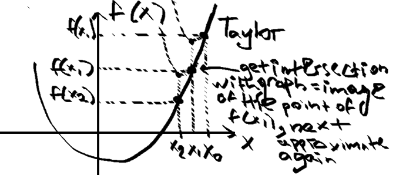

---
usepackage:
    - amsmath
    - geometry
    - float
geometry: margin=0.3cm
header-includes: |
    \usepackage{caption}
    \usepackage{float}
    \usepackage{graphicx}
    \usepackage{fullpage}
---

:::columns

## Descent Algorithm | Fidning **Local** Minimum

Choose $x_{\text{start}}$. Descent algorithm generates a sequence $(x_k)_{k \in N}$ defined by
$$x_{k+1} = x_k + s_kd_k$$
$$f(x_{k+1}) \le f(x_k)$$

- $d_k$ is the descent **direction**
- $s_k$ is the descent **step** or **learning rate**

### General Algorithm

*Input*: $f$ differentiable on $R^d$, $x_{\text{start}}$ initial point, $\varepsilon > 0 \approx 0$ **precision**.
*Output*: approximation of $\min_{x \in R^d}f(x)$

**Algorithm** $\text{DA}(f, x_{\text{start}}, \varepsilon)$ with fixed learning rate:
- Initialize $x_0 = x_{\text{start}}, k:= 0$
- While $||\nabla f(x_k)|| > \varepsilon$ (**stop condition**)
  - Find $d_k$ s.t. $\nabla f(x_k)^Td_k < 0$ $(<\nabla f(x_k), d_k> < 0)$ 
  - Choose $s_k > 0$ in direction $d_k$ s.t. $f(x_k + s_kd_k) < f(x_k)$ (**descent property**)
  - $x_{k+1} := x_k + s_kd_k$ (**update**)
  - $k := k + 1$
- Return $x_k$

We find $d_K$ s.t. $<\nabla f(x_k), d_k> < 0$ because by Taylor:
$$f(x_{k+1}) = f(x_k + s_kd_k) =$$
$$=f(x_k) + s_{k_\text{>0}} <f(x_k), d_k>_{\text{<0}} + \text{ remainder }$$
$$=>f(x_{k + 1}) \le f(x_k)$$

### More Stop Conditions

$$\nabla f(x_k) \to \nabla f(x^*) = 0 => ||\nabla f(x_k)|| \le \varepsilon_1$$ 
$$x_k \to x^* => ||x_k - x_{x+1}|| \le \varepsilon_2$$
$$f(x_k) \to f(x^*) => ||f(x_k) - f(x_{k+1})|| \le \varepsilon_3$$

### Gradient Algorithm

Take $d_k = -\nabla f(x_k)$\
$<\nabla f(x_k), -\nabla f(x_k)> = - ||\nabla f(x_k)||^2 < 0$\
$x_{k+1} = x_k - s \cdot \nabla f(x_k)$

*Input*: $f$ differentiable on $R^d$, $x_{\text{start}}$ initial point, $\varepsilon > 0 \approx 0$ **precision**.
*Output*: approximation of $\min_{x \in R^d}f(x)$

**Algorithm** $\text{GD}(f, x_{\text{start}})$ with fixed learning rate:
- Initialize $x_0 = x_{\text{start}}, k:= 0$
- While $||\nabla f(x_k)|| > \varepsilon$ (**stop condition**)
  - $x_{k+1} := x_k - s\nabla f(x_k)$ (**update**)
  - $k := k + 1$
- Return $x_k$

*Note: choosing good starting point $x_{\text{start}}$ and learning rate $s_k$ is very important. If otherwise, the algorithm might not converge if the learning rate too large. The algorithm might converge slowly, if learning rate is too small. If starting point is chosen wisely, the algorithm might even converge to a global minimum, not local.*

## Gradient Descend Convergence

### Lipschitz Gradient

Let $f: R^d \to R$ differentiable function. If $\exists L \in R^*_+$ s.t.
$$\frac{||\nabla f(x) - \nabla f(y)||}{||x-y||} \le L, \quad x\ne y, \forall (x,y) \in R^d$$

then $f$ is dierentiable with continuous $L$-Lipschitz gradient.

Let $f: R^d \to R$ differentiable function with $L$-Lipschitz continious gradient. Then
$$f(y) \le f(x) + <\nabla f(x), y-x> + \frac{L}{2}||y-x||^2, \quad \forall (x,y) \in R^d$$

### Optimal Step

$$s^* = argmin_{s>0}f(x - s\nabla f(x))$$

### Convergence of GD

We have convergent GD $\iff ||\nabla f(x_k)|| < \varepsilon$ at some point $x_k$.

Let a function $f$ bounded below, of class C1 with gradient Lipschitz of constant $L > 0$. Then:

1. If $\forall k, s_k = s < \frac{2}{L}$ the GD algorithm with constant step **converges globally** and
$$0 < s||\nabla f(x_k)||^2 - \frac{Ls^2}{2}||\nabla f(x_k)||^2 \le f(x_k) - f(x_{k+1})$$

2. The **optimal constant step** is defined by $s_k = s^* = \frac{1}{L} \forall k \in N$ and
$$\frac{1}{2L}||\nabla f(x_k)||^2 \le f(x_k) - f(x_{k+1})$$

### Wolfe's Condition

The direction $d$ and the step $s$ of a descent algorithm with linear search satisfy Wolfe’s conditions if there exists $(\varepsilon_1, \varepsilon_2) \in (0, 1)^2$ such that $\varepsilon_1 < \varepsilon_2$ and

1. $f(x + sd) \le f(x) + \varepsilon_1 s(\nabla f(x)^Td)_{\text{linear}}$
2. $\nabla f(x + sd)^Td \ge \varepsilon_2(\nabla f(x)^Td)$

**The GD algorithm with Wolfe’s step globally converges.**

## Newton's Method

By Taylor:

$$f(x) \approx f(x_k) + f'(x_k)(x-x_k) +$$

$$+ \frac{f''(x_k)}{2}(x-x_k)^2 =: q(x)$$

Here, $f(x_k) + f'(x_k)(x-x_k)$ - linear approximateion of the function in a neighborhood of $x+k$.

The necessary condition for optimization is $q'(x)=0$, $f'(x) \approx q'(x)$.

$$q'(x) = f'(x_k) + f''(x_k)(x-x_k)$$

If $f''(x_k) > 0$, $q$ achieves a minimum at

$$x = x_k - \frac{f'(x_k)}{f''(x_k)}$$

  

### Newton's Algorithm

If $f$ is smooth enough (atleast twice differentiable), then Newton's method is faster (quadratic convergence) than GD.

- input: $f$ **twice differentiable** on $R^d, x_{start}$ initial point, $\varepsilon > 0$
- output: approximation of $\min_{x \in R^d}f(x)$

Algorithm:
1. initialize $x_0 = x_{start}, k =0$
2. While $||\nabla f(x_k)||>\varepsilon$ (stop criterion)
   1. $x_{k+1} = x_k - [Hf(x_k)]^{-1}\nabla f(x_k)$
   2. $k = k+1$
3. return $x_k$

Newton's direction is: $d_k = [Hf(x_k)]^{-1}\nabla f(x_k)$

## Gauss-Newton Method

Approximate the Hessian, since it is and its inverse are hard to estimate.

$$r: R^d \to R^d, \text{differentiable}$$

$$f(x) = \frac{1}{2}||r(x)||^2_2 $$
$$\text{sum of squared residuals}$$

**Idea**: replace at each iteration the non-linear LS problem by an
approximate linear LS problem (by Taylor). Let $x_k$ be the current iterate. Replace
in a neighbourhood of $x_k$, the problem by

$$\min_{y \in R^d}\tilde{f}(y) = \frac{1}{2}||r(x_k) + J_r(x_k)(y-x_k)||^2_2$$

$$y = x_{k + 1}$$

$$x_{k + 1} = (J_r^T(x_k)J_r(x_k))^{-1}(J_r^T(x_k)J_r(x_k)x_k - J_r^T(x_k)r(x_k))$$
$$r(x_k) - \text{ residual vector}$$
$$J_r^T(x_k)r(x_k)=\nabla f(x_k)$$
$$J_r^T(x_k)J_r(x_k)\approx Hf(x_k) - \text{ approximation of Hessian}$$

The direction $d_k=x_{k+1} - x_k$ is called Gauss-Newton direction.

### Gauss-Newton Algorithm

- input: $r$ differentiable on $R^d, x_{start}$ initial point, $\varepsilon > 0$ precision.
- output: approximation of $\min_{x \in R^d}f(x)$

Algorithm:
1. initialize $x_0 = x_{start}, k=0$
2. while $||\nabla f(x_k)|| > \varepsilon$
   1. $x_{k + 1}= x_k - [J_r(x_k)^TJ_r(x_k)]^{-1}J_r(x_k)^Tr(x_k)$
   2. k = k + 1
3. return $x_k$

# Pseudo-random Numbers Generation

## Generalized Inverse

Let $F$ be a non-decreasing function on $R$. The generalized inverse of $F$, denoted by $F^-$   is the function defined by

$$F^-(u)=\inf\{x \in R: F(x) \ge u\}$$

The function $F^-$  is non-decreasing, left-continuous and satisfies

$$F^-(u) \le x \iff u \le F(x), \forall u \in (0,1)$$

If $F$ is **increasing and continious** on $R$, then $F$ has an inverse function defined by $F^{-1}$ s.t. $F * F^{-1}=Id_{(0,1)}$ and $F^{-1}*F=Id_{R}$

### Proposition

Let $U \sim U((0,1))$ and $F=\mu((-\infty,x])$ where $\mu$ is a probability distribution on $(R, B(R))$. Then $F^-(U) \sim \mu$.

In other words, $F^-(U)$ follows the law of $X$.

### Example

We have that $X$ follows an exponential distribution and want to simulate pseudo-random numbers.

$f_X(x) = \lambda e^{-\lambda x}1_{[0, +\infty]}(x)$\
$F_X(x) = \int_{-\infty}^t\lambda e^{-\lambda x}1_{[0, +\infty]}(x)dx$

- if $t<0: F_X(t)=0$
- if $t>0: F_X(t)=1-e^{-\lambda t}$

$u \in (0,1), u=F_X(t)$\
$u = 1 - e^{-\lambda t}$\
$=>t = -\frac{1}{\lambda}log(1-u)$\
To simulate pseude-random numbers:\
$u \sim U((0,1))$\
$F_x^-(u)=-\frac{1}{\lambda}log(1-u) \sim E(\lambda)$

## Acceptance-Rejection

### Method

1. Sample $Y$ with density $g$
2. Generate $U \sim U((0,1))$ independently from $Y$
3. If $U \le \frac{f(Y)}{cg(Y)}$ (accept with probability $\frac{f(Y)}{cg(Y)}$) (notice that it is bounded between $0$ and $1$) 
   - $X=Y$ (acceptance)
   - else go back to step 1 (rejection)
4. Result: samples following target density (not $f$!).

### Optimal

$$c=\sup_{x \in R^d}\frac{f(x)}{g(x)}$$

### Algorithm

1. Generate $U_1\sim g \sim \mathcal{U}([0,1]), U_2 \sim \mathcal{U}([0,1])$ independently ($U_1=Y$).
2. Acceptance/rejection:
   - If $U_2 \le \frac{f(U_1)}{cg(U_1)}$:Set $X=U_1$
    - Else: Go back to step 1

### Example

Simulation of a Beta distribution.\
$\forall x \in (0,1), f(x) = bx^n(1-x)^n$\
$b = \left[\int_0^1x^n(1-x)^ndx\right]^{-1} \left(b \cdot \int f(x)dx = 1\right)$\
Let $g=1_{0,1}$\
$f(x)\le cg(x)$\
Aim: choose optimal $c$.\
$f(x) \le bg(x), c=b$ but not optimal\
$c=\sup\frac{f(x)}{g(x)}=\sup_{x\in (0,1)}bx^n(1-x)^n$\
$f'(x)=nx^{n-1}(1-x)^n - nx^n(1-x)^{n-1}=bnx^{n-1}(1-x)^{n-1}(1-2x)$\
$f(\frac{1}{2})-$ critical point, for $x<1/2, f$ increases, $x>1/2$ f decreases.\
$=>$ the maximum is reached at $x=1/2$.\
$f(1/2)=b\frac{1}{2^n}(1-1/2)^n=b\frac{1}{4^n}=c$\
$u_1 \sim U((0,1)), u_2 \sim U((0,1))$ independently\
$Y=u_1$\
Acceptance/rejection:
- if $u_2 \leq \frac{f(u_1)}{cg(u_1)}=\frac{bu_1^n(1-u_1)^n u_n}{b}=4^nu_1^n(1-u_1)^n$: set $X=u_1$
- else go back to step 1

## Box-Müller Algorithm

Let $X_1, X_2$ independent r.v.. Denote by $R, \theta$ the polar coordinates of $(X_1, X_2)$.

$$R^2=X_1^2 + X_2^2 \sim \mathcal{E}(1/2), \theta \sim \mathcal{U([0, 2\pi])}$$

If $U_1$ and $U_2$ are i.i.d. $\mathcal{U}([0,1])$, the variables $X_1$ and $X_2$ defined by

$$X_1=R\cos(\theta)=\sqrt{-2log(U_1)}\cos(2\pi U_2)$$

$$X_2=R\sin(\theta)=\sqrt{-2log(U_1)}\sin(2\pi U_2)$$

are then i.i.d. of distribution $\mathcal{N}(0,1)$.

### Algorithm

1. Generate independently $U_1, U_2 \sim \mathcal{U}([0,1])$.
2. Define $R_2=-2\log(U_1)$ and $\theta=2\pi U_2$.
3. Return $(X,Y)=(\sqrt{R_2}\cos(\theta), \sqrt{R_2}\sin(\theta))$

# Markov Chains

## Metropolis-Hastings Algorithm

This algorithm allows us to move closer to the area of high probability, while simple accept-reject method did not do, since samples were independent of the last.

Goal: sample from $f \cdot \lambda$, but we know only $f$.

$f\cdot \lambda$, $\lambda-$ normalizing constant that is difficult to compute. So, we only use $f(x)$ that is easy to compute, e.g. Normal.

Main idea: $X_0 \to X_1 \to \dots \to X_B \to X_{B+1} \to \dots$. Here, $X_0 \to X_1 \to \dots$ until some $X_i$ are **burn-in**, they are typically not follow the distribution that we are trying to simulate, while starting from $X_B$ are samples from $f\cdot \lambda$.

- Input: transition matrix $P$ (conditional density $q(\cdot|\cdot)$)
- Output: HMC $X$ (dependent sample distributed according to $f\cdot \lambda$).

1. Initialize $x_0 \in E$
2. For all $n \in \{0,\dots, N-1\}:$ (at each $n$: given $X_n=x_n$)
   1. Generate $Y_n\sim q(\cdot|X_n=x_n)\left(Y_n - \text{next state after }x_n\right)$
   2. Compute acceptance probability $A(a\to b)=p(x_n, Y_n)=\min\left(1, \frac{f(Y_n)q(x_n|Y_n)}{f(x_n)q(Y_n|x_n)}\right)$
      - here $x_n=a, Y_n=b$
   3. Draw $U \sim \mathcal{U}([0,1])$
   4. If $U < p(x_n, Y_n)$
      - Set $X_{n+1}=Y_n$
      - Else set $X_{n+1}=x_n$
   5. $n=n+1$

- The accept/reject step only depends on the ratios $\frac{f(Y_n)}{f(x_n)}, \frac{q(x_n|Y_n)}{q(Y_n|x_n)}$

Steps explained in simpler terms:

1. You are currently in some state $X_t$
2. Sample next candidate from some easier distribution $g$ (e.g. Normal)
3. Should accept this candidate? We accept the candidate based on acceptance probability $A(a\to b)=p(x_n, Y_n)=\min\left(1, \frac{f(Y_n)q(x_n|Y_n)}{f(x_n)q(Y_n|x_n)}\right)$
4. If accept, then next state in the Markov chain is indeed $Y_n=b$
5. If do not accept, then the next state is previous state carried forward, i.e. stay where we at, take the same previous sample again, and then try again for the next sample.
6. Eventually it leads to $f\cdot \lambda$ being a stationary distribution for the Markov Chain.
7. So we computed $X \sim f\cdot \lambda$ just from $f$.

## Random Walk Metropolis-Hastings

What this algorithm is aiming to achieve is that no matter where we are right now, no matter where we are proposed to go, we are going to accept that move if that is a more likely place to be (we want more samples from high density areas) and we might accept the move if it is low area density area (it is still important to sample from tails).

It is the same as previous algorithm, but we have that $q$ is symmetric, meaning $q(x_n|Y_n)$ and $q(Y_n|x_n)$ cancel each other, thus the acceptance probability of moving from $a$ to $b$ becomes $\min\left(1, \frac{f(b)}{f(a)}\right)$. We also now know that $\frac{f(b)}{f(a)}$ is actually $\frac{f(b) \cdot \lambda}{f(a) \cdot \lambda}$, so it follow the distribution we want.

Assume that $q$ is symmetric i.e. $q(x|y) = q(y|x), x, y \in E$. Take
$q(x, y) = g(y-x)$ and $p(x_n, y) = \min(1,f(y)/f(x_n))$.

- Input: $g$ density.
- Output: HMC $X$ (dependent sample distributed according to $f\cdot \lambda$).

1. Initialize $x_0 \in E$
2. For all $n \in \{0,\dots, N-1\}:$ (at each $n$: given $X_n=x_n$)
   1. Generate $Y_n\sim g(\cdot-x_n)\cdot\lambda$
   2. Compute $p(x_n, Y_n)=\min\left(1, \frac{f(Y_n)}{f(x_n)}\right)$
   3. Draw $U \sim \mathcal{U}([0,1])$
   4. If $U < p(x_n, Y_n)$
      - Set $X_{n+1}=Y_n$
      - Else set $X_{n+1}=x_n$
   5. $n=n+1$

This algorithm tells us:
- If the probability of being at $b$ is bigger than of being at $a$, then the acceptance probability of going from $a$ to $b$ is 1: $p(b)>p(a) => A(a\to b)=1$
- Else, if probability of being at $b$ is less than that of $a$, then the acceptance probability is: $p(b)<p(a) => A(a\to b)=\frac{p(b)}{p(a)}$
- Essentially, if are moving up the curve if the next simulated state is above the current state on the curve, while we are moving downwards if the next state if below on the curve of the current state.
- The further the state $b$ from $a$ downwards, the less likely that we go from $a$ to $b$.

  

:::
