# Optimization

Problem of optimization - find local/global minimum or maximum.

$f: D \to \mathbb{R}$\
$D$ - domain\
$\to \min{f}$ or $\max{f}$
$\to$ local $\min{f}$ or local $\max{f}$\
$V \subseteq D$
$\min_{x \in V}f \space; \space \max_{x \in V}f$

Local maximum:

  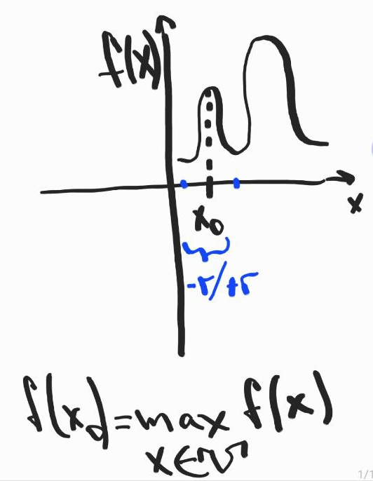

Global maximum:

$f(x) \le f(x_0) \space \forall x \in D$\
$=> f(x_0) = max_{x \in D}f(x)$

Example:

$f(x) = e^{-x^2}$\
$e^{-x^2} \le 1$
$x = 0$ - global maximum.

  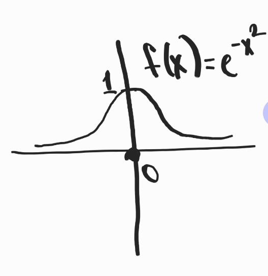

# Differential Calculus and Convex Analysis in $\mathbb{R}^d$

$\mathbb{R}^d$ - euclid space with finite dimension.

## Conversion of Sequences 

### $\mathbb{R}$

$x_n \to x \in \mathbb{R}$

$\forall \epsilon > 0, \exists N_\epsilon \in N$, s.t. $\forall n \ge N: |x_n - x| \le \epsilon$ ($\le$ or $<$ ?)

---

### $\mathbb{R}^d$

$\mathbb{R}^d ||\cdot||: \mathbb{R}^d \to \mathbb{R}^+$

It has the same role as $| \cdot | \in \mathbb{R}$ but in $\mathbb{R}^d$

## Definition 1: Normed Vector Space

A mapping $\|\cdot\|:\mathbb{R}^d\to\mathbb{R}$ is a norm on $\mathbb{R}^d$ if
- For all $x\in\mathbb{R}^d$, $\|x\|\geq 0$ and $\|x\|=0\iff x=0$
- For all $x\in\mathbb{R}^d$ and $\lambda\in\mathbb{R}$, $\|\lambda x\|=|\lambda|\|x\|$
- For all $x,y\in\mathbb{R}^d$, $\|x+y\|\leq\|x\|+\|y\|$ (Triangle inequality)
  
The pair $(\mathbb{R}^d,\|\cdot\|)$ is a normed vector space.

For $\mathbb{R}^1$ we have $(\mathbb{R}, | \cdot |)$ normed space, for $\mathbb{R}^2$ we have:
1. Euclidian norm: $x=(x_1,x_2): ||x||_2 = \sqrt{x_1^2 + x_2^2}$
2. $||x||_1 = |x_1| + |x_2|$
3. $||x||_\infty = max(|x_1|, |x_2|)$

$(\mathbb{R}, ||\cdot||_1)$ and $(\mathbb{R}, ||\cdot||_2)$ are both normed spaces, but defined by different normes, thus different.

For $\mathbb{R}^d$ we have:
1. $x=(x_1,x_2): ||x||_2 = \sqrt{x_1^2 + ... + x_d^2}$
2. $||x||_1 = |x_1| + ... + |x_d|$
3. $||x||_\infty = max(|x_1|, ..., |x_d|)$
4. $||x||_p = (\sum^d_{i=1}x_i^p)^{\frac{1}{p}}, p \ge 1$

Change norm $=>$ normed space changes.

## Definition (2): Inner Product

Let $\mathbb{R}^d$ be a vector space. A mapping $\langle \cdot, \cdot \rangle : (\mathbb{R}^d)^2 \to \mathbb{R}$ is an inner product on $\mathbb{R}^d$ if:
- For all $x, y \in \mathbb{R}^d$, $\langle x, y \rangle = \langle y, x \rangle$ (symmetry).
- For all $x, y, z \in \mathbb{R}^d$ and $\lambda \in \mathbb{R}$, $\langle x + y, z \rangle = \langle x, z \rangle + \langle y, z \rangle$ (left linearity).
- For all $x \in \mathbb{R}^d$, $\langle x, x \rangle \geq 0$, and $\langle x, x \rangle = 0$ if and only if $x = 0$ (positive definiteness).

Symmetry + left linearity defines bilinearity.

$$\mathbb{R}: \langle x,y\rangle = xy$$
$$\mathbb{R}^d: \langle x,y\rangle = \sum^d_{i=1}x_iy_i$$

The triple $(\mathbb{R}^d, \langle \cdot, \cdot \rangle)$ is an inner product space.

Example of a function that does not define an inner product:

$f: (\mathbb{R}^2)^2 \to \mathbb{R}$\
$((x_1, x_2), (y_1, y_2)) \to x_1y_1$\
$x = (x_1, x_2), y = (y_1, y_2)$\
-$ f(x,y) = f(y,x)$ symmetry $\checkmark$\
-$ f$ is left linear, left linearity $\checkmark$\
-$ f((x_1, x_2), (x_1, x_2)) = 0 => x_1^2 = 0 \iff x_1 = 0$ but $x_2?$ does not define positive definiteness.

$=> f$ does not define inner product or $\mathbb{R}^2$

## Proposition 1: Cauchy-Schwarz Inequality

$$|\langle x,y\rangle|^2 \le \langle x,x \rangle \langle y,y \rangle, \forall x,y \in \mathbb{R}^d$$

With **equality** $\iff$ $x$ and $y$ are **linearly** **independent**.

## Proposition 2: Canonical Norm

Let $\langle \cdot, \cdot \rangle$ be the usual inner product on $\mathbb{R}^d$. The mapping 
$$\| \cdot \| : x \in \mathbb{R}^d \mapsto \sqrt{\langle x, x \rangle}$$ 
is a norm on $\mathbb{R}^d$, the **canonical** norm associated with $\langle \cdot, \cdot \rangle$.

$||x|| = \sqrt{\langle x,x \rangle}$\
$|\langle x,y \rangle|^2 \le \langle x,x \rangle \langle y,y \rangle$\
$|\langle x,y \rangle|^2 \le || x ||^2 \space || y ||^2$\
$|\langle x,y \rangle| \le || x || \space || y ||$

## Topology

### Definition 2: Open and Closed Balls

#### Open Ball

Let $\| \cdot \|$ be a norm on $\mathbb{R}^d$. 

$$\forall a \in \mathbb{R}^d, r > 0, B_{\| \cdot \|}(a, r) = \{x \in \mathbb{R}^d : \|x - a\| < r\}$$ 

$$B_{| \cdot |}(a, r) = (a-r, a + r)$$

is the open ball of $(\mathbb{R}^d, \| \cdot \|)$ with center $a$ and radius $r$. From the definition we see that balls depend on the defined norm. In other words, distance from any $x$ to center is less than $r$.

#### Closed Ball

Let $\| \cdot \|$ be a norm on $\mathbb{R}^d$.
$$\forall a \in \mathbb{R}^d, r > 0, \overline{B}_{\| \cdot \|}(a, r) = \{x \in \mathbb{R}^d : \|x - a\| \le r\}$$ 
is the closed ball of $(\mathbb{R}^d, \| \cdot \|)$ with center $a$ and radius $r$.

$$\overline{B}_{\| \cdot \|}(a, r) = [a-r, a+r]$$

Examples:

1. $\mathbb{R}^1$

$(\mathbb{R}, |\cdot|)$ normed space\
$B_{| \cdot |}(a, r) = \{x \in \mathbb{R} : |x - a| < r\} = \{x \in \mathbb{R} : a - r < x < a + r\} = (a -r, a + r)$\
$\overline{B}_{| \cdot |}(a, r) = [a - r, a + r]$

2. $\mathbb{R}^2$

$(\mathbb{R}^2, \|\cdot\|)_\infty$ normed space\
Draw $\overline{B}_{\| \cdot \|}((0,0), 1) = \{ (x_1, x_2) \in \mathbb{R}^2: \max(|x_1|, |x_2|) \le 1\}$\
Draw frontiers: 
- $\max(x_1, x_2) = 1$
  - $x_1 = 1$ and $x_2 \in (0, 1)$
  - $x_2 = 1$ and $x_1 \in (0, 1)$
- $\max(-x_1, x_2) = 1$
  - $x_1 = -1$ and $x_2 \in (0, 1)$
  - $x_2 = 1$ and $x_1 \in (-1, 0)$
- $\max(x_1, -x_2) = 1$
  - $x_1 = 1$ and $x_2 \in (-1, 0)$
  - $x_2 = -1$ and $x_1 \in (0, 1)$
- $\max(-x_1, -x_2) = 1$
  - $x_1 = -1$ and $x_2 \in (-1, 0)$
  - $x_2 = -1$ and $x_1 \in (-1, 0)$

  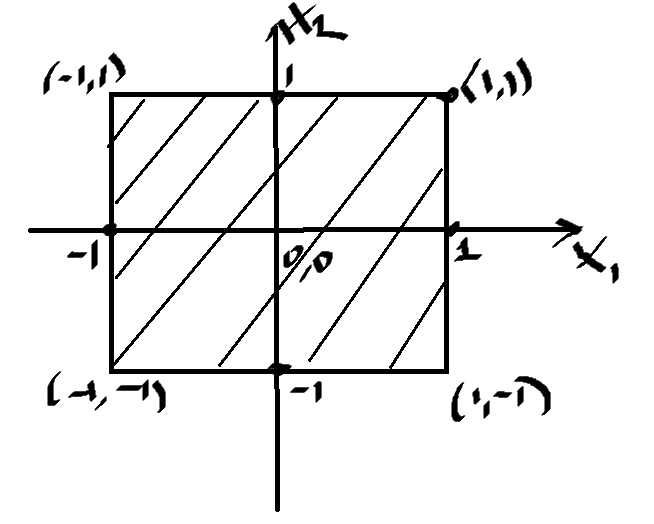

### Definition 3: Neighbourhood of a Point

Let $\| \cdot \|$ be a norm on $\mathbb{R}^d$. A subset $V \subset \mathbb{R}^d$ is a neighborhood of $a \in \mathbb{R}^d$ if 

$$\forall r > 0 : B_{\| \cdot \|}(a, r) \subset V$$

### Definition 4: Open and Closed Sets

Let $\| \cdot \|$ be a norm on $\mathbb{R}^d$.

1. A subset $O \subset \mathbb{R}^d$ is an open set of $(\mathbb{R}^d, \| \cdot \|)$ if
$$\forall a \in O, \, \exists r > 0 : B_{\| \cdot \|}(a, r) \subset O$$

We can find any open ball with small $r$ s.t. for any point in $O$ open ball will be a subset of $O$. Frontier not included!

2. A subset $F \subset \mathbb{R}^d$ is a closed set of $(\mathbb{R}^d, \| \cdot \|)$ if its complement $(F^c := \mathbb{R}^d \setminus F)$ is an open set of $(\mathbb{R}^d, \| \cdot \|)$.

If we take a ball, where center is on the frontier, we will notice that some part of the ball is not in the set ($r > 0$) $=>$ we have closed set.

  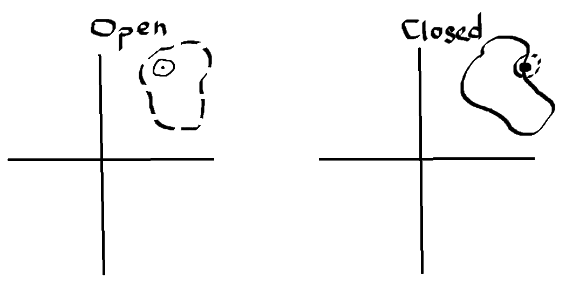

- An open set is a set which is a neighborhood of all its points
- Any open ball is open
- Any closed ball is closed
- In $\mathbb{R}^d$ a compact set is a set which is closed and bounded.

**Remark**: If $F$ is closed $=> F^c$ is open\
If $O$ is open $=> O^c$ is closed ($(O^c)^c = O$ is open $=> O^c$ is closed)

### Definition 5: Interior of a Set

Let $\|\cdot\|_{\mathbb{R}^d}$ be a norm on $\mathbb{R}^d$ and $A \subseteq \mathbb{R}^d$. The interior of $A$ is the largest open subset of $\mathbb{R}^d$ contained in $A$ (it exists) and is denoted by $\overset{\circ}{A}$

*Remarks*: $\overset{\circ}{A}$ is open and $\overset{\circ}{A} \subset A$

Example:\
$A = [1,3]$\
$\overset{\circ}{A} = (1,3)$\
$B = (1,3)$\
$\overset{\circ}{B} = (1,3)$

### Definition 6: Closure of a Set

Let $\|\cdot\|_{\mathbb{R}^d}$ be a norm on $\mathbb{R}^d$ and $A \subseteq \mathbb{R}^d$. The closure of $A$ is the smallest closed subset of $\mathbb{R}^d$ containing $A$ (it exists) and is denoted by $\overline{A}$

*Remarks*: $\overline{A}$ is closed and $A \subset \overline{A}$

Example:\
$A = (1,3]$\
$\overline{A} = [1,3]$

### Definition 7: Frontier of a Set

Let $\|\cdot\|_{\mathbb{R}^d}$ be a norm on $\mathbb{R}^d$ and $A \subseteq \mathbb{R}^d$. The frontier of $A$ is $\delta A = \overline{A} \setminus \overset{\circ}{A}$

Example:\
$A = [1, 3)$\
$\delta A  = \{1,3\}$ (points 1 and 3)

### Family of Open Sets

Let $(O_\alpha)_{\alpha \in I}$ be a family of open sets, then
$$\bigcup_{\alpha \in I}O_\alpha$$ 
is also open (infinite sets).

Let $(A_\delta)_{\delta \in \Delta}$ be a family of open sets s.t. $|\Delta| < +\infty$ , then

$$\bigcap_{\delta \in \Delta}A_\delta$$

is also open (finite sets).

### Theorem 1: Sequential Characterization of Closed Set

Let $(\mathbb{R}^d, || \cdot ||)$ be a normed space. $F \subseteq \mathbb{R}^d$ is closed $\iff \forall (x_n)_{n \ge 1} \subseteq F$ s.t. $x_n \to l$ then $l \in F$

Example:\
$(\mathbb{R}, |\cdot|)$\
$A = [1,3]$\
Let $(x_n)_{n \ge1} \subseteq A$ s.t. $x_n \to l$\
We have that $\forall n \ge 1, x_n \subseteq A => 1 \le x_n \le 3$\
$=> 1 \le \lim{x_n} \le 3$

### Theorem 2: Squeeze Theorem

$$a_n \le b_n \le c_n$$
$$\lim{a_n} \le \lim{b_n} \le \lim{c_n}$$

### Theorem 3: Hölder's Inequality

Let $p$ and $q$ be positive real numbers such that $\frac{1}{p} + \frac{1}{q} = 1$. For any two sequences of real numbers $a_1, a_2, \ldots, a_n$ and $b_1, b_2, \ldots, b_n$, Hölder's inequality states:

$$
\sum_{i=1}^{n} |a_i b_i| \leq \left(\sum_{i=1}^{n} |a_i|^p\right)^{\frac{1}{p}} \left(\sum_{i=1}^{n} |b_i|^q\right)^{\frac{1}{q}}
$$

In this inequality:

- $p$ and $q$ are positive real numbers such that $\frac{1}{p} + \frac{1}{q} = 1$. These numbers are called conjugate exponents of each other.

- $a_i$ and $b_i$ are elements of the sequences $a_1, a_2, \ldots, a_n$ and $b_1, b_2, \ldots, b_n$, respectively.

## Sequences and Mappings

### Definition 8: Convergent Sequence

Let $\|\cdot\|_{\mathbb{R}^d}$ be a norm on $\mathbb{R}^d$. A sequence $(x_n)_{n\in\mathbb{N}}$ of elements of $\mathbb{R}^d$ converges if there exists $x \in \mathbb{R}^d$ such that

$$\forall \varepsilon > 0, \exists N \in \mathbb{N}: \forall n \in \mathbb{N}, n \geq N, \|x_n - x\| < \varepsilon$$

### Proposition 3: Limit of Convergent Sequence

Let $\|\cdot\|_{\mathbb{R}^d}$ be a norm on $\mathbb{R}^d$, and let $(x_n)_{n\in\mathbb{N}}$ be a sequence of elements of $\mathbb{R}^d$

If $(x_n)_{n\in\mathbb{N}}$ converges, it has a unique limit denoted $\lim_{n\to\infty} x_n$

Furthermore,
$$x = \lim_{n\to\infty} x_n \iff \lim_{n\to\infty} \|x_n - x\| = 0$$

### Definition-Proposition 4

Let $\|\cdot\|$ be a norm on $\mathbb{R}^d$, $\|\cdot\|'$ be a norm on $\mathbb{R}^k$, and $f : \mathbb{R}^d \to \mathbb{R}^k$ be a function. The function has the limit $l$ in $\mathbb{R}^k$ at $a \in \mathbb{R}^d$ if

$$\forall \varepsilon > 0, \exists \delta > 0: \forall x \in \mathbb{R}^d, \|x - a\| < \delta \Rightarrow \|f(x) - l\|' < \varepsilon$$

If it exists, the limit $l$ is unique and is denoted $\lim_{x \to a} f(x)$

### Proposition 5

Let $\|\cdot\|$ be a norm on $\mathbb{R}^d$, $\|\cdot\|'$ be a norm on $\mathbb{R}^k$, and $f : \mathbb{R}^d \to \mathbb{R}^k$ be a function. The function has the limit $l$ in $\mathbb{R}^k$ at $a \in \mathbb{R}^d \iff$ for any sequence $(x_n)_{n\in\mathbb{N}}$ of elements of $\mathbb{R}^d$,

$$\lim_{n\to\infty}\|x_n - a\| = 0 \iff ||f(x) - l||' = 0$$

### Definition 9: Continious Function

Let $\|\cdot\|_{\mathbb{R}^d}$ be a norm on $\mathbb{R}^d$, $\|\cdot\|_{\mathbb{R}^k}$ be a norm on $\mathbb{R}^k$, and $f : \mathbb{R}^d \to \mathbb{R}^k$ be a function. The function $f$ is continuous at a point $a$ in $\mathbb{R}^d$ if

$$\lim_{x \to a} f(x) = f(a)$$

Let $O$ be an open subset of $\left(\mathbb{R}^d, \|\cdot\|_{\mathbb{R}^d}\right)$. The function $f$ is continuous on $O$ if $f$ is continuous at any point of $O$.

## Exercices

### 1.2

$D = \mathbb{Q}, d = 4$
1. Prove $Q$ is not open. By contradiction assume $Q$ is open. Let $q \in Q: r > 0$ s.t. $(q - r; q + r) \in Q$. We know that $R \setminus Q$ is dense in $R$. So, $\exists y \in R \setminus Q$ and $y \in (q-r; q+r)$ which is contradiction.
2. Prove $Q$ is not closed. By contradiction assume $Q$ is closed. Then $R \setminus Q$ is open. Let $q \in R \setminus Q, r > 0$ s.t. $(q-r, q+r) \in R \setminus Q$. We know that $Q$ is dense in $R$. So $\exists q \in Q, q \in (q-r, q+r) \subseteq R \setminus Q$ which is contradiction.

## $\mathbb{Q}$ and $\mathbb{R} \setminus \mathbb{Q}$ Dense in $\mathbb{R}$

- $\mathbb{Q}$ is dense in $\mathbb{R} \iff \forall a \in \mathbb{R} \exists (x_n)_{n\ge1} \in \mathbb{Q}$ s.t. $x_n \to a$
- $\mathbb{R} \setminus \mathbb{Q}$ is dense in $\mathbb{R} \iff \forall a \in \mathbb{R} \exists (x_n)_{n\ge1} \in \mathbb{R} \setminus \mathbb{Q}$ s.t. $x_n \to a$

### 1.3

Determine the interior, the closure and the frontier of each set.

1. $A = [-1, +\infty) \times [-2,2] \times (-\infty, -1]$
   1. $\overset{\circ}{A} = (-1, +\infty) \times (-2,2) \times (-\infty, -1)$
   2. $\overline{A} = A$
   3. $\delta A = \overline{A} \setminus \overset{\circ}{A}$ (just points $[-1], [-2, 2], [-1]?$)
2. $B = \mathbb{N}$ 
   1. Aim: $\overset{\circ}{\mathbb{N}} = \empty$. By contradiction $\overset{\circ}{\mathbb{N}} \ne \empty$. Then $\exists a \in \overset{\circ}{\mathbb{N}}, r > 0$, s.t. $(a - r, a + r) \subseteq \overset{\circ}{\mathbb{N}}$. We know that $\overset{\circ}{\mathbb{N}} \subseteq \mathbb{N}$. So $(a-r, a+r) \subseteq \mathbb{N}$. Take $\frac{r}{2}, a-r, a + r \nsubseteq \mathbb{N}$ which is contradiction. $\overset{\circ}{B} = \empty$ (if we had $B = [1,2] \bigcup \mathbb{N}$, then interior would be $\overset{\circ}{B} = (1,2)$)
   2. $\overline{B} = \mathbb{N}$ (all the points in $\mathbb{N}$ are already in the set, and $\mathbb{N}$ has no limit points in $\mathbb{R}$ because there is no point in $\mathbb{R}$ that can be approached arbitrarily closely from $\mathbb{N}$)
   3. $\delta B = \mathbb{N}$
3. $D = \mathbb{Q}, d = 4$
   1. $\overset{\circ}{\mathbb{Q}} \subseteq \mathbb{Q}$. If $\overset{\circ}{\mathbb{Q}} \ne \empty: \exist a \in \overset{\circ}{\mathbb{Q}}$ and because $\overset{\circ}{\mathbb{Q}}$ is open, $\exists r > 0: (a-r, a+r) \subseteq \overset{\circ}{\mathbb{Q}} \subseteq \mathbb{Q}$. We know that $Q$ is dense in $R$. Thus, $\exists y \in R \setminus Q$ s.t. $y \in (a-r, a + r)$. Since $(a-r, a+r) \subseteq \mathbb{Q}$ we get contradiction. $\overset{\circ}{D} = \empty$
   2. Recall that $S$ is closed $\iff \forall (x_n)_{n\ge1} \subseteq S$ s.t. $x_n \to L$ we have that $L \in S$. So, we have to prove that $\mathbb{R} \subseteq \overline{Q}$. Let $a \in \mathbb{R}$. So, by the density of $Q$ in $R$: $\exists (x_n)_{n\ge1} \in \mathbb{Q}$ s.t. $x_n \to a$. On the other hand $Q \subseteq \overline{Q} => (x_n)_{n\ge1} \subseteq \overline{Q}: x_n \to a$. We know that $\overline{Q}$ is closed $=> a \in \overline{Q}$. Thus: $\forall a \in \mathbb{R}: a \in \overline{Q} => \mathbb{R} \subseteq \overline{Q}$. $\overline{D} = \mathbb{R}$
   3. $\delta D = \mathbb{R}$

### 1.4

When it exists, compute the limit of the sequence $(u_n)_{n\in\mathbb{N}}$

1. $u_n = ln(1 + \frac{(-1)^n}{n}), n \in \mathbb{N}$. For $\frac{(-1)^n}{n} \exists  \epsilon > 0, N$ s.t. $\forall n \ge N: ||u_n - u|| < \epsilon$. Take $\epsilon = \frac{1}{N^2  +N}, u_n = \frac{1}{N+2}, u = \frac{1}{N}$. Then we have $\frac{2}{N^2+2N}<\epsilon$, thus the sequence converges. $\lim_{n\to\infty}ln(1 + \frac{(-1)^n}{n}) = \lim_{n\to\infty}\frac{(-1)^n}{n} = 0$
2. $u_n = cos(x + n \pi)$. This function is periodic $=>$ no convergence.
3. $u_n = \sqrt{2n + 4} - \sqrt{n-1}, n \in \mathbb{N}_0$. Take $x_n = \sqrt{2n} - \sqrt{n} = \sqrt{n}$. As $n \to \infty, x_n \to \infty => u_n \to \infty =>$ no limit.

### 1.5

When it exists, compute the limit of $f$ at a given point $x_0$

1. $f(x)=\frac{ln(1+x)}{x}$. $\lim_{x \to 0}\frac{ln(1+x)}{x} = \lim_{x\to0}\frac{(ln(1+x))'}{(x)'} = \frac{1}{1+x}=1$
2. $f(x,y,z) = (x,x+y,x+y+z,0)$. $\lim_{x\to1, y\to-1, z\to 0}(x,x+y,x+y+z,0) = (1,0,0,0)$
3. $f(x,y) = |x|, \forall (x,y) \in \mathbb{R}^2$ s.t. $||(x,y)||_2 \to 0$. $||(x,y)||_2 = \sqrt{x^2 + y^2}$. $\sqrt{x^2 + y^2} \to 0 => x^2 + y^2 \to 0 => x = y = 0$. $\lim_{x\to0,}|x| = 0$
4. $f(x,y)=\frac{1}{e^{\sqrt{x^2+y^2}}}, ||(x,y)||_2 \to \infty$. $||(x,y)||_2 \to \infty => x \to \infty$ or $y \to \infty$ or $x\to\infty, y\to\infty$. Three cases, but have the same answer. $\lim_{x \to \infty, y \to \infty}\frac{1}{e^{\sqrt{x^2 + y^2}}} = 0$

# Differential Calculus

## Differentiable Mapping

The mapping $f: (\mathbb{R}, |\cdot|) \to (\mathbb{R}, |\cdot|), a \in \mathbb{R}$ is derivable at $a \iff$ 
$$\lim_{h \to 0}\frac{|f(a+h) - f'(a) - L(h)|}{|h|}=0$$
$f$ is differentiable if there exists a linear mapping $L(h)=f'(a)h$ s.t. above limit is $0$.

$O$ is open set of $(\mathbb{R}^d, ||\cdot||)$. $f$ is differentiable on $a \in O \iff L \in \mathcal{L}(\mathbb{R}^d, \mathbb{R}^k)$ linear map s.t.
$$\lim_{h \to 0}\frac{||f(a+h) - f(a) - L(h)||}{||h||}=0$$

We denote $L=Df(a), Df(a) \in \mathcal{L}(\mathbb{R}^d, \mathbb{R}^k)$. We call mapping $Df(a)=L$ the differential of $f$ at point $a$. The mapping $f$ is differentiable on $O$ if $f$ is differentiable at any point of $O$. Note that the linear map $Df(a)(h) = L(h) (= f'(a)h$ for $f: \mathbb{R} \to \mathbb{R}$)

### Sum Up

Let $f: \mathbb{R}^d \to \mathbb{R}^k$ be linear. Then $f$ is differentiable at any $x_0 \in \mathbb{R}^d$ and $Df(x_0)(h) = f(h)$ or $Df(x_0) = f$

Let $f: \mathbb{R} \to \mathbb{R}$ derivable. Then $f$ is differentiable at any $x_0 \in \mathbb{R}$ and $Df(x_0)(h) = f'(x_0)h$

### Examples

#### Find linear map $L_a$

$f: (\mathbb{R}, |\cdot|) \to (\mathbb{R}, |\cdot|)$\
$x \to f(x)=2x+1$\
Let $a\in\mathbb{R}$. Aim: looking for $L_a$-linear map depends on $a$ from $\mathbb{R}$ into $\mathbb{R}$ s.t.
$$\lim_{h\to0}\frac{|f(a+h) - f(a) - L_a(h)|}{|h|}=0$$
$f(a+h) - f(a) = 2a +2h + 1 -2a -1 = h$\
$=>f(a+h) - f(a) -2h = 0 \space \forall h \in \mathbb{R}$\
$=>\lim_{h\to0}\frac{|f(a+h) - f(a) - 2h|}{|h|}=0$\
So, $f$ is differentiable on $a \in \mathbb{R}$ and $Df(a) = 2h$ (remark that mapping does not depend on $A$, only on $h$).

#### Prove $f$ is differentiable at $x_0 \in \mathbb{R}^d$

$f: (\mathbb{R}^d, ||\cdot||) \to (\mathbb{R}, |\cdot|)$ linear. Is $f$ differentiable at $x_0 \in \mathbb{R}^d$?

Let $h \in \mathbb{R}^d$\
$f(x_0 + h) - f(x_0) = f(x_0) + f(h) - f(x_0) = f(h)$\
Let $L: h \in \mathbb{R}^d \to f(h)$.\
For all $h \in \mathbb{R}^d, f(x_0 + h) - f(x_0) - L(h) = 0$\
$=> \lim_{h\to0}\frac{||f(x_0 + h) - f(x_0) - L(h)||}{||h||} = 0$

#### Compute the differential of $f$ at $x_0 \in \mathbb{R}$

$f: \mathbb{R} \to \mathbb{R}$ derivable.\
Since $f$ is derivable at $x_0 \in \mathbb{R}$:\
$\lim_{h\to0}\frac{f(x_0 + h) - f(x_0)}{h}$ is finite. We denote $\lim_{h\to0}\frac{f(x_0 + h) - f(x_0)}{h} = f'(x_0)$\
We need to find a linear mapping $L: \mathbb{R} \to \mathbb{R}, h\to L(h)$ s.t.\
$\lim_{h\to0}\frac{|f(x_0+h) - f(x_0) - L(h)|}{|h|}=0$\
Let $L: h \to f'(x_0)h$\
Since $\lim_{h\to0}\frac{f(x_0 + h) - f(x_0)}{h} = f'(x_0)$ then\
$\lim_{h\to0}[\frac{f(x_0 + h) - f(x_0)}{h} - f'(x_0)] = 0$\
$\lim_{h\to0}[\frac{f(x_0 + h) - f(x_0) - hf'(x_0)}{h}] = 0$\
$L: h \to f'(x_0)h$ is linear and continious. Thus, $f$ is differentiable at $x_0$ and $Df(x_0)(h) = f'(x_0)h$

#### Prove $T(h)$ Linear Map

$$\lim_{h \to 0}\frac{||T(a+h) - T(a) - T(h)||}{||h||}=0$$

We have:\
$T(a+h) = T(a) + T(h)$\
$T(a+h) - T(a) = T(h)$\
$=>T(a+h) - T(a) - T(h)=0, \forall h$\
$=>||T(a+h) - T(a) - T(h)||=0, \forall h$\
$\lim_{h \to 0}\frac{||T(a+h) - T(a) - T(h)||}{||h||}=0$\
Thus $DT(a)(h) = T(h)$ a linear map.

#### Show that $f: \mathbb{R} \to \mathbb{R}$ Derivable on $a$

By Taylor Expansion:\
$f(a+h) = f(a) + f'(a)h + h\varepsilon(h), \forall h \in V(a)$\
Here, $V(a)$ is neighborhood of $a$, $h\varepsilon(h) = o(h)$ - small $o$ of $h$\
$=> \frac{|f(a+h) - f(a) - f'(a)h|}{|h|} = \varepsilon (h)$\
$\lim_{h\to0}\frac{|f(a+h) - f(a) - f'(a)h|}{|h|} = 0$\
Thus (or $C/C$): $f'(a)h = Df(a)(h)$

## Affine Function

Affine - linear map + constant.

$f: \mathbb{R} \to \mathbb{R}$\
$f=g + C$

Affine functions are convex and concave at the same time.

## Chain Rule

### $(\mathbb{R}, |\cdot|)$

$f: \mathbb{R} \to \mathbb{R}, g: \mathbb{R} \to \mathbb{R}$\
If $f$ is derivable on $a$ and $g$ is derivable on $f(a)$, then $g \circ f$ is derivable on $a$ and:
$$(g \circ f)'(a) = g'(f(a))f'(a)$$

Example:\
$\phi(x) = e^{x^2}, f(x) = x^2, g(x) = e^x, \phi (x) = g \circ f, => \phi'(x) = g'(f(a))f'(a) = e^x \cdot 2x$

### $(\mathbb{R}^d, || \cdot ||), (\mathbb{R}^k, || \cdot ||'), (\mathbb{R}^p, || \cdot ||'')$

Let $||\cdot||''$ be a norm on $\mathbb{R}^p$. Let $\mathcal{O}$ be an open set of $(\mathbb{R}^d, || \cdot ||)$ which contains $a$. Let $\mathcal{O}'$ an open set of $( \mathbb{R}^k$, $||\cdot||')$ which contains $f(a)$. Let $f : \mathcal{O} \rightarrow \mathbb{R}^k$ be a mapping differentiable at $a \in \mathcal{O}$, and $g: \mathcal{O}' \to \mathbb{R}^p$ differentiable at $f(a)$. Then $g \circ f$ is differentiable at $a$, and

$$D(g \circ f)(a)(h) = [Dg(f(a))] (Df(a)(h))$$

where 
- $\forall h \in \mathbb{R}^d$
- $D(g \circ f)(a)(h)$ - mapping applied to $h$
- $[Dg(f(a))]$ is mapping
- $(Df(a)(h))$ element of $\mathbb{R}^k$

#### Example

$p: \mathbb{R}^d \to \mathbb{R}$\
$(x_1, ..., x_d) \to x^2$\
Prove $p$ is differentiable on $a$.

Let $a \in \mathbb{R}^d, a = (a_1,...,a_d)$\
Let $f : \mathbb{R}^d \to \mathbb{R}$\
$(x_1, ..., x_d) \to x_1$\
$f$ is linear:
- $f(\alpha x + \beta y)=f((\alpha x_1 + \beta y_1, ..., \alpha x_d + \beta y_d))=\alpha x_1 + \beta y_1 = \alpha f(x) + \beta f(y)$

$=> Df(a)(h) = f(h)$\
Let $g: \mathbb{R} \to \mathbb{R}$\
$x \to x^2$\
$g'(x) = 2x$\
$Dg(x)(k) = g'(x)k = 2xk$\
Thus, we have:
1. $f \in \mathcal{L}(\mathbb{R}^d, \mathbb{R})$ - linear mapping
2. $Df(a)(h) = f(h)$
3. $Dg(b)(k) = 2bk$

Since $p = g \circ f$, $p$ is differentiable.

$$Dp(a)(h) = Dg(f(a)) \cdot (Df(a)(h))=Dg(a_1)\cdot(h_1) = 2a_1h_1$$

## Directional Derivative

A mapping $f : \mathcal{O} \rightarrow \mathbb{R}^k$ is differentiable at $a \in \mathcal{O}$ along a given direction $h \in \mathbb{R}^d$ if the limit

$$D_h f(a) = \lim_{{t \to 0}} \frac{f(a + th) - f(a)}{t}$$

exists and is finite.

If a mapping $f : \mathcal{O} \rightarrow \mathbb{R}^k$ is differentiable at $a \in \mathcal{O}$, then there exists $Df(a) \in \mathcal{L} \in(\mathbb{R}^d, \mathbb{R}^k)$ s.t. $D_h f(a) = Df(a)(h), \forall h \in \mathbb{R}^d$. $f$ is differentiable at $a$ along all directions, and

$$D_h f(a) = Df(a)(h); \quad \forall h \in \mathbb{R}^d.$$

## Gradient

For all $j \in \{1, \ldots, d\}$, provided it exists, the partial derivative of
$f : \mathbb{R}^d \rightarrow \mathbb{R}$ with respect to its $j$-th variable at $a \in \mathbb{R}^d$ is
$$\frac{\partial f}{\partial x_j}(a) = D_{e_j} f(a)$$

Here, $D_{e_j} f(a)$ the differential of $f$ at $a$ along the direction $(0,...,0, 1,0, ..., 0)$, where $1$ is at position $j$.

If all partial derivatives of $f$ at $a$ exist, then the gradient of $f$ at $a$ is given by
$$\nabla f(a) = \begin{bmatrix}\frac{\partial f}{\partial x_1}(a) \\ \vdots \\ \frac{\partial f}{\partial x_d}(a)\end{bmatrix}$$

### Example

$$g(x,y) = \begin{cases} \frac{xy}{x^2 + y^2}, \quad (x,y) \ne (0,0) \\ 0, \quad (x,y) = (0,0)\end{cases}$$
Differentiate over $x: \frac{\partial g}{\partial x}(0,0) = D_{e_1}g(0,0) = \lim_{t \to 0}\frac{g((0,0) + te_1) - g(0,0)}{t} = \lim_{t \to 0}\frac{g(t, 0) - g(0,0)}{t} = 0$\
Same for $\frac{\partial g}{\partial y}(0,0)$\
We see that $g$ is not continious, but partial derivatives exist.

## Jacobian Matrix

If $f: \mathbb{R}^d \to \mathbb{R}^k$:\
$x \to f(x): (F_1(x), ..., F_k(x))$ if all partial derivatifves of $f$ at $a$ exist, then we define Jacobian:

$$Jf(a) = \begin{bmatrix}\partial_1 F_1(a) && \ldots && \partial_d F_1(a) \\ \vdots && \ddots && \vdots \\ \partial_1 F_k(a) && \ldots && \partial_d F_k(a)\end{bmatrix}$$

### Example

$f: \mathbb{R}^2 \to \mathbb{R}^2$\
$f(x,y) = \begin{bmatrix}
  x^2y \\ 5x + \sin y
\end{bmatrix}$\
$f_1(x,y) = x^2y, f_2(x,y) = 5x + \sin y$\
$J_f(x,y) = \begin{bmatrix}
  2xy && x^2 \\ 5 && \cos y
\end{bmatrix}$

## Class $C^1$

Let $O$ an open subset of $\mathbb{R}^d$. A function $f: O \to \mathbb{R}^k$ is of class $C^1$ on $O$ if all partial derivatives exist and are continious.

Let $O$ an open subset of $\mathbb{R}^d$ and a function $f: O \to \mathbb{R}^k$ is of class $C^1$. Then $f$ is differentiable on $O$.

### Theorem

A function $f: \mathbb{R}^d \to \mathbb{R}$ of class $C^1$. Then $f$ is differentiable on $\mathbb{R}^d$ and
$$Df(a)(h) = <\nabla f(a), h>$$

#### Proof

Since $f$ is differentiable on $O$ we have:\
$Df(a) \in \mathcal{L}(\mathbb{R}^d, \mathbb{R})$\
$Df(a)(h) = D_hf(a), \quad h \in \mathbb{R}^d$\
$Df(a)(h) = D_{\sum^d_{i=1}h_ie_i}f(a)$\
Since $D_hf(a) = f(h) = f(\sum^d_{i=1}h_ie_i) = \sum^d_{i=1}h_if(e_i) = \sum^d_{i=1}h_iD_{e_i}f(a)$ because the mapping is linear\
Thus we have: $Df(a)(h) = \sum^d_{i=1}h_iD_{e_i}f(a) = \sum^d_{i=1}h_i \partial_if(a) = <\nabla f(a), h>$

### Example

$f: \mathbb{R}^3 \to \mathbb{R}$\
$f: (x,y,z) \to cos(x) + e^yz$\
$\frac{\partial f}{\partial x}=-\sin x, \frac{\partial f}{\partial y}=ze^y, \frac{\partial f}{\partial z}=e^y$\
All partial derivatives are continious and exist $=>$ $f$ is of class $C^1$. Since $f$ is of class $C^1$, it is differentiable on $\mathbb{R}^3$ and $Df(a)(h) = <\nabla f(a), h>$ and\
$\nabla f(a) = \nabla f(x,y,z) = \begin{bmatrix}
  -\sin{x}\\2e^y\\e^y
\end{bmatrix}$\
and\
$<\nabla f(a), h> = -\sin{x} * h_1 + 2e^y * h_2 + e^y * h_3$

## Twice Differentiable Map

A map $f: \mathcal{O} \to \mathbb{R}^k$ is twice differentiable at a point $a \in \mathcal{O}$ if $f$ is differentiable at $a$ and $Df(\cdot)$ is differentiable at $a$. The second differential of $f$ at $a$ is denoted as $D^2f(a) \in \mathcal{L}_2(\mathbb{R}^d, \mathbb{R}^k)$.

**Remarks**

$D^2f$ is a bilinear map: for all $h, h', k, k' \in \mathbb{R}^d$, and $\lambda, \mu \in \mathbb{R}$:
- $D^2f(a)(\lambda h + h', k)=\lambda D^2f(a)(h,k) + D^2f(a)(h',k)$
- $D^2f(a)(h, \mu k + k') = \mu D^2f(a)(h,k) + D^2f(a)(h,k')$

The vector space of bilinear maps from $\mathbb{R}^d$ to $\mathbb{R}^k$ is denoted by $\mathcal{L}_2(\mathbb{R}^d, \mathbb{R}^k)$.

## Second Order Directional Derivatives

A map $f: O \to R^k$ is twice differentiable at $a \in O$ in the direction $h \in R^d$, then in the direction $n \in R^d$ if
$$D_{h,n}f(a) = D_nD_hf(a)$$
We first differentiate along the direction $h$ and then along the direction $n$

### Example

$\partial_{jl} = \frac{\partial}{\partial x_j} \cdot \frac{\partial}{\partial x_l} = \frac{\partial^2}{\partial x_j \partial x_l}$\
$\partial^2_{jl}f(a) = D_{e_l, e_j}f(a) = D_{e_j}D_{e_l}f(a)$

## Schwarz Theorem

If map $f: O \to R^k$ has continious second order partial derivatives on $O$ then for all $a \in O$:
$$\partial^2_{jl}f(a) = \partial^2_{lj}f(a), \quad \forall(l,j) \in \{1,...,d\}^2$$

In other words, we can switch the order when we differentiate and get the same result.

## Hessian Matrix

If all second partial derivatives of $f$ at $a$ exist, then:
$$Hf(a) = \begin{bmatrix}\partial^2_{11}f(a) && \ldots && \partial^2_{1d}f(a) \\ \vdots && \ddots && \vdots \\ \partial^2_{d1}f(a) && \ldots && \partial^2_{dd}f(a)\end{bmatrix}$$

Hessian matrix - matrix of all second partial derivatives.

If $d=2$, then Hessian matrix is symmetric due to the Schwarz theorem ($\partial^2_{xy}f(x,y) = \partial^2_{yx}f(x,y)$). In that case, $Hf(a) = (Hf(a))^T$

## Theorem

If all 2nd order partial derivatives of $f$ on $a, \forall a \in R^d$ continious, then $f$ is twice differentiable.

## Example: Gradient, Jacobian and Hessian

- $f: R^d \to R$ -  Gradient -  matrix (here vector) with first order partial derivatives
$$\nabla f(a) = \begin{bmatrix}
  \partial_1f(a) \\ \vdots \\ \partial_df(a)
\end{bmatrix}$$
- $f: R^d \to R^k, f(a) = (F_1(a), ..., F_k(a)) \in R^k$ -  Jacobian -  matrix with first order partial derivatives
$$Jf(a) = \begin{bmatrix}\partial_1 F_1(a) && \ldots && \partial_d F_1(a) \\ \vdots && \ddots && \vdots \\ \partial_1 F_k(a) && \ldots && \partial_d F_k(a)\end{bmatrix}$$
  Note: if $k=1, Jf(a)$ has only one row and $Jf(a) = (\nabla f(a))^T$
- $f: R^d \to R$ - Hessian - matrix of 2nd order partial derivatives of $f$
$$Hf(a) = \begin{bmatrix}\partial^2_{11}f(a) && \ldots && \partial^2_{1d}f(a) \\ \vdots && \ddots && \vdots \\ \partial^2_{d1}f(a) && \ldots && \partial^2_{dd}f(a)\end{bmatrix}$$

# RECAP

## $f: (\mathbb{R}^d, ||\cdot||) \to (\mathbb{R}^k, ||\cdot||')$

$f$ is differentiable on $a \in \mathbb{R}^d$ if $\exists L \in \mathcal{L}(\mathbb{R}^d, \mathbb{R}^k)$ s.t.
$$\lim_{h\to0}\frac{||f(a+h) - f(a) - L(h)||'}{||h||}=0$$
We say $L$ is differential of $f$:
$$L = Df(a)$$

## $f: \mathbb{R}^d\to \mathbb{R}^k$ Linear Map

If $f$ is a linear map, then $f$ is differentiable on $\mathbb{R}^d$ and then
$$Df(a)(h) = f(h) \quad \forall a \in \mathbb{R}^d, \forall h \in \mathbb{R}^d$$

## $f: \mathbb{R}\to \mathbb{R}$

$f$ is derivable on $a$ if and only if $f$ is differentiable on $a$ and
$$Df(a)(h) = f'(a)(h)$$

## $f: \mathbb{R} \to \mathbb{R}, g: \mathbb{R} \to \mathbb{R}$

If $f$ is derivable on $a$ and $g$ is derivable on $f(a)$, then $g \circ f$ is derivable on $a$ and:
$$(g \circ f)'(a) = g'(f(a))f'(a)$$

## $f: \mathbb{R}^d\to \mathbb{R}, \nabla$

If all partial derivatives $\frac{\partial}{\partial x_i}f, \forall 1 \le i \le d$ exist and continious, then $f$ is differentiable and
$$Df(a)(h) = <\nabla f(a), h>$$
$$Df(a) = \begin{bmatrix}
  \frac{\partial}{\partial x_i}f(a) \\ \vdots \\ \frac{\partial}{\partial x_d}f(a)
\end{bmatrix}$$

## $f: \mathbb{R}^d\to \mathbb{R}^k, J$

$x \to f(x) = (f_1(x),...,f_k(x))$\
If all partial derivatives exist and continious:  
$$\frac{\partial}{\partial x_j}f_i, \quad \forall 1 \le i \le k, \space \forall 1 \le j \le d$$
Then $f$ is differentiable and 
$$Df(a)(h) = J_f(a)(h), \quad J_f(a) = (k \times d), h = (d \times 1)$$
$$J_f(a) = \left(\frac{\partial}{\partial x_j}f_i(a)\right) =_{\begin{align*}
  1\le i \le k \\ 1 \le j \le d
\end{align*}} \begin{bmatrix}\frac{\partial}{\partial x_1} f_1(a) && \ldots && \frac{\partial}{\partial x_d} f_1(a) \\ \vdots && \ddots && \vdots \\ \frac{\partial}{\partial x_1} f_k(a) && \ldots && \frac{\partial}{\partial x_d} f_k(a)\end{bmatrix}$$
$$Df(a) \in \mathcal{L}(\mathbb{R}^d, \mathbb{R}^k)$$
$$Df(a)(h) \to \mathbb{R}^d, \space \forall h \in \mathbb{R}^d$$

## $f: \mathbb{R}^d\to \mathbb{R}, H$

If all second partial derivatives exist and continious:  
$$\frac{\partial^2}{\partial x_i \partial x_j}f, \quad \forall 1 \le i,j \le d$$
Then:
$$\frac{\partial^2}{\partial x_i \partial x_j}f = \frac{\partial^2}{\partial x_j \partial x_i}f$$
and $f$ is twice differentiable and
$$D^2f(a)(h,k) = k^TH_f(a)h$$
$$D^2f(a) \in \mathcal{L}_2(\mathbb{R}^d, \mathbb{R}^k)$$
$$H_f(a) = \left(\frac{\partial^2}{\partial x_i \partial x_j}f(a)\right) = \begin{bmatrix}\frac{\partial^2}{\partial^2 x_{11}} f(a) && \ldots && \frac{\partial^2}{\partial x_1 \partial x_d} f(a) \\ \vdots && \ddots && \vdots \\ \frac{\partial^2}{\partial x_d \partial x_1} f(a) && \ldots && \frac{\partial^2}{\partial^2 x_{dd}} f(a)\end{bmatrix}$$

# Convex Sets and Functions

## Definition 18: Convex Set

A subset $C \subset \mathbb{R}^d$ is convex if
$$\forall x,y \in C, \forall t \in [0,1], (1-t)x + ty \in C$$

In simpler terms, $C$ is convex $\iff$ any time we pick and two points, their segment stays in $C$.

If $C$ is convex:
$$\forall n \in \mathbb{N}, x_1,...,x_n \in C, t_1,...,t_n \in \mathbb{R}_+, t_1 +...+t_n = 1$$
$$\sum^n_{k=1}t_kx_k \in C$$

$\sum^n_{k=1}t_kx_k \in C$ is called **convex combination** ($\sum^n_{k=1}t_kx_k \in C$ is a linear combination, and when $t_k \ge 0$ then it is convex combination).

  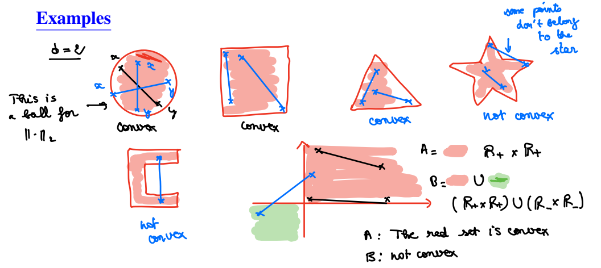

## Propostions 15 and 16: Particular Convex Sets

Following sets are convex:

- Vector subspaces of $\mathbb{R}^d$
- Intersection of two convex sets of $\mathbb{R}^d$
- Translation of convex set is also a convex set

  

    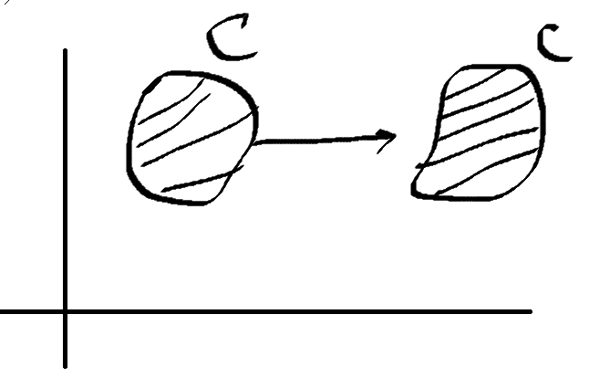
  

- The open $B_{||\cdot||}(a,r) = \{x \in \mathbb{R}^d: ||x-a||< r\}$ and closed balls $\overline{B}_{||\cdot||}(a,r) = \{x \in \mathbb{R}^d: ||x-a||\le r\}$ of $(\mathbb{R}^d, || \cdot ||)$ are convex

Proof for closed ball:\
$\overline{B}_{||\cdot||}(a,r) = a + \overline{B}_{||\cdot||}(0,r)$ - translation by $a$, still convex. Now prove that $\overline{B}_{||\cdot||}(0,r)$ is convex.\
Let $x,y \in \overline{B}_{||\cdot||}(0,r)$ and let $t \in [0,1]$\
$(1-t)x + ty \in \overline{B}_{||\cdot||}(0,r)$\
$||(1-t)x + ty - 0|| \le r$

$||(1-t)x + ty - 0|| \le ||(1-t)x|| + ||ty||=|(1-t)|||x|| + |t|||y|| = (1-t)||x|| + t||y||$\
Since $x,y \in \overline{B}_{||\cdot||}(0,r) => ||x|| \le r, ||y|| \le r, ||x-0|| \le r, ||y-0||\le r$\
$=> ||(1-t)x + ty - 0|| \le (1-t)r + tr = r$\
$=> (1-t)x + ty \in \overline{B}_{||\cdot||}(0,r)$

## Definition 19: Convex Function

A function $f: \mathbb{R}^d \to \mathbb{R}$ is convex if the following set is convex:
$$\{(x,y) \in \mathbb{R}^d \times \mathbb{R}: f(x) \le y\}$$

  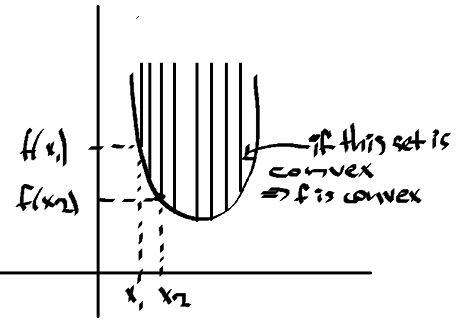

We also have:
$$\forall x,y \in \mathbb{R}^d, t\in[0,1]$$
$$f((1-t)x + ty) \le (1-t)f(x) + tf(y)$$

Example:\
$f(x) = x^2$\
$\forall x,y \in \mathbb{R}, t \in[0,1]$\
$((1-t)x + ty)^2 \le (1-t)x^2 + ty^2$\
$\alpha + \beta = 1$\
$(\alpha x + \beta y)^2 \le \alpha x^2 + \beta y^2$

### Propostion 18: Convexity and Derivative

We have $(\mathbb{R}^d, ||\cdot||)$ and $O$ open and convex, $f\in C^1(O, \mathbb{R})$
1. $f$ is convex if and only if
$$f(y) \ge f(x) + <\nabla f(x), y-x >; \forall x,y \in O$$
Proof:\
$f: \mathbb{R} \to \mathbb{R}, C^1$\
$f(y) \ge f(x) + f'(x)(y-x), \forall x \in \mathbb{R}$\
$f(x+h) \ge f(x) + f'(x)h, \forall h \in V(x)$ - equation of tangent of $f$ at point $x$, we get the graph which is above the tangent line.

2. The map $\nabla f$ is monotone:
$$<\nabla f(y) - \nabla f(x), y-x> \ge 0; \forall x,y \in O$$

Examples:

$f: \mathbb{R} \to \mathbb{R}$\
$f'(x)$ is non-decreasing (respectively increasing) $=>$ $f$ is convex (respectively strictly convex).

$f(x) = x^2$\
$f'(x) = 2x \uparrow \space => f(x)$ is convex\
$f'(x) \uparrow \iff \forall x < y => f'(x) \le f'(y) \iff \forall x,y \in \mathbb{R}: (x-y)|f'(x)-f'(y)| \ge 0$

$f: \mathbb{R} \to \mathbb{R}, C^2$\
if $f''(x) \ge 0, \forall x \in \mathbb{R}$\
$=> f'(x)$ is non-decreasing\
$=> f(x)$ is convex

$f(x) = x^2, f'(x) = 2x, f''(x) = 2$\
$=> f(x)$ is convex.

## Proposition 19: Convexity and Second Derivative

Let $O$ open set of $(\mathbb{R}^d, ||\cdot||)$, $f \in C^2(O, \mathbb{R})$. 
1. $f$ is convex $\iff Hf(x)$ is positive, meaning $\forall h \in \mathbb{R}^d: h^THf(x)H \ge 0$ or $sp[Hf(x)] \subset \mathbb{R}_+ \forall x \in O$ (eigenvalues are real and positive)
2. The function $f$ is strictly convex $\iff Hf(x)$ is positive definite, meaning $\forall h \in \mathbb{R}^d: h^THf(x)H > 0$ or $sp[Hf(x)] \subset \mathbb{R}^*_+ \forall x \in O$

*Remark: to prove that $f$ is convex, use Propositions 18 or 19, and then use Proposition 17 for something else.*

## Taylor Formula

$$f(x+h) = f(x) + Df(x)(h) + \frac{1}{2}D^2f(x)(h,h) + o(||h||^2)=$$
$$f(x) + <\nabla f(x),h> + \frac{1}{2}h^THf(x)h + o(||h||^2) =$$
$$f(x) + \sum^p_{i=1}h_i\frac{\partial f}{x_i}(x) + \frac{1}{2}\sum_{i,j}h_ih_j\frac{\partial^2f}{\partial x_j\partial x_i}(x) + o(||h||^2)$$

$f: \mathbb{R}^d \to \mathbb{R}, C^1$\
$f(x+h) = f(x) + f'(x)h + o(|h|)$

  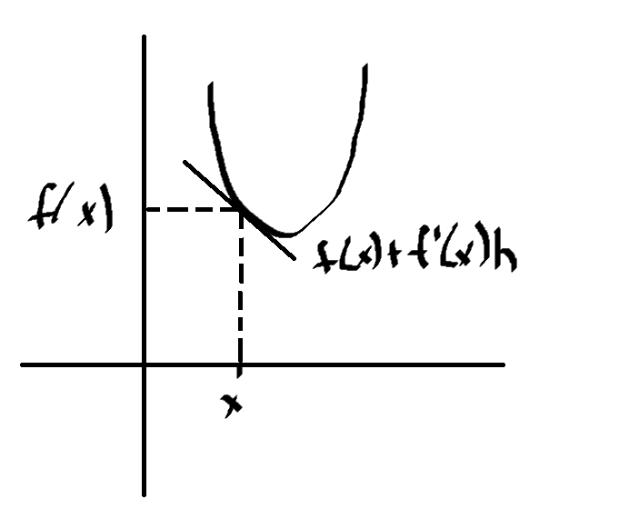

$f: \mathbb{R} \to \mathbb{R}, C^2, h \in \mathbb{R}^d$\
$f(x+h) = f(x) + f'(x)h + f''(x)\frac{h^2}{2} + o(h^2)$

  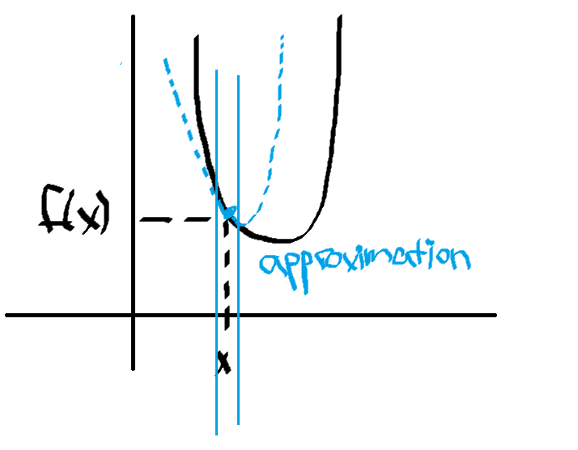

## Theorem 20: Hilbert Projection

Let $||\cdot||_2$ the Euclidean norm on $\mathbb{R}^d$. Let $C$ non-empty closed convex subset of $\mathbb{R}^d$.
1. . There exists a unique element $x_0 \in C$ s.t.
$$||x-x_0||_2 = d(x, C):=\inf_{y \in C}||x-y||_2$$
2. For all $y \in C$
$$<x - x_0, y - x_0> \le 0$$

# Optimization

Let $|| \cdot ||$ be a norm on $\mathbb{R}^d$, and $f : \mathbb{R}^d \to \mathbb{R}$ be a function. The aim of optimization is to solve the minimization (resp. maximization) problem $(P)$:

$$\min_{x \in A} f(x)$$

or

$$\max_{x \in A} f(x)$$

where:
- $f : \mathbb{R}^d \to \mathbb{R}$ is a cost/objective/criterion function,
- $A \subset \mathbb{R}^d$ is the set of constraints,
- Any point $x \in A$ is called an admissible point of problem $(P)$.

If $A$ is open - we have unconstrained problem of optimization, if $A$ is not open - we have optimization with constraints.

## Key Issues

- Existence: Can we find $x^* \in A$ s.t. $f(x^*) = \min_{x \in A}f(x)$ ?
- Necessary conditions: What properties, conditions must an admissible point fulfil to be a minimizer?
- Sufficient conditions: Can we find some properties s.t. if admissible point fulfills them, then it is a minimizer?

## Definition 1: Local, Global Extremum

Let $|| \cdot ||$ be a norm on $\mathbb{R}^d$, and $f : \mathbb{R}^d \to \mathbb{R}$ be a function.

- An element $x^* \in \mathbb{R}^d$ is a local minimum (resp. local maximum) of $f$ if there exists $r > 0$ such that:
$$f(x^*) \leq f(x) (\text{resp. }f(x^*) \geq f(x))$$
$$\forall x \in B_{|| \cdot ||}(x^*, r) \text{ - neighborhood of $x^*$ open ball with center $x^*$ and radius $r$}$$

- An element $x^* \in \mathbb{R}^d$ is a global minimum (resp. global maximum) of $f$ if:
$$f(x^*) \leq f(x) (\text{resp. }f(x^*) \geq f(x))$$
$$\forall x \in \mathbb{R}^d \text{ - whole $\mathbb{R}$}$$

- An element $x^* \in \mathbb{R}^d$ is an extremum of $f$ if it is either a minimum or a maximum of $f$.

*Remark: the problems $\min_{x \in A}[f(x)]$ and $-max_{x \in A}[-f(x)]$ are equivalent*.

Example:\
$f(x) = (x-1)^2 + 2$\
$f(x^*) \le f(x)$\
$(x^*-1)^2 + 2 \le (x-1)^2 + 2$\
$(x^*-1)^2 \le (x-1)^2$\
This holds for $x^* = 1 \forall x \in \mathbb{R}$ since both positive\
$=> \min[f(x)] = 2$\
$\argmin[f(x)] = \{1\}$ (set of all points where $\min$).

## Optimization with Constraints

### Theorems 1,2,3

1. If $A$ is **bounded + closed**: Let $A$ be compact, not void subset of $(\mathbb{R}^d, ||\cdot||)$ and $f$ continious, then
$$\exists x^* \in A \text{ s.t. } f(x^*) = \min_{x\in A}[f(x)]$$
2. If $A$ is **closed**: Let $A$ be closed, non void subset of $(\mathbb{R}^d, ||\cdot||)$ and functions $f: A \to \mathbb{R}$ and $g: \mathbb{R} \to \mathbb{R}$ s.t.
$$f(x) \ge g(||x||) \quad \forall x \in \mathbb{R}^d$$
$$\lim_{t\to +\infty}g(t) = +\infty$$
  We say $f$ is infinite at infinity, i.e.
$$\lim_{x \in A, ||x|| \to + \infty}f(x) = +\infty$$

Example:\
$\mathbb{R}^3$\
$f(x,y,z) = \sqrt{x^2 + y^2 + z^2}$\
$g(t) = t$\
$f(x,y,z) = ||x,y,z|| = g(||x,y,z||)$\
$\lim_{t\to \infty}g(t) = +\infty$\
$=> f$ is infinite at infinity.

3. If $A$ is **unbounded and closed**: If $A$ is unbounded, closed, non void subset and $f$ is continious and **infinite at infinity**, then $\exists x^* \in A$
$$\min_{x\in A}[f(x)] = f(x^*) \quad$$
  The point $x^*$ is **global minimum** of $A$.

Example:\
$f(x) = (x-2)(x-1)(x+2)(x+3)$\
$A = [-4,3]$\
$f$ is continious, $A$ is compact\
$=> \exists x^* \in A \text{ s.t. } f(x^*) = \min_{x\in A}[f(x)]$\
To apply Theorem 3:
- $f$ is continious in $\mathbb{R}$
- $f$ is infinite at it infinity\
In dimension 1, to prove that $f$ is infinite at infinity, it is sufficient to prove that $\lim_{|x| \to \infty}f(x) = + \infty$
$$=> \begin{cases}
  \lim_{x \to \infty}f(x) = + \infty \\
  \lim_{x \to -\infty}f(x) = + \infty
\end{cases}$$
By Theorem 3, we have that $\exists x^* \in A$ s.t. $x^* = \argmin_{x \in A} f(x)$

### Theorem 4: Convexity and Optimization

Let $(P)$ be a minimization problem, and let $x^*$ be a local minimum of $(P)$.

- If $(P)$ is convex, then $x^*$ is a global minimum.
- If $(P)$ is strictly convex, then $x^*$ is the unique global minimum.

  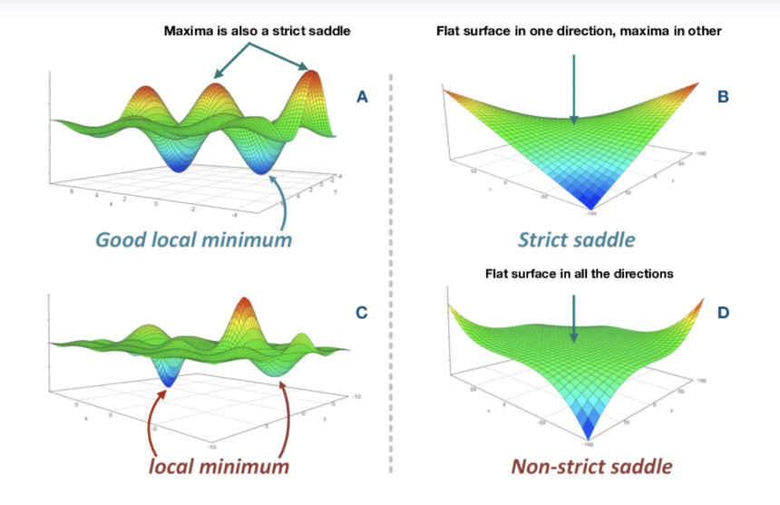

## Unconstrained Optimization

- $O$ is open 
- $f$ is differentiable.
- $f: O \to \mathbb{R}$
- We say $x^* \in O$ is **local** minimum if $f(x^*) \le f(x) \quad \forall x \in B_{||\cdot||}(x^*, r)$ (neighborhood of $x$)
- We say $x^* \in O$ is **global** minimum if $f(x^*) \le f(x) \quad \forall x \in O$ (neighborhood of $x$) 

### Theorem 5: Necessary Condition

Let $O$ be a non void open subset of $(R^d, || \cdot ||)$ and $f \in C^0(O, \mathbb{R})$ ( - continious).\
Let $x^* \in O$.\
If $f \in C^1(O, \mathbb{R})$ (all first order partial derivatives exist and are continious) and $x^*$ is a local minimum of $f$, then $\nabla f(x^*)=0$ ($x^*$ is called **critical point**).

Example:\
Tangent is horizontal $=> f'(x^*) = 0$

### Theorem 6: Suficient Condition

Let $f \in C^2(O, \mathbb{R})$.\
If $\nabla f(x^*) = 0$ and $Hf(x^*)$ is positive (resp. negative) definite, then $x^*$ is a local minimum (resp. maximum) of $f$.\
*Recall that for convexity $Hf(x)$ is positive (definite) at $\forall x \in O$, but for local min we have $Hf(x^*)$ only at $x^*$*.

Example:\
$\mathbb{R}^2, f \in C^2$\
$f(x^* + h) = f(x^*) + \nabla f(x^*)^Th + h^THf(x)h + o(||h||) \quad \forall h \in B_{||\cdot||}(0,r)$\
$f(x^* + h) \ge f(x^*)$

### Sylvester's Criterion

Used to prove that matrix is positive definite.

$A = \begin{bmatrix}
  a_{11} & a_{12} & a_{13} \\ a_{21} & a_{22} & a_{23} \\ a_{31} & a_{32} & a_{33}
\end{bmatrix}$

$\det a_{11} = a_{11} > 0$\
$\det \begin{bmatrix}
  a_{11} & a_{12} \\ a_{21} & a_{22}
\end{bmatrix} > 0$\
$\det A > 0$

Example:\
$f: (x,y) \in \mathbb{R}^2 \to x^2+y^2-xy$\
$\nabla f(x,y) = 0$\
$\nabla f(x,y) = \begin{bmatrix}
  2x - y \\ 2y - x
\end{bmatrix} = \begin{bmatrix}
  0 \\ 0
\end{bmatrix}$\
$2x=y$\
$2y=x$\
$4y - y =0$\
$=> x=0, y=0$\
$=> x^*=(0,0)$ is a critical point. To prove that it is local minumum:\
$Hf(x,y) = \begin{bmatrix}
  2 & -1 \\ -1 & 2
\end{bmatrix} \quad \forall x,y \in \mathbb{R}^2$\
$Hf(0,0) = \begin{bmatrix}
  2 & -1 \\ -1 & 2
\end{bmatrix}$\
By Sylvester's Criterion:\
$\det(2) = 2 > 0$\
$\det(Hf(0,0))$ = 3 > 0\
$Hf(x^*)$ is positive definite\
$=> x^*$ is local minimum.

### Theorem 7: Global Minimum | Unique

Let $C$ be a non-empty convex set in $\mathbb{R}^d$.

1. If $f : C \to \mathbb{R}$ is a convex and has a local minimum, then this minimum is global.

2. If $f : C \to \mathbb{R}$ is a **strictly** convex function and has a local minimum, then this minimum is both global and **unique**.

3. If $C$ is open in $\mathbb{R}^d$ and $f \in C^1(C, \mathbb{R})$, and $f$ is **convex**, then
$$\forall x^* \in C, \nabla f(x^*) = 0 \iff f(x^*) = \min_{x \in C}f(x)$$

Example:\
$f: (x,y) \in \mathbb{R}^2 \to x^2+y^2-xy$\
$\nabla f(x,y) = 0$\
$\nabla f(x,y) = \begin{bmatrix}
  2x - y \\ 2y - x
\end{bmatrix} = \begin{bmatrix}
  0 \\ 0
\end{bmatrix}$\
$2x=y$\
$2y=x$\
$4y - y =0$\
$=> x=0, y=0$\
$=> x^*=(0,0)$ is a critical point. To prove that it is local minumum:\
$Hf(x,y) = \begin{bmatrix}
  2 & -1 \\ -1 & 2
\end{bmatrix} \quad \forall x,y \in \mathbb{R}^2$\
$Hf(0,0) = \begin{bmatrix}
  2 & -1 \\ -1 & 2
\end{bmatrix}$\
By Sylvester's Criterion:\
$\det(2) = 2 > 0$\
$\det(Hf(0,0))$ = 3 > 0\
$Hf(x^*)$ is positive definite\
$=> f$ is strictly positive\
$=> x^*$ is unique global minimum

## RECAP

1. $f: C \to \mathbb{R}$ is convex (resp. strictly convex) $\iff \forall x \in C, Hf(x)$ is positive (resp. positive definite).
2. $x^*$ is local minimum $<=>$ If $\nabla f(x^*) = 0$ and $Hf(x^*)$ is positive definite
3. If $C$ is open in $\mathbb{R}^d$ and $f \in C^1(C, \mathbb{R})$, and $f$ is **convex**, then
$$\forall x^* \in C, \nabla f(x^*) = 0 \iff f(x^*) = \min_{x \in C}f(x)$$
4. If $f : C \to \mathbb{R}$ is a convex and has a local minimum, then this minimum is global
5. If $f : C \to \mathbb{R}$ is a **strictly** convex function and has a local minimum, then this minimum is both global and **unique**.

## Algorithms for Unconstrained Optimization

Determining the exact solution of a minimization
problem is impossible (in most cases). Descent algorithms can provide an
approximation of this.

### Descent Algorithm | Fidning **Local** Minimum

Choose $x_{\text{start}}$. Descent algorithm generates a sequence $(x_k)_{k \in N}$ defined by
$$x_{k+1} = x_k + s_kd_k$$
$$f(x_{k+1}) \le f(x_k)$$
,where
- $d_k$ is the descent **direction**
- $s_k$ is the descent **step** or **learning rate**

#### General Algorithm

*Input*: $f$ differentiable on $R^d$, $x_{\text{start}}$ initial point, $\varepsilon > 0 \approx 0$ **precision**.
*Output*: approximation of $\min_{x \in R^d}f(x)$

**Algorithm** $\text{DA}(f, x_{\text{start}}, \varepsilon)$ with fixed learning rate:
- Initialize $x_0 = x_{\text{start}}, k:= 0$
- While $||\nabla f(x_k)|| > \varepsilon$ (**stop condition**)
  - Find $d_k$ s.t. $\nabla f(x_k)^Td_k < 0$ $(<\nabla f(x_k), d_k> < 0)$ 
  - Choose $s_k > 0$ in direction $d_k$ s.t. $f(x_k + s_kd_k) < f(x_k)$ (**descent property**)
  - $x_{k+1} := x_k + s_kd_k$ (**update**)
  - $k := k + 1$
- Return $x_k$

We find $d_K$ s.t. $<\nabla f(x_k), d_k> < 0$ because by Taylor:
$$f(x_{k+1}) = f(x_k + s_kd_k) = f(x_k) + s_{k_\text{greater than 0}} <f(x_k), d_k>_{\text{should be less than 0}} + \text{ remainder }$$
$$f(x_k + 1) \le f(x_k)$$

#### Stop Conditions

One or the combination of the following criteria can be used to stop
the iterations of a descent algorithm:

- Since $\nabla f(x_k) \to \nabla f(x^*) = 0$ we can set:
$$||\nabla f(x_k)|| \le \varepsilon_1$$ 
- We have $x_k \to x^*$, so that we can choose
$$||x_k - x_{x+1}|| \le \varepsilon_2$$
- We also have $f(x_k) \to f(x^*)$ so we can use:
$$||f(x_k) - f(x_{k+1})|| \le \varepsilon_3$$

#### Gradient Algorithm

Take $d_k = -\nabla f(x_k)$\
$<\nabla f(x_k), -\nabla f(x_k)> = - ||\nabla f(x_k)||^2 < 0$\
$x_{k+1} = x_k - s \cdot \nabla f(x_k)$

*Input*: $f$ differentiable on $R^d$, $x_{\text{start}}$ initial point, $\varepsilon > 0 \approx 0$ **precision**.
*Output*: approximation of $\min_{x \in R^d}f(x)$

**Algorithm** $\text{GD}(f, x_{\text{start}})$ with fixed learning rate:
- Initialize $x_0 = x_{\text{start}}, k:= 0$
- While $||\nabla f(x_k)|| > \varepsilon$ (**stop condition**)
  - $x_{k+1} := x_k - s\nabla f(x_k)$ (**update**)
  - $k := k + 1$
- Return $x_k$

  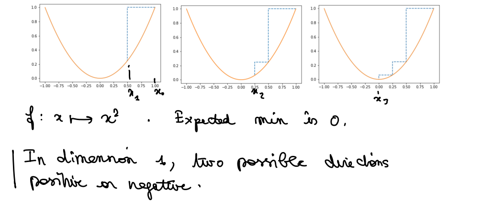

**Note: choosing good starting point $x_{\text{start}}$ and learning rate $s_k$ is very important. If otherwise, the algorithm might not converge if the learning rate too large. The algorithm might converge slowly, if learning rate is too small. If starting point is chosen wisely, the algorithm might even converge to a global minimum, not local.**

### Gradient Descend Convergence

#### Lipschitz Gradient

Let $f: R^d \to R$ differentiable function. If $\exists L \in R^*_+$ s.t.
$$\frac{||\nabla f(x) - \nabla f(y)||}{||x-y||} \le L, \quad x\ne y, \forall (x,y) \in R^d$$

then $f$ is dierentiable with continuous $L$-Lipschitz gradient.

Let $f: R^d \to R$ differentiable function with $L$-Lipschitz continious gradient. Then
$$f(y) \le f(x) + <\nabla f(x), y-x> + \frac{L}{2}||y-x||^2, \quad \forall (x,y) \in R^d$$

#### Optimal Step

The optimal step is defined by
$$s^* = \argmin_{s>0}f(x - s\nabla f(x))$$

#### Convergence of GD

We have convergent GD $\iff ||\nabla f(x_k)|| < \varepsilon$ at some point $x_k$.

Let a function $f$ bounded below, of class C1 with gradient Lipschitz of constant $L > 0$. Then:

1. If $\forall k, s_k = s < \frac{2}{L}$ the GD algorithm with constant step **converges globally** and
$$0 < s||\nabla f(x_k)||^2 - \frac{Ls^2}{2}||\nabla f(x_k)||^2 \le f(x_k) - f(x_{k+1})$$

Proof:\
We know: $f(y) \le f(x) + <\nabla f(x), y-x> + \frac{L}{2}||y-x||^2$\
Let $y = x_{k+1}, x = x_k$. Then\
$f(x_{k+1}) \le f(x_k) + <\nabla f(x_k), x_{k+1}-x_k> + \frac{L}{2}||x_{k+1}-x_k||^2$\
We know that $x_k - x_{k+1} = s\nabla f(x_k)$. Then\
$f(x_{k+1}) \le f(x_k) - <\nabla f(x_k), s\nabla f(x_k)> + \frac{L}{2}||s\nabla f(x_k)||^2$\
$f(x_{k+1}) - f(x_k)\le - s<\nabla f(x_k), \nabla f(x_k)> + \frac{Ls^2}{2}||\nabla f(x_k)||^2$\
$f(x_k) - f(x_{k+1})\ge s||\nabla f(x_k)||^2 - \frac{Ls^2}{2}||\nabla f(x_k)||^2$

2. The **optimal constant step** is defined by $s_k = s^* = \frac{1}{L} \forall k \in N$ and
$$\frac{1}{2L}||\nabla f(x_k)||^2 \le f(x_k) - f(x_{k+1})$$

#### Wolfe's Condition

The direction $d$ and the step $s$ of a descent algorithm with linear search satisfy Wolfe’s conditions if there exists $(\varepsilon_1, \varepsilon_2) \in (0, 1)^2$ such that $\varepsilon_1 < \varepsilon_2$ and

1. $f(x + sd) \le f(x) + \varepsilon_1 s(\nabla f(x)^Td)_{\text{linear}}$
2. $\nabla f(x + sd)^Td \ge \varepsilon_2(\nabla f(x)^Td)$

**The GD algorithm with Wolfe’s step globally converges.**

### Newton's Method

By Taylor:

$$f(x) \approx f(x_k) + f'(x_k)(x-x_k) +$$

$$+ \frac{f''(x_k)}{2}(x-x_k)^2 =: q(x)$$

Here, $f(x_k) + f'(x_k)(x-x_k)$ - linear approximateion of the function in a neighborhood of $x+k$.

The necessary condition for optimization is $q'(x)=0$, $f'(x) \approx q'(x)$.

$$q'(x) = f'(x_k) + f''(x_k)(x-x_k)$$

If $f''(x_k) > 0$, $q$ achieves a minimum at

$$x = x_k - \frac{f'(x_k)}{f''(x_k)}$$

  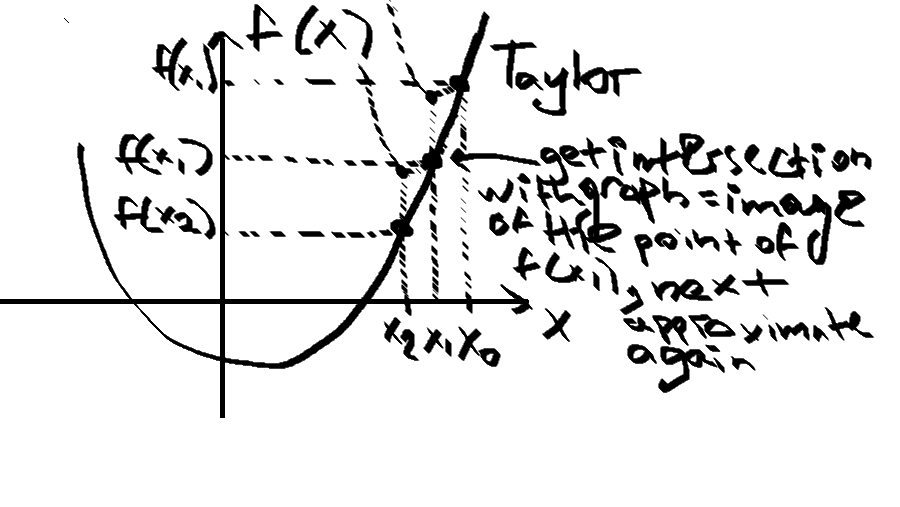

#### Newton's Algorithm

- input: $f$ **twice differentiable** on $R^d, x_{start}$ initial point, $\varepsilon > 0$
- output: approximation of $\min_{x \in R^d}f(x)$

Algorithm:
1. initialize $x_0 = x_{start}, k =0$
2. While $||\nabla f(x_k)||>\varepsilon$ (stop criterion)
   1. $x_{k+1} = x_k - [Hf(x_k)]^{-1}\nabla f(x_k)$
   2. $k = k+1$
3. return $x_k$

Newton's direction is: $d_k = [Hf(x_k)]^{-1}\nabla f(x_k)$

### Link Between GD and Newton's

  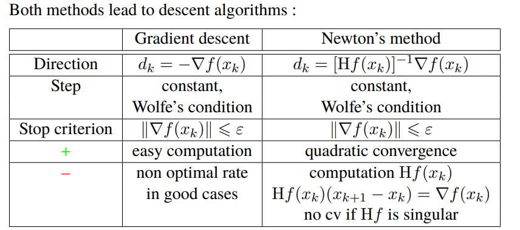

- If $f$ is smooth enough (atleast twice differentiable), then Newton's method is faster (quadratic convergence)
- Both methods have a drawback, since they only provide local minimum.

### Gauss-Newton Method

$$r: R^d \to R^d, \text{differentiable}$$

$$f(x) = \frac{1}{2}||r(x)||^2_2$$

**Idea**: replace at each iteration the non-linear LS problem by an
approximate linear LS problem (by Taylor). Let $x_k$ be the current iterate. Replace
in a neighbourhood of $x_k$, the problem by

$$\min_{y \in R^d}\tilde{f}(y) = \frac{1}{2}||r(x_k) + J_r(x_k)(y-x_k)||^2_2$$

$$y = x_{k + 1}$$

$$x_{k + 1} = (J_r^T(x_k)J_r(x_k))^{-1}(J_r^T(x_k)J_r(x_k)x_k - J_r^T(x_k)r(x_k))$$

The direction $d_k=x_{k+1} - x_k$ is called Gauss-Newton direction.

#### Gauss-Newton Algorithm

- input: $r$ differentiable on $R^d, x_{start}$ initial point, $\varepsilon > 0$ precision.
- output: approximation of $\min_{x \in R^d}f(x)$

Algorithm:
1. initialize $x_0 = x_{start}, k=0$
2. while $||\nabla f(x_k)|| > \varepsilon$
   1. $x_{k + 1}= x_k - [J_r(x_k)^TJ_r(x_k)]^{-1}J_r(x_k)^Tr(x_k)$
   2. k = k + 1
3. return $x_k$

## Optimization with (In)equality Constrains

$$\min_{x \in A}f(x) (\text{resp.} \max_{x \in A}f(x))$$

$$f: R^d \to R$$

- $f$ a **cost/objective function**, $A \subset R^d$ is the **admissible set**. 
- The **optimal value** of $(P)$ is 

$$p^*=\inf_{x \in A}f(x)$$

We allow $p^*=\plusmn\infty$

- A point $x^*$ is **optimal** if $x^*$ is **admissible** and $f(x^*)=p^*$. The set of all points is the **optimal set**. Point $x^*$ is **admissible** if it satisfies some constrains.

#### Example

  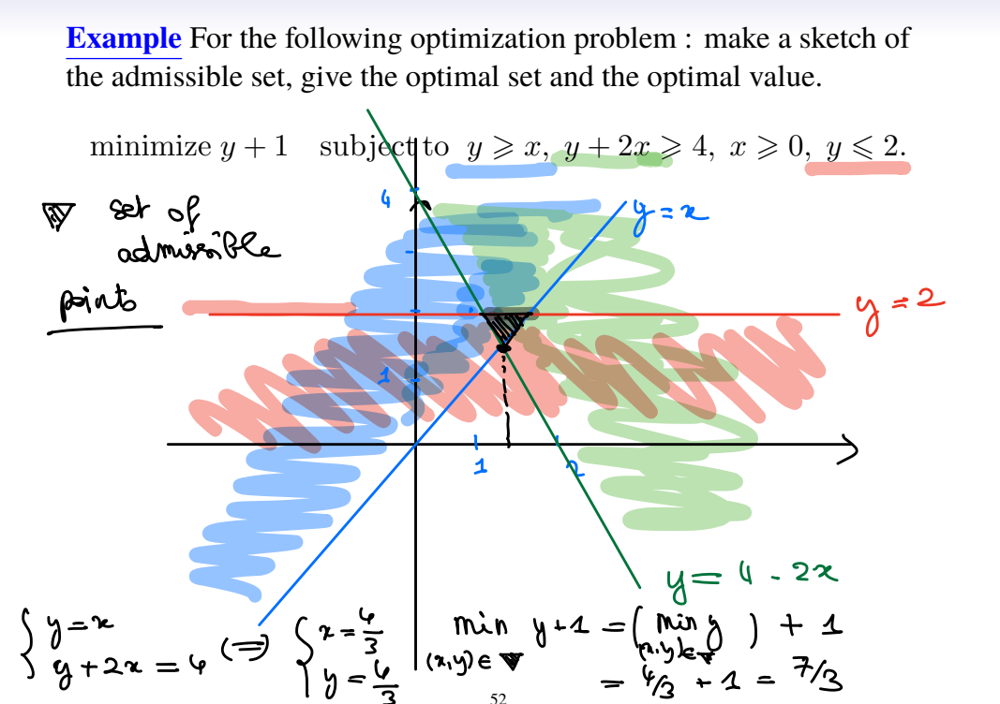

- **objective function**: $f(x,y) = y+1$
- **constraint functions**:
  - $x - y \le 0, g_1(x,y) = x-y$
  - $4 - y - 2x \le 0, g_2(x,y) = 4-y-2x$
  - $-x \le 0, g_3(x,y) = -x$
  - $y-2 \le 0, g_4(x,y) = y-2$

### Admissible Direction

Let $x \in A$. A direction $d \in R^d$ is admissble at $x$ if there exists $\overline{s} > 0$ s.t. $x + sd$ is admissible for all $s \in (0, \overline{s}]$

Remember: $A$ is convex, $x,y \in A; (1-t)x + ty \in A, \forall t \in [0,1]; x + t(y-x) \in A; => y-x$ admissible at $x$ ($t=1, d=y-x, s=t$)

### Tangent Cone

Let $A \subset R^d$ and $x\in A$. The vector $d \in R^d$ is tangent to $A$ at $x$ if and only if there exist sequences

- $(x_n)_{n \in N_0}$ of elements of $A$
- $(\lambda_n)_{n \in N_0}$ of positive numbers

s.t.

$$x_n \to_{n \to +\infty}x \text{ and } \lambda_n(x_n - x) \to_{n \to +\infty} d$$

The set $T_x(A)$ is called the **tangent** **cone** to $A$ at $x$.

The vector $d$ is called a **tangent direction** to $A$ at $x$.

#### Examples

$A = \{x=(x_1, x_2) \in R^2: -x_1^3 + x_2 \le 0, -x_2 \le 0\}, x=(0,0)$

  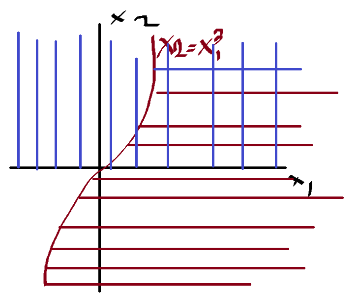

We are looking for a direction at $(0,0)$ tangent to the intersection of the graphs.

$$(x_1^n, x_2^n)\in A \to (0,0)$$

$$\lambda_n((x_1^n, x_2^n) - (0,0)) \to d$$

Let $x_1^n = \frac{1}{n}, x_1^n \to_{n \to \infty} 0$\
Let $x_2^n = \frac{1}{n^3}, x_2^n \to_{n \to \infty} 0$

$$(-\frac{1}{n})^3  + \frac{1}{n^3}=0 => \in A (-x_1^3 + x_2 \le 0)$$

Let $\lambda_n = n$, then

$$n(1/n, 1/n^3)=(1,1/n^2) \to (1,0)$$

$=> d=(1,0) \in T_x(A)$

$A = \{x=(x_1, x_2) \in R^2: x_1^2 \le x_2^2\}$
$<=> \{x=(x_1, x_2) \in R^2: |x_1| \le |x_2|\}$

  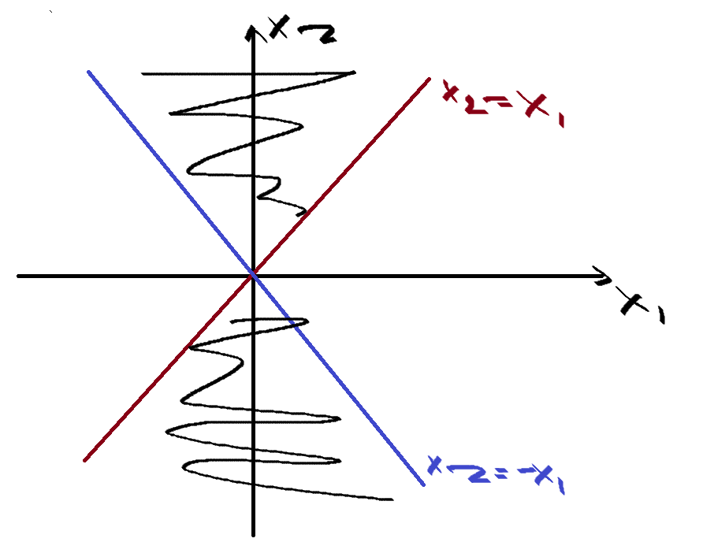

Looking for a direction vector at $(0,0)$ tangent to the intersection of graphs.

Let $x_1^n = \frac{1}{n} x_1^n \to_{n \to \infty} 0$\
Let $x_2^n = \frac{1}{n}, x_2^n \to_{n \to \infty} 0$

$$1/n - 1/n = 0 => \in A$$

Let $\lambda_n = n$, then

$$n(1/n, 1/n)=(1,1) \to (1,1)$$

$=> d=(1,1) \in T_x(A)$

### Necessary Optimality Condition

Let $x^*$ be a local minimum of $(P)$. Then

$$\forall v \in T_{x^*}(A), <\nabla f(x^*), v> \ge 0$$

### Frame

We consider the constrained optimization problem

$$(P) \text{ minimize } f(x) \text{ subject to }  \begin{cases}
  g_i(x) \le 0, i=1,...,m \\
  h_j(x) = 0, j=1,...,p
\end{cases}$$

where

- for $i=1,...m, [g_i(x) \le 0]$ is an **inequality constraint** and $g_i: R^d \to R$ an **inequality constraint function** assumed to be **differentiable**.
- for $j=1,...p, [h_j(x) = 0]$ is an **equality constraint** and $h_j: R^d \to R$ an **equality constraint function** assumed to be **differentiable**.

*Remark: if $m=p=0, (P)$ is an unconstrained optimization problem.*

### Terminology

1. The domain of the problem $(P)$ is

$$D = Dom f \cap (\bigcap^m_{i=1}Dom\space g_i) \cap (\bigcap^p_{j=1}Dom\space h_j)$$

2. A point $x \in D$ is **admissible** if $x \in A$ where

$$A = \{ x \in D: g_i(x) \le 0, h_j(x) = 0\}$$

We also denote

$$A^+ = \{ x \in D: g_i(x) < 0, h_j(x) = 0\}$$

3. The constraint $g_i$ is active at $x \in A$ if $g_i(x) =0$ and we note 
 
$$I(x) = \{ i=1,...,m: g_i(x)=0\}$$

The constraint $g_i(x)$ is **saturated** at $x$.

### Qualification of Constraints

The constraints of $(P)$ are qualified at $x \in A$ if 

$$T_x(A) = \{d \in R^d:$$

$$\forall j \in\{1,...,p\}, <\nabla h_j(x), d> = 0\,$$

$$\forall i \in I(x), <\nabla g_i(x), d> \le 0\}$$

This set is calledthe **polyhedron** of constraints of $F_x(A)$.

That means that the constraints are qualified at $x$ if the tangent cone consists of directions $d$ s.t.

$$<\nabla h_j(x), d> = 0$$

$$<\nabla g_i(x), d> \le 0 \quad \forall i \in I(x)$$

We say that the constaints $(P)$ are qualified at $x \in A$ if

$$\{\nabla h_j(x), j = 1,...,p\} \cup \{\nabla g_i(x), i \in I(x)\}$$

are **linearly independent**.

#### Example

$$(P) \text{ minimize } f(x,y) x^2-2y^2 + x \text{ subject to }  \begin{cases}
  -x+y^2 \le 0 \\
  -x-y \le 0
\end{cases}$$

$A = \{(x,y) \in R^2: -x+y^2 \le 0, -x-y \le 0\}$\
$g_1(x,y) = -x + y^2$\
$g_2(x,y) = -x-y$

Let $A$ be the set of admissible points. Prove: the constraints of $(P)$ are qualified at all points of $(x, y) \in A$ with $y\neq-1/2$.

Prove: $\{\nabla h_j(x), j = 1,...,p\} \cup \{\nabla g_i(x), i \in I(x)\}$ are linearly independent.

$$\nabla g_1(x,y) = (-1, 2y)$$

$$\nabla g_2(x,y) = (-1, -1)$$

if $y \neq -1/2$ then $\{\nabla g_1(x,y), \nabla g_2(x,y)\}$ are linearly independent.

Thus, the constraints are qualified at all points of $A$ s.t. $y \neq -1/2$.

### Convex Optimization Problem

A convex problem is a problem where the objective function is convex and the inequality constraint functions are convex. The equality constraint functions are affine:

$$h_j(x) = a_j^Tx - b_j, x \in R^d$$

$$\begin{bmatrix}
  h_1(x) \\ \vdots \\ h_p(x)
\end{bmatrix} = 0 \iff Ax=b, A = \begin{bmatrix}
  a_1^T \\ \vdots \\ a_p^T
\end{bmatrix}$$

### Slater Condition

In the case of convex problem, a simple constraint qualification is the **Slater** **condition**: 

$$\exists x \in \overset{\circ}{D} \text{ s.t. }$$
$$\forall j=1,...,p, h_j(x) = 0 $$
$$g_i(x) < 0, i=1,...,m$$

Slater’s condition can be refined when there exists $k \in \{1,...,m\}$ s.t. $g_1,...,g_k$ are affine. Slater's condition is then:

$$\exists x \in \overset{\circ}{D} \text{ s.t. }$$

$$g_i(x) \le 0; i = 1,...,k$$

$$g_i(x) < 0, i = k+1,...,m$$

$$Ax=b$$

**If $f(x)$ is not convex, we cannot do Slater condition**.

#### Example

Show that the Slater's condition holds.

1. Check that the problem is convex.
2. Check that Slater's condition holds at all points $(x, -1/2) \in A$

$f(x,y) = x^2 + 2y^2 + x$\
$g_1(x,y) = -x+y^2$\
$g_2(x,y) = -x-y$

Is $f$ convex?

$Hf(x,y) = \begin{bmatrix}
  2 && 0 \\ 0 && 4
\end{bmatrix}$

$Hf(x,y)$ is pos. def. $=>$ $f$ is convex.

Is $g_1$ convex?

$Hg_1(x,y) = \begin{bmatrix}
  0 && 0 \\ 0 && 2
\end{bmatrix}$

$Hf(x,y)$ is semi-pos. def. $=>$ $g_1$ is convex.

Is $g_2$ convex?

$g_2(x,y) = -x-y = [-1, -1]\begin{bmatrix}
  x \\ y
\end{bmatrix}$ affine $=>$ convex.

$=> (P)$ is convex.

Consider points $(x,-1/2) \in A$. We have that $g_2$ is affine. Assume $g_2$ is active at $(x,-1/2)$. That means that $g_2(x,-1/2) = 0 \iff -x+1/2 = 0 \iff x=1/2$

$g_1(1/2,-1/2) = -1/4 < 0$

We have that $g_1$ is not active at $(1/2, -1/2)$. Thanks to the Slater's condition the constraints are qualified at $(1/2, -1/2)$

### Lagrangian

The Lagrangian associated to $(P)$ is the function $\mathcal{L} : R^m \times R^p \to R$ defined for $(\gamma, \lambda) \in R^m \times R^p$ by

$$\mathcal{L}(x,\gamma, \lambda) = f(x) + \sum^m_{i=1}\gamma_ig_i(x) + \sum^p_{j=1}\lambda_jh_j(x)$$

where
- $f(x)$ - objective function
- $g_i(x), h_j(x)$ - constraint functions.
- $x \in R^d$
- $\gamma \in R^m$
- $\lambda \in R^p$

### Karush-Kuhn-Tucker CN

Let $x^* \in A$ be an admissible point of $(P)$. Assume that the constraints are qualified at $x^*$. If $x^*$ is a local minimum of $f$ on $A$,
there exist $(\gamma^*, \lambda^*) \in R^m \times R^p$ such that

$$\text{KKT }\begin{cases}
  \nabla_x\mathcal{L}(x^*,\gamma^*, \lambda^*) = 0, \\
  h_j(x^*) = 0, \\
  \gamma^*_ig_i^*(x^*) = 0, \\
  \gamma_i^* \ge 0, \\
  j = 1,...,p \\
  i = 1,...,m
\end{cases}$$

They are referred as the Karush-Kuhn-Tucker (KKT) conditions.

### SNC Condition in a Convex Problem

Assume that $(P)$ is a convex problem. Let $x^*\in A$ be an admissible point of $(P)$ where the constraints are qualified.
Then, $x^*$ is a global minimum of $f$ on $A$ if and only if the KKT conditions hold at $x^*$.

### 2nd-order Sufficient Condition

Define the Hessian of the Lagrangian by

$$H\mathcal{L}(x,\gamma, \lambda) = Hf(x) + \sum^m_{i=1}\gamma_iHg_i(x) + \sum^p_{j=1}\lambda_jHh_j(x)$$

Let $x^* \in A$ s.t.
- $(x^*,\gamma, \lambda)$ satisfy KKT conditions
- $H\mathcal{L}$ is positive definite on $T_{x^*}^+(A)$ (where $x^*$ is qualified by linear independence or $F_{x^*}^+$)

Then, $x^*$ is a strict local minimum of $(P)$ (strict = unique in a neighborhood of $x^*$).

**If $f(x)$ is not convex, we cannot do Slater condition**.

### Algorithm to Find Local Minimum

1. Check if $f(x)$ is convex.
   1. If convex $=>$ do Slater condition
2. If not convex, calculate Lagrangian.  
3. Calculate $\nabla$ of Lagrangian
4. Find critical points by KKT.
5. Find minimum among the critical points (where $f(x)$ takes minimal value).
6. Compute Hessian of the Lagrangian at the point
7. Check if Hessian is positive definite
   1. If positive definite $=>$ then $x$ is strict local minimum
   2. If not positive definite, cannot say anything.

### Unconstrained vs with (In)equality Constraints Optimizations

  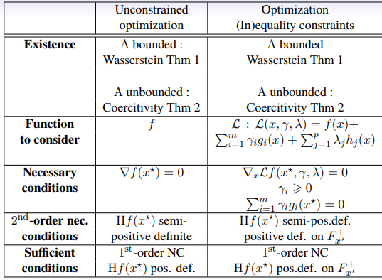

### Lagrangian Duality
The Langrange dual function associated to $(P)$ is the function $\phi: R^m_+ \times R^p \to R$ s.t.

$$\phi(\gamma, \lambda) = \inf_{x\in D}L(x,\gamma, \lambda)$$

When the Lagrangian is unbounded from below in $x, \phi(\gamma, \lambda) = -\infty$. The dual admissible domain is

$$A^* = \{(\gamma, \lambda)\in R^m_+ \times R^p: \phi(\gamma, \lambda) > - \infty\}$$

### Dual Problem

Since $A \subseteq D$:

$$\inf_{x\in D}L(x,\gamma, \lambda) \le \inf_{x\in A}L(x,\gamma, \lambda) \le \inf_{x \in A}f(x)$$

$$d^*=\sup_{\gamma \in R^m, \lambda \in R^p}\phi(\gamma, \lambda) \le \inf_{x \in A}f(x) = p^*$$

$$d^* \le p^*$$

$$(P): \min_{x\in A}f(x) = p^* - \text{ primal problem}$$

$$(D): \max_{\gamma \in R^m, \lambda \in R^p}\phi(\gamma, \lambda) = d^* - \text{ dual problem}$$

The Langrange dual function provides a lower bound for the optimization problem $(P)$.

#### Example

$$\text{ minimize }f(x) = c^Tx$$

$$\text{ subject to }Ax = b, x \ge 0$$

$$x \in R^d, A\in M^{p \times d}, b,c \in R^p$$

$L(x, \gamma, \lambda) = c^Tx + \sum^d_{i=1}\gamma_i(-x_i) + \sum^d_{j=1}\lambda_j(A_j^Tx - b_j)=c^Tx - \gamma^Tx + \lambda^T(Ax-b)$

$\phi(\gamma, \lambda) = \inf_{x \in R^d}L(x,\gamma, \lambda)=\inf_{x \in R^d}[c^Tx - \gamma^Tx + \lambda^T(Ax-b)]$

We have that $c^Tx, \gamma^Tx$ and $\lambda^T(Ax-b)$ are linear.

$\inf_{x \in R^d}[(c-\gamma+A\lambda^T)x - \lambda^Tb]$

We have that $[(c-\gamma+A\lambda^T)x - \lambda^Tb]$ is affine.

To find the minimum of affine function, we need to look at $\nabla=0$.

$\nabla_xL(x,\gamma,\lambda) = c -\gamma+A^T\lambda=0$

$=>\inf_{x \in R^d}L(x,\gamma,\lambda) = \begin{cases}
  -\lambda^Tb,\text{ if }c -\gamma+A^T\lambda=0 \\ -\infty
\end{cases}$

#### Conjugate Function

The conjugate of a function $f: R^d \to R$ is the function $f^*$ defined by

$$f^*(y) = \sup_{x\in D(f)}(y^Tx-f(x))$$

The Lagrange dual function and conjugate function are closely related.

$$\inf(\dots) = -\sup(- \dots)$$

#### Example

$\phi(\gamma, \lambda)=\inf_{x \in R^d}L(x,\gamma, \lambda)=\inf_{x \in R^d}[c^Tx-\gamma^Tx+(A^T\lambda)^T x - \lambda^Tb] = - \lambda^Tb+\inf_{x \in R^d}[c^Tx-\gamma^Tx+(A^T\lambda)^T x]=-\lambda^Tb-\sup_{x \in R^d}[-c^Tx+\gamma^Tx-(A^T\lambda)^T x]$

$f(x) = -c^Tx, y^Tx = \gamma^Tx-(A^T\lambda)^T x$

$=> \phi(\gamma, \lambda)=-\lambda^Tb-\sup_{x \in R^d}[y^Tx-f(x)] = -f^*(\gamma-A^T\lambda)-\lambda^Tb$

### Dual Problem

The (Lagrange) dual problem $(D)$ associated to the primal problem $(P)$ is defined by

$$\text{maximize }\phi(\gamma,\lambda)\text{ subject to }(\gamma,\lambda) \in R^m_+ \times R^p$$

We denote $d^*$ the optimal value of $(D)$ i.e.

$$d^* = \sup_{(\gamma,\lambda)\in R^m_+ \times R^p}\phi(\gamma,\lambda)$$

The dual problem is convex, since $\sup_{\dots}\phi(\dots)=-\inf_{\dots}-\phi(\dots)$. Since $\phi$ is concave, then $-\phi$ is convex.

**Question**: under which conditionsdo we have $d^*=p^*?$

### Saddle Points of the Lagrangian

- For any $(\gamma,\lambda) \in \mathbb{R}^m_+ \times \mathbb{R}^p$, the map $x \in D \to L(x, \gamma,\lambda)$ is convex

- For any $x \in D$, the map $(\gamma,\lambda) \in \mathbb{R}^m_+ \times \mathbb{R}^p \to L(x, \gamma,\lambda)$ is concave.

An element $(x^*, \gamma^*,\lambda^*) \in D \times R^m_+, R^p$ is a saddle point of $L$ if

- $L(x^*, \gamma,\lambda) \le L(x^*, \gamma^*,\lambda^*), \forall \gamma \in R^m_+, \lambda \in R^p (\text{maximizes})$
- $L(x^*, \gamma^*,\lambda^*) \le L(x, \gamma^*,\lambda^*), \forall x \in D (\text{minimizes})$

### Weak Duality

The following weak principle holds:

$$d^* \le p^*$$

The duality gap is $p^* - d^*$

### Strong Duality

The duality gap is $0: p^*=d^*$

Let $x^* \in D, (\gamma^*, \lambda^*) \in R^m_+ \times R^p$. The points $(x^*, \gamma^*, \lambda^*)$ is a saddle point of $L$ if and only if

- $x^*$ is a solution $(P)$,
- $(\gamma^*, \lambda^*)$ is a solution of $(D)$
- The duality gap is $0: p^*=d^*$

Moreover, we have

$$p^* = f(x^*) - \inf_{x \in A}\left[\sup_{(\gamma, \lambda)\in R^m_+ \times R^p}L(x,\gamma,\lambda)\right]$$

#### Example

$$(P) = \begin{cases}
  \text{minimize }f(x,y) = x^2-2y^2 + x \\
  g_1(x,y) = -x+y^2 \\ g_2(x,y) = -x -y
\end{cases}$$

We saw $(1/2, 1/\sqrt{2})$ is a critical point with $\gamma_1=2, \gamma_2=0$. We couldn't tell anything else since the Hessian was semi-positive definite. But now we can prove that if the point $(1/2, 1/\sqrt{2})$ is saddle, then it is the global minimum of the problem.

$$L((x,y),\gamma_1,\gamma_2) = x^2-2^2+x+\gamma_1 g_1(x,y) + \gamma_2 g_2(x,y)$$

1. $L((1/2, 1/\sqrt{2}), \gamma_1, \gamma_2) \le L((1/2, 1/\sqrt{2}), 2, 0) ?$
   1. $L((1/2, 1/\sqrt{2}), 2, 0) = -1/4$
   2. $L((1/2, 1/\sqrt{2}), \gamma_1, \gamma_2) = -1/4 - \gamma_2(1/2 + 1/\sqrt{2})$
   3. $L((1/2, 1/\sqrt{2}), \gamma_1, \gamma_2) \le L((1/2, 1/\sqrt{2}), 2, 0), \forall \gamma_1, \gamma_2 \ge 0$
2. $L((1/2, 1/\sqrt{2}), 2, 0) \le L((x, y), 2, 0) ?$
   1. $L((1/2, 1/\sqrt{2}), 2, 0) = -1/4$
   2. $L((x, y), 2, 0) = x(x-1) (\text{doesn't depend on y})$
   3. $=> L((x, y), 0, 2) \le L((1/2, 1/\sqrt{2}), 2, 0), \forall x, y\in D$

$=> ((1/2, 1/\sqrt{2}), 2, 0)$ is saddle

$(x^*, \gamma^*) = \left( \begin{bmatrix}
  1/2 \\ 1/\sqrt{2}
\end{bmatrix}, \begin{bmatrix}
  2 \\ 0
\end{bmatrix}\right)$ - global minimum.

Also notice that we have strong duality, since $p^* = d^*$

$$p^* = f(x^*)= L(x^*, \gamma^*, \lambda^*) = d^* = \inf_{x \in D}L(x, \gamma^*, \lambda^*)$$

### CNS Strong Duality

In practise, Strong duality theorem does not indicate how to compute the saddle points of the Lagrangian but we have the following:

1. If $(P)$ has an optimal solution, so does $(D)$ and $p^*=d^*$
2. $x^*$ is a soltuin of $(P)$ and $(\gamma^*, \lambda^*)$ is a solution of $(D)$ if and only if
   1. $x^* \in A$
   2. $\gamma \ge 0$
   3. The following holds

$$f(x^*) = L(x^*, \gamma^*, \lambda^*) = \inf_{x\in R^d}L(x, \gamma^*, \lambda^*)$$

### Slater's Convex Condition

1. $f(x)$ convex
2. $g_i(x), i=1,\dots,m, g_i:R^d \to R$ convex
3. $h_j(x), j=1,\dots,p, h_j:R^d \to R^d$ affine: $\exists (a_j, b_j) \in R^d \times R^d$ s.t. $h_j(x)=a_j^Tx - b_j, x\in R^d$
4. $\exists x_0 \in D$ s.t;
   1. $h_j(x_0) = 0, \forall j=1,\dots,p$
   2. $g_i(x_0)<0, \forall i=1,\dots,m$

### Slater's Theorem

If $f(x)$ convex, $g_i(x)$ convex + Slater's condition ($h_j(x)=0, g_i(x)<0$), then

1. $p^*=d^*$
2. $\exists \gamma^* \in R^m_+$ s.t. $(x^*, \gamma^*)$ is a saddle point of the Lagrangian and
   1. $\nabla f(x^*) + \sum^m_{i=1}\gamma_i^*\nabla g_i(x^*)+ \sum^p_{j=1}\lambda_j^*\nabla h_i(x^*)=0$
3. $(x^*, \gamma^*, \lambda^*)$ is a critical points of KKT.

# Numerical Probabilities

| Property                                   | $X(\Omega)$ finite or countable set | $X(\Omega) \subset R$ |
|--------------------------------------------|-------------------------------------| -------------------------|
| Distribution $P_X(\{x\})$                  | $P_X(\{x\})=P(X = x)$               | $dP_X(x) = f_X(x)dx$                      |
| Cumulative Distribution Function $F_X(x)$  | $F_X(x) = \sum_{k\in X(\Omega), k \le x} P(X=k)$ | $F_X(x) = \int_{-\infty}^{x} f_X(t)dt$ |
| Expectation $E[X]$                         | $\sum_{k \in X(\Omega)} k P(X = k)$ | $\int_{-\infty}^{\infty} x f_X(x)dx$                          |
| Transfer Theorem $E[g(X)]$                 | $E[g(X)] = \sum_{k \in X(\Omega)} g(k)P(X = k)$ | $E[g(X)] = \int_{-\infty}^{\infty} g(x)f_X(x)dx$              |

$$Var(X) = E[X^2] - (E[X])^2 \text{ and } \sigma_X = \sqrt{Var(X)}$$

| Distribution | $X(\Omega)$ | Support + Definition | $E[X]$ | $Var(X)$ |
|--------------|-------------|----------------------|--------|----------|
| Bernoulli    | $X \sim B(p)$ | $\begin{bmatrix}X(\Omega) = \{0, 1\} \\ P(X=1)=p \\ P(X=0)=1-p \end{bmatrix}$ | $p$ | $p(1-p)$ |
| Binomial     | $X \sim B(n, p)$ | $\begin{bmatrix}X(\Omega) = \{0, \ldots, n\} \\ P(X=k) = \binom{n}{k}p^k(1-p)^{n-k} \end{bmatrix}$ | $np$ | $np(1-p)$ |
| Geometric    | $X \sim G(p)$ | $\begin{bmatrix}X(\Omega) = \{N \geq 1\} \\ P(X=k)=p(1-p)^{k-1}\end{bmatrix}$ | $\frac{1}{p}$ | $\frac{1-p}{p^2}$ |
| Poisson      | $X \sim P(\lambda)$ | $\begin{bmatrix}X(\Omega) = \mathbb{N}_0 \\ P(X=k)=e^{-\lambda}\frac{\lambda^k}{k!}\end{bmatrix}$ | $\lambda$ | $\lambda$ |
| Uniform      | $X \sim U([a, b])$ | $\begin{bmatrix}X(\Omega)=[a, b] \\ f_X(x)=\frac{1}{b-a}\mathbb{1}_{R^+}(x)\end{bmatrix}$ | $\frac{a+b}{2}$ | $\frac{(b-a)^2}{12}$ |
| Exponential  | $X \sim E(\lambda)$ | $\begin{bmatrix}X(\Omega) = \mathbb{R}^+ \\ f_X(x)=\lambda e^{-\lambda x}\mathbb{1}_{R^+}(x)\end{bmatrix}$ | $\frac{1}{\lambda}$ | $\frac{1}{\lambda^2}$ |
| Standard Normal | $X \sim N(0, 1)$ | $X(\Omega) = \mathbb{R}$ | $0$ | $1$ |
| Normal       | $X \sim N(\mu, \sigma^2)$ | $X(\Omega) = \mathbb{R}$ | $\mu$ | $\sigma^2$ |

## Simulation of Random Variables

Methods of simulation are based on the production of random
variables (usually i.i.d.) that are distributed according to a
distribution that is not necessarily known.

The generation of "random numbers" is the problem of
producing a deterministic sequence of values in $[0, 1]$ which
imitates a sequence of i.i.d. uniform random variables of
distribution $U([0, 1])$.

### Pseudo-Random Variables

If $u_n=U_n(\omega)$, we call $(u_n)_n$ a sequence of pseudo-random numbers (because it is deterministic).

### Distributions

Distributions can be characterized by:

- if $X(\Omega)$ - image of random variable - is finite and countable, then the law of $X$ is characterized by the probability of singletons and we have CDF
- if $X(\Omega) \subset R$ absolutely continious w.r.t the Lebesque measure, then the law is characterized by PDF - probability density function - distributions that have a density w.r.t. the Lebesque measure.

### Characteristic Function

$X: \Omega \to R, \quad dR_x=f_X(x)dx$

$$G_X(t)=E[e^{itX}]=\int_{R}e^{itx}f_X(x)dx$$

$$\phi(x)=e^{itx}$$

### Generalized Inverse Function

We have $F_x(x)$. Want to find a transformation $T(U)$, $T$ function, $U$ uniform distribution, s.t. $T(U)=X$, where $X$-numbers following distribution we want our numbers to follow, such as exponential, etc.

$$F_X(x)=P(X\le x)=P(T(U)\le x) = P(U \le T^{-1}(x))$$

Now it is easy for a uniform distribution:

$$\iff P(U \le T^{-1}(x)) = T^{-1}(x)$$

Thus:

$$F^{-1}_X(x)=T(x)$$

Let $F$ be a non-decreasing function on $R$. The generalized inverse of
$F$, denoted by $F^-$   is the function defined by

$$F^-(u)=\inf\{x \in R: F(x) \ge u\}$$

The function $F^-$  is non-decreasing, left-continuous and satisfies

$$F^-(u) \le x \iff u \le F(x), \forall u \in (0,1)$$

If $F$ is **increasing and continious** on $R$, then $F$ has an inverse function defined by $F^{-1}$ s.t. $F * F^{-1}=Id_{(0,1)}$ and $F^{-1}*F=Id_{R}$

### Proposition

Let $U \sim U((0,1))$ and $F=\mu((-\infty,x])$ where $\mu$ is a probability distribution on $(R, B(R))$. Then $F^-(U) \sim \mu$.

In other words, $F^-(U)$ follows the law of $X$.

### Example

We have that $X$ follows an exponential distribution and want to simulate pseudo-random numbers.

$f_X(x) = \lambda e^{-\lambda x}1_{[0, +\infty]}(x)$

$F_X(x) = \int_{-\infty}^t\lambda e^{-\lambda x}1_{[0, +\infty]}(x)dx$

- if $t<0: F_X(t)=0$
- if $t>0: F_X(t)=1-e^{-\lambda t}$

$u \in (0,1), u=F_X(t)$

$u = 1 - e^{-\lambda t}$

$=>t = -\frac{1}{\lambda}log(1-u)$

To simulate pseude-random numbers:

$u \sim U((0,1))$

$F_x^-(u)=-\frac{1}{\lambda}log(1-u) \sim E(\lambda)$

### Acceptance-Rejection

Many distributions can not be directly simulated by an inverse transform, or via other transformation methods. Sometimes, it is easier access to the PDF rather than CDF. Use a simpler (simulationwise) density g, the **instrumental** density, from which the simulation of many densities f, the **target** density: $p(x)=\frac{f(x)}{NC}, NC-$ normalizing constant: $NC=\int_Rf(x)dx$, is done.

Let $f: R^d \to R_+$ s.t. there exists a (positive) probability density $g$ and a positive real constant $c>0$ s.t.

$$f(x) \le cg(x)$$

Remember: we want the curve of $g$ to be always above the curve of $f$ no matter the $x$, thus we have the constant $c$. $g$ is easy to sample from. Sampling is going to be more likely in places where $g$ has a higher density and less likely where $g$ has a lower density.

#### Method

1. Sample $Y$ with density $g$
2. Generate $U \sim U((0,1))$ independently from $Y$
3. If $U \le \frac{f(Y)}{cg(Y)}$ (accept with probability $\frac{f(Y)}{cg(Y)}$) (notice that it is bounded between $0$ and $1$) 
   - $X=Y$ (acceptance)
   - else go back to step 1 (rejection)
4. Result: samples following target density (not $f$!).

$$p(x)=\frac{f(x)}{NC}$$

$p(x)-$ want to simulate, $f(x)-$ know.

$$f(x)\le cg(x)$$

$$D(x|A)=\frac{P(A|x)D(x)}{P(A)}=\frac{\frac{f(x)}{cg(x)}g(x)}{P(A)}$$

$$P(A)=\int_Rg(x)\frac{f(x)}{cg(x)}dx=\frac{1}{c}\int_Rf(x)dx=\frac{NC}{c}$$

$$=>D(x|A)=\frac{\frac{f(x)}{cg(x)}g(x)c}{NC}=\frac{f(x)}{NC}=p(x)$$

Problem: if $c$ is very large (meaning we need to scale $g$ my large $c$ so that it is always above $f$), then $P(A)$ is very low and it will take a lot of time to simulate $p$.

#### Optimality

$$c=\sup_{x \in R^d}\frac{f(x)}{g(x)}$$

#### Example

Simulation of a Beta distribution.

$\forall x \in (0,1), f(x) = bx^n(1-x)^n$

$b = \left[\int_0^1x^n(1-x)^ndx\right]^{-1} \left(b \cdot \int f(x)dx = 1\right)$

Let $g=1_{0,1}$

$f(x)\le cg(x)$

Aim: choose optimal $c$.

$f(x) \le bg(x), c=b$ but not optimal

$c=\sup\frac{f(x)}{g(x)}=\sup_{x\in (0,1)}bx^n(1-x)^n$

$f'(x)=nx^{n-1}(1-x)^n - nx^n(1-x)^{n-1}=bnx^{n-1}(1-x)^{n-1}(1-2x)$

$f(\frac{1}{2})-$ critical point, for $x<1/2, f$ increases, $x>1/2$ f decreases.

$=>$ the maximum is reached at $x=1/2$.

$f(1/2)=b\frac{1}{2^n}(1-1/2)^n=b\frac{1}{4^n}=c$

$u_1 \sim U((0,1)), u_2 \sim U((0,1))$ independently

$Y=u_1$

Acceptance/rejection:
- if $u_2 \leq \frac{f(u_1)}{cg(u_1)}=\frac{bu_1^n(1-u_1)^n u_n}{b}=4^nu_1^n(1-u_1)^n$:
  - set $X=u_1$
  - else go back to step 1.

### Box-Müller Algorithm

Let $X_1, X_2$ independent r.v.. Denote by $R, \theta$ the polar coordinates of $(X_1, X_2)$.

$$R^2=X_1^2 + X_2^2 \sim \mathcal{E}(1/2), \theta \sim \mathcal{U([0, 2\pi])}$$

If $U_1$ and $U_2$ are i.i.d. $\mathcal{U}([0,1])$, the variables $X_1$ and $X_2$ defined by

$$X_1=R\cos(\theta)=\sqrt{-2log(U_1)}\cos(2\pi U_2)$$

$$X_2=R\sin(\theta)=\sqrt{-2log(U_1)}\sin(2\pi U_2)$$

are then i.i.d. of distribution $\mathcal{N}(0,1)$.

#### Algorithm

1. Generate independently $U_1, U_2 \sim \mathcal{U}([0,1])$.
2. Define $R_2=-2\log(U_1)$ and $\theta=2\pi U_2$.
3. Return $(X,Y)=(\sqrt{R_2}\cos(\theta), \sqrt{R_2}\sin(\theta))$

## Markov Chains

### Discrete Stochastic Process

A discrete stochastic process is a collection of random variables indexed by time.

###  Distribution of a Process

Distribution of a process is a collection of all the laws and distributions of random variables.

$$\mathbb{P}_{(X_{k_1},\dots,X_{k_n})}, \forall n \in N, k_1,\dots,k_n \in N, k_1 < \dots < k_n$$

### Example

We flip coin $n$ times. $X_1,\dots,X_n$ are independent.

$P[\{0\}]=P[X_k=0]=1-p, P[\{1\}]=P[X_k=1]=p$

$=>P[X_k=x_k]=p^{x_k}(1-p)^{1-x_k}$

$\mathbb{P}_{(X_{k_1},\dots,X_{k_n})}(\{x_1,\dots,x_n\})=P(X_1=x_1,\dots,X_n=x_n)=P(X_1=x_1)\cdot\dots\cdot P(X_n=x_n)=\prod^n_{i=1}P[X_i=x_i]=\prod^n_{i=1}p^{x_i}(1-p)^{1-x_i}=p^{\sum^n_{i-1}x_i}(1-p)^{n-\sum^n_{i=1}x_i}$

### Filtration

A sequence of $F=(F_n)n$ of sub sigma-algebras of $A$ is a filtration of $(\Omega, A)$ if

$$\forall m,n \in N_0, n \le m, F_n \subset F_m$$

The quadruplet $(\Omega, A, F, P)$ is a filtered probability space.

*Remark: $F_n$ includes all the information provided the the r.v.*

### Example

Let $(X_n)_n$ be a process and $F_n=\sigma(X_0,...,X_n)$ is the smallest sigma-albegra making the application $\omega \in \Omega \to (X_0(\omega),\dots,X_n(\omega))$ measurable. The familty $(F_n)_n$ is a called the natural filtration assossicated to $X$.

### Adapted Process

A process $X=(X_n)_n$ is adapted to the filtration $F=(F_n)_n$ if $X_n$ is $F_n-$ measurable for all $n \in N_0$

### Examples

1. $S_n=\sum^n_{k=1}X_k$. Is $S_n$ $F_n-$ measurable? Yes, for all $n$, then it is adapted.
2. $T_n=X_n + X_{n+1}$. $T_n$ is not $F_n-$ measurable and $(T_n)_n$ is not $(F_n)_n$ adapted.

### Stopping Time

A random variable $\tau$ is a $F-$ stopping time if 

$$\{\omega \in \Omega: \tau(\omega) = n\}=\{\tau=n\}\in F_n$$

In other words, $\tau_A$ is the first time the process $X$ appears in $A$.

1. Constant applications from $\Omega$ to $N_0$ are $F-$ stopping times
2. if $\tau_1$ and $\tau_2$ are $F-$ stopping times, then $\min(\tau_1, \tau_2)$ and $\max(\tau_1, \tau_2)$ are $F-$ stopping times
3. If the process $(X_n)_n$ is $F-$ adapted, then $\tau_A=\min\{n\in N_0: X_n \in A\}$ is a $F-$ stopping time.

### Example

$\{\tau_A=2\}=\{X_0 \notin A\}\cap \{X_1 \notin A\} \cap \{X_2 \in A\} \in F_2$

$F_2=\sigma(X_0,X_1,X_2)$

### Markov Chain

Probability of the future knowing all the past is a conditional probability of the future knowing jus the present.

$$P(X_{n+1}=x_{n+1}|X_n=x_n,\dots,X_0=x_0)=P(X_{n+1}=x_{n+1}|X_n=x_n)$$

The distribution of $X_0$ is the initial distribution of the Markov chain
$X$.

### Stochastic Matrix

A matrix $(P(x,y))_{(x,y)\in E}$ is stochastic if

1. $P(x,y)\ge0 \quad\forall x,y \in E$ 
2. For all $x\in E, \sum_{y \in E}P(x,y)=1$

### Homogeneous Markov Chain

A Markov Chain $X$ is homogeneous if there exists a stochastic matrix $(P(x,y))_{(x,y)\in E}$ s.t.

$$P(X_{n+1}=y|X_n=x)=P(x,y)$$

The matrix $P$ is the transition matrix of the Markov chain $X$.

Knowing the present, predicting the future, does not depend on time $n$.

### Example

$E=\{1,2,3\}-$ state space.

  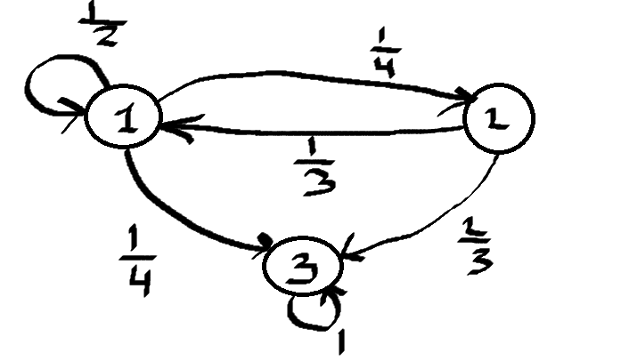

1. $1/2+1/4+1/4=1$
2. $2/3+1/3=1$
3. $1$

$P = \begin{bmatrix}
  p(1,1) & p(1,2) & p(1,3) \\ p(2,1) & p(2,2) & p(2,3) \\ p(3,1) & p(3,2) & p(3,3)
\end{bmatrix} = \begin{bmatrix}
  1/2 & 1/4 & 1/4 & \sum=1 \\ 1/3 & 0 & 2/3 & \sum=1 \\ 0 & 0 & 1 & \sum=1
\end{bmatrix}$

$P$ is stochastic transition matrix of Markov Chain $X$, $X$ is homogeneous.

### Initial Distribution

A process  $X=(X_1,\dots,X_n)=(X_n)_{n\ge0}-$  is a homogeneous Markov chain of $P_{X_0}$ initial distribution of and transition matrix $P$ if and only if

$$P(X_0=x_0,\dots,X_n=x_n)=P_{X_0}\prod^{n-1}_{k=0}P(X_k,X_{k+1})$$

If we know the initial distribution and transition matrix, we know all the laws of Markov chain.

HMC is characterized by its initial distribution $P_{X_0}$ and the transition matrix $P$.

This gives the expression  of the joint distribution of $(X_1,\dots,X_n)$.

$$P(X_{x+m}=y|X_0=x_0,\dots,X_{n-1}=x_{n-1},X_n=x_n)=(P^m)(x,y)$$

This gives the expression of the probability of $X_{n+m}$ given $(X_1,\dots,X_n)$.

### Example

$P[X_{0+3}=y|X_0=x]=P[X_{3+0}=y|X_0=x]=P^3(x,y)$

### Example (conitnued)

1. $P[X_2=3|X_0=1]=P[X_{0+2}=3|X_0=1]=p^2(1,3)$
2. $P[X_2=3|X_0=1]=P[X_1=1|X_0=1]P[X_2=3|X_1=1]+P[X_1=2|X_0=1]P[X_2=3|X_1=2]+P[X_1=3|X_0=1]P[X_2=3|X_1=3]=1/2*1/4+1/4*2/3+1/4*1=13/24$

$$p^2(1,3)=\begin{bmatrix}
  *1/2* & 1/4* & *1/4* \\ 1/3 & 0 & 2/3 \\ 1 & 0 & 1
\end{bmatrix}\begin{bmatrix}
  1/2 & 1/4 & **1/4** \\ 1/3 & 0 & *2/3* \\ 1 & 0 & *1*
\end{bmatrix}=1/2*1/4+1/4*2/3+1/4*1=13/24$$

### Recurrent States, Transient States

$$N_x=\sum^\infty_{n=1}1_{\{x\}}(X_n)$$

$N_x-$  starting from $x$.

$N_x-$  number of times you leave state $x$ and come back to it. It is random, can be infinity.

1. The state $x$ is recurrent for $X$ if $E_x[N_x] = \infty$ (expectation). Recurrent means the process visits $x$ infinity of times, $N_x$ is unbounded $(1 \to 1, 1 \to 2, 2 \to 2, 2 \to 1)$. We say the **chain** $X$ is **reccurent** if all **states** are **recurrent**.

2. The state $x$ is transient for $X$ if it is not recurrent, i.e., $E_x[N_x] < \infty$ (expectation is finite) $(1\to 1 p(1/2), 1 \to 2 p(1/2), 2\to 2 p(1))$. Since we have probability to go to 2, it is not recurrent (no path from 2 to 1).

3. The state $x$ is absorbing for $X$ if $P(x, x) = 1$ (in previous example 2 is absorbing).

4. For $X$, the state $y$ is reachable from $x$, which is denoted by $x \rightarrow y$, if there exists $n \in \mathbb{N}_0$ such that $P_x(X_n = y) > 0$ (in previous example 2 is rechable from 1). **The path does not need to be direct**.

5. For $X$, $x$ and $y$ communicate if $x \rightarrow y$ and $y \rightarrow x$ (in previous example, 1 and 2 do not communicate). **The path does not need to be direct**.

6. The state is **nonnull** if the expected time to return
is finite.

7. Steady state: $P(X_{t+1}=s)=P(X_t=s)$. **Markov** **chain** is **steady** if all **states** are **steady**.

### Closed Classes, Irreducible Classes

1. The class $C$ is closed for $X$ if
   - $\forall x,y \in E,$ if $x \in C$ and $x \to y$, then $y \in C$ ($x \in C$, $y$ is reachable from $x$, then $C$ is closed)

  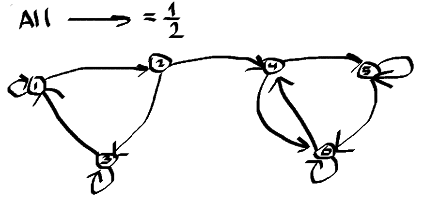

In the above: is $C=\{4,5,6\}$ closed, but $C=\{2,4\}$ not closed, since $5$ is reachable from $2$, but $5 \notin C$

2. The class $C$ is irreducible for $X$ if all its states communicate (also have to check $x \to x$)
3. The Markov chain $X$ is irreducible if $E$ is an irreducible class of $X$.

### Irreducible: Recurrent and Transient States

Let $X$ be a Homogeneous Markov chain.

1. An irreducible, finite and closed class consists of recurrent states.
2. An irreducible and non-closed class consists of transient states.

If the number $T$ of transient states of $X$ is finitem then for any irreducible and closed class of recurrent states $R$ and any $x \in T$,

$$\mathbb{P}_x(\tau_R<+\infty)=\sum_{y \in R}P(x,y)+\sum_{y\in T}P(x,y)\mathbb{P}_y(\tau_R<+\infty)$$

$$\tau_R=\min\{n\ge1:X_n\in R\}$$

### Invariant Probability Measure | Steady State

Answers question: to which state does the Markov Chain converge?

$\mathcal{P}(E) -$ power set, $\mu-$ probability measure on $(E, \mathcal{P}(E))$. We say $X$ is invariant with $\mu$ if $\mu\cdot P=\mu$.

If the Markov chain $X$ is irreducible, then it admits a unique invariant probability measure $\mu$. Moreover, for all $x \in E, \mathbb{E}_x[\tau_x]=\frac{1}{\mu(\{x\})}$

$$\mu\cdot P=\mu \iff (\mu\cdot P)^T=\mu^T \iff  P^T\mu^T=\mu^T$$

$\mu^T$ is an eigenvector (for the eigenvalue 1) of $P^T$. Then to compute invariant measure, it can be easier to see it as an eigenvector of $P^T$.

### Example

Find if there exists the invariant measures of $P^T$.

$$P=\begin{bmatrix}
  1/2 & 1/4 & 1/4 \\ 1/3 & 0 & 2/3 \\ 0 & 0 & 1
\end{bmatrix}$$

$$P^T=\begin{bmatrix}
  1/2 & 1/3 & 0 \\ 1/4 & 0 & 0 \\ 1/4 & 2/3 & 1
\end{bmatrix}$$

$$\mathcal{P}^T\mu^T=\mu^T$$

$$\begin{bmatrix}
  1/2 & 1/3 & 0 \\ 1/4 & 0 & 0 \\ 1/4 & 2/3 & 1
\end{bmatrix}\cdot\begin{bmatrix}\mu_1\\\mu_2\\\mu_3\end{bmatrix}=\begin{bmatrix}\mu_1\\\mu_2\\\mu_3\end{bmatrix}$$

$$\begin{cases}
  1/2\mu_1+1/3\mu_2=\mu_1\\1/4\mu_1=\mu_2\\1/4\mu_1+2/3\mu_2+\mu_3=\mu_3\\\mu_1+\mu_2+\mu_3=1
\end{cases}$$

$$\iff \mu_1=\mu_2=0,\mu_3=1$$

Thus, the only invariant measure of $X$ is $\mu=(0,0,1)$

This means: if there is $0%$ chance of being at $1$ in the current step, $0%$ chance of being at $2$ in the current step and $100%$ chance of being at $3$ in the current step, then what is the probability of being at $1, 2, 3$ in the next step? They are the same, since we have stationary distribution. The probability will not change ever again.

So, **to find invarient measures**:

1. Compute transition probability matrix $P$
2. Solve system $\mu\cdot P=\mu$

### Corollary

Let $R_1, \ldots, R_k$ ($k \in \{1, \ldots, \text{card}(E)\}$) be the irreducible classes of $X$.
For all $i \in \{1, \ldots, k\}$, let $\mu_i$ be the invariant probability measure of $X$
with support $R_i$. The invariant measures of $X$ are of the form

$$\sum_{i=1}^{k} \lambda_i \mu_i,$$

where $\lambda_1, \ldots, \lambda_k \in [0, 1]$ such that $\sum_{i=1}^{k} \lambda_i = 1$.

### Ergodic Theorem

If $X$ is irreducible of invariant probability measure $\mu$, then for all functions $f: E \to R$,

$$\frac{1}{n}\sum^n_{i=1}f(X_i){\overset{P}{\underset{n \to +\infty}{\longrightarrow}}}\sum_{x \in E}f(x)\mu(\{x\})=E[f(Y)], Y\sim \mu$$

In statistics, we have $E[f(Y)]$, in LLN:$\frac{1}{n}\sum^n_{i=1}f(Y_i)\to E[f(Y)]$, **where** $\perp Y_i$

By Markov chain we can achieve:
1. $X=(X_n)_{n\ge0} -$ HMC, irreducible
2. $\mu -$ invariant measure for $X$
3. $\frac{1}{n}\sum^n_{i=1}f(X_i){\overset{P}{\underset{n \to +\infty}{\longrightarrow}}}\sum_{x \in E}f(x)\mu(\{x\})=E[f(Y)], Y\sim \mu$ (here is $\mu$ is now target distribution). We do not require independence of $X_i$ !

### Stationarity, Irreducibility

1. **Stationarity**: $X$ is stationary of invariant (or stationary) distribution $f$ is $X_0 \to f \cdot \lambda$ implies $X_n \to f \cdot \lambda$ for all $n$. In other words, if we have a distribution at some time step and we allow the Markov Chain to proceed, we want the distribution at each of the states to stay the same. This is important for sampling, that is the Markov Chain is steady.

2. **Irreducibility**: $X$ is $(f \cdot \lambda)-$irreducible if for all $A \in \mathcal{E}$ s.t. $f \cdot \lambda(A)>0, \mathbb{P}_x(\tau_A<\infty)>0$ for all $x \in E$.

## Markov Chains Monte Carlo (MCMC)

Issue with accept-reject method: if $c$ is large, then we almost never accept the sample.

When $f(x)$ is high, thus close to $cg(x)$, we want to sample in this region, since $f(x)$ is high (density in this region is high). 

MCMC learns from previous samples - pick samples based on what learned from previous sample.

In MCMC next sample depends on the last sample (Markov chain).

Let $Y: \Omega \to \mathcal{X}, Y \sim \mu = \mathbb{P}_Y, Y$ is absolutely continous.

$E[h(Y)] = \int_\mathcal{X}h(x)f_Y(x)dx$

- By **LLN**:

$y_1,\dots,y_n \sim \mathbb{P}_Y \perp$ (can use generalized inverse or acceptance rejection to generate $y_1,\dots,y_n$).

$\frac{1}{n}\sum^n_{i=1}h(y_i) \to E[h(y)]$

- By Markov Chain

$E[h(Y)] - ?$

1. Look for stochastic matrix $P$, s.t. $\mu \cdot P=\mu$, $\mu$ is invariant.
2. generate a HMC $X$ irreducible (all states communicate) + $P$ its transition matrix and $\mu$ is its invariaent measure
3. By Ergodic Theorem approximate $\frac{1}{n}\sum^n_{i=1}h(X_i)=E[h(Y)], Y\sim \mu$

### Metropolis-Hastings Algorithm

This algorithm allows us to move closer to the area of high probability, while simple accept-reject method did not do, since samples were independent of the last.

Goal: sample from $f \cdot \lambda$, but we know only $f$.

$f\cdot \lambda$, $\lambda-$ normalizing constant that is difficult to compute. So, we only use $f(x)$ that is easy to compute, e.g. Normal.

Main idea: $X_0 \to X_1 \to \dots \to X_B \to X_{B+1} \to \dots$. Here, $X_0 \to X_1 \to \dots$ until some $X_i$ are burn-in, they are typically not follow the distribution that we are trying to simulate, while starting from $X_B$ are samples from $f\cdot \lambda$.

- Input: transition matrix $P$ (conditional density $q(\cdot|\cdot)$)
- Output: HMC $X$ (dependent sample distributed according to $f\cdot \lambda$).

1. Initialize $x_0 \in E$
2. For all $n \in \{0,\dots, N-1\}:$ (at each $n$: given $X_n=x_n$)
   1. Generate $Y_n\sim q(\cdot|X_n=x_n)\left(Y_n - \text{next state after }x_n, \text{ see as }x_n=a, Y_n=b\right)$
   2. Compute acceptance probability $A(a\to b)=p(x_n, Y_n)=\min\left(1, \frac{f(Y_n)q(x_n|Y_n)}{f(x_n)q(Y_n|x_n)}\right)$
   3. Draw $U \sim \mathcal{U}([0,1])$
   4. If $U < p(x_n, Y_n)$
      - Set $X_{n+1}=Y_n$
      - Else set $X_{n+1}=x_n$
   5. $n=n+1$

- The accept/reject step only depends on the ratios $\frac{f(Y_n)}{f(x_n)}, \frac{q(x_n|Y_n)}{q(Y_n|x_n)}$

Steps explained in simpler terms:

1. You are currently in some state $X_t$
2. Sample next candidate from some easier distribution $g$ (e.g. Normal)
3. Should accept this candidate? We accept the candidate based on acceptance probability $A(a\to b)=p(x_n, Y_n)=\min\left(1, \frac{f(Y_n)q(x_n|Y_n)}{f(x_n)q(Y_n|x_n)}\right)$
4. If accept, then next state in the Markov chain is indeed $Y_n=b$
5. If do not accept, then the next state is previous state carried forward, i.e. stay where we at, take the same previous sample again, and then try again for the next sample.
6. Eventually it leads to $f\cdot \lambda$ being a stationary distribution for the Markov Chain.
7. So we computed $X \sim f\cdot \lambda$ just from $f$.

So, the algorithm to approximate $E[X]$ now is:

1. We **know** the law of r.v.
2. Compute $P$
3. Metropolis-Hastings Algorithm returns us $X$
4. Approximate $E[X]$

### Theorem

Let $X=(X_n)_{n \ge 0}$ be the chain produced by the Metropolis-Hastings algorithm. Assumje that $X$ is $(f \cdot \lambda)-$ irreducible. If $h \in L^1(E, f \cdot \lambda),$ then

$$\lim_{n\to+\infty}\frac{1}{n}\sum^n_{i=1}h(X_i)=\int_Eh(x)f(x)\lambda(dx)$$

### Symmetric Law

$$q(x,y)=q(y,x)$$

$$P(1,2)=P(2,1)$$

### Random Walk Metropolis-Hastings

What this algorithm is aiming to achieve is that no matter where we are right now, no matter where we are proposed to go, we are going to accept that move if that is a more likely place to be (we want more samples from high density areas) and we might accept the move if it is low area density area (it is still important to sample from tails).

It is the same as previous algorithm, but we have that $q$ is symmetric, meaning $q(x_n|Y_n)$ and $q(Y_n|x_n)$ cancel each other, thus the acceptance probability of moving from $a$ to $b$ becomes $\min\left(1, \frac{f(b)}{f(a)}\right)$. We also now know that $\frac{f(b)}{f(a)}$ is actually $\frac{f(b) \cdot \lambda}{f(a) \cdot \lambda}$, so it follow the distribution we want.

Assume that $q$ is symmetric i.e. $q(x|y) = q(y|x), x, y \in E$. Take
$q(x, y) = g(y-x)$ and $p(x_n, y) = \min(1,f(y)/f(x_n))$.

- Input: $g$ density.
- Output: HMC $X$ (dependent sample distributed according to $f\cdot \lambda$).

1. Initialize $x_0 \in E$
2. For all $n \in \{0,\dots, N-1\}:$ (at each $n$: given $X_n=x_n$)
   1. Generate $Y_n\sim g(\cdot-x_n)\cdot\lambda$
   2. Compute $p(x_n, Y_n)=\min\left(1, \frac{f(Y_n)}{f(x_n)}\right)$
   3. Draw $U \sim \mathcal{U}([0,1])$
   4. If $U < p(x_n, Y_n)$
      - Set $X_{n+1}=Y_n$
      - Else set $X_{n+1}=x_n$
   5. $n=n+1$

This algorithm tells us:
- If the probability of being at $b$ is bigger than of being at $a$, then the acceptance probability of going from $a$ to $b$ is 1: $p(b)>p(a) => A(a\to b)=1$
- Else, if probability of being at $b$ is less than that of $a$, then the acceptance probability is: $p(b)<p(a) => A(a\to b)=\frac{p(b)}{p(a)}$
- Essentially, if are moving up the curve if the next simulated state is above the current state on the curve, while we are moving downwards if the next state if below on the curve of the current state.
- The further the state $b$ from $a$ downwards, the less likely that we go from $a$ to $b$.

  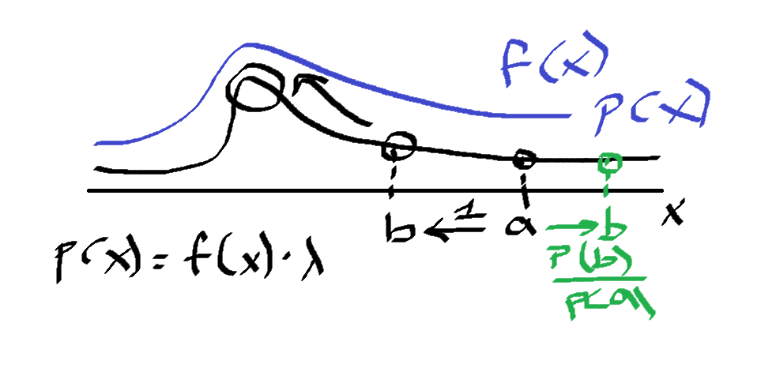

