# Enumeration (Combinatorics)

Combinatorics is an art of counting sets.

## Definition 1.1: Cardinal

The cardinal of a set $A$ is a number of elements contained in $A$.

## Types of Sets

- Countable set: can list all elements in a sequence indexed by integers.
  - Finite set: the number of elements in the set is finite. Example: $A = \{1,2,3,6,7\}, card(A) = 5$.
  - Infinite set: the number of elements in the set is infinite. Example: set of $\mathbb{N} = \{ 1,2,3,...\}$
- Uncountable set: set that cannot be indexed by the sequence of integers. Example: $\mathbb{R}, \{ 0,1\}^\mathbb{N}=0010101..., 0101101111..., \mathcal{P}(\mathbb{N})$.

*Remark*: $\mathbb{N}$ is countable because you can establish a one-to-one correspondence (bijection) between its elements and the positive integers. You can list them in a sequence without missing any, and you can count them. This correspondence can be represented as $f: \mathbb{N} \to \mathbb{N}$, where $f(n) = n$. Each natural number corresponds to itself, making it easy to count and list them. $\mathbb{R}$ is uncountable because it has a higher cardinality than $\mathbb{N}$ or any other countable set. Cantor's diagonal argument is one way to demonstrate that $\mathbb{R}$ is uncountable. It shows that you cannot list all real numbers in a countable sequence. If you try to list them as a decimal or binary expansion, you can always construct a real number that is not in your list, simply by changing at least one digit from each number in your list. This process is infinitely recursive and ensures that you can never list all real numbers.

## Basic Rules

### Bijection

In set theory, a bijection is a function between two sets that establishes a one-to-one correspondence between their elements. More formally, a function $f: A \rightarrow B$ is considered a bijection if the following conditions are met:

1. Injective (One-to-One): For every pair of distinct elements $x$ and $y$ in set $A$, $f(x)$ and $f(y)$ are also distinct in set $B$. In other words, no two elements in set $A$ map to the same element in set $B$.

2. Surjective (Onto): For every element $y$ in set $B$, there exists an element $x$ in set $A$ such that $f(x) = y$. In other words, the function $f$ covers all elements in set $B$.

3. Bijective: If a function $f$ is both injective and surjective, it is called a bijection. This means that there is a one-to-one correspondence between the elements of sets $A$ and $B$, and every element in set $B$ has a unique pre-image in set $A$.

In practical terms, bijections are often used to prove that two sets have the same number of elements or to establish a correspondence between elements in different contexts. They are also used in the study of functions and transformations in mathematics.

If $A$ and $B$ are in bijection, then
$$card(A) = card(B)$$

  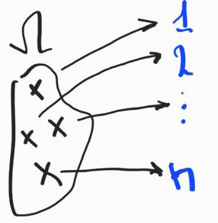

### Product

Let $A,B$ be two finite sets. We define the product $A\cdot B$ as $A \cdot B = \{ (a,b) | a \in A, b \in B \}$ and
$$card(A \cdot B) = card(A) \cdot card(B)$$

### Disjoint

Let $A,B$ be two subsets of a set $\Omega$. If $A,B$ are disjoint, then
$$card(A \cup B) = card(A) + card(B)$$

### Joint

If $A,B$ are joint, then:

$$card(A \cup B) = card(A) + card(B) - card(A \cap B)$$

  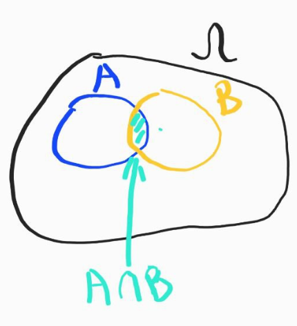

Since $card(A) + card(B)$ counts $card(A \cap B)$ two times, we subtract one $card(A \cap B)$.

If $A,B,C$ are joint, then:

$$card(A \cup B \cup C) = card(A) + card(B) + card(C) - $$
$$-card(A \cap B) - card(A \cap C) - card(B \cap C) + card(A \cap B \cap C)$$

  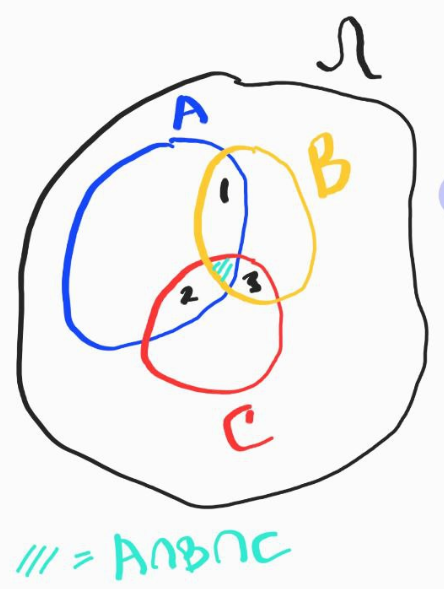

Example:

Throw 2 dice. We want to find the probability that we get atleast one 6.

$1/6 + 1/6 - 1/36 = 11/36$, where $1/36 = A \cap B$

## Definition 1.2: Indicator Function

Let $\Omega$ be a set and $A \subset \Omega$. We denote by $1_A$ the indicator function of the set $A$ s.t.

$$1_A:$$
$$\Omega \to \{ 0,1\}$$
$$\omega \to  \begin{cases}1, \omega \in A \\ 0, \omega \notin A \end{cases}$$

Example:

$\Omega = \mathbb{R}, a<b \in \mathbb{R}$

  

$1_{\overline{A}} = 1 - 1_A, \overline{A} = \Omega \setminus A$

$$card(A) = \sum_{\omega \in \Omega}1_A(\omega) = \sum_{\omega \in A}1$$

## Definition 1.3: Power Set

Let $\Omega$ be a set. We denote by $\mathcal{P}(\Omega)$ the power set of $\Omega$. It is defined by $\mathcal{P}(\Omega) = \{A | A \subset \Omega\}$ (nested sets).

Example:\
$\Omega = \{1,2,3\}$\
$\mathcal{P}(\Omega) = \{\{1\}, \{2\}, \{3\}, \{1,2\}, \{1,3\}, \{2,3\}, \{1,2,3\}, \emptyset \}$

## Theorem 1.1: Cardinal of Power Set 

$$card(\mathcal{P}(\Omega)) = 2^{card(\Omega)}$$

Proof:\
The set $\mathcal{P}(\Omega)$ can be put in bijection with the set $\{0,1\} \times \{0,1\} \times ... \times \{0,1\} = \{0,1\}^\Omega = \{0,1\}^{card(\Omega)}$

$\mathcal{P}(\Omega) \to \{\{0,1\} \times \{0,1\} \times ... \times \{0,1\}\}$

We map each element of $\Omega$ to either $0$ or $1$. Thus:\
$card(\mathcal{P}(\Omega)) = card(\{0,1\}^{card(\Omega)}) = card(\{0,1\})^{card(\Omega)} = 2^{card(\Omega)}$

## Diagonal Counter Argument

Set $\{0,1\}^\mathbb{N}$ is uncountable. $\{0,1\}^\mathbb{N} = \{$ infinite sequence of 0s or 1s $\}$

Proof:\
Assume $\{0,1\}^\mathbb{N}$ is countable.\
$s_1 = (0110001...)$\
$s_2 = (0011001...)$\
$s_3 = (0110101...)$\
$s_4 = (0000001...)$\
$...$
$s_n = (0000001...1)$\
Make matrix $S$, where each row is $s_1, s_2, ..., s_n$\
Let $s = (0010...1)$ - where each digit corresponds to diagonal element of $S$.\
Let $s_I = (1101...0)$ be an inverse of $s$.\
We claim $s_I \ne s_n, \forall n \in \mathbb{N}$ ($s_I$ is different from $s_n, \forall n \in \mathbb{N}$).\
This is true, because $n_{th}$ digit of $s_I$ is different from the $n_{th}$ digit of $s_n$. Thus, $s_I \notin S$, making $\{0,1\}^\mathbb{N}$ uncountable.

## Definition 1.4: Permutation

A set $\Omega$ is not ordered, there is no repetition:\
$\{a,b,c\} = \{b,c,a\} = \{a,c,b\} = \{a,b,c,b,c,a\}=...$

A permutation is a way to order the elements of $\Omega$. Alternatively, it is a bijetion from $\Omega$ to $\{1,2,3,..., n\}$ where $n = card(\Omega)$

  

## Theorem 1.2: Permutation

If $\Omega$ has $n$ elements, then there are $n!$ number of permutations of $\Omega$.

$(w_1, w_2, w_3,..., w_n)$\
$n, n-1, n-2, ..., 1$\
$n$ possible ways to choose $w_1$, $n-1$ possible ways to choose $w_2$, ..., $1$ possible way to choose $w_n$ = $n!$

*Question*: how many anagrams of the word PROBA ?\
Answer: $5!$

*Question*: how many anagrams of the word ECOLE ?\
Answer: $5!/2!$

*Question*: how many anagrams of the word MISSISSIPPI ?\
Answer: $\frac{11!}{4!4!2!}$

## Definition 1.5: Arrangement

An arrangement of $k$ elements from $n$ elements of a set $\Omega$ is an ordered sequence of $k$ distinct elements of $\Omega$. In arrangement, the order of selection matters.

Example:

$\Omega = \{a,b,c,d,e,f\}$\
$(a,b,c),(a,f,e),(a,e,f)$ are 3 distinct arrangments of 6 elements of $\Omega$.

## Theorem 1.3: Arrangement

There are

$$A^k_n = n(n-1)(n-2)...(n-k + 1) = \frac{n!}{(n-k)!}$$

ways to arrange $k$ elements among $n$ elements.

## Definition 1.6: Combination

A combination of $k$ elements from $n$ elements of $\Omega$ is a subset of $\Omega$ with $k$ elements. In combination, the order does not matter ($\{1,2\} = \{2,1\}$).

Example:\
$\Omega = \{ 1,2,3\}$\
$k=2, C(n,k)=\{\{1,2\},\{1,3\},\{2,3\}\}$ - the number of combinations of $k$ elements among a set of $n$ elements ($C(n,k)$ is called "$n$" choose "$k$").

## Theorem 1.4: Combination

$$C(n,k) = \frac{n!}{k!(n-k)!}$$

Proof:\
Given a combination of $k$ elements, we can form exactly $k!$ distinct arrangements by permuting the $k$ elements chosen. This gives the equality:

$A^k_n = \frac{n!}{(n-k)!}$

$k!\binom{n}{k} = A^n_k = \frac{n!}{k!(n-k)!}$

## Rules / Facts

$$\binom{n}{k} = \binom{n}{n-k}$$

Choosing $k$ elements out of $n$ elements is the same as choosing $n-k$ elements out of $n$ elements.

$$\binom{n+1}{k+1} = \binom{n}{k} + \binom{n}{k+1}$$

$$k\binom{n}{k} = (n-k+1)\binom{n}{k-1}$$

$$(n-k)\binom{n}{k} = n\binom{n-1}{k}$$

$$n\binom{n}{k} =n\binom{n-1}{k-1}$$

Vandermonde equality

$$\binom{n+m}{k} = \sum^k_{i=0}\binom{n}{i}\binom{m}{k-1}$$

## Theorem 1.5: Newton Binomial Theorem

$$(x+y)^n = \sum_{k=0}^nC(n,k)x^ky^{n-k}$$

## Theorem 1.6: Balls and Bags | How Many Solutions to an Equation, Where Each $n$ is Non-Negative Integer

$$k_1 + ... + k_i = n, \space k \in \mathbb{N}_0, n \in \mathbb{N}$$
$$\binom{n + i - 1}{i - 1}$$

## Exercises

### $\sum^n_{k=0}\binom{n}{k}=2^n$

$2^n = (1 + 1)^n$\
$(1 + 1)^n = \sum^n_{k=0}\binom{n}{k}$\
$=> 2^n = (1 + 1)^n = \sum^n_{k=0}\binom{n}{k}$

### How many anagrams of the words MATHS, SCHOOL, PILITIPILIT are there?

1. MATHS: $\frac{5!}{1!1!1!1!1!}$
2. SCHOOL: $\frac{6!}{2!}$
3. PILITIPILIT: $\frac{11!}{2!5!2!2!}$

### We split the 52 card game among 4 players (A,B,C,D), so that each player has 13 cards. Compute the number of distinct game configurations.

$\binom{52}{13}\binom{52-13}{13}\binom{52-13-13}{13}\binom{52-13-13-13}{13} = \binom{52}{13}\binom{39}{13}\binom{26}{13}= \frac{52!}{13!13!13!13!}$

This is the same problem as computing the number of anagrams for the word $(A_1,...,A_{13})(B_1,...,B_{13})(C_1,...,C_{13})(D_1,...,D_{13})$

We can say that player $A$ is the same as player $B$, then:

$\frac{\frac{52!}{13!13!13!13!}}{4!}$

### Marie wants to decorate her garden. She wants to plant a row of 8 flowers. She bought 3 green flowers and 5 blue ones. 1. In how many distinct ways she can plant her flowers? 2. In how many ways she can plant her flowers if 2 green flowers cannot be planted consecutively?

1. $\frac{8!}{3!5!}$

8 positions for flowers, remove repeats for 3 green and 5 blue.

2. We have 6 positions for 3 green flowers so that they are not planted consecutively.

  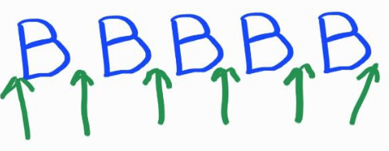

Thus: $\binom{6}{3}$

### We have 9 digit access code. 1. How many possible codes there are? 2. How many codes contain digit 4? 3. How many codes contain digit 4 exactly 1 time? 4. Same questions if the digits are all different.

1. 9 possible digits for each out of 4 positions: $9^4$
2. First compute how many codes do not contain digit 4: $8^4$. Then subtract from all codes number of codes that do not contain digit 4: $9^4 - 8^4$
3. We have 4 possibilities: $4xyz, x4yz, xy4z, xyz4$, where $x,y,z$ can have 8 digits. Thus: $8^4 \cdot 4$
4. 1. $9*8*7*6$
   2. $9*8*7*6 - 8*7*6*5$ 
   3. $8 * 7 * 6 * 4$ (same as 4.2.)

### We have 9 digit and 2 letters among 3 letters (A,B,C) access code. 1. How many possible codes there are? 2. How many codes if all characters are distinct?

1. $9^4 * 3^2 * \frac{6!}{2!4!}$\
$\frac{6!}{2!4!}$ is how many positions there are for 2 letters in 6 digit code.
2. $9 * 8 * 7 * 6 * 3 * 2 * \frac{6!}{2!4!}$

### Compute the number of solutions to the equation: $n_1 + n_2 + n_3 + n_4 = 6$, where $n_i$ are non-negative integers

Balls and bags problem. General solution for $k_1 + ... + k_i = n$ is: $\binom{n + i - 1}{i - 1}$\
Hence: $\binom{6+4-1}{4-1}$

Why? We have 6 balls and 3 sticks, in total 9 items. We need to arrange 3 sticks among 9 positions in any position we want, thus we have combination $\binom{9}{3}$. 

If we were not to count 0 as a solution, then we would have to arrange 3 sticks among 5 positions (between balls), so that there are no 0 balls between sticks.

  

### Vandermonde formula. Show by a 1. combinatorial proof and by a 2. algebraic proof that: $\binom{n+m}{k} = \sum^k_{i=0}\binom{n}{i}\binom{m}{k-1}$

1. Imagine we have $n$ girls and $m$ boys. We need to form a team of $k$ pupils. Thus: $0 \le k \le m + n$. We can do this with $\binom{m+n}{k}$.

But, we can also form $k$ pupils with $i$ boys and $k-i$ girls: $\binom{m}{i}\binom{n}{k-i}$. Since we fixed $i$, but $i$ can be 0, 1, ..., $m$, or in other words we can have 0 boys, $k$ girls; 1 boy, $k-1$ girls; 2 boys, $k-2$ girls, we have a sum: $\sum^k_{i=0}\binom{m}{i}\binom{n}{k-i}$

Thus: $\binom{n+m}{k} = \sum^k_{i=0}\binom{n}{i}\binom{m}{k-1}$

2. Remember Netwon binomial formula: 

$\sum^{m+n}_{k=0}\binom{m+n}{k}x^k = \sum^{m}_{i=0}\binom{m}{i}x^i\sum^{n}_{j=0}\binom{n}{j}x^j$

If we expand right side we get:

$(\binom{m}{0}x^0 + \binom{m}{1}x^1 + \binom{m}{2}x^2 + ... + \binom{m}{i}x^i) \cdot (\binom{n}{0}x^0 + \binom{n}{1}x^1 + \binom{n}{2}x^2 + ... + \binom{n}{j}x^j) = (\binom{m}{0}\binom{n}{0})x^0 + (\binom{m}{0}\binom{n}{1} + \binom{m}{1}\binom{n}{0})x + (\binom{m}{0}\binom{n}{2} + \binom{m}{1}\binom{n}{1} + \binom{m}{2}\binom{n}{0})x^2 + ...$

Coefficients for $x^k$ are:

$\binom{m}{0}\binom{n}{k} + \binom{m}{1}\binom{n}{k-1} + ... + \binom{m}{k}\binom{n}{0} = \sum^k_{i=0}\binom{m}{i}\binom{n}{k-i}$

Therefore, by comparing the coefficients of $x^k$, we get:

$\sum^k_{i=0}\binom{m}{i}\binom{n}{k-i} = \binom{m+n}{k}$

$\binom{m+n}{k}$ is the coefficient for any $x^k$ in $(1 + x)^{m+n}\sum^{m+n}_{k=0}\binom{m+n}{k}x^k$, but for $(1+x)^m(1+x)^n$ it is the summation $\sum^k_{i=0}\binom{m}{i}\binom{n}{k-i}$

# Probability Space

Probability theory aims to quantify the notion of uncertainty. The notion of uncertainty reflects a lack of information that prevents us from predicting the outcome of an experiment with absolute certainty.

Let's take the example of a coin toss. Intuitively, we'll come up tails about half of the time. But what's the reality ? The coin toss, as a physical system, can be considered deterministic. If I could describe with absolute precision the action exerted by my hand on the coin, I could deduce its exact trajectory and predict on which face the coin would fall. Let's assume that the coin's trajectory depends on a parameter $\lambda \in [0, 1]$. Since we have no information on the parameter $\lambda$, we'll assume that it is chosen randomly according to some law (for example, a uniform law). In this case, we'd observe that for about half the values of $\lambda$ the coin will land on heads, and for the other half it will land on tails.

Probability theory enables us to quantify a lack of information about the parameters of a given experiment. This lack of information translates into uncertainty about the outcome of the experiment. **To give ourselves a framework for making probabilities is to give ourselves a model of the uncertainty we face**.

In order to define a framework for doing probability we need three ingredients. 

1. **Universe** of possible configurations for the experiment or game. For a dice roll - trajectory of the hand, for card game - set of all possible decks.
2. **Notion of information** - set of events we consider. Say we have a survey: people between 0 and 20 years old, between 20 and 50 years old, over 50 years old. Here, the **universe is all the people** surveyed. Our survey allows us to quantify the probability of occurrence of events such as "The person is under 50". On the other hand, we have no access to quantities such as "The person is between 40 and 60", let alone "The person is a man". This notion of information seems a little superfluous, as it always seems possible to "enlarge" the experiment in order to access information we don't have. It is almost impossible and bad to consider all information because:
   1. This distorts/complicates the model (e.g. when rolling a dice we do not care how many flips a dice does, the essential information is only the final value of the die).
   2. When modeling a quantity that evoles with time.
   3. There are mathematical obstructions to considering "all information" when the space $\Omega$ is uncountable (see Banach-Tarski paradox: have 1 sphere with radius $r = 1$, cut the sphere into uncountable number of pieces, glue pieces back together, get 2 spheres with radius $r=1$).
3. **Measure of probability**. It quantifies the probability of a  given event to occur. In the case of a well-mixed pack of cards, for example, we can choose a uniform probability over all the decks of cards, meaning that each card shuffle has a probability 1/(52!), but if it's badly mixed, the probability may be chosen differently. Modeling an experiment therefore requires choosing the probability with which each event occurs. This measure is supposed to respect the physical reality of the experiment as closely as possible, which can prove complicated. A statistical test can be used to check the agreement between a theoretical probabilistic model and a real experiment repeated a large number of times

## Definition 2.1: Probability Space

A probability space is a triplet $(\Omega, F, P)$ where:
- $\Omega$ is the universe, set of possible configurations of the experiment, simply a set;
- $F$ is a $\sigma$-algebra on $\Omega$. $F$ represents the information we can acquire during the experiment. An element in $F$ is called an **event**. An event is the subset of $\Omega$ universe. Therefore, $F$ is a set of events. It is possible to apply certain operations between events : union, intersection, difference, complementary, etc. In other words, the set $F$ is stable by a number of operations;
- $P$ is a probability measure. It is used to quantify the probability of a given event occurring. For a given event $A$, it associates a number between 0 and 1, denoted $P(A)$, which reflects the probability of the event $A$ occurring.

## Definition 2.2: $\sigma$-algebra

A $\sigma$-algebra $F$ on a space $\Omega$ is a subset of $P(\Omega)$ (the power set of $\Omega$) such that:

1. $\Omega \in F$ (the universe is an event)
2. If $A \in F$, then $\overline{A} \in F$ (stability by passing to the complementary)
3. If $(A_n)_{n \geq 0} \in F$, then $\bigcup_{n \geq 0} A_n \in F$ (stability by countable union)

**$\sigma$-algebra - everything you can construct with union, intersection, complementary, ... of events**

### Definition 2.3: Measurable Space

The pair $(\Omega, F)$ is a measurable space (events in $F$ are measurable).

### Definition 2.4: Trivial / Discrete $\sigma$-algebras

The $\sigma$-algebra $\{\emptyset, \Omega\}$ is called the trivial $\sigma$-algebra. It is the smallest $\sigma$-algebra on $\Omega$ that we can consider. The $\sigma$-algebra $P(\Omega)$ is called the discrete $\sigma$-algebra. It is the largest $\sigma$-algebra on $\Omega$ that can be considered.

### Definition 2.5: Smallest $\sigma-$algebra

Let $C$ be a subset of $P(\Omega)$. Let $\sigma(C)$ be the smallest $\sigma$-algebra containing $C$. It is the intersection of all $\sigma$-algebras containing $C$. For example, if $\Omega$ is countable and $C$ is the set of singletons, it's easy to see that $\sigma(C) = P(\Omega)$.

Let $\Omega = [0, 1]$. If $I$ is an interval with ends $a$ and $b$ (not necessarily open or closed), then $\mu(I) = b - a$. This definition is "consistent" with the notion of a probability space: $\mu(\Omega) = 1$.

$I_1$ and $I_2$ are disjoint intervals such that $I_1 \cup I_2$ is an interval (e.g., $I_1 = [a, b]$ and $I_2 =[b, c])$, then:
$\mu(I_1 \cup I_2) = \mu(I_1) + \mu(I_2)$

### Definition 2.6: Borelian $\sigma$-algebra

Let $B([0, 1])$ be the $\sigma$-algebra generated by the intervals included in $[0, 1]$. It is called the Borelian $\sigma$-algebra on $[0, 1]$. Similarly, $B(\mathbb{R})$ is the $\sigma$-algebra generated by the intervals in $\mathbb{R}$.

$B([0,1]) \not ={} \mathcal{P}([0,1]), \mathcal{P}([0,1])$ is much bigger. 

$C = \{[a,b] | a,b \in [0,1]\}$\
$B([0,1]) = \sigma(C)$

## Definition 2.7: Probability Measure $P$

A probability measure $P$ on a measurable space ($\Omega$, $F$) is an application:

$P : F \rightarrow [0, 1]$
$A \rightarrow P(A)$

Such that:

1. $P(\Omega) = 1$ (the universe is an event with probability 1)
2. If ($A_n$)$_{n \geq 0}$ is a countable family of pairwise disjoint events, then:
   $P(\bigcup_{n=0}^\infty A_n) = \sum_{n=0}^\infty P(A_n)$

### Definition 2.8: Almost-Surely / Negligible

If $A$ is an event in a probability space ($\Omega$, $F$, $P$) such that $P(A) = 1$, we say that $A$ is realized **almost-surely** (sometimes denoted as a.s.). Conversely, if $A$ is an event in a probability space ($\Omega$, $F$, $P$) such that $P(A) = 0$, we'll say that $A$ is a **negligible** event.

## Theorem 2.1: Caratheodory Extension

There exists a unique probability measure (still denoted $\mu$) on $(\Omega, B([0, 1]))$ such that:
- $([0, 1], B([0, 1]), \mu)$ is a probability space.
- $\mu(I) = b - a$ for any interval $I$ of extremity $a$ and $b$.

In other words, if we decide that the measure of an interval is exactly its length, then we can extend this measure to the entire $\sigma$-algebra generated by intervals:countable unions of intervals, singletons,... and much more.

# Conditional Probability and Independence

When we want to model two distinct quantities by a probabilistic model, it often happens that these two quantities are **correlated**.

## Definition 2.9: Conditional Probability

Let $(\Omega, F, P)$ be a probability space, and $B$ an event of non-zero measure.
Then for any event $A$, we call the quantity:
$$P(A|B) = \frac{P(A \cap B)}{P(B)}$$
It indicates the probability of an event $A$ occurring knowing that event $B$ has occurred.

$$(\Omega, F, P) \rightarrow (B, \mathcal{F}_B, P(\cdot | B))$$

$$\mathcal{F}_B = \{A \cap B \mid A \in F\}$$

## Definition 2.10: Complete System of Events

A family $\{B_1, \ldots, B_n\}$ is said to be a complete system of events if:

- $\forall i \in \{1, \ldots, n\}, P(B_i) \neq 0$ ($B_i \not ={\empty}$)

- $\forall i, j \in \{1, \ldots, n\}, P(B_i \cap B_j) = 0$ ($B_i \cap B_j = \empty$)

- $P\left(\bigcup_{i=1}^n B_i\right) = 1$ or equivalently $\sum_{i=1}^n P(B_i) = 1$ ($=> \cup B_i = \Omega$)

In other words, the family $\{B_1, \ldots, B_n\}$ forms a probabilistic partition of the universe $\Omega$. It is possible to adapt the definition for a countable family of events.

For example, if $0 < P(A) < 1$, then the family $\{A, A\}$ forms a complete system of events. Similarly, provided the following events have non-zero probabilities, the following family:
$\{A \cap B, \overline{A} \cap B, A \cap \overline{B}, \overline{A} \cap \overline{B}\}$
is a complete system of events.

## Theorem 2.2: Law of Total Probability

Let $\{B_1, \ldots, B_n\}$ be a complete system of events, and $A$ be any event. Then:
$$P(A) = \sum_{i=1}^{n} P(B_i)P(A|B_i)$$

## Theorem 2.3: Bayes' Formula

Let $A$ and $B$ be two events of non-zero probability. Then we have the identity:
$$P(A|B) = \frac{P(A)P(B|A)}{P(B)}$$

If the family $\{A_1, \ldots, A_n\}$ is a complete system of events, then for $1 \leq i \leq n$ we have:
$$P(A_i|B) = \frac{P(A_i)P(B|A_i)}{\sum_{i=1}^{n} P(A_i)P(B|A_i)}$$

Bayes' formula makes it possible, by knowing the effects, to trace back to a probability on the causes. It is the basis of Bayesian inference.

## Definition 2.9: Independence

Event $A$ is independent of event $B$ if the probability of its occurrence does not depend on whether or not $B$ has occurred. In other words:
$P(A|B) = P(A)$

For example, if two dice are rolled, knowledge of the value of the first die has no influence on the value of the second die. The events "the first die is a 6" and "the second is even" are independent.

If $\mathcal{F}_1$ and $\mathcal{F}_2$ are $\sigma-$algebras in $\mathcal{F}$, then we say $\mathcal{F}_1 \perp \mathcal{F}_2$ (independent) if

$$\forall A \in \mathcal{F}_1, \forall B \in \mathcal{F}_2: P(A \cap B) = P(A)P(B)$$

## Definition 2.10: Mutual Independence in a Family of Events: Infinite Subset $I$.

Events $A_1, \ldots, A_n$ are said to be mutually independent if for any subset $I$ of $\{1, \ldots, n\}$ we have: 
$$P\left(\bigcap_{i \in I} A_i\right) = \prod_{i \in I} P(A_i)$$ 
Similarly, the $\sigma$-algebras $F_1, \ldots, F_n$ are mutually independent if for any events $A_1, \ldots, A_n$ such that: $A_1 \in F_1, \ldots, A_n \in F_n$, the events $A_1, \ldots, A_n$ are independent.

## Independence vs Disjoint

- Independence: Two events $A$ and $B$ are said to be independent if: $P(A \cap B) = P(A) \cdot P(B)$. In simple terms, if two events $A$ and $B$ are independent, the occurrence of one event does not provide any information about the occurrence or non-occurrence of the other event. They are unrelated in terms of probability.
- Disjoint (Mutually Exclusive): Two events $A$ and $B$ are said to be disjoint or mutually exclusive if they cannot occur at the same time. In other words, if one event happens, the other cannot happen simultaneously. Mathematically, $A$ and $B$ are disjoint if $A \cap B = \emptyset$, where $\emptyset$ represents the empty set. Disjoint events are not independent because if one event occurs, it implies that the other event cannot occur. Therefore, there is a strong relationship between them, but it's a relationship of exclusion.

## Theorem 2.4: Mutually Independent Events

Let $F_1, \ldots, F_n, G_1, \ldots, G_m$ be mutually independent $\sigma$-algebras. Then:

$$\sigma\left(\bigcap_{i=1}^n F_i\right) \perp \sigma\left(\bigcap_{j=1}^m G_j\right)$$

For example, let $A_1, A_2, A_3, A_4, A_5$ be mutually independent events. Then:
$$(A_1 \cup A_3) \perp (A_2 \cap (A_4 \cup A_5))$$

Generally speaking, if we separate a family of mutually independent events into two groups, then an event constructed from the first group and the operations $\cap$, $\cup$, and complement will be independent of an event constructed from the second group and the same operations. Mutual independence must be understood in terms of the independence of information. The information provided by knowledge of $A_1$ and $A_3$ is independent of the information generated by knowledge of $A_2$, $A_4$, and $A_5$.

## Definition 2.11: Mutual Independence in a Family of Events: Finite Subset $I$

A family $(A_n)_{n \in \mathbb{N}}$ of events is said to be mutually independent if for any finite subset $I$ of $\mathbb{N}$ we have:
$$P\left(\bigcap_{i \in I} A_i\right) = \prod_{i \in I} P(A_i)$$

Similarly, the $\sigma$-algebras $(F_n)_{n \in \mathbb{N}}$ are mutually independent if for any family of events $(A_n)_{n \in \mathbb{N}}$ such that:
$$\forall n \in \mathbb{N}, A_n \in F_n$$
the events $(A_n)_{n \in \mathbb{N}}$ are mutually independent.

# Limit Theorems

## Definition 2.12: Limit Superior | Limit Inferior

Let $(A_n)_{n \geq 0}$ be a sequence of sets. The limit superior of the sequence is defined as:
$$\limsup_{n \geq 0} A_n = \bigcap_{n \geq 0} \bigcup_{k \geq n} A_k,$$

and the limit inferior of the sequence is defined as:
$$\liminf_{n \geq 0} A_n = \bigcup_{n \geq 0} \bigcap_{k \geq n} A_k.$$

The interpretations of these two quantities are as follows:

- An element $\omega \in \Omega$ belongs to the set $\limsup_{n \geq 0} A_n$ if and only if $\omega$ belongs to an infinite number of events in the sequence $(A_n)_{n \geq 0}$.

- An element $\omega \in \Omega$ belongs to the set $\liminf_{n \geq 0} A_n$ if and only if $\omega$ belongs to all events of the sequence $(A_n)_{n \geq 0}$ starting from a certain rank.

## Theorem 2.5: Borel-Cantelli

Let $(A_n)_{n \geq 0}$ be a sequence of events in a probability space $(\Omega, F, P)$. If
$$\sum_{n \geq 0} P(A_n) < +\infty$$
then
$$P\left(\limsup_{n \geq 0} A_n\right) = 0$$

If the events $(A_n)_{n \geq 0}$ are mutually independent and
$$\sum_{n \geq 0} P(A_n) = +\infty$$
then
$$P\left(\limsup_{n \geq 0} A_n\right) = 1$$

In other words, if the series of terms $\left(P(A_n)\right)_{n \geq 0}$ converges, then the events in the sequence $(A_n)_{n \geq 0}$ will almost surely only occur a finite number of times.

Conversely, if we add the assumption of independence of the sequence $(A_n)_{n \geq 0}$ and the series of terms $\left(P(A_n)\right)_{n \geq 0}$ diverges, then the events of the sequence $(A_n)_{n \geq 0}$ occur infinitely often almost surely.

Examples:
1. Sequence: $P(A_1) = 1/2, P(A_2) = 1/4, P(A_3) = 1/8, ..., P(A_n) = 1/2^n$\
$\sum P(A_n) = \sum\frac{1}{2^n} < \infty$\
$=>P(\limsup_{n \ge0} A_n) = 0$

2. Sequence: $P(A_1) = 1, P(A_2) = 1/2, P(A_3) = 1/4, ..., P(A_n) = 1/n$\
$\sum P(A_n) = \sum\frac{1}{n} = +\infty$\
$=>P(\limsup_{n \ge0} A_n) = 1$

This remains unchanged if we don't change the tail (asymptotic events depend on $A_n$).

$P(x_n$ converges to $E[x]) = 0$ or $1$, for $1$ - theorem of large numbers.

In the following, $(\Omega, \mathcal{F}, P)$ is a probability space, and $(F_n)_{n \geq 0}$ is a sequence of mutually independent $\sigma$-algebras included in $\mathcal{F}$.

## Definition 2.13: Asymptotic $\sigma$-algebra 

We define the asymptotic $\sigma$-algebra:
$$F_\infty = \bigcup_{n \geq 0} \sigma\left(\bigcup_{k \geq n} F_k\right)$$
The asymptotic $\sigma$-algebra groups events that depend only on the "tail" of the $\sigma$-algebra sequence $(F_n)_{n \geq 0}$, i.e., that do not depend on the first elements of the $\sigma$-algebra sequence. An event in $F_\infty$ is called an asymptotic event.

## Theorem 2.6: Kolmogorov's 0-1 Law 

Let $A$ be an event of the asymptotic $\sigma$-algebra $F_\infty$. Then
$$P(A) \in \{0, 1\}$$

In other words, an event in the asymptotic $\sigma$-algebra either almost surely occurs, or almost surely never occurs. There is no in-between possibility. On the other hand, it can be difficult to know in which case we are. Typical examples of asymptotic events are: "Is a sequence of independent random variables bounded? Does it converge?"

## Exercices

### Show that a $\sigma$-algebra is stable by intersection (1), by ensemblistic difference (2)

1. $\overline{A \cup B} = \overline{A} \cap \overline{B}; \overline{\overline{A} \cup \overline{B}} = A \cap B (A, B \in F, \overline{A}, \overline{B} \in F, A \cup B \in F)$
2. Take arbitrary sets from sigma; ensemblic difference is $A \setminus B = A \bigcap B^C$. We know that sigma is stable by intersection and complementary.

### Let $\Omega$ be any set. Show that $\{\empty, \Omega\}$ and $\mathcal{P}(\Omega)$ are $\sigma$-algebras on $\Omega$. Show that the intersection of a family of $\sigma$-algebras is still a $\sigma$-algebra. Is the union of two $\sigma$-algebras a $\sigma$-algebra?

1. By axiom 1: $\Omega \in F$. By axiom 2 and that the set difference between the set and self we have: $\Omega \setminus \Omega = \Omega \bigcap \overline{\Omega} \in F = \empty \in F$
2. Let $\Omega$ be a set, $\mathcal{P}(\Omega)$ is its power set. $\forall A,B \in \mathcal{P}(\Omega): A \cup B \in \mathcal{P}(\Omega)$. $\forall A \in \mathcal{P}(\Omega): \overline{A} \in \mathcal{P}(\Omega)$. Let $(A_n)_{n\ge0} \in \mathcal{P}(\Omega)$ be countable infinite sequence of sets. Since power set is closed under countable unions: $\bigcup_{i \in  \mathbb{N}}A_i \in \mathcal{P}(\Omega)$, we have that $\mathcal{P}(\Omega)$ is sigma-algebra by definition. 
### Let $\Omega$ = $\{a, b, c, d, e\}$. Describe the $\sigma$-algebra $\sigma(\{\{a, b\}, \{e\}\})$
$\Omega = \{a,b,c,d,e\}$\
$F(\{a,b\}, {e}) = \{\{\Omega\}, \{\empty\}, \{a,b\}, \{e\}, \overline{\{a,b\}}=\{c,d,e\}, \overline{\{e\}}=\{a,b,c,d\}, \{a,b\}\cup\{e\}=\{a,b,e\},\{c,d\}\}$
### Let $(\Omega, F, \mathbb{P})$ be a probability space. Show that:
1. $\mathbb{P}(\empty) = 0$: A probability measure $P$ on a measurable space ($\Omega$, $F$) is an application: $P(\Omega) = 1$ (the universe is an event with probability 1). If ($A_n$)$_{n \geq 0}$ is a countable family of pairwise disjoint events, then:
$P(\bigcup_{n=0}^\infty A_n) = \sum_{n=0}^\infty P(A_n)$. ALSO: $\forall A \in F: 0 \le P(A)$ Since $\Omega \cup \empty = \Omega$ we have: $P(\Omega) = P(\Omega \cup \empty) = P(\Omega) + P(\empty)$. Since $P(\Omega) = 1$ it follows that $P(\empty) = 0$ Or we can prove it like this: $P(\Omega) = P(\Omega \cup \empty) = P(\Omega) + P(\empty)$. Since $P(\Omega)=1$, we have $P(\empty) = 0$. Or prove it through complement: $\empty = \overline{\Omega}, P(\empty) = 1 - P(\Omega) = 0$
2. If $A \subset B$, show $P(A) \le P(B)$. $B = A \cup (B \setminus A)$ (make sets disjoint). $=> P(B) = P(A) + P(B \setminus A)$. Since $P(B \setminus A)  \ge 0, P(B) \ge P(A)$.
3. $P(A\cup B) = P(A) + P(B) - P(A \cap B)$. $P(A\cup B) = P(A) + P(B \setminus A) = P(A) + P(B) - P(A\cap B)$
4. $P(\overline{A}) = 1 - P(A)$. $P(\Omega) = P(A) + P(\overline{A}), 1 = P(A) + P(\overline{A}), P(\overline{A}) = 1 - P(A)$
5. If $(A_n)_{n\ge0}$ is increasing sequence of events: $P(\bigcup^\infty_{n=0}A_n)=\lim_{n \to \infty}P(A_n)$. Since $A_n$ increasing, $n\ge0: A_n \subset A_{n+1}$. Set $B_0 = 0, B_n = A_n \setminus A_{n-1}$ (so that they are disjoint). We have $A_n = \bigcup_{k=0}^nB_k$. Thus: $P(\bigcup_{n\ge0}A_n) = P(\bigcup_{n\ge0}B_n) =(axiom \space 2) = \sum_{n=0}^\infty P(B_n)$. Since $P(B_n) = P(A_n) - P(A_{n-1}): \sum_{n=0}^N P(B_n) = P(B_0) + \sum_{n=0}^N (P(A_n) - P(A_{n-1})) = P(B_0) - P(A_0) + P(A_N) = P(A_N). P(\bigcup_{n\ge0}A_n) = \lim_{N \to \infty}\sum_{n=0}^N P(B_n) = \lim_{N \to \infty}P(A_N)$.

### Given an urn containing 3 white balls and 5 black balls. Two balls are drawn successively at random. Draw a tree. What is the probability that the second ball drawn is black.

35/56. Since two events are disjoint, we can sum them ($P(\bigcup^N_{n=0}A_n) = \sum P(A_n)$)
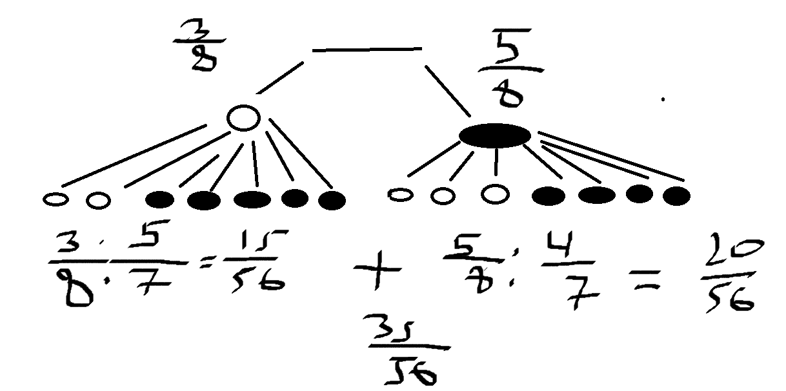

### We have two urns. The first urn contains 2 white balls and 5 black balls. The second urn has 5 white balls and 6 black balls. I choose one of the two urns uniformly at random. Then I draw a ball uniformly at random from the chosen urn. Make a tree. If the ball I've drawn is white, what's the probability that it comes from the first urn?

$P(U_1|W_1) = \frac{P(U_1 \cap W_1)}{P(W_1)}$. $P(W_1) = 1/2 * 2/7 + 1/2 * 5/11 = 57/154$. $P(U_1 \cap W_1) = 1/2 * 2/7 = 1/7$. $=>P(U_1|W_1) = 1/7 * 154/57 = 22/57$

### Consider a throw of two dice. Consider the events : Event A : "The first die is odd". Event B : "The second die is even". Event C : "The sum of the dice is odd". Show that events A, B and C are pairwise independent, but are not mutually independent.
Events $A$ and $B$ are said to be pairwise independent if the probability of both A and B occurring is equal to the product of their individual probabilities, i.e., $P(A \cap B) = P(A) * P(B)$\
Events $A, B,$ and $C$ are said to be mutually independent if the probability of all of them occurring together is equal to the product of their individual probabilities, i.e., $P(A \cap B \cap C) = P(A) * P(B) * P(C)$\
We have: $|\Omega| = 36. P(A) = 1/2, P(B) = 1/2, P(C) = 1/2.|A \cap B| = 9, P(A \cap B) = 9/36=1/4 => P(A \cap B) = P(A) * P(B). |A \cap C| = 9. P(A \cap C) = 9/36=1/4 => P(A \cap C) = P(A) * P(C)$ (same with $B$). $|A \cap B \cap C| = 9, P(A \cap B \cap C)=9/36=1/4 => P(A \cap B \cap C) \ne P(A)*P(B)*P(C) \ne 1/8$

# Random Variable

Random variable $X$ is a mapping to which a configuration, a given outcome (element of $\Omega$) associates an object, a number, a color, etc. **A random variable models the different values that the outcome of a random experiment
can take**.

- The roll of the dice. Consider the random variable $X : \Omega \rightarrow \{1, 2, 3, 4, 5, 6\}$ the application to which a given configuration associates the value of the dice.

- The coin toss. Consider the random variable $X : \Omega \rightarrow \{"Head", "Tail"\}$ the application to which a given configuration associates the value of the coin.

- The dart game. Consider the random variable $X : \Omega \rightarrow \mathbb{R}^+$ the application to which a given configuration associates the distance of the dart from the center of the target.

- The throw of two dice. Consider the random variable $X : \Omega \rightarrow \{2, \ldots, 12\}$ the application to which a given configuration associates the sum of the two dice.

For coin game, we have $X$ mapping: 
$$X: \Omega \to \{"Head", "Tail"\}, \omega \to x(\omega)$$

We have to ensure that $\{\omega \in \Omega: x(\omega) = "Tail"\}$ (*Notation: $\{\omega \in \Omega: x(\omega) = "Tail"\} = \{X = "Tail"\}$*) is an event, i.e. an element of the $\sigma$-algebra $\mathcal{F}$. Indeed, the proposition "the probability that the coin lands on tails is $1/2$" is written mathematically:

$$\mathbb{P}(X = "Tails") = 1/2$$

## Countable Space

If $X$ takes value in a countable (finite) space we require that for any $x$ in $E$ the set
$$\{X = x\} = \{\omega \in \Omega \,|\, X(\omega) = x\}$$
is an event (i.e., belongs to the $\sigma$-algebra $\mathcal{F}$). Since any subset $U$ of $E$ can be written as a
countable union of singletons, then:
$$\{X \in U\} = \bigcup_{x \in U} \{X = x\}$$
And thus:
$$\forall U \subset E, \{X \in U\} \subset \mathcal{F}$$

## Uncountable Space ($X$ is Real-Valued)

If we ask only that the sets $\{X = x\}$ are events, we can't assert that the set:
$$\{X \in [0, 1]\} = \bigcup_{x \in [0,1]} \{X = x\}$$
is an event, since a $\sigma$-algebra is only stable by countable union, and the set $[0, 1]$ is uncountable. We need to restrict the collection of subsets we're allowed to look at. The minimum
we can require is to be able to make sense of propositions like "the probability that my dart
arrives within $20$cm of the target is $1/2$". To achieve this, the set:
$$\{X \leq 20\} = \{\omega \in \Omega \,|\, X(\omega) \leq 20\}$$
is an event. In general, we require that for any $x \in \mathbb{R}$, the set:
$$\{X \leq x\} = \{X \in ]-\infty, x]\}$$
is an event. From this, we can that the following subsets of $\Omega$ are events (the set of events forms a $\sigma$-algebra. So the intersection, union and complement of events are still events):
$$\{X < x\} = \bigcup_{n \geq 0} \left\{X \leq x - \frac{1}{n}\right\}$$
$$\{X > x\} = \{X \leq x\}$$
$$\{X \geq x\} = \{X < x\}$$
$$\{x \leq X \leq y\} = \{X \in [x, y]\} = \{X \geq x\} \cap \{X \leq y\}$$
$$\{X = x\} = \{x \leq X \leq x\}$$

## Theorem 3.1: Dynkin System

Let $X : (\Omega, \mathcal{F}, P) \rightarrow (E, G)$ be an application. Suppose that the $\sigma$-algebra $\mathcal{G}$ is generated by a set $C$ of subsets of $E$, stable by intersections. This means:
$$\mathcal{G} = \sigma(C)$$
$$\forall U, V \in C, U \cap V \in C$$
Then $X$ is a random variable $\iff$
$$\forall U \in C, \{\omega \in \Omega \,|\, X(\omega) \in U\} \in \mathcal{G}$$

In other words, it's enough to check that $\{X \in U\}$ is an event for all $U \in C$ to deduce that it's an event for all $A \in G$. This allows us to clarify the definition of a random variable in the two cases we're interested in: real random variables and discrete random variables.

## Definition 3.1: Discrete Random Variable

Let $X$ be an application of a probability space $(\Omega, \mathcal{F}, P)$ with values in a countable space $E$, provided with the discrete $\sigma$-algebra. This means
$$X : (\Omega, \mathcal{F}, P) \rightarrow (E, P(E))$$
We say that $X$ is a discrete random variable with values in $E$, if for any $e \in E$, the set $\{X = e\}=\{\omega \in \Omega | X(w) = e\}$ is an event of the $\sigma$-algebra $\mathcal{F}$.

## Definition 3.2: Real Random Variable

Let $X$ be an application of a probability space $(\Omega, \mathcal{F}, P)$ with values in $\mathbb{R}$, provided with the Borelian $\sigma$-algebra $\mathcal{B}(\mathbb{R})$ ($B(\mathbb{R})$ is the $\sigma$-algebra generated by the intervals in $\mathbb{R}$), i.e.
$$X : (\Omega, \mathcal{F}, P) \rightarrow (\mathbb{R}, \mathcal{B}(\mathbb{R}))$$
We say that $X$ is a real random variable if for any $x \in \mathbb{R}$, the set $\{X \leq x\}=\{\omega \in \Omega | X(w) \le x\}$ is an event of the $\sigma$-algebra $\mathcal{F}$.

  

# Distribution of Random Variables

## Définition 3.2: The Distribution of a Random Variable $X$

The distribution of a random variable 
$$X: (\Omega, \mathcal{F}, P) \rightarrow (E, G)$$
is defined for any 
$$U : (\Omega, \mathcal{F}, P) \rightarrow (E, G)$$
as follows:
$$P(X \in U) = P(\{\omega \in \Omega \,|\, X(\omega) \in U\})$$

## Theorem 3.2: Dynkin System: Distribution of a Random Variable

If the $\sigma$-algebra $G$ is generated by a set $C$ of subsets of $E$, stable by intersection, then the distribution of a random variable $X$ is entirely characterized by giving for any $U \in C$, the quantities:
$$P(X \in U)$$

## Definition 3.3: Distribution of Discrete Random Variable

Let $X$ be a discrete random variable with values in a countable space $E$. The distribution of $X$ is entirely characterized by the quantities:
$$P(X = e)$$
for $e \in E$ ($X$ is a collection of quantities $\mathbb{P}(X=e)$)

For example, if the random variable $X$ models the number of people in a queue, then the distribution of $X$ is characterized by giving, for $k \in \mathbb{N}$, the quantities:
$P(X = k)$ ($P(X=0)$ - no one waits in the queue, $P(X=1)$ - 1 person in the queue, etc.).

## Definition 3.4: Distribution of Real Random Variable

Let $X$ be a real random variable. The distribution of $X$ is entirely characterized by the quantities:
$$P(X \le x)$$
for $x \in \mathbb{R}$.

For example, if the random variable $X$ models the distance of a dart from the center of the dartboard, then its distribution is characterized by giving for $X \in \mathbb{R}^+$ the quantities:
$$P(X \le x)$$

## Cumulative Distribution Function (CDF)

Let $X$ be a real random variable. The function $F$ defined by:
$$F_X : \mathbb{R} \rightarrow [0, 1]$$
$$x \mapsto P(X \leq x)$$
is called the cumulative distribution function of the variable $X$.

The cumulative distribution function characterizes the distribution
of $X$. This function is central to the study of real random variables.

Example:\
Let $X$ be a random variable that models the uniform drawing of a real number between $0$ and $1$. Its CDF is:

  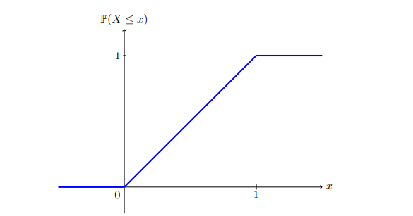

We know that $P(X \le 0) = 0$ since the numbers are $\in [0, 1]$. We also know that $P(X \le 1) = 1$ since the upper bound is $1$. And between $[0,1]$ is uniform distribution, so the probabilities are the same for each interval $[a,b] \in [0,1]$.

Another example:\
Let $X$ be a random variable that models a balanced throw of a die. It is a real random variable since $\{1, 2, 3, 4, 5, 6\} \subset \mathbb{R}$. Its cumulative distribution function is as follows:

  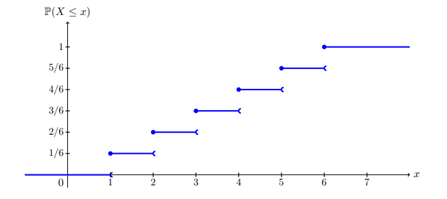

In general, when $X$ is a discrete random variable, its cumulative distribution function is
piecewise constant, and the points of discontinuity are exactly the values reached by $X$ with
non-zero probability.

## Theorem 3.1: CDF Properties

The cumulative distribution function $F_X$ of a random variable verifies the following properties:

- $F_X$ is increasing and:
  - $\lim_{x \to -\infty} F_X(x) = 0$
  - $\lim_{x \to +\infty} F_X(x) = 1$

- $F_X$ is continuous on the right: If $(x_n)_{n \geq 0}$ is a decreasing sequence that converges to a real number $x$, then:
  - $\lim_{n \to +\infty} P(X \leq x_n) = P(X \leq x)$

- $F_X$ admits a left limit at any point: If $(y_n)_{n \geq 0}$ is an increasing sequence that converges to a real number $y$, then:
  - $\lim_{n \to +\infty} P(X \leq y_n) = P(X < y)$

A function $F$ verifying the last to points is said to be *cadlag* (continious on the right, limit on the left).

### Demonstration

Let $x, y \in \mathbb{R}$ be real points s.t. $x \le y$. Then:
$$\{X \le x\} \subset \{X \le y\}$$
$$P(X \le x) \le P(X \le y)$$
Furthermore, let $(x_n)_{n\in\mathbb{N}}$ be a sequence increasing towards infinity. The events $(\{X \le x_n\})_{n\in\mathbb{N}}$ form an increasing sequence of events whose union is $\mathbb{R}$ any number. Hence:
$$\lim_{n \to +\infty} F_X(x_n) = \lim_{n \to +\infty} P(X \leq x_n)$$
$$= P\left(\bigcup_{n=0}^\infty \{X \leq x_n\}\right)$$
$$= P(X \in \mathbb{R})$$
$$= 1$$

The case for $-\infty$ is similar. 

Let $(x_n)_{n \in \mathbb{N}}$ be a decreasing sequence towards a real $x$. Then:
$$\lim_{n \to +\infty} F_X(x_n) = \lim_{n \to +\infty} P(X \leq x_n)$$
$$= P\left(\bigcup_{n=0}^\infty \{X \leq x_n\}\right)$$
$$= P(X \leq x)$$
$$= F_X(x)$$

Let $(y_n)_{n \in \mathbb{N}}$ be a sequence increasing towards a real $y$.
$$\lim_{n \to +\infty} F_X(y_n) = \lim_{n \to +\infty} P(X \leq y_n)$$
$$= P\left(\bigcup_{n=0}^\infty \{X \leq y_n\}\right)$$
$$= P(X < y)$$

### Quantile Function

Let $F$ be a function verifying the three points of Theorem 3.1. We define the quantile function $F^{-1}: [0, 1] \rightarrow \mathbb{R}$ by
$$F^{-1}(u) = \inf \{x \in \mathbb{R} \,|\, F(x) \geq u\}$$
(in general: $F(x) = y \iff x=F^{-1}(y)$)

Let $U$ be a uniform distribution on $[0, 1]$. The quantile function $F^{-1}$ verifies the following properties:
- If $F$ is continuous and increasing, then $F^{-1}$ is the reciprocal bijection of $F$.
- The random variable $X = F^{-1}(U)$ has the cumulative distribution function $F$.

## Definition 3.6: Atom

Let $x \in \mathbb{R}$. A real random variable $X$ is said to have an atom at the point $x$ if:
$$P(X = x) > 0$$

Take case where X is discrete (throwing dice).

## Theorem 3.3: CDF and Atom | Jump of Discontinuity

Let $X$ be a real random variable. The cumulative distribution function of $X$ exhibits a jump of discontinuity at the point $x$  if and only if $X$ has an atom at the point
$x$. In this case, the jump is of size $P(X = x)$.

Example:\
$U$ - uniform $\{0, 100\}$ (age)\
$X$ - height of Alex at time $U$\
$X \in [50cm, 181cm]$

Another example:\
Consider a random variable $X$ representing the outcome of rolling a fair six-sided die. In this case, $X$ can take values from $1$ to $6$. Each outcome $(1, 2, 3, 4, 5,$ or $6)$ has a probability of $1/6$ of occurring, so $P(X=x)=1/6$ for each 
$x$ in the range. Since each value has a non-zero probability, 
$X$ has an atom at each of these points.

## Definition 3.7: Random Variable with Density | Probability Density Function of Distribution of $X$ (PDF)

Let $X$ be a real random variable with a cumulative distribution function $F_X$. The random variable $X$ is said to have a density if there exists an integrable function $f_X$ such that
$$F_X(x) = P(X \leq x) = \int_{-\infty}^{x} f_X(t) \, dt$$
The function $f_X$ is called the probability density of the distribution of $X$.

The function $F_X$ is a primitive of the function $f_X$. We deduce that $F_X$ is continuous, so $X$ is atom-free. We also deduce the following theorem.

## Theorem 3.4: CDF and PDF

Let $X$ be a real random variable. If its cumulative distribution function $F_X$ is continuous and piecewise derivable, then $X$ is a random variable with probability density $f$ and:
$$f_X = (F_X)' = \frac{d}{dx} F_X$$

Conversely, if $X$ is a random variable that has a density, its characteristic function is continuous, so $X$ has no atom. On the other hand, there are atom-free random variables that do not admit a density (Cantor's staircase is a counterexample).

Let $a$ and $b$ be real numbers with $a < b$, and let $X$ be a random variable with density $f_X$. Then:

$$P(a \leq X \leq b) = \int_{a}^{b} f_X(t) \, dt$$

For example, let $X$ be a uniform random variable on the set $[0, 1]$. For $0 \leq a \leq b \leq 1$, we have:

$$P(a \leq X \leq b) = b - a = \int_{a}^{b} 1 \, dt$$

In other words, the density of the uniform distribution is the function $1_{[0,1]}$.

If now $I = [x, x + \varepsilon]$ is a small interval, then we have:

$$P(x \leq X \leq x + \varepsilon) = \int_{x}^{x+\varepsilon} f_X(t) \, dt \approx \varepsilon f_X(x)$$

Let $X$ be a random variable with density $f_X$. The probability that $X$ belongs to a small interval around a point $x \in \mathbb{R}$ is proportional to the size of this interval. The proportionality coefficient is exactly $f_X(x)$.

## Theorem 3.5: PDF: Positive and Mass

Let $X$ be a random variable with density $f_X$. Then:

- $f_X$ is positive.

- $f_X$ has mass 1:

$$\int_{-\infty}^{\infty} f_X(t) \, dt = 1$$

**Conversely, if $f$ is a function verifying these two properties, then there exists a random variable $X$ of density $f$.**

### Demonstration (Proof)

For the first point, we have for $\varepsilon$ a small positive real:
$$0 \leq P(x \leq X \leq X + \varepsilon) \approx \varepsilon f(x)$$
And so $f$ is necessarily positive.

For the second point, we have:
$$1 = P(-\infty < X < +\infty)=P(X\in\mathbb{R}) = \int_{-\infty}^{\infty} f(t) \, dt$$

## Memoryless Property

### Discrete Random Variable

A discrete random variable $X$ is memoryless with respect to a variable $a$ if, (for positive integers $a$ and $b$) the probability that $X$ is greater than $a + b$ given that $X$ is greater than $a$ is simply the probability of $X$ being greater than $b$. Symbolically, we write:

$$P( X > a + b | X > a ) = P ( X > b )$$

To make this specific, let $a=5$ and $b=10$. If our probability distribution is memoryless, the probability $X > 15$ if we know $X > 5$ is exactly the same as the probability of $X>10$.

Note that this is not the same as the probability of $X$ being greater than 15, as it would be if the events $X > 15$ and $X > 5$ were independent.

### Continious Random Variable

We say that a continuous random variable X (over the range of reals) is memoryless if for every real $h, t$:

$$P( X > t + h | x > t ) = P ( X > h )$$

# Expectation, Variance, Median

## Expectation

### Simple Random Variable

Let $X$ be a positive real random variable on a probability space. If $X$ is a simple random variable with:

$$
X = \lambda_1 1_{A_1} + \ldots + \lambda_n 1_{A_n} = \sum^n_{i=1}\lambda_i1_{A_i}
$$

We define the expected value as:

$$
E[X] = \lambda_1 P(A_1) + \ldots + \lambda_n P(A_n)=\sum^n_{i=1}\lambda_i P(A_i)
$$

In the general case, we define the expected value of positive simple variable as:

$$
E[X] = \sup \{E[Y] \, | \, Y \text{ simple and } Y \leq X\}
$$

We say that $X$ is integrable (or of finite expectation) if:

$$
E[X] < +\infty
$$

### Quelconque Random Variable | Lebesque Integral

Let $X$ be a real random variable quelconque, not necessarily positive. We decompose $X$ into:

$$
X = X1_{X \ge 0} + X1_{X < 0}
$$

If the positive random variable $X 1_{X \ge 0}$ and the positive random variable $(-X1_{X < 0})$ have finite expectations, we say that $X$ has a finite expectation and define its mean by:

$$
E[X] = E[X1_{X \geq 0}] - E[X1_{X < 0}]
$$

  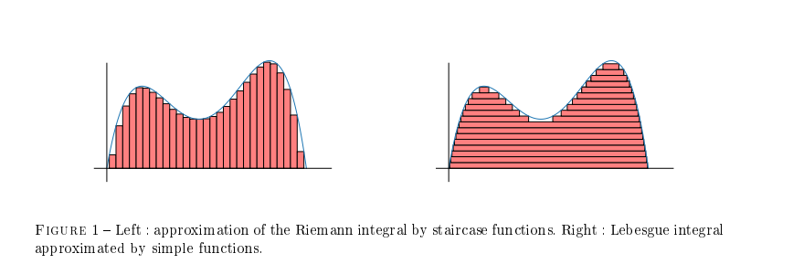

### Expectation Properties

Let X and Y be two integrable random variables defined on the same probability space $(\Omega, \mathcal{F}, \mathbb{P})$, and $\lambda$ a real number. Then,

- Linearity : For $\lambda \in \mathbb{R}$, we have

$$E[\lambda X + Y] = \lambda E[X] + E[Y]$$

- Monotonicity : If, for almost all $\omega \in \Omega$, we have $X(\omega) \leq Y(\omega)$, then

$$E[X] \leq E[Y]$$

For example: $E[1_A] = P[A]$

**Expectation of a constant $=$ constant.**

### Transfer Theorem

Let $X$ be a random variable defined on a probability space $(\Omega, \mathcal{F}, P)$, and $g$ be a function from $\mathbb{R}$ to $\mathbb{R}$. Then, the quantity $E[g(X)]$ depends only on the function $g$ and the distribution of $X$.

If $F_X=F_Y$, then $E[X] = E[Y]$

### Expectation Discrete

Let $X$ be a discrete random variable, and let $(x_n)_{n \in \mathbb{N}}$ be the values it can take. Then, $X$ has finite expectation if and only if:

$$
\sum_{n=0}^\infty |x_n|P(X = x_n) < +\infty
$$

In this case:

$$
E[X] = \sum_{n=0}^\infty x_nP(X = x_n)
$$

Moreover, if $g$ is a function from $\mathbb{R}$ to $\mathbb{R}$ (provided the sum converges absolutely):

$$
E[g(X)] = \sum_{n=0}^\infty g(x_n)P(X = x_n)
$$

### Expectation Density

Let $X$ be a real random variable with density $f_X$. Then, $X$ has finite expectation if and only if:

$$
\int_{-\infty}^{\infty} |x|f_X(x)dx < +\infty
$$

In this case:

$$
E[X] = \int_{-\infty}^{\infty} xf_X(x)dx
$$

Furthermore, if $g$ is a function from $\mathbb{R}$ to $\mathbb{R}$ (provided the integral converges absolutely):

$$
E[g(X)] = \int_{-\infty}^{\infty} g(x)f_X(x)dx
$$

Remember that $f_X(x)\varepsilon \approx P(X \in [x, x + \varepsilon])$

Example:\
Let $g = 1_{[a,b]}$\
$E[g(x)] = E[1_{[a,b]}(x)] = P(a \le X \le b) = \int^{+\infty}_{-\infty}1_{[a,b]}(x)f_X(x)dx = \int^b_af_X(x)dx = P(a \le X \le b)$

### Markov's Inequality

Let $X$ be a positive random variable with finite expectation, and $\alpha$ a strictly positive real number. Then,

$$
P(X \geq \alpha) \leq \frac{E[X]}{\alpha}
$$

More generally, if $g$ is a positive and strictly increasing function, then,

$$
P(X \geq \alpha) \leq \frac{E[g(X)]}{g(\alpha)}
$$

## Median

The median of a random variable is a number $m$ such that:

$$
P(X \leq m) \geq \frac{1}{2} \text{ and } P(X \geq m) \geq \frac{1}{2}
$$

## Variance

Let $X$ be a random variable with finite expectation. We denote $\text{Var}(X)$ as the variance of $X$, defined as:

$$
\text{Var}(X) = E\left[(X - E[X])^2\right]
$$

If this quantity is finite, we say $X$ has finite variance. In that case, we denote by $\sigma(X) = \sqrt{\text{Var}(X)}$ its standard deviation.

Let $X$ be a random variable with finite variance, and $\lambda$ a real number. We have:

- $\text{Var}(\lambda X) = \lambda^2 \text{Var}(X)$
- $\text{Var}(X + \lambda) = \text{Var}(X)$
- $X$ is almost surely (a.s.) constant if and only if $\text{Var}(X) = 0$
- $\text{Var}(X) = E[X^2] - E[X]^2$

If $X$ is a discrete random variable with values in $\{x_1, x_2, \ldots\}$ and finite variance, then:

$$
\text{Var}(X) = \left(\int_{\mathbb{R}} t^2 f_X(t)dt\right) - \left(\int_{\mathbb{R}}t f_X(t)dt\right)^2
$$

### Chebyshev's Inequality

Let $X$ be a random variable with finite variance and $\beta$ a nonzero real number. By using Markov's inequality, we can show that:

$$
P(|X - E[X]| \geq \beta) \leq \frac{\text{Var}(X)}{\beta^2}
$$

# Probability Distributions

## Discrete

### Bermoulli

This distribution is associated with an experiment having two possible outcomes: 0 or 1. A random variable $X$ follows a Bernoulli distribution with parameter $p$ if:

$$P(X = 0) = 1 - p \text{ and } P(X = 1) = p$$
$$E[X] = p$$
$$\text{Var}(X) = p(1-p)$$

### Poisson

This distribution is associated with the number of people in a
queue. A random variable $X$ follows a Poisson distribution with parameter $\lambda$ if, for $k \in \mathbb{N}^*$:

$$
P(X = k) = \frac{e^{-\lambda} \lambda^k}{k!}
$$
$$E[X] = \lambda$$
$$\text{Var}(X) = \lambda$$

### Binomial

This distribution is associated with the repetition of $n$ independent and identically distributed random variables following a Bernoulli distribution with parameter $p$. A random variable $X$ follows a binomial distribution with parameters $n$ and $p$ if, for $k$ in the set $\{0, 1, \ldots, n\}$:

$$
P(X = k) = \binom{n}{k} p^k (1 - p)^{n - k}
$$

If you toss a biased coin $n$ times (with a probability of landing on heads being $p$), the random variable $X$ counting the number of heads follows a binomial distribution with parameters $n$ and $p$.

$$E[X] = np$$
$$\text{Var}(X) = np(1-p)$$

### Uniform $\mathbb{U}(a,b)$

This is the uniform distribution over the integers $a, a+1, \ldots, b$. We denote $n = b - a + 1$. A random variable $X$ follows a uniform distribution with parameters $a$ and $b$ if for $k \in \{1,...,n\}$:
$$P(X=k) = \frac{1}{n}$$
$$E[X] = \frac{n+1}{2}$$
$$\text{Var}(X) = \frac{n^2-1}{12}$$

### Geometric

This distribution is associated with the distribution of the first occurrence of a repeated experiment. A random variable $X$ follows a geometric distribution with parameter $p$ if for all $k \in N$:
$$P(X=k)=(1-p)^{k-1}$$
$$P(X\le k)=1 - (1-p)^k$$
$$P(X>k)=(1-p)^k$$
$$E[X] = \frac{1}{p}$$
$$\text{Var}(X) = \frac{1-p}{p^2}$$

## Density

### Normal $\mathcal{N}(m, \sigma^2)$

This distribution naturally appears in the central limit theorem. It often models random fluctuations of a parameter around its average value (temperature,
white noise, stock prices, etc). Its density is given by:
$$f_X(x) = \frac{1}{\sqrt{2\pi \sigma^2}}e^{-\frac{(x-m)^2}{2\sigma^2}}$$
$$m = E[X]$$
$$\sigma^2 = \text{Var}(X)$$

  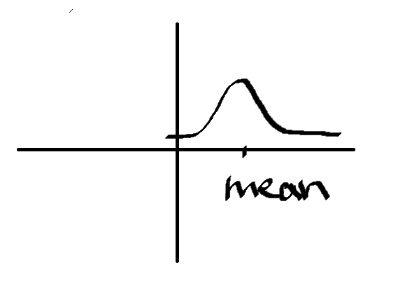

### Exponential (Memoryless) $\varepsilon(\lambda)$

This is the only family of memoryless distributions. Atoms die randomly.
$$f_X(t) = \lambda e^{-\lambda t}1_{[0, +\infty]}(t)$$
$$E[X] = \frac{1}{\lambda}$$
$$\text{Var}(X) = \frac{1}{\lambda^2}$$

  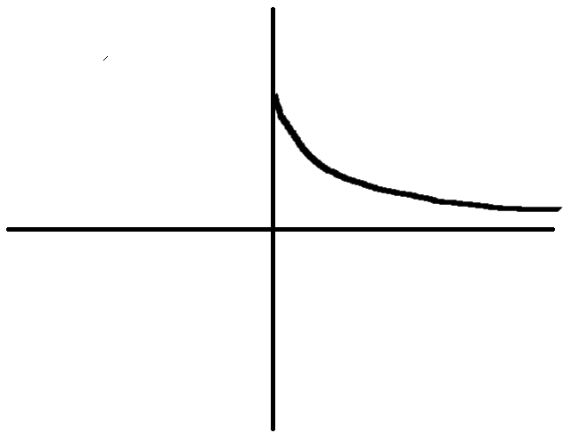

### Uniform on Interval $\mathcal{U}([a,b])$

This is the uniform distribution over a bounded interval $[a, b]$. $X$ follows a uniform distribution over $[a, b]$ if for $c,d$ s.t. $a\le c\le d \le b:$
$$P(c < X < d) = \frac{d-c}{b-a}$$
$$f_X(x) = \frac{1}{b-a}1_{[a,b]}$$
$$E[X] = \frac{b+a}{2}$$
$$\text{Var}(X) = \frac{(b-a)^2}{12}$$

  

# Pair of Random Variables

Let $X$, $Y$ be random variables defined on the same measurable space:

$$X: (\Omega, \mathcal{F}, P) \to (E,G)$$
$$Y: (\Omega, \mathcal{F}, P) \to (F,H)$$

Product random variables:
$$(X, Y): (\Omega, \mathcal{F}, P) \to (E \times F,G \otimes H)$$

## Joint Law

Let $(E, G)$ and $(F, H)$ be two measurable spaces. The product space:

$$E \times F = \{(x, y) \,|\, x \in E, y \in F\}$$

can naturally be equipped with a sigma-algebra, called the product sigma-algebra and denoted by $G \otimes H$. It is generated by the sets:

$$G \otimes H = \sigma\{(A \times B) \,|\, A \in G, B \in H\}$$

The law of a pair $(X, Y)$ of random variables defined as above is the specification of probabilities:

$$P(X \in A, Y \in B) = P(\{X \in A\} \cap \{Y \in B\})$$

for all $A \in G$ and $B \in H$.

When we know the law of the pair $(X, Y)$, it is possible to determine the laws of $X$ and $Y$.

## Marginal Law

Let $X$ be a random variable:

$$X : (\Omega, F, P) \to (E, G)$$

and let $Y$ be another random variable defined on the same sample space:

$$Y : (\Omega, F, P) \to (F, H)$$

If we know the law of the pair $(X, Y)$, we can derive the law of X using the formula:

$$\forall A \in G, P(X \in A) = P(X \in A, Y \in F)$$

## Discrete Case

### Joint Law

Let $X$ and $Y$ be two discrete random variables defined on the same probability space. The law of the pair $(X, Y)$ is given by the probabilities:

$$P(X = x_k, Y = y_j)$$

where $x_k$ (respectively, $y_j$) ranges over the values taken by $X$ (respectively, $Y$).

#### Example

$X$ models coin flip, $Y$ models dice throw. We have:
$$P(X=H, Y=1)$$
$$P(X=T, Y=1)$$
$$P(X=H, Y=2)$$
$$P(X=T, Y=2)$$
$$\vdots$$

**If you know the distribution of the pair $(X,Y)$, then you can deduce the Marginal Distributions of $X$ and $Y$.**

### Marginal Law

The marginal laws of $X$ and $Y$ are then given by:

$$P(X = x_k) = \sum_j P(X = x_k, Y = y_j)$$

and

$$P(Y = y_j) = \sum_k P(X = x_k, Y = y_j)$$

#### Example

$X$ models coin flip, $Y$ models dice throw. We have:
$$P(Y = 1) = \sum_k P(X = x_k, Y = 1) = P(X=H, Y=1) + P(X=T, Y=1)$$

Since they are independent (see later) we can split the probabilities:

$$P(Y = 1) = \sum_k P(X = x_k, Y = 1) = P(X=H, Y=1) + P(X=T, Y=1) = \frac{1}{6}(\frac{1}{2} + \frac{1}{2}) = \frac{1}{6}$$

**Knowing marginals does not allow us to compute the joint, unless we add some hypothesis, like independence (?).**

## Continious Case

### Joint Law

Let $X$ and $Y$ be two real random variables defined on the same probability space. The law of the pair $(X, Y)$ is given by the probabilities:

$$P(X \leq x, Y \leq y)$$

where $x$ and $y$ range over the real numbers.

### Joint Density

Let $X$ and $Y$ be two real random variables defined on the same probability space. We say that the pair $(X, Y)$ has a joint density $f_{(X, Y)}$ if, for all intervals $I$ and $J$ in $R$, we have:

$$P(X \in I, Y \in J) = \iint_{I \times J} f(X, Y)(x, y) \, dx \, dy$$

In this case, the random variables $X$ and $Y$ have marginal densities given by:

$$f_X(x) \to \int_{R} f_{(X, Y)}(x, y) \, dy$$

and

$$f_Y(y) \to \int_{R} f_{(X, Y)}(x, y) \, dx$$

  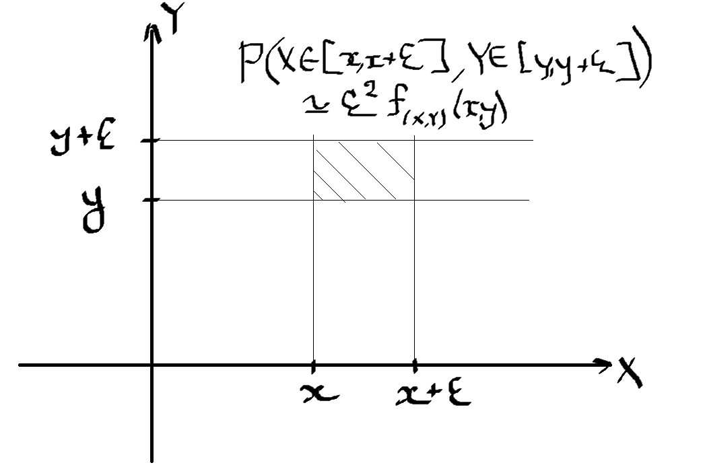

High density - high probability to be around the point.\
Low density - low probability to be around the point.

**If you have joint density, you can compute marginal densities.**

## Independent Random Variables

Two random variables $X$ and $Y$ defined as above are independent if:

$$\forall A \in G, \forall B \in H, P(X \in A, Y \in B) = P(X \in A)P(Y \in B)$$

In other words, the events $\{X \in A\}$ and $\{Y \in B\}$ are independent.

In general, it is possible to talk about a family $(X_n)_{n\in\mathbb{N}}$ of mutually independent random variables. They are independent if and only if the sigma-algebras $(\sigma(X_n))_{n\in\mathbb{N}}$ are mutually independent. For example, if $X, Y$, and $Z$ are the results of rolling three dice, then $X + Y$ is independent of $Z$.

### Discrete Case

Let $X$ and $Y$ be two discrete random variables defined on the same probability space. The random variables $X$ and $Y$ are independent if and only if:

$$P(X = x_k, Y = y_j) = P(X = x_k)P(Y = y_j)$$

where $x_k$ (respectively, $y_j$) ranges over the values taken by $X$ (respectively, $Y$).

### Continious Case

Let $X$ and $Y$ be two real random variables defined on the same probability space. The random variables $X$ and $Y$ are independent if and only if:

$$P(X \leq x, Y \leq y) = P(X \leq x)P(Y \leq y)$$

#### Joint Density

If $X$ and $Y$ are two random variables with densities $f_X(x)$ and $f_Y(y)$, they are independent if and only if the pair $(X, Y)$ has a joint density given by:

$$f_{(X, Y)}(x, y) \rightarrow f_X(x)f_Y(y)$$

### Expected Values | Variances

#### Expected Values

Let $X$ and $Y$ be two independent random variables with finite **expectations**. Then:

$$E[XY] = E[X] E[Y]$$

And more generally, for any measurable functions $f$ and $g$ from $\mathbb{R}$ to $\mathbb{R}$:

$$E[f(X) g(Y)] = E[f(X)] E[g(Y)]$$

Let $X_1, ..., X_n$ be mutually independent random variables. Then:

$$E[X_1 \ldots X_n] = E[X_1] \ldots E[X_n]$$

#### Variances

If $X$ and $Y$ have finite **variances**:

$$Var(X + Y) = Var(X) + Var(Y)$$

Let $X_1, ..., X_n$ be mutually independent random variables. Then:

$$Var(X_1 + \ldots + X_n) = Var(X_1) + \ldots + Var(X_n)$$

#### Covariance

Covariance of variables $X$ and $Y$ is denoted as:

$$Cov(X, Y) = E[(X - E[X])(Y - E[Y])] = E[XY] - E[X]E[Y]$$

In the case where $X$ and $Y$ are independent, the covariance of the two terms is zero, but not vice versa.

### Convolution

#### Discrete

For discrete random variables $X$ and $Y$ with values in $N$:
$$P(X + Y = n) = \sum_{k=0}^{n} P(X = k) P(Y = n - k)$$

##### Example

Let $X, Y$ models throwing dice. Then 
$$P(X+Y=2) = \sum_{k=0}^{2} P(X = k) P(Y = 2 - k) =$$
$$P(X = 1)P(Y = 2-1) + P(X = 2)P(Y = 0) (\text{ which is zero }) + \cdots (\text{ zeros}) =$$
$$= \frac{1}{6} \cdot \frac{1}{6} = \frac{1}{36}$$

#### Random Variables with Densities

For real independent random variables $X$ and $Y$ with densities we define $Z=X+Y$ and:
$$f_{Z}(z) = \int_{-\infty}^{\infty} f_X(u) f_Y(z - u) \, du$$

# Limit Theorems

## Modes of Convergence of Random Variables

Let $(X_n)_{n\ge0}$ be a sequence of random variables and X a random variable, all defined on the same probability space $(\Omega, \mathcal{F}, \mathbb{P})$. We aim to give meaning to the convergence of the sequence $(X_n)_{n\ge0}$ to $X$. We have 4 modes of convergence.

### Almost Sure Convergence

We say that $(X_n)_{n\ge0}$ converges to $X$ **almost surely** if, for almost every $\omega \in \Omega$
$$\lim_{n \to +\infty}X_n(\omega) = X(\omega)$$
We write
$$X_n \to^{a.s.}_{n \to + \infty}X$$

If we simulate convergence of $X_n(\omega) - X(\omega)$ for a fixed $\omega$, then this sequence converges to $0$.

#### Example

A simple case of almost sure convergence occurs when dealing with an increasing and bounded sequence of random variables. In that case, it converges almost surely to a limiting random variable.

### Convergence in $L^p$

We say that $(X_n)_{n\ge0}$ converges to $X$ **in $L^p$** if
$$\lim_{n \to +\infty}E[|X_n - X|^p]=0$$
We write
$$X_n \to^{L^p}_{n \to + \infty}X$$
When $p=2$ it is called quadratic convergence.

In other words, as we compute distances for each $\omega$ for $(X_n)_{n\ge0}$ and $X$, each $\omega$ should be close for $E[|X_n - X|^p]$ to go to $0$.

### Convergence in Probability

We say that $(X_n)_{n\ge0}$ converges to $X$ **in probability** if, for every $\varepsilon>0$
$$\lim_{n \to +\infty}P[|X_n - X|>\varepsilon]=0$$
We write
$$X_n \to^{P}_{n \to + \infty}X$$
In other words, a sequence of random variables converges in probability to its limit when the probability that the sequence takes values far from its limit tends to $0$.

#### Example

Let $(X_n)_{n\ge0}$ a sequence of random variables following a Bernoulli distributon with parameter $1/n$. $(X_n)_{n\ge0}$ converges in probability to the constant random variable equal to $0$, because
$$\forall \varepsilon>0 \quad P(|X_n - 0|>\varepsilon)\le P(X_n=1)=\frac{1}{n} \to_{n\to +\infty}0$$
$$\text{here read as } P(|X_n - 0|>\varepsilon)= P(X_n=1)$$
$$P(X = 0) = 1 - 1/n \text{ and } P(X = 1) = 1/n$$

### Convergence in Distribution

We say $(X_n)_{n\ge0}$ (with distribtuion functions $(F_n)_{n\ge0}$) **converges** **in** **distribution** to $X$ (with distribution function $F$) if, at every continuity point $x$ of function $F$ we have
$$\lim_{n \to +\infty}F_n(x) = F(x)$$
We write
$$X_n \to^L_{n\to+\infty}X$$

In other words, if $(X_n)_{n\ge0}$ is Gaussian, or Bernoulli, or etc., then $X$ is distributed the same way (this does not imply that $\omega$'s are close to each other)

#### Example

$(X_n)_{n\ge0}$ can converge in **distribution** to $X$, but not converge in other modes of convergence. Take sequence $(X, -X, X, -X,...)$. We have Gaussian in every $X_i$, so sequence converges to Gaussian. Convergence in distribution generally does not imply other modes of convergence. Convergence in distribution is **weak mode of convergence**.

Instead of $X$ we can put a distribution, for example
$$X_n \to^L_{n\to+\infty}\mathcal{N}(0,1)$$

### Additional Lemma

If $(X_n)_{n\ge0} \to^L_{n \to+\infty}X$ and $X=C, C \in R => $(X_n)_{n\ge0} \to^P_{n \to+\infty}X$

### Convergence Implications

Almost Sure Convergence $=>$ Convergence in Probability $=>$ Convergence in Distribution

Convergence in $L^p$ $=>$ Convergence in Probability $=>$ Convergence in Distribution

The converses are generally fake.

### Independent and Identically Distributed Sequence of Random Variables (i.i.d.)

If $(X_n)_{n\ge1}$ are i.i.d., then they all have the same distribution.

### Empirical Mean

We define the sequence of empirical means $\overline{(X_n)_{n\ge1}}$ of i.i.d. random variables as
$$\forall n\ge0 \quad \overline{X_n} = \frac{X_1+...+X_n}{n}$$

### Law of Large Numbers

The law of large numbers establishes the connection between the empirical mean and the theoretical mean For example, in a dice roll, I have a one in six chance of rolling a 5. The law of large numbers asserts that, on average, after a large number of experiments, I would have rolled a 5 approximately one in six times.

If $(X_n)_{n\ge1}$ are i.i.d. and expectation of $X$ is finite, then
$$\overline{X_n} \to^{\text{a.s.}}_{n\to+\infty}E[X]$$

#### Example

Suppose I toss a biased coin infinitely many times, where the probability of getting
"Heads" is $p$. The random variable $X_n$ is equal to $1$ if the coin lands on heads and $0$ otherwise.
$$X_n = 1_{A_n}, A_n=\text{"The coin lands on Head"}$$
Here, the sequence $(X_n)_{n\ge1}$ is indeed an i.i.d sequence following a Bernoulli distribution with parameter $p$. In this case
$$\overline{X_n} = \frac{X_1+...+X_n}{n} = \frac{\text{num. Heads in n tosses}}{n}$$
It corresponds to the proportion of "Heads" in the first $n$ tosses. The law of large numbers then asserts that this proportion converges to the expectation of $X_n$, which is the probability of the
event "The coin lands on "Heads""
$$\overline{X_n} \to^{\text{a.s.}}_{n\to+\infty}E[X] \to p$$

### Monte Carlo

An application of the law of large numbers is the Monte Carlo method for estimating the value
of an integral. This method is particularly useful in dimensions $d \ge 1$.

Let $f:[0,1]^d\to R$ be an integrable function, and $(U_n)_{n\ge1}$ be an i.i.d. sequence of uniform random variables on $[0,1]^d$. Then
$$\frac{f(U_1) + ... + f(U_n)}{n}\to_{n\to+\infty}\int_{[0,1]^d}f(x)dx$$

### Central Limit Theorem (CLT)

The Central Limit Theorem (CLT) allows us to specify the fluctuations of the empirical mean around the theoretical mean. It helps construct confidence intervals when estimating a certain parameter. For example, if I toss a coin $10000$ times and get heads $4500$ times, can I conclude
that the coin is fair?

As a reminder, a random variable $Z$ follows a normal distribution $\mathcal{N}(\mathcal{m}, \sigma^2)$ if it has a density given by
$$f_Z(z) = \frac{1}{\sqrt{2\pi \sigma^2}}e^{-\frac{(z-m)^2}{2\sigma^2}}$$

Theorem: assuming that the variance of $X$ is finite, then
$$\frac{\overline{X_n}-E[\overline{X_n}]}{\sqrt{Var(\overline{X_n})}}\to^L_{n\to+\infty}\mathcal{N}(0,1)$$

#### Example

Tossing a dice. We have:\
$X_1,...,X_n$ i.i.d. of 1 dice throw.\
$\overline{(X_n)_{n\ge1}}=\frac{1}{n}\sum^n_{i=1}X_i$\
For $n=1: \overline{(X_n)_{n\ge1}} \approx U(\{1,2,3,4,5,6\})$\
For $n=2: 3$ or $4$ are more likely that $1$ or $6$\
For $n \to +\infty: \overline{(X_n)_{n\ge1}} \to^{\text{a.s.}}3.5$

To answer the question at which rate does this convergence happen, we can express the CLT in the following way:
$$\sigma^2=Var(X)$$
$$E[\overline{X_n}] = E[X]$$
$$Var(\overline{X_n})=\frac{\sigma^2}{n}$$
Thus:
$$\sqrt{n}(\overline{X_n} - E[X]) \to^L_{n\to+\infty}\mathcal{N}(0, \sigma^2)$$
$$\frac{(X_1 + ... + X_n)-nE[X]}{\sqrt{n}\sigma}\to^L_{n\to+\infty}\mathcal{N}(0, 1)$$

**The CLT asserts that the error between the theoretical and empirical means is of the order of $\sqrt{Var(\overline{X_n})}=\frac{\sigma}{\sqrt{n}}$**.  This allows the calculation of asymptotic confidence interval.

### Asymptotic Confidence Interval at level $\alpha$

Let us see an example on how to estimate the mean of a random variable using the observation of a sample of size $n$, in the case where the variance $\sigma$ is known.

Let $Z$ be a standard normal random variable, and $0 < \alpha < 1$. We define the number $q_{\alpha/2}$ such that
$$P(-q_{\alpha/2} \le Z \le q_{\alpha/2}) = 1 - \alpha$$
Then
$$\lim_{n\to+\infty}P(\overline{X_n}-\frac{\sigma}{\sqrt{n}}q_{\alpha/2} \le E[X] \le \overline{X_n}+\frac{\sigma}{\sqrt{n}}q_{\alpha/2}) = 1 - \alpha$$

#### Demonstration

According to the CLT we have
$$\lim_{n\to+\infty}P(-q_{\alpha/2} \le \sqrt{n}\frac{\overline{X_n}-E[X]}{\sigma} \le q_{\alpha/2}) = 1 - \alpha$$
The conclusion follows.
