# Continious and Discrete Signal Processing

Signal processing studies the representatons and transformations of signals.

In $1D$ there are speech and audio signals, financial data,...

  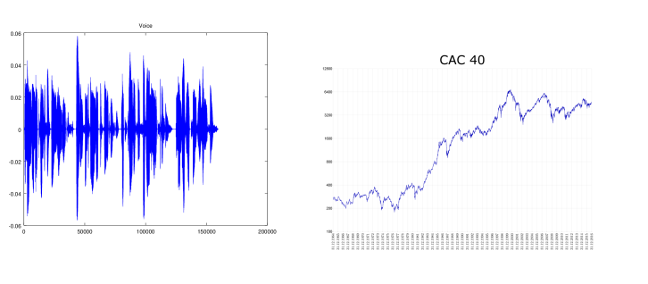

In $2D$ there are images (visual, $2D$ scan, ...) (greyscale images).

$I: \mathbb{N} \times \mathbb{N} \to \mathbb{N}$\
$(r,c) \to I(r,c)$

  

In $3D$ there are color images (RGB), video, ...

Videos - sequence of images.

  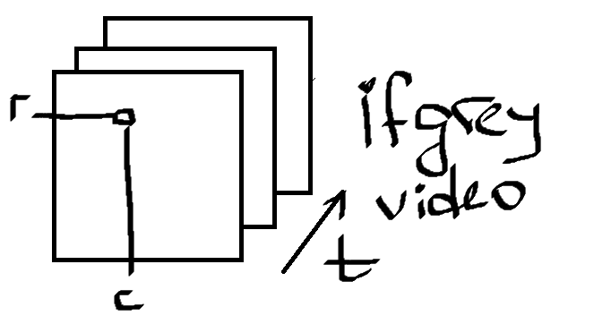

  

## Signal  

A signal is a the physical representation of information carried from a source to its destination.

  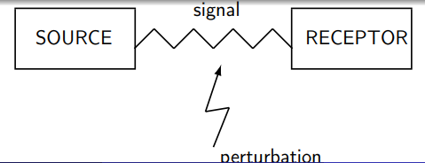

### Continious 

A continious or analogical signal will be defined on $\mathbb{R}$, $\mathbb{R}^2$, ... and represents a continious quantity.

A one-dimensional continious signal is a real (or complex) valued function of one variable, $f(t), t \in \mathbb{R}$

$f: \mathbb{R} \to \mathbb{R}$\
$t \to f(t)$

if $f_1$ is continious:

$$f(t) = \begin{align*} f_1(t), t \in [a,b] \\ 0 \end{align*}$$

$$\int_\mathbb{R}|f(t)|dt = \int^\infty_{-\infty}|f(t)|dt = \int^b_a|f_1(t)|dt < \infty$$

### Discrete 

A discrete signal represents information through a sequence of numbers, thus defined on $\mathbb{N}, \Z, \Z^2,...$

  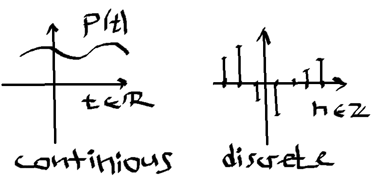

# Continious Signals

## Support of a Signal

The set of points where a signal is non-zero is called its support. The support of a signal $f$ defined $\mathbb{R}$ is the adherence of the set of points where $f$ is not vanishing:

$$supp(f) = \overline{t \in \mathbb{R} \setminus f(t) \ne 0}$$

In signal processing, the support of a signal refers to the set of points (or intervals) in the time or frequency domain where the signal is non-zero or has significant energy. The support can be thought of as the region where the signal "exists" or is active.

If the support is **compact**, the signal of **finite** **length** or **finite**. When a signal has a compact support, it means that the signal is non-zero or has significant energy over a **finite** and well-defined region in the time or frequency domain. In this case, the signal is **finite** in that specific region.

Real signals should start and finish (finite signal, finite length).

## Stable

A signal is stable if it is intergrable:

$$f \in L^1(\mathbb{R}) <=> \int_\mathbb{R} |f(t)|dt < \infty$$

Stable signals do not explode in time (doesnt go to plus infinity). Signal has to converge to 0 fast enough (faster than to $+\infty$) or be bounded.

$f$ is stable if $\int_\mathbb{R}|f(t)|dt$ is finite, defined, which **implies** $\lim_{|t| \to +\infty}|f(t)| = 0$

## Finite Energy

A signal is of finite energy if:

$$f \in L^2(\mathbb{R}) <=> E_f = \int_\mathbb{R} |f(t)|^2dt < \infty$$

## Operations

### Periodic 

A one-dimensional signal is periodic of period $T \in \mathbb{R}_+^*$ if $\forall t \in \mathbb{R}: f(t) = f(t + T)$

These signals are not finite, not stable and not of finite energy.

Examples: $cos, sin, ...$

  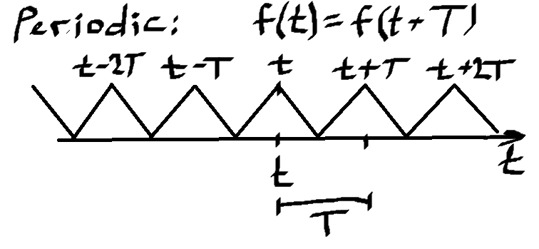

### Vector space

The one-dimensional continuous signals form a vector space:

$$\forall t \in \mathbb{R}: (f + g)(t) = f(t) + g(t), \space (\alpha f)(t) = \alpha f(t), \alpha \in \mathbb{R}$$

If $\alpha > 1$ it highlights the image, if $\alpha < 1$ it darkens images, for sounds $=>$ increases, decreases.

  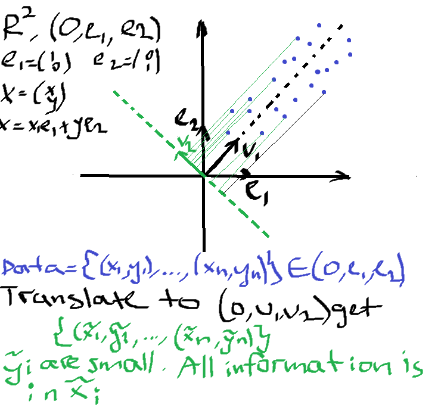

### Translation

The translation by $h \in \mathbb{R}^*$ of one-dimensional continious signal is defined

$$\forall t \in \mathbb{R}, \space (\tau_h f)(t) = f(t - h)$$
$$g = \tau_hf, \space g(t) = f(t - h)$$

In practise, all of the signals are of finite length, but for mathematical analyses we need all possible stable signals.

A well chosen representation of a signal is crusial for analysis, treatment, ...

  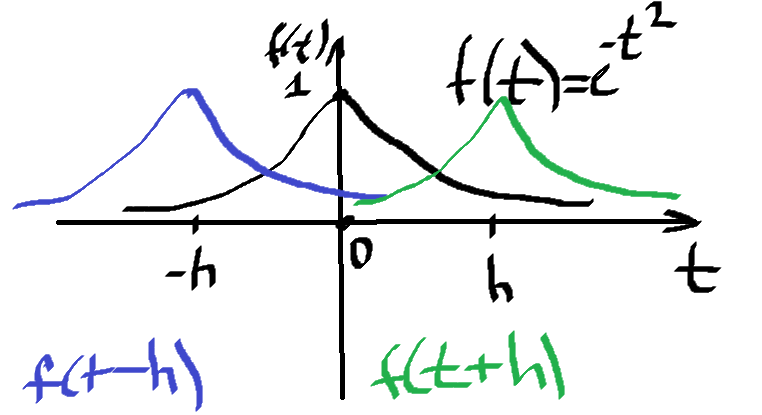

If we have positive translation $=>$ move signal in the future. If we have negative translation $=>$ move signal in the past.

## Complex Numbers

$z \in C => z = a + ib, a,b \in \mathbb{R}, i^2=-1$\
$a$ - real part; $ib$ - imaginary, non-real part.

Complex numbers have 2 coordinates (represent 2 quantities with 1 number).

  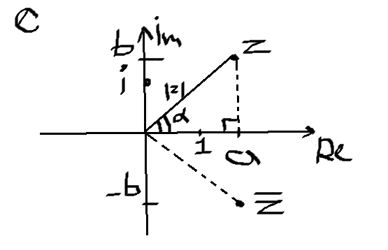

$z = |z|e^{i \alpha}$\
$z = a + ib$\
$|z| = \sqrt{a^2 + b^2}$\
$\alpha = \tan{\frac{b}{a}}$\
$\tan{\alpha} = \frac{b}{a}$\
$\overline{z} = a - ib$ - conjugate\
$\overline{z} = |z|e^{-i\alpha}$ - conjugate

  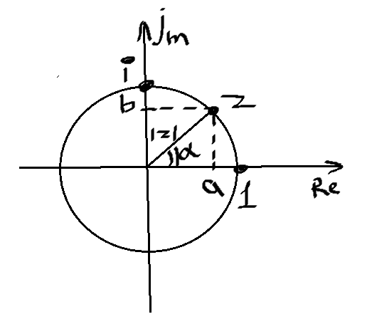

$|z_0| = 1$\
$a = \cos{\alpha}$\
$b = \sin{\alpha}$\
$z_0 = a + ib = \cos{\alpha} + i \sin{\alpha}$\
$z = |z|z_0 = |z|(\cos{\alpha} + i \sin{\alpha}) = |z|e^{i \alpha}$\
$e^{i\alpha} = \cos{\alpha} + i\sin{\alpha}$\
$e^{-i\alpha} = \cos{-\alpha} + i\sin{-\alpha} = \cos{\alpha} - i\sin{\alpha}$\
$\cos{\alpha} = \frac{1}{2}(e^{i\alpha} + e^{-i\alpha})$ - **Euler**\
$\sin{\alpha} = \frac{1}{2i}(e^{i\alpha} - e^{-i\alpha})$ - **Euler**

### Operations with Complex Numbers

$z_1, z_2 \in C$\
$z_1 + z_2 = (a_1 + ib_1) + (a_2 + ib_2) = (a_1 + a_2) + i(b_1 + b_2)$\
$z_1 + z_2 = |z_1|e^{i\alpha_1} + |z_2|e^{i\alpha_2}$\
$z_1z_2 = (a_1 + ib_1)(a_2 + ib_2) = (a_1a_2 - b_1b_2) + i(a_1b_2 + b_1a_2)$\
$z_1z_2 = z_1|e^{i\alpha_1}|z_2|e^{i\alpha_2} = |z_1||z_2|e^{i(\alpha_1 + \alpha_2)}$ - if $|z_1$ or $|z_2$ equal to $1$, then multiplication is just a rotation by $\alpha_1$ or $\alpha_2$

## Fourier

The Fourier Transform of $f$:

$$\forall v \in \mathbb{R}, \hat{f}(v) = \int_{\mathbb{R}}f(t)e^{-ivt}dt$$

Here, $v$ represents frequency component at a particular point in time $t$ in the signal $f(t)$.

So, you go from time representation(space) to frequency representation(space).

Notation: $\hat{f}(v)= F(f)(v) = F(f)$\
Dimension: Often $t$ is measured in seconds and the frequency $\epsilon = \frac{v}{2\pi}$ in $Hz=1/s$. The angular frequence $v$ is in radians.

  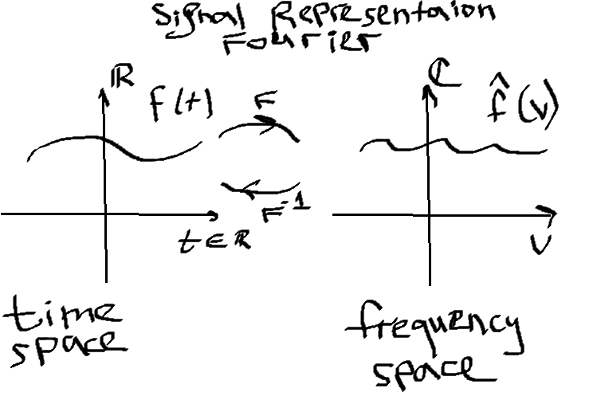

$\hat{f}(v)$ is some new object. We can use $\hat{f}(v)$ to represent $f(t)$. Both $f(t)$ and $\hat{f}(v)$ form vector spaces.

$$\hat{f}(v) = \int_{\mathbb{R}}f(t)e^{-ivt}dt = \int_\mathbb{R} f(t)cos(vt)dt - i\int_\mathbb{R} f(t)sin(vt)dt$$

If $f(t) \in \mathbb{R}$, then $\hat{f}(v) \in C, \int_\mathbb{R} f(t)cos(vt)dt \in \mathbb{R}, \int_\mathbb{R} f(t)sin(vt)dt \in \mathbb{R}$

**To compute Fourier of a signal, the signal must have $L^1$. This means signal has to have certain properties in order to have Fourier Transform**.

### Inverse Fourier Transform

$$\forall t \in \mathbb{R}, f(t) = \frac{1}{2\pi}\int_{\mathbb{R}}\hat{f}(v)e^{+ivt}dv$$

$\frac{1}{2\pi}$ is a normalization factor which is a common convention in Fourier analysis and is used to ensure that the amplitudes and units are correctly represented in both the time and frequency domains.

$\hat{f}(v)$ - coordinate, $e^{+ivt}$ - basis

$\forall t \in \mathbb{R}, f(t) = \frac{1}{2\pi}\int_{\mathbb{R}}\hat{f}(v)e^{+ivt}dv = \int_\mathbb{R} \hat{f}(v)cos(vt)dv + \frac{i}{2\pi}\int_\mathbb{R} \hat{f}(v)sin(vt)dv$

*Remark*: we assume that all the integrals are convergent.

### Fourier Interpritation

For $f(t)$ a real function (signal), in general $\hat{f}(v)$ will not be real.

As $e^{-ivt} = cos(vt) - isin(vt)$,\
$\mathbb{R}e(\hat{f}(v)) = \int_\mathbb{R} f(t)cos(vt)dt$\
$\Im(\hat{f}(v)) = - \int_\mathbb{R} f(t)sin(vt)dt$\
$\hat{f}(v) = \mathbb{R}e(\hat{f}(v)) + i \Im(\hat{f}(v))$

If $f$ is a real even function, $\Im\hat{f}(v) = 0, \hat{f}$ is real. 

If $f$ is a real odd function, $\mathbb{R}e\hat{f}(v) = 0, \hat{f}$ is purely imaginary.

---

#### REMARK: Even / Odd Functions

An even function is one that satisfies the property $(f(-t) = f(t)), \forall t$. In other words, it is symmetric about the $y$-axis. When you calculate the Fourier transform of an even function $f(t)$, you can see that the imaginary part of $\hat{f}(v)(\Im(\hat{f}(v)))$ is zero because of the symmetry property:

$$\Im(\hat{f}(v)) = -\int_{-\infty}^{\infty} f(t)\sin(vt)dt$$

Thus, $f(t)$ is even, $\sin(vt)$ is odd function, and the **integral of an odd function times even function is zero** (even function does not change sign, odd does, so we get sum 0). Therefore, $\Im(\hat{f}(v)) = 0$, which means $\hat{f}(v)$ is purely real.

---

The statement "the integral of an odd function over a symmetric interval is zero" is a property that arises from the definition of odd functions and the symmetry of the interval of integration.

An odd function is a mathematical function $f(x)$ that satisfies the property:

$$f(-x) = -f(x)$$

In other words, if you replace $x$ with $-x$ in the function, the sign of the function's value changes. Odd functions exhibit symmetry about the origin (the point $x = 0$). Geometrically, this means that if you reflect the graph of the function across the y-axis (change $x$ to $-x$), you get the same graph with a sign change.

**Symmetric Interval:** When we talk about integrating an odd function over a "symmetric interval," we mean that the interval of integration has the property:

$$a = -b$$

In other words, the endpoints of the interval are symmetric with respect to the origin. This could be an interval like $[-a, a]$, where $a > 0$.

Now, let's see why the integral of an odd function over such a symmetric interval is zero:

$$ \int_{-a}^{a} f(x) \, dx $$

Because $f(x)$ is an odd function, we can use the property $f(-x) = -f(x)$ to rewrite the integral:

$$ \int_{-a}^{a} f(x) \, dx = -\int_{-a}^{0} f(x) \, dx + \int_{0}^{a} f(x) \, dx $$

Now, observe that the interval from $-a$ to $0$ is symmetric to the interval from $0$ to $a$. In other words, these two integrals have the same magnitude but opposite signs:

$$ \int_{-a}^{0} f(x) \, dx = -\int_{0}^{a} f(x) \, dx $$

So, when we add them together, the opposite signs cancel each other out:

$$ \int_{-a}^{a} f(x) \, dx = -\int_{0}^{a} f(x) \, dx + \int_{0}^{a} f(x) \, dx = 0 $$

---

An odd function is one that satisfies the property $f(-t) = -f(t)$ for all $t$. It is symmetric about the origin. When you calculate the Fourier transform of an odd function $f(t)$, you can see that the real part of $\hat{f}(v)$ ($\mathbb{R}e(\hat{f}(v))$) is zero because of the symmetry property:

$$\mathbb{R}e(\hat{f}(v)) = \int_{-\infty}^{\infty} f(t)\cos(vt)dt$$

Since $f(t)$ is odd, $\cos(vt)$ is even function, and the **integral of an odd function multiplied by an even function over a symmetric interval is zero** (same as even function times odd function above with $sin$). Therefore, $\mathbb{R}e(\hat{f}(v)) = 0$, which means $\hat{f}(v)$ is purely imaginary.

---

### Polar Coordinates

Polar coordinates are a system for representing points in a two-dimensional space using a different set of coordinates than the familiar Cartesian coordinates $(x, y)$. In the polar coordinate system, a point is defined by its distance from a fixed point (the origin) and the angle it makes with respect to a fixed axis (usually the positive x-axis). These two values are typically denoted as $(r, \theta)$, where:

- $r$ (radius): This is the distance from the origin to the point. It is a non-negative real number.

- $\theta$ (theta): This is the angle measured in radians, typically counterclockwise from the positive x-axis to the line connecting the origin and the point.

Here's a visual representation of how polar coordinates work:

- The point (r, θ) is located by measuring an angle θ counterclockwise from the positive x-axis and then moving a distance r away from the origin along that direction.

- If r is positive, it denotes a point in the first or any subsequent quadrant.

- If r is negative, it denotes a point in the second or fourth quadrant (the angle θ is still measured counterclockwise).

- If θ is negative or measured clockwise from the positive x-axis, it denotes a point in a different direction from the positive x-axis.

We can represent Fourier transform of a signal in polar coordinates:

$$\hat{f}(v) = A_f(v)e^{i \Phi_f(v)}$$

$$\hat{f}(v) = A_f(v)cos(\Phi_f(v)) + iA_f(v)sin(\Phi_f(v))$$

If $A_f(v) = 0 => \hat{f}(v) = 0$

#### Switching to Polar Coordinates

Example:\
$f(t) = e^{-\pi t^2}$\
$L^1 = \int_\mathbb{R}e^{-\pi x^2}dx = \int_\mathbb{R}e^{-\pi y^2}dy$\
$(L^1)^2 = \int_\mathbb{R}e^{-\pi (x^2+y^2)}dxdy$\
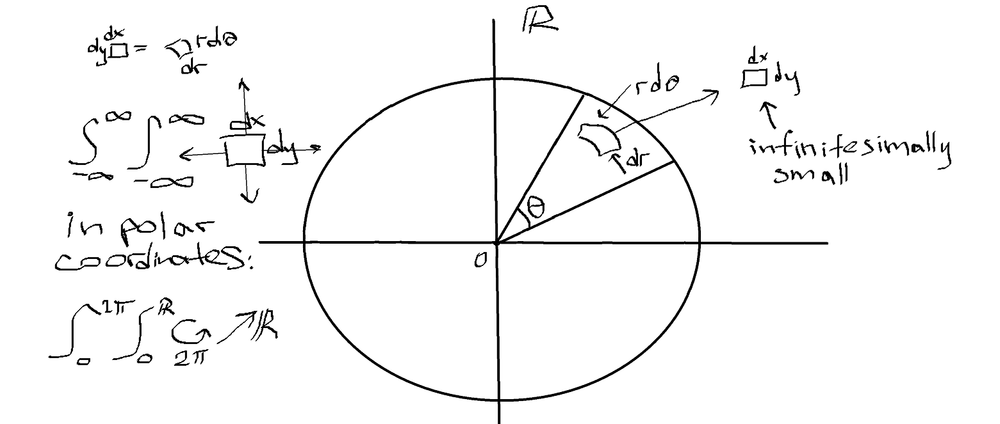
$x^2 + y^2 = r^2$\
In polar coordinates, $\int^\infty_{-\infty}\int^\infty_{-\infty}dxdy$ is the same as going from $0$ to $\mathbb{R}$ radially and from $0$ to $2\pi$ angularly.\
$dxdy = rd\theta dr$\
Thus, we get: $(L^1)^2 = \int^{2\pi}_0\int^\mathbb{R}_0e^{-\pi r^2}rdrd\theta$\
$e^{-pir^2}rdr: u = r^2, \frac{du}{dr} = 2r, du = 2rdr$\
$=> \frac{1}{2}\int^\infty_0e^{-\pi u}du = -\frac{1}{2\pi}e^{-\pi u}|^\infty_0 = \frac{1}{2\pi}$\
We get: $(L^1)^2 = \frac{1}{2\pi}\int^{2\pi}_0d\theta = \frac{1}{2\pi}\theta|^{2\pi}_0 = 1$

### Amplitude | Magnitude | $A_f(v)$

The amplitude of a sinusoidal component in the Fourier transform represents the strength or magnitude of that particular frequency component in the original signal. In simpler terms, it tells you how "big" or "loud" that component is.

  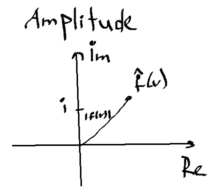

$$A_f(v) = |\hat{f}(v)| \ge 0$$

$A_f(v): \mathbb{R} \to \mathbb{R}_+$\
$A_f(v): v \to |\hat{f}(v)|$

Increase amplitude of a signal by 2:

  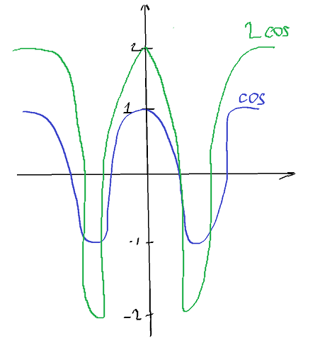

In the Fourier transform, the magnitude of the frequency-domain representation at a particular frequency indicates the amplitude of that frequency component in the original signal.

$$supp(A_f(v)) = \{v|A_f(v)\ne0\}$$

Example:

Amplitude refers to the "height" or "size" of a wave or oscillation in a signal. It's a measure of how strong or intense a particular wave component is within the signal:

Imagine you have a guitar string, and you pluck it to produce a sound. The resulting sound wave can be represented as a sum of various pure tones or sinusoidal waves at different frequencies. Each of these pure tones has its own amplitude.

For example, let's say you pluck the guitar string and produce a sound that includes a strong note at a frequency of 440 Hz (which corresponds to the A4 musical note) and a weaker note at 660 Hz (a higher-pitched A5 note).

- The amplitude of the 440 Hz component represents how loud or intense the A4 note sounds in the overall sound wave. If the amplitude is large, the A4 note will be more pronounced and produce a louder sound. If the amplitude is small, the A4 note will be quieter.

- Similarly, the amplitude of the 660 Hz component represents how loud or intense the A5 note sounds in the overall sound wave. A larger amplitude for this component means the A5 note is more pronounced, and a smaller amplitude means it's quieter.

So, in this example, the amplitude of each frequency component tells you how "loud" or "soft" each musical note is in the sound you hear. Larger amplitudes correspond to louder notes, while smaller amplitudes correspond to quieter notes.

### Phase | Angle | $\Phi_f(v)$

Phase in the Fourier transform refers to the time offset or timing of a sinusoidal component with respect to a reference point. It tells you where in its cycle a sinusoidal component is at a given point in time.

$$\Phi_f(v) = \alpha_v$$

$\Phi(v): \mathbb{R} \to (-\pi, \pi] (mod.2\pi)$\
$\Phi(v): v \to \alpha$

  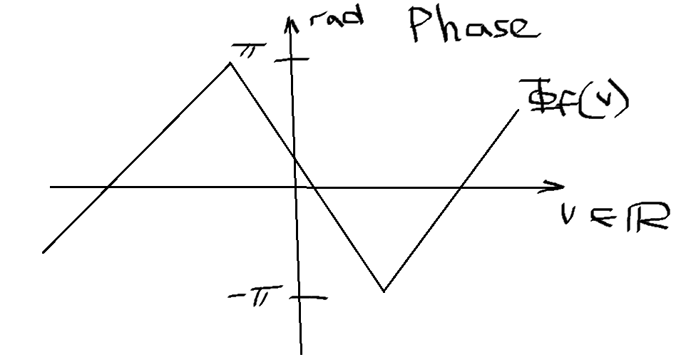

Increase frequency of a signal:

  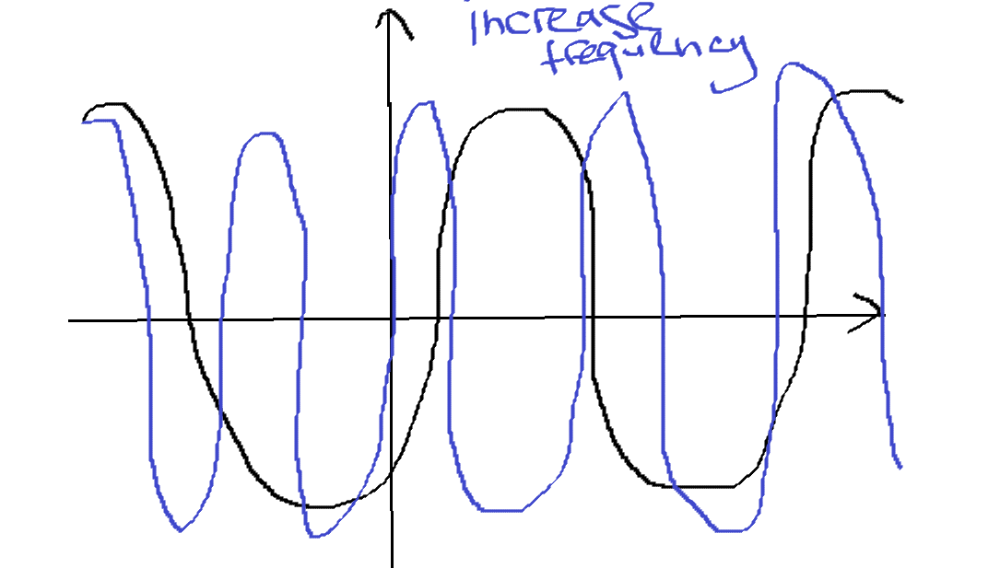

Example:

Phase refers to the timing or position of a wave within a cycle. It tells you where a particular wave or oscillation is in its cycle at a given point in time. Let's simplify this concept with an example:

Imagine you have a clock with a second hand. The second hand moves around the clock in a circular motion, completing one full rotation every 60 seconds. Now, let's consider two scenarios:

- Phase at 0 Degrees: When the second hand is pointing directly at the 12 o'clock position, we say it is at a phase of 0 degrees. This means it is at the very beginning of its cycle, just like starting a race from the starting line.

- Phase at 180 Degrees: When the second hand is pointing directly at the 6 o'clock position, we say it is at a phase of 180 degrees. This means it is halfway through its cycle, as it has traveled half of the circle's circumference.

Now, relate this concept of phase to a wave:

- If you have a wave (e.g., a sinusoidal wave) that starts at its maximum value, it is said to have a phase of 0 degrees. This corresponds to the wave being at the beginning of its cycle.

- If the wave starts at zero and is increasing, it has a phase of 90 degrees (or π/2 radians). This corresponds to the wave being one-quarter of the way through its cycle.

- If the wave starts at its minimum value and is increasing, it has a phase of 180 degrees (or π radians). This corresponds to the wave being halfway through its cycle.

- The phase can continue to increase beyond 180 degrees, indicating where the wave is in its cycle as it progresses.

So, phase tells you at what stage or point in its cycle a particular frequency component is within a signal.

### Bandwidth

The bandwidth of a signal or a frequency component refers to the range of frequencies it covers or the width of its frequency spectrum. It provides information about how spread out or narrow a signal's frequency content is.

- A signal with a narrow bandwidth is concentrated around a specific frequency or set of frequencies. Such signals are often referred to as "pure tones."
- A signal with a wide bandwidth contains a broad range of frequencies. This includes complex and transient signals.

**Bandwidth = length of the support of the amplitude.**

  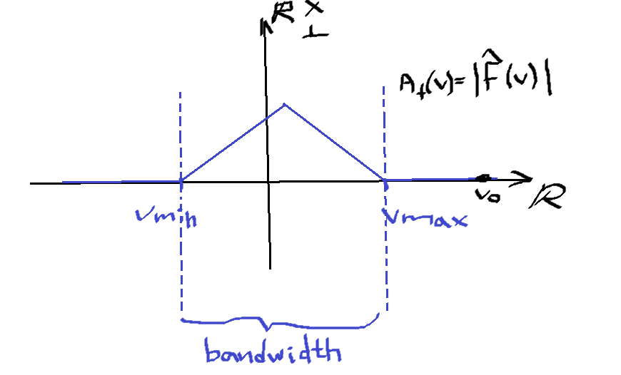

Here: Bandwidth = $v_{max} - v_{min}$, where the graph itself represents amplitude of a signal (I guess).

### Spectrum

Spectrum of a signal provides information about which frequencies are present in the signal and how strong or intense they are. Spectrum of a function is where $A_f(v) > 0$.

1. Frequency Components: The spectrum shows the various frequency components that make up the signal. Each component corresponds to a specific frequency, and the spectrum indicates the presence and characteristics (amplitude and phase) of these components.

2. Amplitude: The amplitude in the spectrum tells you the strength or magnitude of each frequency component. Larger amplitudes correspond to stronger or more pronounced frequencies in the signal, while smaller amplitudes correspond to weaker ones.

3. Phase: The phase in the spectrum provides information about the timing or alignment of each frequency component within the signal. It tells you where each frequency is in its cycle at a given point in time.

4. Frequency Range: The spectrum typically covers a range of frequencies, and it can be displayed in various ways, such as a continuous plot, a discrete set of frequency bins, or as a graphical representation like a spectrogram.

5. Energy Distribution: By examining the spectrum, you can determine which frequencies carry the most energy in the signal. This information is useful for identifying dominant frequencies, harmonic relationships, and other characteristics of the signal.

### Representing Signal using Fourier Transform

$$f(t) = \frac{1}{2\pi}\int_\mathbb{R}\hat{f}(v)e^{+ivt}dv = \frac{1}{2\pi}\int_\mathbb{R} A_f(v) e^{i\Phi_f(v)} e^{+ivt}dv = \frac{1}{2\pi}\int_\mathbb{R} A_f(v) e^{+i(\Phi_f(v) + vt)}dv = \frac{1}{2\pi}\int_\mathbb{R} A_f(v)cos(\Phi_f(v) + vt)dv+\int_{\mathbb{R}}isin(\Phi_f(v) + vt) dv$$

$f$ is a "series" of trigonometric functions, the infinite sum being over all frequencies which are in it's specturm, i.e. where $A_f(v) > 0$.

## Exercices

1.
    1. Give examples of finite continious signals, are they stable, of finite energy?
        - **Finite continious signal: i.e. compact support, which means non zero on a closed interval.**
        - $f(x) = x + 1, x \in [1,6]$. The signal is stable and finite.
        - 5 seconds human speech. The signal is stable and finite.
        - Stock on the market: The signal is stable and finite.
        - $f(x) = cos(x)$. THe signal is stable, but infinite. 
    2. Give an example of 1. stable signal which is not of finite energy, 2. signal of finite energy which is not stable (1. $* f$ such that $\int_\mathbb{R}|f(t)dt < \infty$ and $\int_\mathbb{R}|f(t)|^2dt$ not finite, 2. $g$ s.t. $\int_\mathbb{R}|g(t)|dt$ not finite and $\int_\mathbb{R}|g(t)|^2dt < \infty$)
        1. $$f(t) = \begin{align*} 1/t^{2/3}, 0 < t \le 1 \\ 0 \end{align*}$$
            For $L^1(\mathbb{R})$ we have: $\int_\mathbb{R} t^{-2/3}dt = \lim_{\epsilon \to 0}\int^1_\epsilon t^{-2/3}dt = \lim_{\epsilon \to 0}[3t^{1/3}]^1_\epsilon = \lim_{\epsilon \to 0}[3 - \epsilon^{1/3}] = 3 - 0 = 3$\
            For $L^2(\mathbb{R})$ we have: $\int_\mathbb{R} (t^{-2/3})^2dt = \lim_{\epsilon \to 0}\int^1_\epsilon t^{-4/3}dt = \lim_{\epsilon \to 0}[-3t^{-1/3}]^1_\epsilon = \lim_{\epsilon \to 0}[-3 + \frac{3}{\epsilon^{1/3}}] = +\infty$
            

                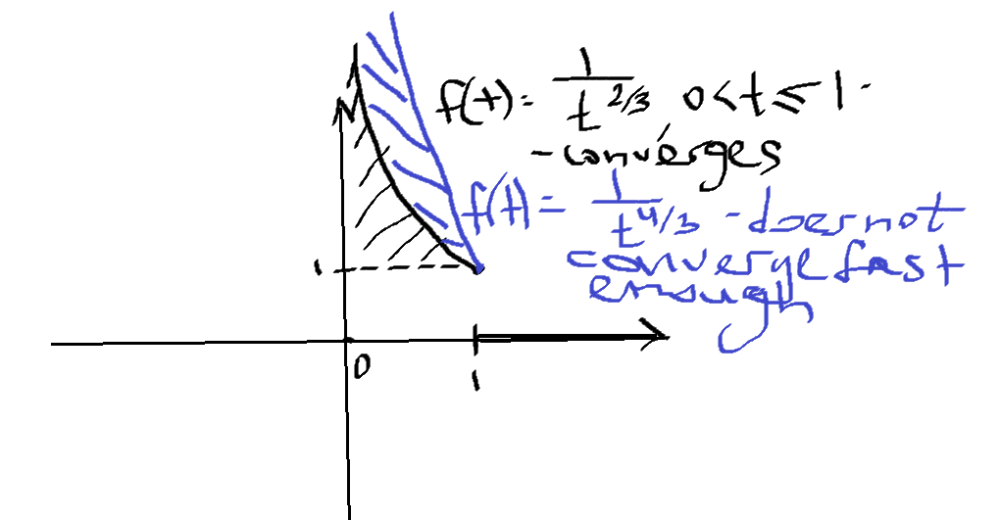
            

        2. $$g(t) = \begin{align*} 1/t, t \ge 1 \\ 0, t < 1 \end{align*}$$ 
            For $L^1(\mathbb{R})$ we have:$\int_\mathbb{R} t^{-1}dt = \int^\infty_1 t^{-1}dt = \lim_{A \to +\infty}\int^A_1 t^{-1}dt = \lim_{A \to +\infty}[ln(t)]^{t=A}_{t=1} = \lim_{A \to \infty}(ln(A) - ln(1)) = \infty$\
            For $L^2(\mathbb{R})$ we have:$\int_\mathbb{R} t^{-2}dt = \lim_{A \to \infty}\int^A_1 t^{-2}dt = \lim_{A \to \infty}[-t^{-1}]^{t=A}_{t=1} = \lim_{A \to +\infty}(1 - A^{-1}) = 1$
            

                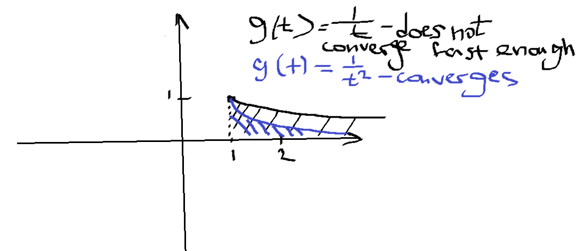
            

        *Remark*: $\sum\frac{1}{t^\alpha}$ converges if $\alpha>1$; $\int^{+\infty}_1\frac{1}{t^\alpha}$ converges iff $\alpha>1$; $\int^1_0\frac{1}{t^\alpha}$ converges iff $\alpha<1$

    3. Give examples of periodic continious signals. Verify that they are not finite, not stable and not of finite energy.\
        $f(t) = cos(t)$\
        $f(t) = f(t + T)$\
        $\int_\mathbb{R}|f(t)|dt = \lim_{A \to +\infty}\int^A_{-A}|f(t)|dt = \lim_{h \to +\infty}\int^{hT}_{-hT}|f(t)|dt=2h\int^T_0|f(t)dt$\
        $\int^T_0|f(t)dt$ converges, but $2h$ is infinite.
        

             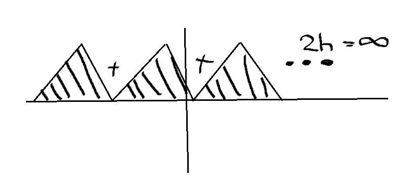
        

### Fourier Transform Properties

1. Fourier tranform of translated signal is the Fourier tranform of original signal times $e^{-ivh}$:

$$F(T_hf) = F(f)e^{-ivh} = |F(f)|e^{i(\Phi_{F(f)} - vh)}$$

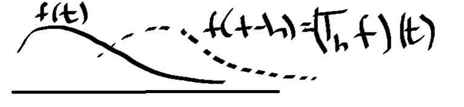

2. Translated Fourier transform is the same as fourier transform of a signal translated by $e^{+ith}$:

$$(T_hF(f))(v) = F(f)(v - h) = F(f(t)e^{+ith}) = F(f(t)e^{+ith})(v)$$

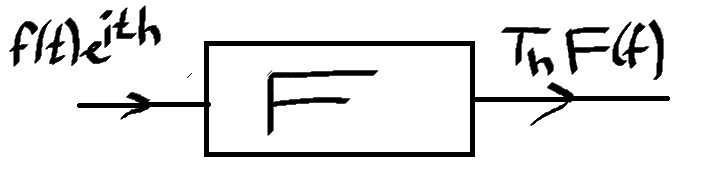

1. Fourier tranform of derivative is Fourier tranform of the original signal times $iv$:

$$F(f') = ivF(f)$$

4. Derivative of Fourier tranform is Fourier tranform of original signal times $-it$:

$$(F(f))' = \frac{d}{dv}F(f) = F(-itf)$$

## Convolution

$$y(t) = (f * g)(t) = \int_\mathbb{R}f(s)g(t - s)ds$$

### Properties:

1. $f * g = g * f$
2. $T_h(f  *g) = (T_hf) * g = f * (T_hg)$
3. $(f * g)' = f' * g = f * g'$
4. $F(f * g) = F(f)F(g)$ and $F(fg) = \frac{1}{2\pi}(F(f) * F(g))$

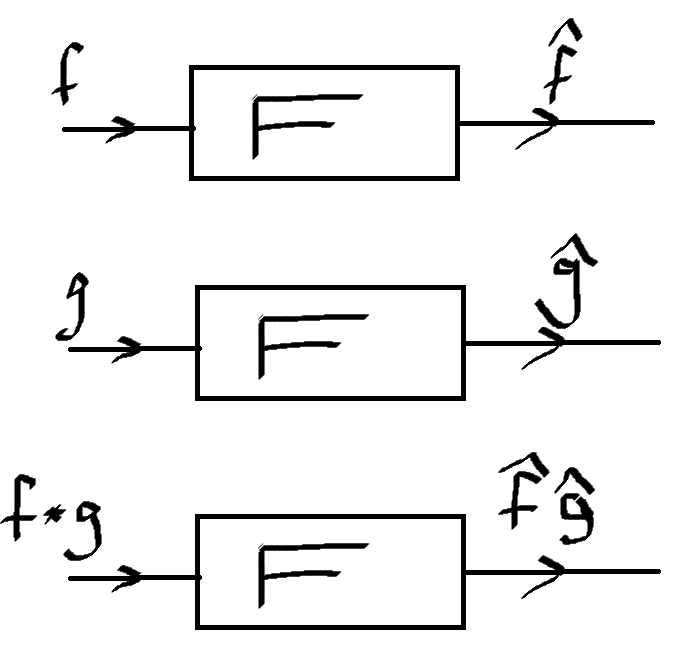

## Filter

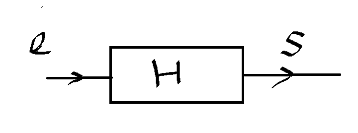

We have some signal $e$, filter $H$ and output signal $s$. 
1. If $H$ is linear: $H[\alpha e_1 +\beta e_2] = \alpha H[e_1] + \beta H[e_2] = \alpha s_1 + \beta s_2, \forall \alpha, \beta \in \mathbb{R}$
2. If $H$ is time invariant: $H[T_{\alpha}e] = T_{\alpha}H[e]$

If $H$ is linear and time invariant (stationary), then $\exists h$ s.t. $s = H[e] = h * e$. This $h$ is called **impulse response**, characterization of $H$.

We also know that $F(s) = F(h)F(e)$ (Fourier transform of the output is Fourier transform of the input). Here, $F(h)$ is called **frequency response** of the filter $H$.

### Filter Properties

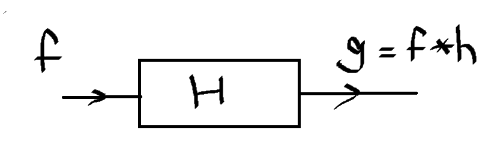

We have:

$$F(f) = |F(f)|e^{i\Phi_f} = A_fe^{i\Phi_f}$$
$$F(h) = |F(h)|e^{i\Phi_h} = A_he^{i\Phi_h}$$

Since $g = f * h, F(g) = F(f)F(h)$ we have:

$$A_g = A_fA_h$$
$$\Phi_g = \Phi_f + \Phi_h$$

This allows to filter selected frequences of $f$: by forcing $A_h=0$ for selected frequences, we filter out(cancel) those frequences of the original signal. By amplifying $A_h$ for selected frequences, the contribution of these frequences gets stronger in the output signal.

*Note*: low frequency content of $f$:

$$F(f)(0) = \int_\mathbb{R}f(t)dt$$

### Filters in Series / Parallel

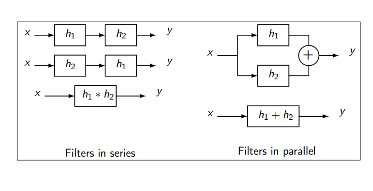

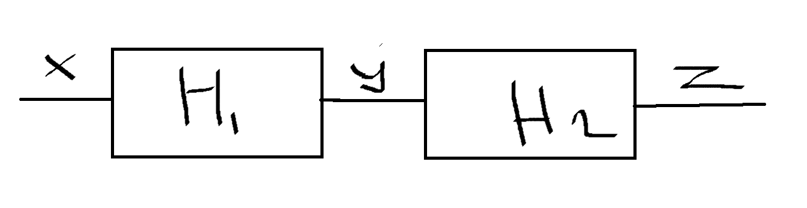

$y = x * h_1$\
$z = y * h_2$\
$z = (x * h_1) * h_2 = (x * h_2) * h_1 = x * (h_1 * h_2)$

## Plancherel Formula

$$\int_\mathbb{R}f(t)\overline{g(t)}dt = \frac{1}{2\pi}\int_\mathbb{R}F(f)\overline{F(g)}dv$$

*Note: $\overline{z} = a - ib, \overline{z} = |z|e^{-i\alpha}$ - conjugate*

$$\int_\mathbb{R}|f(t)|^2dt = \frac{1}{2\pi}\int_\mathbb{R}|F(f)|^2dv$$

Thus, $E_{F(f)} = 2\pi E_f$, energy is up to a constant the same in $f$ and $F(f)$.

## Denoising a Signal

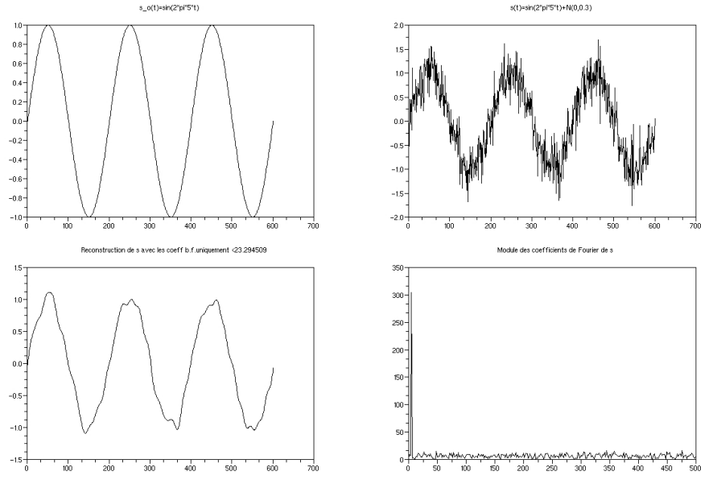

We have signal:

$$s_0(t) = sin(2\pi \cdot 5t)$$

We add Gaussian noise (normally distributed):

$$s(t) = s_0(t) + N(0, 0.3)$$

Here, in $N(0, 0.3)$:
1. $N$ - normal distribution
2. $0$ - mean $0$
3. $0.3$ - standart deviation $0.3$

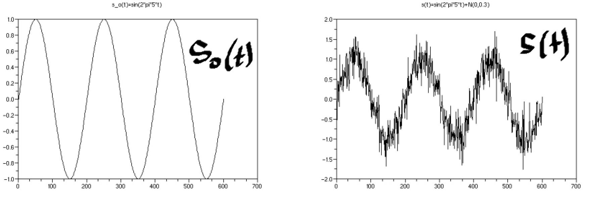

$s_o(t)$ has low frequency = variations in the signal are low (variations are large near local extremas):

$s_t$ has high frequency = large variations in the signal.

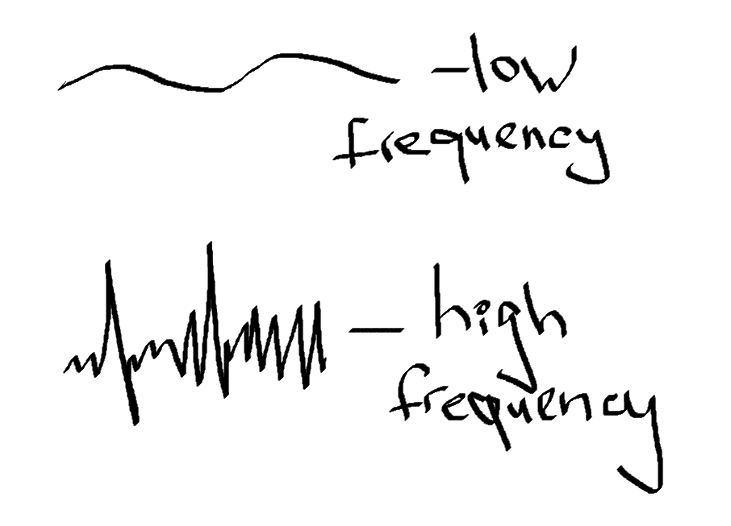

After doing Fourier transform of $s(t)$ we get the following graph:

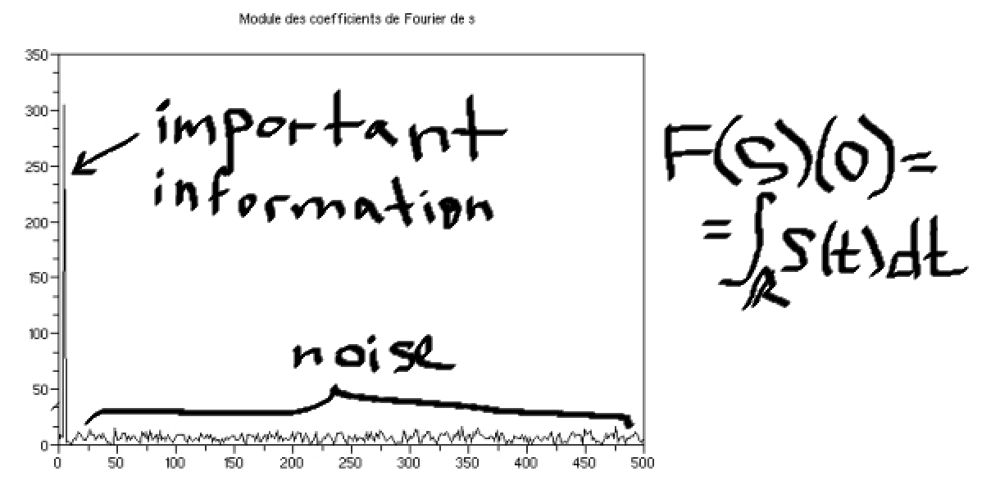

$$F(s)(0) = \int_\mathbb{R}s(t)dt$$

When we inverse Fourier transform we get:

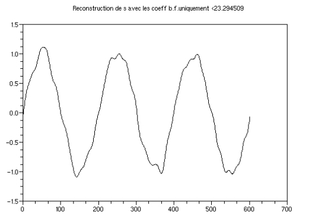

We destroyed some frequences while denoising using Fourier transform and inverse of Fourier transform, but got a signal close to the original one without nose $s_0(t)$.

**Summary**: We try to represent the signal using $sin$ and $cos$ functions by varying $v$. When we add noise, we add little variations $s_0 - sin$. In our initial signal, we have low frequency. Thus, we remove high frequencies (large variations). Which is why when we get $F(s)(0)$ and do inverse, we remove some local extremas from original signal, where variations are large.

## Exercices:

1. 1. $y = h * x, x, y, h$ - signals. Give a "graphic" interpritation of the convolution. Use translation and reflection.\
    $y(t) = \int_\mathbb{R}h(s)x(t - s)ds = \int_\mathbb{R}x(s)h(t - s)ds$\
    $s \to x(s)h(t-s)$\
    Set $h_r(s) = h(-s)$ - reflection of $h(s)$\
    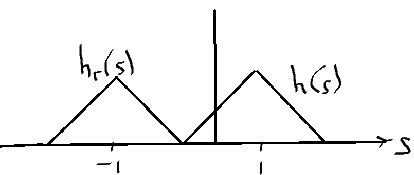
    Then: $h(t-s) = h_r(s - t) = (T_th_r)(s)$\
    Then: $y(t) = \int_\mathbb{R}x(s)(T_th_r)(s)ds$\
    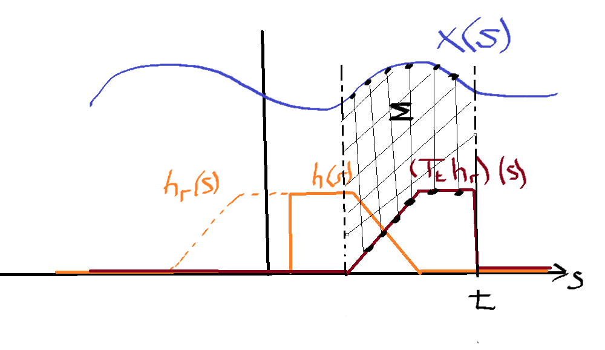\
    $y(t)$ is the sum of $x(s) \cdot (T_th_r)(s)$ for all $t$.\
    If $h$ is even function, then reflection $h_r(s) = h(s)$\
    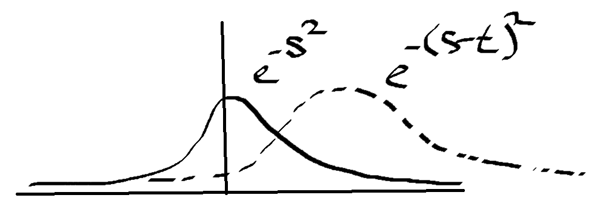\
    Since we get the sum for all $t$, the final signal $y(t)$ is like we are getting a weighted mean of $x(s)$ with weights determined by $(T_th_r)(s)$:\
    Weighted mean: $\frac{\int_\mathbb{R}x(s)(T_th_r)(s)ds}{\int_{t-\alpha}^{t + \alpha}(T_th_r)(s)ds}$\
    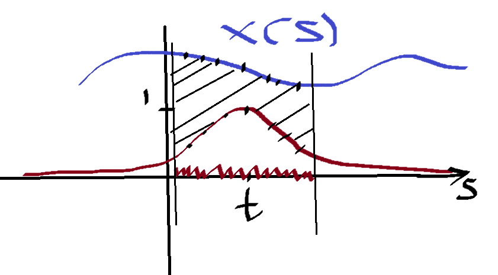\
    Which is why $y(t)$ is a smooth signal.
     2. Discuss symmetries in $F(x)$ if $x$ is a real signal.\
       $x: \mathbb{R} \to \mathbb{R}$\
       $t \to x(t)$\
       $F(x)(v) = \int_\mathbb{R}x(t)e^{-ivt}dt$\
       $F(x)(0) = \int_\mathbb{R}x(t)dt$\
       If $x(t)$ is real $=> \overline{x(t)} = x(t) (z = a + ib, \overline{z} = a - ib)$\
       $\overline{F(x)(v)} = \overline{\int_\mathbb{R}x(t)e^{-ivt}dt} = \int_\mathbb{R}x(t)e^{+ivt}dt = F(x)(-v)$\
       **For real $x(t)$ the amptitude $A_x(v)$ is even**:\
       $A_x(v) = A_x(-v): |F(x)(v)| = \overline{|F(x)(v)|} = |F(x)(-v)|$\
       Phase of $F(x)(v)$:\
       $F(x)(v) = A_x(v)e^{i \Phi_x(v)}$\
       $\overline{F(x)(v)} = \overline{A_x(v)e^{i \Phi_x(v)}} = A_x(v)e^{-i \Phi_x(v)} = F(x)(-v) = A_x(v)e^{i \Phi_x(-v)}$\
       Thus **phase is odd**: $\Phi_x(v) = -\Phi_x(-v), \Phi_x(-v) = - \Phi_x(v)$\
       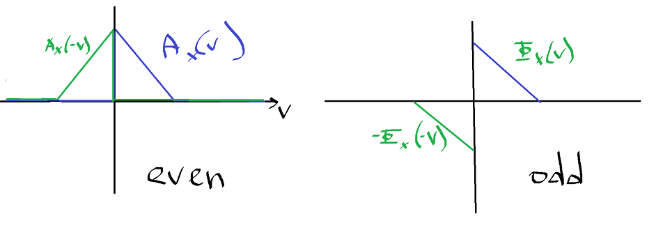
2. For the following signals, compute the support, verify if they are stable, of finite energy, and compute the Fourier transform, if defined. Draw a sketch of a signal.
   1. Signal $f(t)$ with $a > 0$:
      $$f(t) = \begin{align*}
        1, |t|\le a \\ 0
      \end{align*}$$
      $supp(f(t)) = [-a, a]$\
      $L^1 = 2a$\
      $L^2 = 2a$\
      $F(f)(v) = \frac{2}{v}sin(va) = \frac{1}{vi}(e^{iva} - e^{-iva})$ for $v \ne 0$. For $v \approx 0: sin(va) \approx va; \frac{2}{v}sin(va) \approx 2a$
   2. Signal $f(t)$ with $a > 0$:
      $$f(t) = \begin{align*}
        -1, -a\le t < 0 \\ 1, 0 \le t < a \\0
      \end{align*}$$
      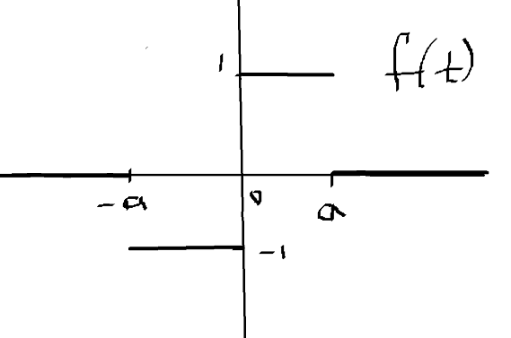\
      $supp(f(t)) = [-a, a]$
      $f(t)$ is odd $=> F(f)(v)$ is purely imaginary.
   3. Signal $f(t) = cos(at)$\
      $supp(f(t)) = \mathbb{R}$\
      $L^1$ and $L^2$ are not defined ($\infty$).
   4. See in hw_1. 
   5.  $f(t) = e^{-\pi t^2}$\
      $supp(f(t)) = \mathbb{R}$\
      $L^1$:\
      $L^1 = \int_\mathbb{R}e^{-\pi x^2}dx = \int_\mathbb{R}e^{-\pi y^2}dy$\
      $(L^1)^2 = \int_\mathbb{R}e^{-\pi (x^2+y^2)}dxdy$\
      Switch to **polar coordinates**:
      $(L^1)^2 = \int^{2\pi}_0\int^\mathbb{R}_0e^{-\pi r^2}rdrd\theta$\
      $e^{-pir^2}rdr: u = r^2, \frac{du}{dr} = 2r, du = 2rdr$\
      $=> \frac{1}{2}\int^\infty_0e^{-\pi u}du = -\frac{1}{2\pi}e^{-\pi u}|^\infty_0 = \frac{1}{2\pi}$\
      We get: $(L^1)^2 = \frac{1}{2\pi}\int^{2\pi}_0d\theta = \frac{1}{2\pi}\theta|^{2\pi}_0 = 1$\
      $L^1 = 1$\
      $L^2 = \frac{1}{2}$\
      $F(f)(v)$:\
      $F(f)(v) = \int_\mathbb{R}e^{-\pi t^2}e^{-ivt}dt = \int_\mathbb{R}e^{-(\pi t^2 + ivt)}dt = \int_\mathbb{R}e^{-(\sqrt{\pi} t + \frac{iv}{2\sqrt{\pi}})^2 - \frac{v^2}{4\pi}}dt = e^{-\frac{v^2}{4\pi}}\int_\mathbb{R}e^{-(\frac{2\pi t + iv}{2\sqrt{\pi}})^2}dt$\
      $u = \frac{2\pi t + iv}{2\sqrt{\pi}}, \frac{du}{dt} = \sqrt{\pi}, dt = \frac{du}{\sqrt{\pi}}$\
      $e^{-\frac{v^2}{4\pi}}\int_\mathbb{R}e^{-u^2}\frac{du}{\sqrt{\pi}} = \frac{e^{-\frac{v^2}{4\pi}}}{\sqrt{\pi}}\int_\mathbb{R}e^{-u^2}du$\
      By using polar coordinates, we get: $\int_\mathbb{R}e^{-u^2}du = \sqrt{\pi}$\
      Thus: $F(f)(v) = e^{-\frac{v^2}{4\pi}}$

# Discrete Signal Processing

A one-dimensional discrete signal is a sequence of real (or complex) numbers $f[n], n \in \mathbb{Z}$, also written $(f[n])_{n \in \mathbb{Z}}$

## Support

The support of a discrete signal $f$ defined on $\mathbb{Z}$ is the smallest connected set where the signal has non zero values. If the support is compact, the signal is of finite length or finite.

  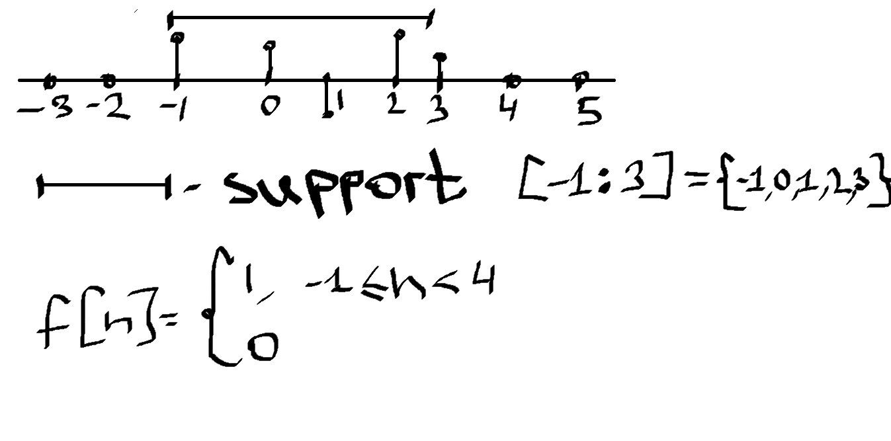

## Stable

A discrete signal is stable if 
$$f \in \mathcal{l}^1(\mathbb{Z}) \iff E_f=\sum_{n \in \mathbb{Z}}|f[n]| < \infty$$

## Finite Energy

A discrete signal is of finite energy if 
$$f \in \mathcal{l}^2(\mathbb{Z}) \iff \sum_{n \in \mathbb{Z}}|f[n]|^2 < \infty$$

## Examples

$$f[n] = \begin{cases}
  1 && 0 \le n \le 4 \\ 0 
\end{cases}$$

  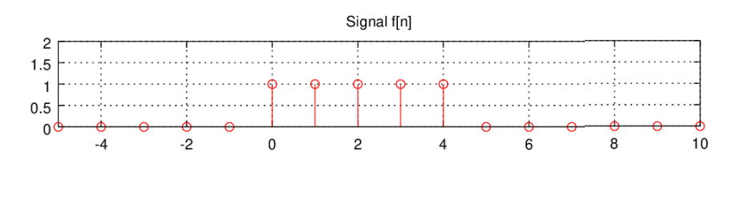

$$g[n] = \sin{(\frac{2\pi}{5}n)}$$

  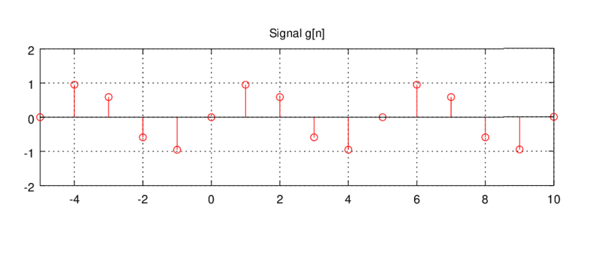

**Kronecker signal**:
$$\delta[n] = \begin{cases}
  1 && n=0 \\ 0 
\end{cases}$$

  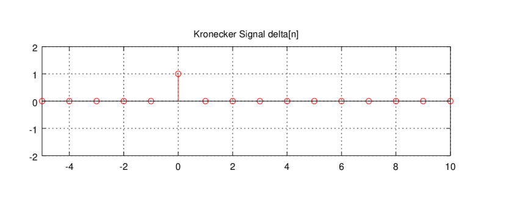

## Operations

### Periodic

A one-dimensional discrete signal is periodic of period $N \in \mathbb{N}$ if $\forall n \in \mathbb{Z}:f[n]=f [n + kN], k \in \mathbb{Z}$

  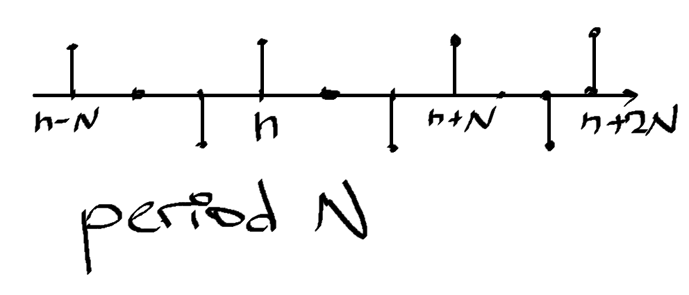

#### Examples

1. $f[n] = (-1)^n, n \in \mathbb{Z}, N = 2$
2. $g[n] = \sin{(\frac{2\pi}{5}n)},  g[n] = g[n + N], \sin{(\frac{2\pi}{5}n)} = \sin{(\frac{2\pi}{5}n + \frac{2\pi}{5}N)}, \frac{2\pi}{5}N = 2\pi \to N = 5$

### Translation

The translation by $m \in \mathbb{Z}$, of a one-dimensional discrete signal is defined $\forall n \in \mathbb{Z}$ by $\tau_mf [n]= [n − m]$

$$\tau_m\delta[n] = \delta[n − m] = \delta_m[n], n \in \mathbb{Z}$$

### Convolution

The convolution $h = f \circ g$ is defined by
$$\forall n \in \mathbb{Z}: h[n] = \sum^{+\infty}_{k=-\infty}f[n-k]g[k]$$
If $f$ or $g$ are of finite length, $h$ is well defined

In practice, all of the signals will be of finite length/duration.

Convolution is a fundamental mathematical operation in signal processing, used to combine two signals to produce a third signal. 

Here's how the convolution operation works:
1. For each point in time (continuous time) or sample (discrete time) in the resulting signal "y," you take a weighted sum of the product of the two input signals "f" and "g."
2. The weights are determined by the values of the second signal "g," which are typically flipped (reversed) in time or order before multiplication and summing. This reversal is what makes convolution different from other operations like cross-correlation.
3. The convolution operation is performed over a range of values, often extending to infinity in continuous time or to a suitable range in discrete time, depending on the problem.

The result of the convolution represents the combined effect of the two signals. In practical terms, convolution is used for various purposes, such as filtering, signal smoothing, and simulating the response of linear time-invariant systems. In image processing, for instance, it is used for tasks like blurring, edge detection, and feature extraction.

## Fourier

The Fourier transform of discrete signal $f$ is:
$$\forall v \in \mathbb{R}, \hat{f}(v) = \sum_{-\infty}^{+\infty}f[n]e^{-ivn} = A_f(v)e^{i\Phi_f(v)}$$
This is sometimes also referred to as Fourier Transform in Discrete Time (FTDT).

To a real sequence $(f[n])_{n \in \mathbb{Z}}$ is associated a **$2\pi$-periodic function** $\hat{f}: \mathbb{R} \to \mathbb{C}; v \to \hat{f}(v)$

$\hat{f}$ is $2\pi$-periodic:
$$\hat{f}(v + 2\pi k ) = \sum_{-\infty}^{+\infty}f[n]e^{-in(v + 2\pi k)} = \hat{f}(v)$$
$$e^{-in(v + 2\pi k)} = e^{-ivn} \cdot (e^{-2i\pi nk}=1) (e^{xi} = \cos(x) + i\sin(x), e^{-2\pi i} = \cos(-2\pi) + i sin(-2\pi) = 1)$$

*Remark: if $(f[n])_{n \in \mathbb{Z}}$ is **periodic**: $f_p[n] = f_p[n + mN], n \in \mathbb{Z}$ the FTDT is **not defined**. Periodic signals are **unstable**.*

The only difference between Fourier Transform in continious case and discrete case is that in discrete case Fourier Transform, Amplitude and Phase are $2\pi$-periodic.

  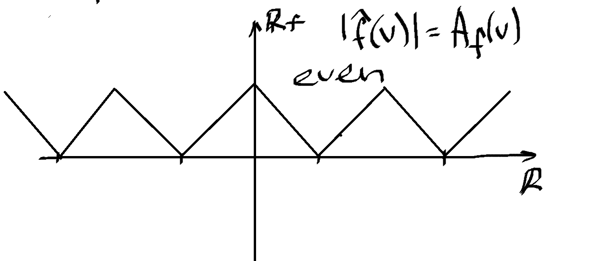

  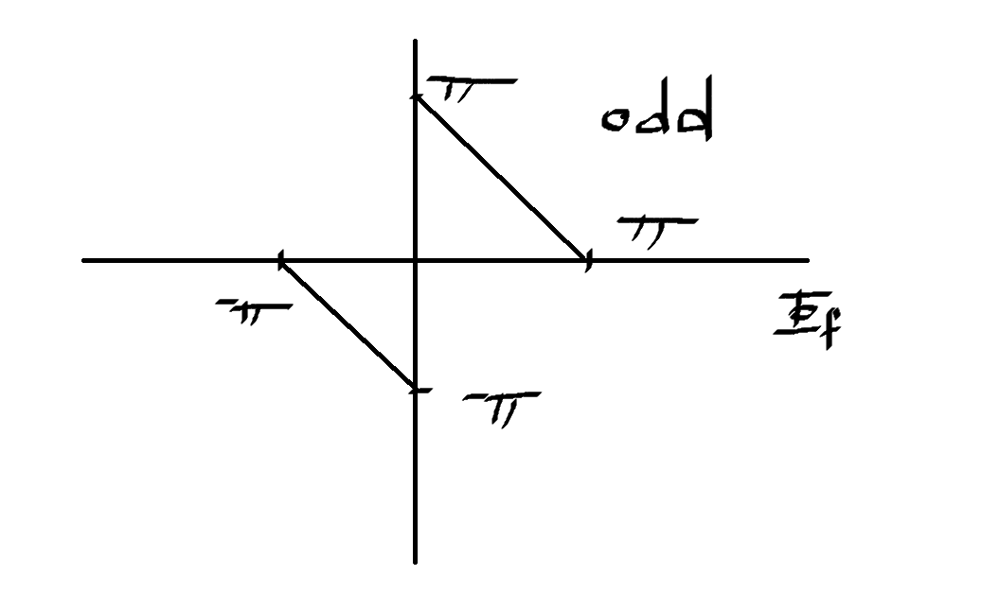

### Properties

$$\hat{f}(v) = \overline{\hat{f}(-v)}$$
$$|\hat{f}(v)| = \hat{f}(-v)$$
$$\Phi(\hat{f}(-v)) = - \Phi(\hat{f}(v))$$

The low frequency content at $\hat{f}(0)$ will repeat at $v=2\pi k, k \in \mathbb{Z}$\
The high frequences are localized at $v=\pi + 2\pi k, k \in \mathbb{Z}$

$$\widehat{f * g}(v) = \hat{f}(v)\hat{g}(v)$$
$$\widehat{fg}(v) = \frac{1}{2\pi}\hat{f}(v) * \hat{g}(v)$$

$$\widehat{\tau_mf}(v) = \hat{f}(v)e^{-imv} = A(v)e^{i[\Phi(v)-mv]}$$
$$\widehat{f[n]e^{i\alpha n}} = \hat{f}(v-\alpha) = \tau_\alpha\hat{f}(v)$$

### Inverse Fourier Transform

$$\forall n \in \mathbb{Z}, f[n] = \frac{1}{2\pi}\int_{-\pi}^{+\pi}\hat{f}(v)e^{+ivn}dv = \frac{1}{2\pi}\int_{-\pi}^{+\pi}A_f(v)e^{i(nv + \Phi_f(v))}dv$$

If $A = 0 \to$ frequency is not present.

  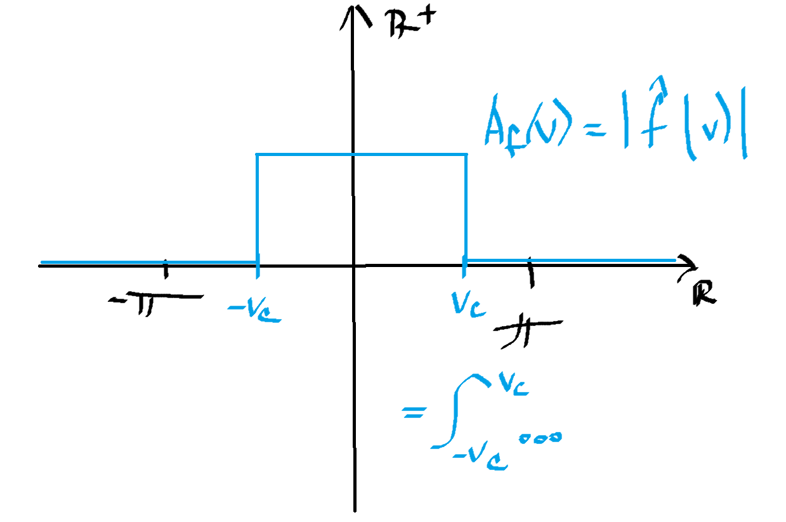

One period of $\hat{f}$, in the continuous frequency variable, allows reconstruction.

### Amplitude

$$A_f(v) = |\hat{f}(v)|$$

### Bandwidth

The bandwidth is the width of a subset of $[-\pi, \pi]$ centered at $0$.

## Periodic Discrete Signals

Restrict signals to $N$ values (one period).

### Discrete Fourier Transform of Periodic Signals (DFT)

$$\hat{f}_p[k] = \sum^{N-1}_{n=0}f_p[n]e^{-in( \frac{2\pi}{N}k)}, \quad k=0,1,...,N-1$$

$f_p[n]$ is $N$ periodic

$(\frac{2\pi}{N}k) \approxeq v$

### Inverse Discrete Fourier Transform

$$f_p[n] = \frac{1}{N}\sum^{N-1}_{k=0}\hat{f}_p[k]e^{in( \frac{2\pi}{N}k)}, \quad n=0,1,...,N-1$$

**In the time and in the frequency domain, a period characterizes $\hat{f}$ and $f$.**

### Convolution

For periodic signals the usual convolution is not defined (in general no convergence). The following definition uses the $N$-periodicity of the signals.

#### Circular Convolution

If $f_p$ and $g_p$ have period $N$, we define $h_p = f_p ∗_c g_p$ with
$$h_p[n] = (f_p *_c g_p)[n] = \sum^{N-1}_{m=0}f_p[n-m]g_p[m], \quad n=0,1,...,N-1$$

The circular convolution becomes multiplication in frequency domain.

For DFT we have:
$$\widehat{h_p}[k] = \widehat{f_p}[k]\widehat{g_p}[k], \quad k=0,1,...,N-1$$

#### Example | Exercise 10

Let $f_1[n]$ and $f_2[n]$ be discrete signals of lengths $N_1$ and $N_2$, respectively, $i = 1,2$

1. What is the length of the convolution signal $g = f_1 * f_2$?
   The question can be restated as: for which values of $n \in Z: f_1[n-k]f_2[k] \ne 0?$\
   Suppose $f_1[k] \ne 0$ for $k=n_1, n_1 + 1,..., N_1 + n_1 - 1$. In other words, $f_1$ starts at $n_1$ and ends at $N_1 + n_1 - 1$. $len(f_1) = (N_1 + n_1 - 1) - n_1  +1$\
   For $f_2$: $supp(f_2)=[n_2, N_2 + n_2 - 1]$\
   $f_2[k] \ne 0 \text{ for } k$ s.t. $n_2 \le k \le N_2 + n_2 - 1$\
   $f_1[n-k] \ne 0 \text{ for } n-k$ s.t. $n_1 \le n-k \le N_1 + n_1 - 1$\
   $=>$ get by summing up: $n_1 + n_2 \le n \le N_1 + N_2 + n_1 + n_2 - 2$\
   Thus, $g[n] = \sum_{k \in Z}f_1[n-k]f_2[k]\ne 0 \text{ for } n \in [n_1 + n_2, N_1 + N_2 + n_1 + n_2 - 1]$\
   $len(g) = (N_1 + N_2 + n_1 + n_2 - 1) - (n_1 + n_2) +1 = N_1 + N_2 - 1$\
   If $N_1=N_2=N$ then $len(g) = 2N-1$

2. For the rest of the questions, suppose $N = N_1 = N_2$. What is the complexity in real scalar operations of a (full) computation of $g = f_1 * f_2$?
   $len(g) = 2N-1$, thus we have $(2N-1)$ coefficients to compute. For each coefficient we have $N$ multiplications and $N-1$ additions. Thus, we get $N+N-1=2N-1$ operations for each of the terms of $g[n]$. $=>$ total complexity is $(2N-1)(2N-1)=(2N-1)^2$ or $O(N^2)$

3. We want to use the Fast Fourier Transform (FFT) and the inverse FFT (iFFT) to compute $g[n]$. To what length must the signals $f_1$ and $f_2$ be completed in order to recover the correct result, considering the respective lengths?
   $g=f_1*f_2$\
   $\hat{g}=\hat{f_1}\cdot \hat{f_2}$\
   $len(f_1)=N, len(f_2)=N, len(g) = 2N-1$\
   DFT of $f_1$ $N$ coefficients, DFT of $f_2$ $N$ coefficients, but DFT of $g$ $(2N-1)$ coefficients\
   Thus we need to complete $f_1$ and $f_2$ with zeros up until we get a signal of length $(2N-1):$\
   $\hat{g}[k]=\hat{f_1}[k]\cdot \hat{f_2}[k], 0\le k\le 2N-2$\
   $\hat{g}[k] = \hat{g}(\frac{2\pi}{2N-1}k)$

4. What is the complexity of the method mentioned in question 3?
   1. By FFT: $2(2N-1)\log(2N-1)$ ($f_1$ and $f_2$)
   2. Multiply $(2N-1)$ times two complex numbers
   3. Make inverse FFT of $(2N-1)$ length signal: $(2N-1)\log(2N-1)$
   4. Thus we get: $3(2N-1)\log(2N-1) + (2N-1) \approx_{N \to \infty} N\log(N)$
   5. Complexity is $O(N\log(N)) < O(N^2)$
   6. So, it is better to go to compute  $FFT \hat{g} = \hat{f_1}\hat{f_2} \to iFFT \hat{g}$ to get $g$ than $g = f_1 * f_2$

## Zero-padding

Zero-padding: We can complete a signal by adding zeros: artificially make signal longer in time. By zero-padding we obtain any length.

  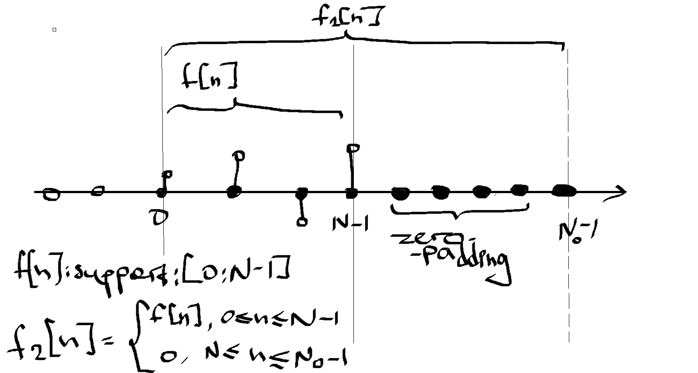

## Periodization

Periodization: make signal periodic. By periodization we obtain an infinite-length, periodic signal.

$$f_p[n] = \sum_{m\in\mathbb{Z}}f[n + mN] = f[n \text{ mod } N]$$

  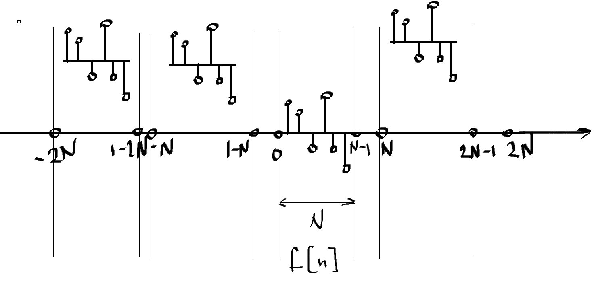

## DFT and DFTP

  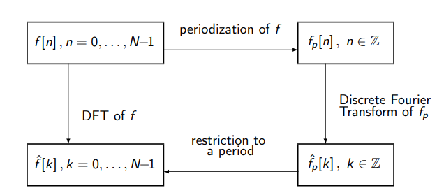

## Fast Fourier Transform

$$\hat{f}[k] = \sum^{N-1}_{n=0}f[n]e^{-in( \frac{2\pi}{N}k)}, \quad k=0,1,...,N-1$$

## Fast Inverse Fourier Transform

$$f[n] = \frac{1}{N}\sum^{N-1}_{k=0}\hat{f}[k]e^{in( \frac{2\pi}{N}k)}, \quad n=0,1,...,N-1$$

- Direct computations are $O(N^2)$ real scalar operations.
- Reorganizing computations leads to the Fast Fourier Transform (FFT) which is $O(N \ln(N))$.

## DFT and FTDT Properties

We have finite discrete signal. Then:
$$\hat{f}[k] = \hat{f}(\frac{2\pi}{k}), \quad k=0,1,\dots,N-1$$

$$\begin{cases}
  \hat{f}(v) = \sum^{N-1}_{n=0}f[n]e^{-inv} && v\in[0, 2\pi) \\ \hat{f}[k] = \sum^{N-1}_{n=0}f[n]e^{-in\frac{2\pi}{N}k}
\end{cases}$$

$$v = \frac{2\pi}{N}k, \quad 0 \le k \le N-1$$

$$\hat{f}[0] = \hat{f}(0)$$
$$\hat{f}[1] = \hat{f}(\frac{2\pi}{N}), \quad k = 1$$

  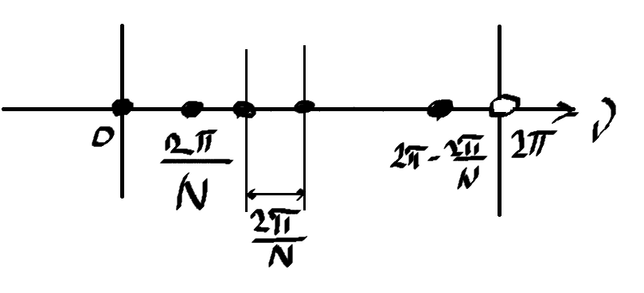

We have information at $0$ and at $2\pi$ the same, which is why the borders are $[0, 2\pi)$

The DFT coefficients are samples at rate $T = \frac{2\pi}{N}$ of the FTDT on $[0, 2\pi)$. In other words, the DFT is a sampling of the FTDT by $\frac{2\pi}{N}$: the larger $N$, the better the information.

### Example

$$f[n] = \begin{cases}
  1 && 0 \le n \le 4 \\ 0 && 5 \le n \le 9
\end{cases}$$

$supp(f) = [0:9], N = 10$
$$\hat{f}(v) = \sum_{n \in \mathbb{Z}}f[n]e^{-inv} = \sum_{n=0}^{N_0}f[n]e^{-inv}$$
$$\hat{f}[k] = \sum_{n=0}^{N-1}f[n]e^{-in\frac{2\pi}{N}k} = \sum_{n=0}^{N_0}f[n]e^{-in\frac{2\pi}{N}k}$$

*Remark: summing up to $N_0$, because 0's after $N_0$*

  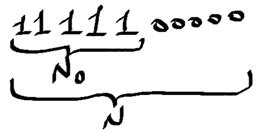

## Symmetries in DFT Coefficients for Real Finite Signals

- $\hat{f}[k]$ is $N$-periodic
$$\hat{f}[-k] = \hat{f}[-k + N]$$
$$\hat{f}[k] = \overline{\hat{f}[-k]} = \overline{\hat{f}[N - k]}$$
$$\hat{f}[1] = \hat{f}[N - 1]$$

- For $0 \leq k \leq N - 1$ real, we have $\hat{f}[k] = \overline{\hat{f}[-k]}$, thus

$$|\hat{f}[k]| = |\hat{f}[-k]| \text{ and } \text{arg}(\hat{f}[k]) = -\text{arg}(\hat{f}[-k]), \quad \text{arg = $\Phi_f$}$$

- By $N$ periodicity: for $1 \leq k \leq N - 1, \hat{f}[k] = \overline{\hat{f}[N - k]}$, thus

$$|\hat{f}[k]| = |\hat{f}[N - k]| \text{ and } \text{arg}(\hat{f}[k]) = -\text{arg}(\hat{f}[N - k])$$

- We always have $\hat{f}[0] = \sum_{n=0}^{N-1}f[n] \in \mathbb{R}$, and if $N$ is even:
$$\hat{f}[N/2] = \overline{\hat{f}[N - \frac{N}{2}]} = \overline{\hat{f}[\frac{N}{2}]}\text{ is real too }$$

*Remark: if $z = \overline{z}$, then we are on the real line*.

To represent $N$ DFT coefficients, one uses the range:
$$[-\frac{N}{2}: \frac{N}{2} - 1], \text{ if $N$ is even}$$
$$[-\frac{N-1}{2}: \frac{N-1}{2} - 1], \text{ if $N$ is odd}$$

The coefficients close to $k=0$ and $k=N-1$ are the low frequences and around $k=\lfloor\frac{N}{2}\rfloor$ are the high frequences of the signal.

  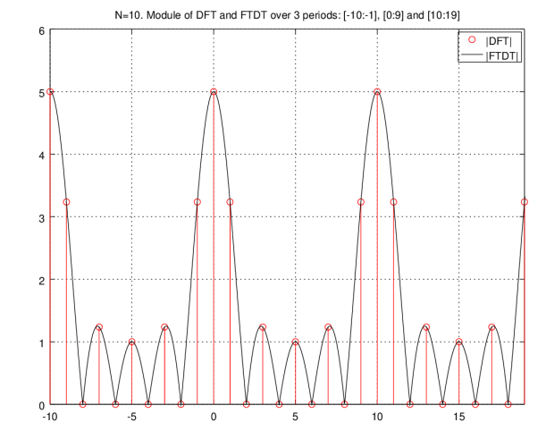

## Filter In Discrete Time | Ideal Filter

Let $H$ be a filter defined by the discrete signal $(h[n])_{n \in Z}$.
To a (finite) discrete signal $x$, we associate the discrete signal $y = H[x]$. These signals are related in temporal and frequency domain by
$$y[n] = (h * x)[n], n \in Z \quad \text{and} \quad \hat{y}(v) = \hat{h}(v)\hat{x}(v), v \in [-\pi, \pi]$$

**Ideal** filters are designed to cut off specified frequencies of the input signal.
One obtains ideal **low-pass, high-pass** and **band-pass** filters by defining (in
the frequency domain) $\hat{h}$:

  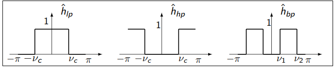

In here, $v_c$ is the cutoff frequency (everything is $0$ outside of the $[-v_c, v_c]$) and $[v_1,v_2]$ is the allowed frequency band.

### Ideal Low-pass Filter

$$\hat{h}_{LP}(v) = \begin{cases}
  1, \quad |v|\le v_c \\ 0, \quad v_c < |v| < \pi
\end{cases}$$

  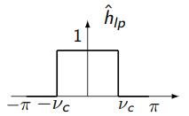

The **impulse** **response** is:
$$h_{LP}[n] = \frac{\sin(v_cn)}{\pi n}$$

It is not finite and leads to ringing artifacts (Gibbs phenomenon).

### Ideal High-pass Filter

$$\hat{h}_{HP}(v) = \begin{cases}
  0, \quad |v|\le v_c \\ 1, \quad v_c < |v| < \pi
\end{cases}$$

  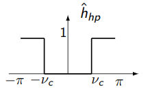

The **impulse** **response** is:
$$h_{HP}[n] = \delta[n] - \frac{\sin(w_cn)}{\pi n}$$

### Ideal Band-pass Filter

$$\hat{h}_{BP}(v) = \begin{cases}
  1, \quad v_1 \le |v| \le v_2 \\ 0, \quad |v| < v_1 \text{ or } v_2 < |v| \le \pi
\end{cases}$$

  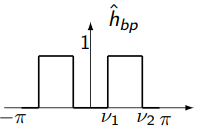

## Discrete Signal Processing in 2 Dimensions

  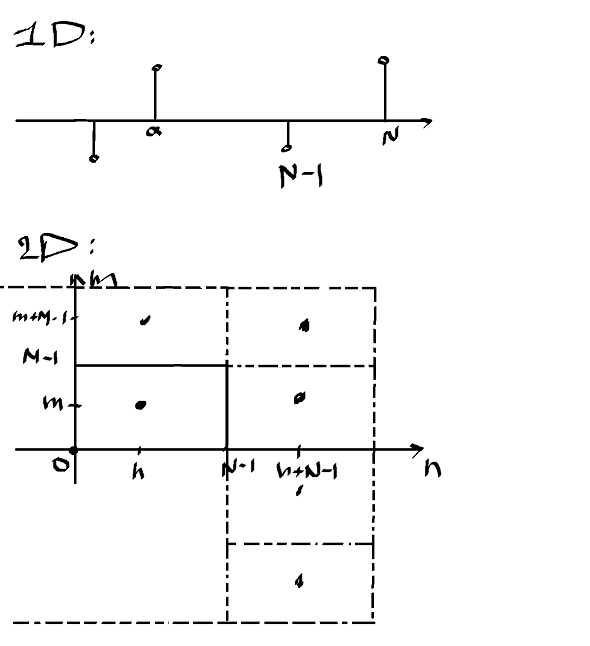

A discrete signal in 2 dimensions is a double entry sequence
$$(f[i,j])_{(i,j)\in Z^2}$$
In images a pixel $f[i,j]$ represents a gray level.

### Periodicity

A signal $f$ is periodic of period $(N, M)$ if $\forall (n, m) \in \mathbb{Z}^2$
$$\forall (i, j) \in \mathbb{Z}^2: f[i, j] = f[i + n \cdot N, j + m \cdot M]$$

### Convolution

The convolution $g = h ∗ f$ of two signals is defined by 
$$\forall (i, j) \in \mathbb{Z}^2: g[i, j] = \sum_{k, l \in \mathbb{Z}} h[i - k, j - l]f[k, l]$$

### The Fourier Transform

The Fourier Transform of $f$ is 
$$\hat{f}(\nu_1, \nu_2) = \sum_{k, l \in \mathbb{Z}} f[k, l]e^{-ik\nu_1}e^{-il\nu_2}$$

### Inverse Fourier Transform

Reconstruction of signal $f$ is given by

$$f[n, m] = \frac{1}{(2\pi)^2} \int_{0}^{2\pi} \int_{0}^{2\pi} \hat{f}(\nu_1, \nu_2)e^{in\nu_1}e^{im\nu_2}d\nu_1d\nu_2$$

### Discrete Fourier Transform

Let $f[m, n]$ be of support $[0 : M - 1] \times [0 : N - 1]$ and $W_N = e^{i\frac{2\pi}{N}}$. We have the 2D Discrete Fourier Transform (DFT) as:

$$
\hat{f}[k, l] = \sum_{m=0}^{M-1} \sum_{n=0}^{N-1} f[m, n]W^{-km}_M W^{-ln}_N,
$$
$$k = 0, 1, \ldots, M - 1 \text{ and } l = 0, 1, \ldots, N - 1$$

The inverse 2D DFT can be expressed as:

$$
f[m, n] = \frac{1}{MN} \sum_{k=0}^{M-1} \sum_{l=0}^{N-1} \hat{f}[k, l]W^{km}_M W^{ln}_N,
$$
$$m = 0, 1, \ldots, M - 1 \text{ and } n = 0, 1, \ldots, N - 1$$

As $f$ is real and due to the periodization behind the DFT:
$$\hat{f}[k,l] = \overline{\hat{f}[M - k, N - l]}, \quad 0 \le k \le M - 1, 0 \le l \le N - 1$$

Suppose $M=N$. Then we have:

  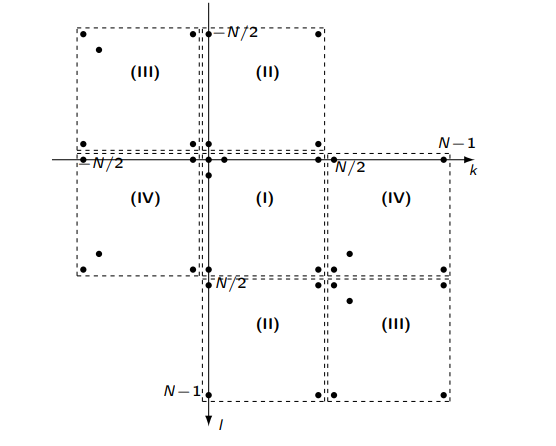

Here:
$$|I| = |III|, |II| = |IV|, \arg(I) = -\arg(III), \arg(II)=-\arg(IV)$$
