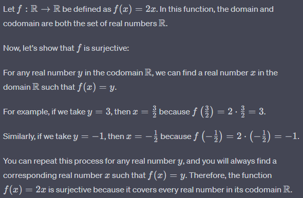
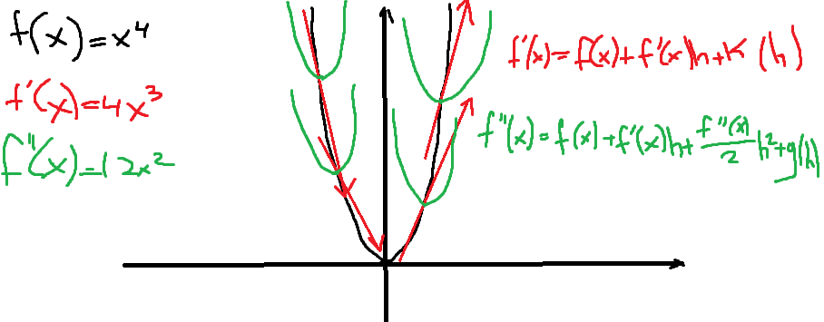
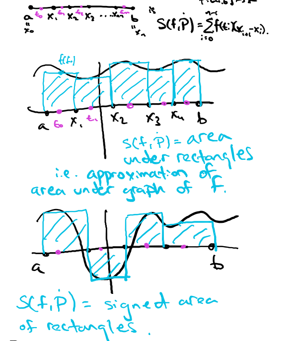
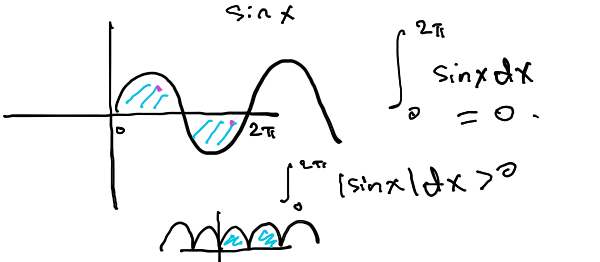
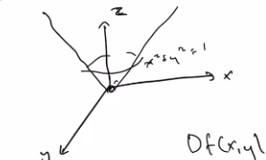
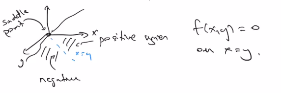
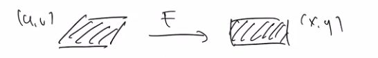
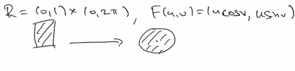
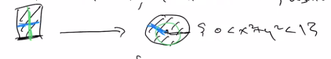
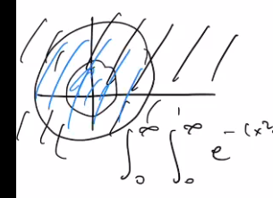

# Sets

**Defn**: we say U is a subset of A if $\forall x \in U, x \in A$. Conversely we say $A \supset U$.

**Defn**: Given sets $A, U$ with $U \subset A$, we write $A / U$ for the complement of $U$ in $A$:

$$A / U = \{x \in A : x \notin U \}$$

# Functions

A function $f$ between sets $A$ and $B$, denoted as $f: A \mapsto B$, takes each element $x \in A$ to some element $f(x) \in B$. Most of the time, $f$ will be a function between sets of $\mathbb{R}$, and then the notion becomes intuitive because we can "draw the graph" of $f$.

Rigorous: subset of $AxB  = \{(x,y): x \in A, y \in B\}$, s.t. every $x \in A$ appears in exactly one pair $(x,y)$

domain of $f: A \rightarrow B$ is A, the range is , the image is ... (negative real numbers for f(x) = x^2)

- injective - graph doesnt intercept itself (f(x) are unique, if f(x1) = f(x2) then x1=x2)

- surjective: a function is surjective if it covers or "hits" every element in its codomain (output). There are no "unmapped" elements in the codomain. It means that the range of the function is equal to the codomain. example: 

- bijective: both injective and surjective. In simple terms, a bijective function establishes a one-to-one correspondence between the elements of the domain and the elements of the codomain. This means that each element in the domain is uniquely mapped to an element in the codomain, and every element in the codomain has a unique pre-image in the domain. example:

When we map $f: A \mapsto B$, and $x \in E$, $E \subset A$, then $f(x) \in f(E)$

# Continuity

$A \subset \mathbb{R}$ interval

Naive defn: $f: A \mapsto \mathbb{R}$ is continious if the graph is connected.

Defn: $f: A \mapsto \mathbb{R}$ is continious at $x \in A$ if $\forall \epsilon > 0$ (positive number no matter how small) $\exists \delta > 0$ s.t. $\forall y \in A$ with $|x-y| < \delta$, we have $|f(x) - f(y)| < \epsilon$ f is continious on A if its continious at all $x \in A$

In simpler terms, it means that you can make the values of $f(x)$ and $f(y)$ as close as you want (within $\epsilon$) by choosing y sufficiently close to x (within $\delta$).

Another way of saying this is: a function $f$ is continious at a point $x$ if, for any small positive value $\epsilon$, you can find a small positive value $\delta$ s.t. if $y$ is within $\delta$ units of $x$, then the function values $f(x)$ and $f(y)$ are within $\epsilon$ units of each other. If it holds for all x's, then the function is continious on the whole set.

The function $f$ is continious on the set $A$ if it is continious at every point $x$ in the set $A$.

# Limits

Defn: A sequence is a set of numbers $(x_n) ^\infty_{n=1} \subset \mathbb{R}$ indexed by $\mathbb{N} / \{ 0 \}$ (equivalently, a function from $\mathbb{N} \mapsto \mathbb{R}, n \mapsto x_n$)

We say $x_n$ converges as $x \rightarrow \infty$ and write
$lim_{n \rightarrow \infty}x_n = x$ if $\forall \epsilon > 0$ and $\exists N \in \mathbb{N}$ s.t. $\forall n > N, |x_n - x| < \epsilon$. We say that $\lim_{n \rightarrow \infty}x_n = \infty$ if for all $M>0$ there exists $N \in \mathbb{N}$ s.t. $\forall n>N, x_n > M$. Likewise for $- \infty$.
\
We say $x_n$ diverges, if the limit does not exist. E.g.: $x_n = (-1)^n$

## Right-hand / Left-hand

Way to describe the right-hand and left-hand limits of a function as it approaches a point $c$ within its domain.

Let $f : (a,b) \rightarrow \mathbb{R}$ be a function. We say that $\lim_{x \to c^+}f(x) = y$ if for all sequences $x_n$ decreasing to $c$, $\lim_{n \to \infty}f(x_n) = y$. Here we allow $y = \plusmn \infty$. 
- This notation represents the right-hand limit of the function $f(x)$  as $x$ approaches $c$ from the right side (i.e., from values greater than $c$).
- It says that the limit of $f(x)$ as $x$ approaches $c$ from the right side $=y$.
- To show this, it states that for any sequence $x_n$ that approaches $c$ from the right (i.e. $x_n > c$ and $x_n$ decreases towards $c$), the limit of $f(x_n)$ as $n$ approaches infinity is y.

Likewise, $\lim_{x \to c^-}f(x) = y$ if for all sequences $x_n$ increasing to $c$, $\lim_{n \to \infty} f(x_n) = y$.

In simpler terms, this definition is a formal way to describe what happens to a function as it gets closer to a specific point 
$c$ from the left and right sides. It shows that the function approaches a particular value
$y$ as you get arbitrarily close to 
$c$ from both sides.

This definition is particularly useful when dealing with functions that may have different behavior as you approach a point from different directions. It allows you to analyze how the function behaves as you approach 
$c$ from the left and right sides separately.

# Derivatives

Defn.: Let $f : (a,b) \to \mathbb{R}$ be a function. We say $f$ is differentiable at $x$, with derivative $f'(x)$, if

$$\lim_{h \to 0}\frac{f(x + h) - f(x)}{h} = f'(x)$$

- $\frac{f(x + h) - f(x)}{h}$ - average rate of change of $f(x)$ over a small interval $[x, x+h]$

- If limit exists, value of the derivative $f'(x)$ tells us the rate at which $f(x)$ is changing at that specific point $x$.

- In summary, the expression $\lim_{h \to 0}\frac{f(x + h) - f(x)}{h} = f'(x)$ means that as the interval $[x, x +h]$ becomes infinitesimally small (as $h$ approaches 0) the average rate of change of the function $f(x)$ over this interval approaches a specific value, which is the derivative $f'(x)$ at the point $x$.

We say $f(x)$ is differentiable if it is differentiable at every point in its domain.

## Tangent Line

The derivative has an interpritation as the tangent line to the graph of $f$. THe point is that if $f$ is differentiable at $x$, then for $\exists \delta>0$ s.t. $forall |h|<\delta$:

$$f(x + h) = f(x) + f'(x)h + k(h)$$

, where
- k(h) is a function, s.t. $\lim_{h \to 0}\frac{k(h)}{h} = 0$. Thus, $k(h)$ could be something like $h^2$ or $h^\alpha, \alpha > 1$. Note that if $f$ is differentiable at $x$, then it is continious at $x$, for

$$|f(x + h) - f(x)| \le |f'(x)||h| + |k(h)|$$

## L'Hopital's Rule

If $\lim_{x \to c}f(x) = \lim_{x \to c}g(x) = 0$ or $\plusmn \infty$

and $g'(x)$ is non-zero in an interval around $c$, and $\lim_{x \to c}\frac{f'(x)}{g'(x)}$ exists, then:

$$\lim_{x \to c}\frac{f(x)}{g(x)} = \lim_{x \to c}\frac{f'(x)}{g'(x)}$$

## Higher Order Derivatives

We can take more derivatives: the derivative of $f'(x)$ is called a second derivative and denoted $f''(x)$. This should be thought of as giving us a
quadratic approximation to our function: indeed, if $f$ is twice differentiable at $x$, then for $h$ small:

$$f(x + h) = f(x) + f'(x)h + \frac{f''(x)}{2}h^2 + g(h)$$

, where
- $\lim_{h \to 0}{\frac{g(h)}{h^2}} = 0$

Likewise we have $f'''(x)$, etc. Eventually, we start writing $f^{(n)}(x)$ to mean $n^{th}$ derivative.

We say that a function is $n$ times differentiable, or sometime we say $f$ is $C^
n$ if the $n^{th}$ derivative exists and is continuous. If $f$ is infinitely differentiable, we say that it is smooth, and write that $f$ is $C^\infty$.

# Optimization

## Local Maximim / Minimum

Let $f$ be a function on a subset of $\mathbb{R}$. A point $x$ isa local maximum for $f$ if there exists $\delta > 0$ s.t. $\forall y$ with $|x-y| <\delta, f(x) > f(y)$. Similarly, $x$ is a local minimum if $\forall y$ with $|x-y| <\delta, f(x) < f(y)$.

If $x$ local maximum or minimum, then $f'(x) = 0$. **Proof**:\
Suppose $x$ - maximum and $f'(x) \ne 0$. If $f'(x) > 0$, then by the formula

$f(x + h) = f(x) + f'(x)h + g(h)$

, we see that for $h > 0$ small, $f(x + h) > f(x)$. And if $f'(x) < 0$, then for $h < 0$ small, $f(x + h) < f(x)$. Same idea for a local minimum.

Another, more detailed **proof**:

- Local Minimum: \
The definition of local minimum: for some $r > 0$ we have $f(x) \ge f(x_0) \forall x$ with $|x - x_0| < r$. \
Assume $f'(x_0)$ exists. Then: $f'(x_0) = \lim_{h \to 0}\frac{f(x_0 + h) - f(x_0)}{h}$. \
$\forall h$ with $|h| <r$ we have $f(x_0 + h) - f(x) \ge 0$ (definition of local minimum). \
We conclude: \
$\lim_{h \to 0^+}\frac{f(x_0 + h) - f(x)}{h} \ge 0$, since numenator $\ge 0$ and denominator $>0$\
and \
$\lim_{h \to 0^-}\frac{f(x_0 + h) - f(x)}{h} \le 0$, since numenator $\ge 0$, but denumenator $<0$ \
Thus: $0 \le f'(x_0) \le 0$, and $f'(x_0) = 0$
- Local Maximum: \
The definition of local maximum: for some $r > 0$ we have $f(x) \le f(x_0) \forall x$ with $|x - x_0| < r$. \
Assume $f'(x_0)$ exists. Then: $f'(x_0) = \lim_{h \to 0}\frac{f(x_0 + h) - f(x_0)}{h}$. \
$\forall h$ with $|h| <r$ we have $f(x_0 + h) - f(x) \le 0$ (definition of local maximum). \
We conclude: \
$\lim_{h \to 0^+}\frac{f(x_0 + h) - f(x)}{h} \le 0$, since numenator $\le 0$ and denominator $>0$\
and \
$\lim_{h \to 0^-}\frac{f(x_0 + h) - f(x)}{h} \ge 0$, since numenator $\le 0$ and denumenator $<0$ \
Thus: $0 \le f'(x_0) \le 0$, and $f'(x_0) = 0$

The converse however, is not true: consider $f(x) = x^3$ at $x = 0$. If $f′(x) = 0$ and $x$ is not a local maximum or minimum, then $x$ is called a saddle point. Local minimums or maximums
are sometimes called local extrema.

## Second Derivative Test

Suppose $f'(x) = 0$. If $f''(x) < 0$, then $x$ is a local maximum. If $f''(x) > 0$, then $x$ is a local minimum. If $f''(x) = 0$, we can't say anything.

Proof: \
We know that: $f(x + h) = f(x) + f'(x)h + \frac{f''(x)}{2}h^2 + g(h)$

Since $x$ - local maximum, $f'(x) = 0$ and $f(x + h) < f(x)$. Thus, for the quadratic approximation to hold $f''(x)$ must be $<0$ for $x$ to be local maximum. Same with local minimum.

## Mean Value Theorem

If a function f(x) is continious on a closed interval $[a, b]$ and differentiable on the open interval (a, b), then $\exists$ at least one number $c \in (a,b)$ s.t.:

$$f'(c) = \frac{f(b) - f(a)}{b - a}$$

In other words, there is a point $c \in (a, b)$ where the $f'(x)$ is equal to the average rate of change of the function over $[a, b]$

Example:

Show: $\forall x, y, |sin(x) - sin(y)| \le |x - y|$

$f(x) = sin(x), f'(x) = cos(x)$

$c \in (x, y)$

$\frac{sin(x) - sin(y)}{x - y} = cos(c)$

$sin(x) - sin(y) = (x - y) \cdot cos(c)$

We know $|cos(c)| \le 1$. Then:

$|sin(x) - sin(y)| \le |x - y| \cdot |cos(c) \le |x - y| \cdot 1 $

## Cool Example

Prove  $x \ge sin(x), x \ge 0$

- Define $f(x) = x - sin(x)$
- WTS $f(x) \ge 0 \forall x \ge 0$
- $f(0) = 0 - sin(0) = 0$
- $f'(x) = 1 - cos(x) \ge 0$ since $cos(x) \le 1$
- so $f$ - non-decreasing
- $=> f(x) = x - sin(x) \ge 0$
- $=> x \ge sin(x)$

# Integration

## Riemann Sum

A partition $P$ of a closed interval $[a, b]$ is a subdivision into subintervals $[x_0, x_1], ..., [x_{n-1}, x_n]$, where $x_0 = a, x_n = b$. A tagged partition $\dot{P}$ is a partition along with a cohice of number $t_i \in [x_i, x_{i + 1}]$. The Riemann sum of a function $f : [a,b] \to \mathbb{R}$ with respect to $\dot{P}$ is

$$S(f, \dot{P}) = \sum_{i = 1}^nf(t_i)(x_{i+1} - x_i)$$

$S(f, \dot{P})$ is the total signed area under the graph from $a$ to $b$ of the piecewise function $g$ defined by $g|_{[x_i, x_{i + 1}]}=t_i$. By “signed area,” we mean that any area under the x-axis counts
as “negative area”. The idea behind Riemann sums is that, as we take the partition to be
finer and finer (i.e., make the intervals $[x_i, x_{i+1}]$ smaller and smaller), the Riemann sums
should converge to the total signed area under the graph of f. This idea is made formla by
the definition.

## Integral

$f: [a,b] \to \mathbb{R}$ is Riemann integrable if $\exists L \in \mathbb{R}$ s.t. $\forall \epsilon >0, \exists \delta > 0$ s.t. $\forall \dot{P} w/ \max|x_{i + 1} - x_i| < \delta$,

$$|S(f, \dot{P}) - L| < \epsilon$$

$L$ - integral of $f$

$$L = \int_a^bf(x)dx$$

Intuition: $L$ is signed area under graph.

Remark: a function can be integrable without admitting a primitive (i.e. $\nexists g$ s.t. $f = g'$)

Example: 
$$f(x) = \begin{align} x, x \le 1 \\ 2, x > 1\end{align}$$

$f$ has no primitive, but restricted to $(- \infty, 1)$ or $(1, \infty)$ it does.

Example:

$f(x) = |x|$

$$g(x) = \begin{align} \frac{1}{2}x^2, x \ge 0 \\ -\frac{1}{2}x^2, x \le 0 \end{align}$$

Remark: every continious function is Riemann integrable.

## Techniques of integration

- u-substitution. A function might appear complicated, but simplify upon making a
subsitution. The u-substitution technique is really an application of the chain rule: given
differentiable functions $f$ and $u$, the primitive of $f'(u(x))u'(x)$ is $f(u(x))$.

$$\int^b_af(u(x))u'(x)dx = \int^{u(b)}_{u(a)}f(u)du$$

## Primitive

$f: (a,b) \to \mathbb{R}$. A primitive is a function $g:(a,b) \to \mathbb{R}$ s.t. $g'(x) = f(x)$

A primitive is unique up to addition by a constant.

## Fundamental Theorem of Calculus

$f = g', \forall (c, d) \subset (a,b)$

$$\int_c^df(x)dx = g(d) - g(c)$$

If $b < a$, we set $\int_a^bf(x)dx = - \int^a_bf(x)dx$

You can write:

$$\int f(x)dx = g(x) + C$$

to mean that $g$ is a primitive of $f$.

## Integration Rules

- Additivity for Intervals:\
$\int_{a}^{b} f(x) \, dx + \int_{c}^{b} f(x) \, dx = \int_{c}^{a} f(x) \, dx$

- Additivity for Functions:\
$\int_{a}^{b} f_1(x) \, dx + \int_{a}^{b} f_2(x) \, dx = \int_{a}^{b} (f_1(x) + f_2(x)) \, dx$

- Scalar Multiplication:\
For a constant $c$, \
$\int_{a}^{b} cf(x) \, dx = c \int_{a}^{b} f(x) \, dx$

- Comparison Property: \
If $f(x) \leq g(x)$ for all $x$, then \
$\int_{a}^{b} f(x) \, dx \leq \int_{a}^{b} g(x) \, dx$

## U-Substitution

Chain rule $(f(u(x))) ' = u'(x)f'(u(x))$ \
So, primitive of a function of the form $u'(x)f'(u(x))$ is $f(u(x))$. Going to integrals, $u: [a,b] \to [c,d]$ differentiable, $f: [c,d] \to \mathbb{R}$ continious:

$$\int_a^bf(u(x))u'(x)dx = \int_c^df(u)du$$

$c = u(a), d = u(b)$

Example:

Compute $\int^1_0\frac{x}{1 + x^2}dx$ 

$u(x) = 1 + x^2, u(a) = u(0) = 1, u(b) = u(1) = 2$ 

$\frac{du}{dx} = 2x, dx = \frac{du}{2x}$

$\int^1_0\frac{x}{1 + x^2}dx = \int^2_1 \frac{x}{u} \frac{du}{2x} = 1/2 \int^2_1 \frac{1}{u} du = 1/2 * (ln(u) |^2_1) = \frac{1}{2} ln(2)$

## Integration by parts. 

This standard technique can get tricky but you should really just think of it as an application of the product rule $(fg)'(x) = f'(x)g(x)+f(x)g'(x)$. Simply putting in integrals, we get the standard integration by parts formula

$$\int^b_af'(x)g(x)dx = \int^b_a (fg)'(x)dx - \int^b_af(x)g'(x)dx = (fg)(b) - (fg)(a) - \int^b_af(x)g'(x)dx$$

or, for primitives,

$$\int^b_af'(x)g(x)dx = f(x)g(x) - f(x)g'(x)$$

# Indefinite Integral

$\int f(x)dx = g(x) + C$

$\int f'(x)g(x)dx = (fg)(x) - \int f(x)g'(x)dx + C$

Example:

$h: (0, \infty) \to \mathbb{R}, h(x) =  xlogx$

$\int xlog(x) dx$

$f'(x) = x, f(x) = \frac{1}{2}x^2$\
$g(x) = log(x), g'(x) = \frac{1}{x}$

$\int xlog(x) dx = \frac{1}{2}x^2 \cdot log(x) - \int \frac{1}{2}x^2 \cdot \frac{1}{x} dx = \frac{1}{2}x^2 \cdot log(x) - \frac{1}{2}\int x dx = 1/2x^2ln(x) - 1/4x^2$

Example:

$h(x) = x^3e^x$

$f'(x) = e^x, f(x) = e^x$\
$g(x) = x^3, g'(x) = 3x^2$

$\int x^3e^x = e^x \cdot x^3 - \int e^x \cdot 3x^2 = ... = e^x(x^3 = 3x^2 - 6x - 6)$

## Lebesgue Integral

Tells how to integrate over most subsets of $\mathbb{R}$

1. If $\int^b_af(x)dx \exists \forall b>a$, set

$$\int^\infty_af(x)dx = \lim_{b \to \infty} \int^b_af(x)dx$$

2. If $\int^b_af(x)dx \exists \forall a<b$, set

$$\int^b_{-\infty}f(x)dx = \lim_{a \to -\infty} \int^b_af(x)dx$$

3. $\forall c \in \mathbb{R}$, if $\int^\infty_cf(x)dx$, $\int^c_{-\infty}f(x)dx$, $\exists$

$$\int^\infty_{-\infty}f(x)dx = \int^c_{-\infty}f(x)dx + \int^\infty_cf(x)dx$$

4. $f : (a, b) \to \mathbb{R}$ continious $\forall d<b$,

$$\int^d_af(x)dx = \lim_{c \to a}\int^d_cf(x)dx$$

# Convergence of Sequences of Functions

Defn: $(x_n)^\infty_{n=1} \subset \mathbb{R}, \lim_{n \to \infty}x_n = x \in \mathbb{R}$ if $\forall \epsilon > 0 \exists N \in \mathbb{R}$ s.t. $n > N, |x_n - x | < \epsilon$. We say that $\lim_{x \to \infty} x_n = \infty$ if $M > 0 \exists N \in \mathbb{N}$ s.t. $\forall n > N, x_n > M$. Likewise, $\lim_{x \to \infty} x_n = -\infty$ if $M < 0 \exists N \in \mathbb{N}$ s.t. $\forall n > N, x_n < M$. If none of these things happen, we say that the sequence diverges.

Example:

$x_n = \frac{1}{n}$ as $n \to \infty, x_n \to 0$

Example:

$x_n = (-1)^n$ diverges (between $-1$ and $1$)

Example:

$x_n = \frac{sin(n)}{n^{1/2}}$

We know $|sin(n)| \le 1$

WTS $|x_n - x | < \epsilon$

$x = 0$

$=> |\frac{sin(n)}{n^{1/2}}| \le n^{1/2}$

Let $\epsilon < 0$. Want $N < \epsilon, \forall n > N, n^{-1/2} < \epsilon$, i.e. $n^{1/2} > \epsilon^{-1}, n > \epsilon^{-2}$

Pick $N \in \mathbb{N}, N > \epsilon^{-2}, \forall n > N$

$|\frac{sin(n)}{n^{1/2}}| \le \epsilon$

## Squeeze Theorem

$(x_n)^\infty_{n=1}, (y_n)^\infty_{n=1}, (z_n)^\infty_{n=1}$

Suppose $\exists n \in \mathbb{R}$ s.t. $\forall n > N, y_n \le x_n \le z_n$. Suppose $y_n, z_n$ converge to the same limit $X$. Then

$$\lim_{n \to \infty}x_n = X$$

Proof:

Let $\epsilon > 0, \exists N \in \mathbb{N}$, s.t. $\forall n > N, |y_n - x| < \epsilon, |z_n - x| < \epsilon$

For $y_n \exists N_1 \in \mathbb{N}$, s.t. $\forall n > N_1, |y_n - x| < \epsilon$

For $z_n \exists N_2 \in \mathbb{N}$, s.t. $\forall n > N_2, |z_n - x| < \epsilon$

Take $N = \max\{N_1, N_2\}$

$|y_n - x| < \epsilon$ means $-\epsilon < y_n - x < \epsilon$

Can also assume $\forall n > N, y_n \le x_n \le z_n$

Now, $-\epsilon < y_n - x \le x_n - x \le z_n - x < \epsilon$

Equivalently, $|x_n - x| < \epsilon$

Example:

$x_n = n^{1/n^2}$ (Recall $\lim_{n \to \infty}n^{1/n} = 1$)

$z_n = n^{1/n}, 1/n^2 \le 1/n => n^{1/n^2} \le n^{1/n}$

$y_n = 1, n \ge 1, n^{1/n^2} \ge 1^{1/n^2} = 1$

By squeeze, $\lim_{n \to \infty}n^{1/n^2} = 1$

## Cauchy Criterion

$(x_{n_k})^\infty_{n=1}$ converges $<=> \forall \epsilon >0, \exists N$ s.t. $\forall n, m \ge N, |x_n - x_m| < \epsilon$. Such sequence is called **Cauchy**.

Sequence $(x_n)^\infty_{n=1}$ Cauchy if and only if it converges.

## Bounded Sequence

**Defn**: $(x_n)^\infty_{n=1}$ is bounded if $\exists M > 0$ s.t. $\forall n, |x_n| \le M$

**Thm**: If sequence converges, it is bounded.

Proof: 

Let $x = \lim_{n \to \infty}x_n$

Let $\epsilon = 1$

$\exists N \in \mathbb{N}$, s.t. $\forall n > N, |x_n - x| < 1$

$\forall n > N, |x_n| = |(x_n - x) + x| \le |x_n - x| + |x| < |x| + 1$

## Monothone Convergence Theorem

Suppose $(x_n)^\infty_{n=1}$ is a sequence that is both monotone and bounded. Then it converges.

Proof.

*Remark*: $sup_nx_n$ is the smallest number $X$ s.t. $\forall n, X \ge x_n$. We allow $inf_nx_n = \infty$. $inf_nx_n$ is the largest number $X$ that is lower bound, i.e. $X \le x_n$. We allow $inf_nx_n = -\infty$

1. If $x_n$ increases, take $x = sup_nx_n$. Formally, $sup_nx_n$, the *supremum*, is defined to be the smallest number that is larger than all $x_n$. For example, if $x_n$ is a constant $M$, then $sup$ is $M$. If $x_n = 1 - \frac{1}{n}$, then the $sup$ is 1. The $sup$ is allowed to be $\infty$, but the hypothesis that s sequence is bounded guarantees that this $sup$ is finite. Going back to the theorem, $x_n$ does not converge to $x$, then we can find $\delta > 0$ and a subsequence $(x_{n_k})^\infty_{k=1} \subset (x_{n})^\infty_{n=1}$ s.t. $|x_{n_k} - x| \ge \delta$. But then the supremum of the $x_n$'s is certainly smaller than x. 

## Induction

Induction: shows if sequence is monotone or not.

If we can show $(x_{n+1} > x_n)$ assuming $(x_n > x_{n-1})$ and we know $x_2 > x_1$ then we get that $x_{n+1} \ge x_n \forall n$

Example:

$x_1 = 1$

$x_{n+1} = \sqrt{2 + x_n}, \forall n \in \mathbb{N}$

Show:

1. $(x_n)$ converges.
2. Find limit.

Solution:

MCT states that if $x_n$ is monotone and bounded, then it converges.

Just pick numbers and look at the sequence behaivor:

$x_1 = 1 < x_2 = \sqrt{3} < x_3 = \sqrt{\sqrt{3} + 2} < ...$

1)

By induction, assume $x_n > x_{n-1}$

$x_{n+1} = \sqrt{x_n + 2} \ge \sqrt{x_{n-1} + 2} = x_n$. 

Thus, $(x_n)^\infty_{n=1}$ is monotone.

If $(x_n)^\infty_{n=1}$ is bounded, it will converge to some $x$ which is:

$x = \lim_{n \to \infty}x_n = \lim_{n \to \infty}x_{n+1} = \lim_{n \to \infty}\sqrt{x_n + 2} = \sqrt{\lim_{n \to \infty}x_n + 2} = \sqrt{x + 2}$

$x = \sqrt{x + 2}$

$(x - 2)(x + 1) = 0$

As $x_1 > 0$ and $x_n$ is monotone increasing, $x$ should be $>0$. Thus, $x$ = 2

2.

Show $x_n \le 2, \forall n$

Induction:
1. $x_1 \le 2$ (initial case)
2. suppose $x_{n-1} \le 2$. WTS $x_n \le 2$. Proof: $x_n = \sqrt{x_{n-1} + 2} \le \sqrt{2 + 2} = 2$

Thus, by 1. and 2. and MCT $(x_n)$ converges.

## Bolzano-Weierstrass Theorem

Every bounded sequence has a convergent subsequence.

The idea is that every sequence has a monotone subsequence, and then we can apply the
monotone convergence theorem to that subsequence.

## Big-O

Let $(x_n)^\infty_{n=1}$ and $(y_n)^\infty_{n=1}$ be sequences where $x_n > 0, y_n > 0$

We write $y_n \in O(x_n)$ if: $\exist C > 0$ s.t. $\forall n, y_n \le Cx_n$

Example:

$n \in O(n^2), as \forall n > 0, n^ \ge n$

$5n^2 + 6n^3 + 8log(n) + 10^10n^5 \le (10^10 + 19)n^5 \in O(n^5)$

- $p(n)$ be a polynomial in $n$. Then $p(n) \in O(e^n)$
- $a>0, a^n \in O(n!)$
- $a>1, p(n) \in O(a^n)$
- $log(n) \in O(n)$

## Little-o

Let $(x_n)^\infty_{n=1}$ and $(y_n)^\infty_{n=1}$ be sequences where $x_n > 0, y_n > 0$

We say: $x_n \in O(y_n)$ if: $\lim_{n \to \infty}\frac{x_n}{y_n} = 0$

So, little-o stronger than big-O.

Example:

$n^2 \in O(n^2)$, but $n^2 \notin o(n^2) (\lim_{n \to \infty}\frac{x_n}{y_n}=1)$

$n^2 \in o(n^3)$

# Sequences of Functions

Fix an interval $(a,b)$ (or $[a,b], (a,b], [a, b)$) in $\mathbb{R}$.

$(f_n)^\infty_{n=1}$ where: $f_n: (a,b) \to \mathbb{R}$

## Pointwise Convergence

$(f_n)^\infty_{n=1}$ converges pointwise to $f: (a,b) \to \mathbb{R}$ if $\forall x \in (a,b)$ the sequence: $(f_n(x))^\infty_{n=1} \subset \mathbb{R}$ converges to $f(x) (\lim_{n \to \infty} f_n(x) = f(x))$

This means:

$\exist x \in (a,b), \forall \epsilon > 0, \exist N = N(\epsilon, x)$ s.t. $\forall n>N(\epsilon, x): |f_n(x) - f(x)| < \epsilon$ 

Example:

Let $f_n: \mathbb{R} \to \mathbb{R}$

$x \to x/n$

Then $f_n \to 0$ pointwise $n \to \infty$

Idea: $\forall x \in \mathbb{R}$ we pick $N > \epsilon^{-1}x$

Let $f_n: [0,1] \to \mathbb{R}, x \to x^n$

Then:

$$\begin{align} 0,  & 0 \le x < 1 \\ 1, & x=1 \end{align}$$

## Uniform Convergence

We say that a sequence of functions $(f_n)^\infty_{n=1}$ defined on an interval $(a, b)$ converges uniformly to a function $f$ if $\forall \epsilon > 0 \exist, \delta > 0$ s.t. for $x \in (a, b)$,
$|f_n(x) − f(x)| < \epsilon = f(x)$

Uniform convergence in terms of limits:

Let $A \subset \mathbb{R}$. $\lim_{n \to \mathbb{R}}sup \{y_n = |f_n(x) - f(x)| : x \in (a,b) \} = 0$

$\forall x \in (a,b), \forall \epsilon > 0, \exist N \in \mathbb{N}$ s.t. $\forall n>N: |f_n(x) - f(x)| < \epsilon$ ($N$ depends only on $\epsilon$, not on $x$)

Uniform convergence $=>$ pointwise convergence.

Example:

$f_n: \mathbb{R} \to \mathbb{R}$

$x \to sin(x/n)$

$f_n \to 0$ pointwise, as $|f_n| = |sin(x/n)| \le |x/n|$

But not uniformly.

Let $\epsilon = 1/2$. If $f_n \to 0$ uniformly, then $\exist N \in \mathbb{N}$ s.t. $\forall n>N, |sin(x/n)|< \epsilon = 1/2$

It doesn't work when $x = \frac{n \pi}{2}$ ($\sin(x/n) = sin(\pi/2) = 1 > 1/2$)

In pointwise convergence, for each point $x$ in the domain of the functions, you check whether the sequence of function values $f_n(x)$ approaches the corresponding value of the limit function $f(x)$ as you move along the sequence. In other words, you fix a specific point $x$ and examine how $f_n(x)$ behaves for that point as $n$ increases.

In the case of uniform convergence, you're looking for a single value of $N$ that works for all points in the domain, such that for all $n>N$, the function values $f_n(x)$ are uniformly close to the corresponding values of the limit function $f(x)$ across the entire domain. This means that the behavior of the sequence is "uniform" or consistent across the domain.

In summary, pointwise convergence focuses on how the sequence behaves at individual points one at a time, while uniform convergence requires that the behavior of the sequence holds true uniformly or consistently for all points in the entire domain simultaneously, with a single choice of $N$ that works for all points. Uniform convergence is a stronger condition because it ensures a higher level of consistency across the entire domain.

# Series & Taylor Expansions

## Series

Let $(x_n)^\infty_{n = 1}$ be a sequence. The series of $x_n$ is the sequence $(y_m)^\infty_{m = 1}$ of the form $y_m = \sum^m_{n=1}x_n$ (sum of $n$ to $m$ terms). $y_m$ might also be called a partial sum.

The series $(x_n)^m_{n = 1}$ converges if the sequence $(\sum^m_{n=1}x_n)^\infty_{m=1}$ converges.

The limit is denoted $\sum^\infty_{n=1}x_n$, or $x$

Example:

$x_n = 1/n, y_m = \sum^m_{n=1}1/n$

The series converges $\sum^\infty_{n=1}1/n = \infty$ (equals to 1 + 1/2 + 1/2 + 1/2 +... which converges to $\infty$)

Example:

$x \in (-1, 1), x_n = x^n, y_m = \sum^m_{n=1}x^n$

We observer $(\sum^N_{n=1}x^n)(1 - x) = 1 - x^{N+1}$, from which we deduuce:

$\sum^N_{n=1}x^n = \frac{1 - x^{N+1}}{1 - x}$

Taking $n \to \infty$ yields $\sum^\infty_{n=1}x^n = \frac{1}{1-x}$

**Fact**: If $\sum^m_{n=1}x_n$ converges, then $\lim_{n \to \infty} x_n = 0$

## Series Convergence / Divergence

The notation $\sum^\infty_{n=1}a_n$ represents an infinite series, and the statement $\sum^\infty_{n=1}a_n < \infty$ means that this infinite series converges. In other words, the sum of the terms in the series is a finite real number.

An infinite series $\sum^\infty_{n=1}a_n$ converges if the sequence of partial sums, denoted by $S_n$, approaches a finite limit as $n$ goes to infinity. Mathematically, this can be expressed as:

$lim_{n \to \infty} S_n = L$

If such a finite limit $L$ exists, then the series $\sum^\infty_{n=1}a_n$ converges, and its sum is equal to $L$. In this case, we say that the series is convergent.

Conversely, if the limit of the partial sums $S_n$ does not exist or approaches infinity as $n$ goes to infinity, then the series diverges ($\sum^\infty_{n=1}a_n = \infty$). In this case, the sum of the series is not a finite real number, and the series does not converge.

## Absolute | Conditional Convergence

The series $\sum^m_{n=1}x_n$ converges absolutely if the series $\sum^m_{n=1}|x_n|$ converges. If a series converges, but doesn't converge absolutely, we say it converges conditionally. If a series converges absolutely, it converges in the usual sense.

**Defn**: the series diverges (conditionally, absolutely) if the series does not converge conditionally, absolutely.

Example:

$\sum^\infty_{n=0}(-1)^nx^n, x \in (0, 1)$

It absolutely converges:

$\sum^\infty_{n=0}|(-1)^nx^n, x| \in (0, 1) = \sum^\infty_{n=0}x^n = \frac{1}{1 - x} < \infty$

It converges conditionally:

$\sum^\infty_{n=0}|(-1)^nx^n, x| \in (0, 1) = \sum^\infty_{n=0}(-x)^n = \frac{1}{1 - (- x)} = \frac{1}{1 + x} < \infty$

## Absolute Convergence Tests

### Bounded Partial Sums

Suppose $x_n \ge 0, \exist M > 0$ s.t. $\forall m, \sum^m_|s{n=1}| < M$. Then the series absolutely converges.

Reason: MCT. says if we have monotone bounded sequence, then it converges. $y_m = \sum^m_{n=1}|x_n|$ is non-decreasing.

### Comparison Test

$(x_n)^\infty_{n=1}, (a_n)^\infty_{n=1}, 0 \le x_n \le a_n$. If $\sum^\infty_{n=1}a_n < \infty$, then $\sum^\infty_{n=1}x_n < \infty$. If $\sum x_n = \infty$, then $\sum a_n = \infty$

Example:

$\sum^\infty_{n=1}\frac{1}{n^2ln(n + 1)} < \infty$ since

$\frac{1}{n^2ln(n + 1)} < \frac{1}{n^2}$ for $n \ge 2$

### Another Comparison Test

$(x_n)^\infty_{n=1}, (y_n)^\infty_{n=1}$, both non-zero, $x_n \ne 0, y_n \ne 0$. Assume $r = \lim_{n \to \infty}|x_n/y_n|$ exists. If $r \ne 0$, then $\sum x_n$ converges absolutely if and only if $\sum y_n$ does. If $r=0$ and $\sum y_n$ converges absolutely, then so does $\sum x_n$

### Integral Test

Let $f$ be a positive decreasing function on $\{t: t \ge 1 \}$. The series $\sum^\infty_{k=1}f(k)$ converges if and only if the improper integral $\int^\infty_1f(t)dt$ exists.

Example:

$n^{-\alpha}, \alpha \ge 1$

For $\alpha > 1, \int x^{-\alpha}dx = \frac{1}{-\alpha + 1}x^{-\alpha + 1}$, so the sequence converges. For $\alpha = 1, \int x^{-\alpha}dx = log(x)$, so the series diverges.

## Conditional Convergence Tests

### Alternating Series Test

Let $(z_n)_{n=1}^\infty$ be a decreasing sequence of positive numbers with $\lim_{n\to\infty} z_n = 0$. Then the alternating series $\sum_{n=1}^\infty (-1)^n z_n$ converges.

This alternating series test is actually just a special case of the Dirichlet test.

### Dirichlet Test

Let $(x_n)_{n=1}^\infty$ be a decreasing sequence of positive numbers with $\lim_{n\to\infty} x_n = 0$, and $(y_n)$ a sequence s.t. the partial sums $\sum_{n=1}^N y_n$ are all uniformly bounded ($\exist M$ s.t. $\forall m |\sum^m_{n=1}y_n| < M$). Then the series $\sum_{n=1}^\infty x_n y_n$ converges.

Indeed, to deduce the alternating series test from the Dirichlet test, the partial sums of $y_n = (-1)^n$ are all uniformly bounded by 1. The key to understanding the Dirichlet test is summation by parts.

### Summation by Parts

Let $(x_n)_{n=1}^\infty$, $(y_n)_{n=1}^\infty \subset \mathbb{R}$ be sequences, and set $s_n = \sum_{j=1}^n y_j$. Then
$\sum_{j=n+1}^m x_j y_j = (x_m s_m - x_{n+1} s_{n+1}) + \sum_{j=n+1}^{m-1} (x_j - x_{j+1}) s_j$.

**Proof of Dirichlet Test**: First, the Cauchy criterion for sequences implies that if $\left|\sum_{j=n+1}^m x_j y_j\right| \to 0$ as $n \to \infty$, then the series converges. There exists $B > 0$ such that for all $m$, $\left|\sum_{n=1}^m y_n\right| \leq B$. We compute, using summation by parts,
$$\left|\sum_{j=n+1}^{m} x_j y_j\right| \leq B(x_m + x_{n+1}) + B \sum_{j=n+1}^{m-1} (x_j - x_{j+1}) = B(x_m + x_{n+1}) + B(x_{n+1} - x_m) = 2Bx_{n+1}.$$
We deduce the claim from the fact that $\lim_{n\to\infty} x_n = 0$.

## Taylor Series

Given $x \in (a, b)$, for $h$ such that $(x - h, x + h) \subset (a, b)$ for $h>0$, the Taylor series expansion of a function $f(x)$ is expressed as:

$$
f(x + h) = f(x) + f'(x)h + \frac{1}{2}f''(x)h^2 + \ldots + \frac{f^{(n-1)}(x)}{(n-1)!}h^{n-1} + R_n(x),
$$

where the function $R_n(x)$ is called the remainder and is defined as:

$$
R_n(x) = \frac{1}{(n-1)!} \int_{x}^{x+h} f^{(n)}(t)(x + h - t)^{n-1} dt.
$$

This representation is known as the Taylor series of $f$ about $x$.

**Defn**: $R_n(h)$ depended on $x$. Write $R^x_n(h)$. Think of it as a family of functions in $x$, indexed by $h$. Given a closed interval $[a,b]$, if $R^x_n(h) \to 0$ as $h \to 0$ uniformly as $n \to \infty$ on $[a,b]$, then we write:

$$f(x + h) = \sum^\infty_{j=1}\frac{f^{(j)}(x)}{j!}h^j$$

The series $\sum^m_{j=1}\frac{f^{(j)}(x)}{j!}h^j$ converges uniformly to $f(x + h)$

Example:

$f(x) = e^x$
$f^{(n)} = e^x$

Taylor series at stage $n$. Set $x=0, "h=s"$

$f(x + h) = f(s)$ when $x=0$

$f(s) = \sum^m_{j=0}\frac{f^{(j)}(0)}{j!}s^j + R_n(s) = \sum^m_{j=0}\frac{s^j}{j!} + R_n(s)=\sum^{m-1}_{j=0}\frac{s^j}{j!} + \int^s_0\frac{f^{(m)}(t)}{(m-1)!}(s-t)^{m-1}dt = \sum^{m-1}_{j=0}\frac{s^j}{j!} + \int^s_0 \frac{e^t}{(m-1)!}(s-t)^{m-1}dt$

Want to write:

$e^s =  \sum^\infty_{j=0}s^j/j!$

Want to show $R_n(s) \to 0$ uniformly on every $[a,b]$. Fix $[a,b]$

$|R_m(s)| = |\int^s_0\frac{e^t}{(m-1)!}(s-t)^{m-1}dt|$

Assume $s>0$. For simplicity, $s<0$ case is similar.

$e^t \le e^s$ for $t \in (0, s)$

$(s-t)^{m-1} \le s^{m-1}$

$s \in [a,b], e^s \le e^b, s \le b, s^{m-1} \le b^{m-1}$

$|R_m(s)| \le \int^s_0\frac{e^bb^{m-1}}{(m-1)!}dt = \frac{e^bb^{m-1}s}{(m-1)!} \le \frac{e^bb^{m}}{(m-1)!} \to 0$ as $m \to \infty$

Rate of convergence does not depend on $s$.

For $e^x$ the only thing we used to show $R_m \to 0$ uniformly on $[a, b]$ was that $\exist M > 0$ s.t. $\forall s \in [a,b], n, |f^{(n)}(s)| \le M$

### Standart Taylor Series

1. **Exponential Function ($e^x$):**
   The Taylor series expansion for the exponential function is:
   $$
   e^x = \sum_{n=0}^{\infty} \frac{x^n}{n!} = 1 + x + \frac{x^2}{2!} + \frac{x^3}{3!} + \frac{x^4}{4!} + \ldots
   $$

2. **Sine Function ($\sin(x)$):**
   The Taylor series expansion for the sine function is:
   $$
   \sin(x) = \sum_{n=0}^{\infty} (-1)^n \frac{x^{2n+1}}{(2n+1)!} = x - \frac{x^3}{3!} + \frac{x^5}{5!} - \frac{x^7}{7!} + \ldots
   $$

3. **Cosine Function ($\cos(x)$):**
   The Taylor series expansion for the cosine function is:
   $$
   \cos(x) = \sum_{n=0}^{\infty} (-1)^n \frac{x^{2n}}{(2n)!} = 1 - \frac{x^2}{2!} + \frac{x^4}{4!} - \frac{x^6}{6!} + \ldots
   $$

4. **Natural Logarithm Function ($\ln(1+x)$):**
   The Taylor series expansion for the natural logarithm function near \(x=0\) is:
   $$
   \ln(1+x) = \sum_{n=1}^{\infty} (-1)^{n-1} \frac{x^n}{n} = x - \frac{x^2}{2} + \frac{x^3}{3} - \frac{x^4}{4} + \ldots
   $$

5. **Arctangent Function ($\arctan(x)$):**
   The Taylor series expansion for the arctangent function is:
   $$
   \arctan(x) = \sum_{n=0}^{\infty} (-1)^n \frac{x^{2n+1}}{2n+1} = x - \frac{x^3}{3} + \frac{x^5}{5} - \frac{x^7}{7} + \ldots
   $$

6. **Geometric Series ($\frac{1}{1-x}$):**
   The Taylor series expansion for the geometric series is:
   $$
   \frac{1}{1-x} = \sum_{n=0}^{\infty} x^n = 1 + x + x^2 + x^3 + \ldots
   $$

7. **Hyperbolic Sine Function ($\sinh(x)$):**
   The Taylor series expansion for the hyperbolic sine function is:
   $$
   \sinh(x) = \sum_{n=0}^{\infty} \frac{x^{2n+1}}{(2n+1)!} = x + \frac{x^3}{3!} + \frac{x^5}{5!} + \frac{x^7}{7!} + \ldots
   $$

8. **Hyperbolic Cosine Function ($\cosh(x)$):**
   The Taylor series expansion for the hyperbolic cosine function is:
   $$
   \cosh(x) = \sum_{n=0}^{\infty} \frac{x^{2n}}{(2n)!} = 1 + \frac{x^2}{2!} + \frac{x^4}{4!} + \frac{x^6}{6!} + \ldots
   $$

$f(x) = sinx$. Taylor series at $0$.

$f'(x) = cosx, f'(0) = 1, f''(x) - sinx, f''(0) = 0, f'''(x) = -cosx, f'''(0) = -1, f''''(x) = sinx, f''''(0) = 0$. Back to where we started.

$sinx = \sum^\infty_{n=0}\frac{-1^n}{(2n+1)!}x^{2n+1}$

Example:

$cosx = \sum^\infty_{n=0}\frac{-1^n}{(2n)!}x^{2n}$

For $|x| < 1, ln(1+x) = \sum^\infty_{n=1}(-1)^n\frac{x^n}{n}$

Example:

$\sum^\infty_{n=0}(-1)^n\frac{x^{4n}}{n!}$

$(-x^4) = x, e^x = \sum^\infty_{n=0}\frac{x^n}{n!}$

$=> \sum^\infty_{n=0}\frac{(-x^4)^n}{n!} = e^{-x^4}$

Example:

$\sum^\infty_{n=0} \frac{(-1)^n \pi^{2n}}{6^{2n}(2n)!}$

$x = \pi/6$

$=> cos(\pi/6) = \frac{sqrt{3}}{2}$

Example with integral:

$\int xcos(x^3)dx$

$cos(x^3) = \sum^\infty_{n=0}\frac{(-1)^n}{(2n)!}(x^3)^{2n} = \frac{(-1)^n}{(2n)!}x^{6n}$

$=> \int \sum^\infty_{n=0} \frac{(-1)^n}{(2n)!}x^{6n + 1}dx = \sum^\infty_{n=0} \frac{(-1)^n x^{6n + 2}}{(2n)! (6n + 2)} + C$

Example with integral:

$\int \frac{e^x - 1}{x}dx = \int \frac{e^x}{x}dx - \int \frac{1}{x}dx$

$\int \frac{e^x}{x}dx = \int \sum^\infty_{n=0}\frac{x^{n-1}}{n!}$

$\int \frac{1}{x}dx = ln(x) + C$

$=> \int \sum^\infty_{n=0}\frac{x^{n-1}}{n!} - ln(x) + C = ln(x) + \sum^\infty_{n=1}\frac{x^n}{n!} - ln(x) + C = \sum^\infty_{n=1}\frac{x^n}{n!} + C$

### Taylor Series and Limits

$f_n: (a,b) \to \mathbb{R}, \sum^\infty_{n=0}f_n(x) = f(x)$ uniformly on every compact interval. Then $\lim_{x \to a}f(x) = \lim_{x \to a}\sum^\infty_{n=0}f_n(x) = \sum^\infty_{n=0}\lim_{x \to a}f_n(x) = \sum^\infty_{n = 0}f_n(a)$

$f_n: (a,b) \to \mathbb{R}, \sum^\infty_{n=0}f_n(x) \to f(x)$ uniformly, then $\int^b_af_n(x)dx \to \int^b_af(x)dx$ as $n \to \infty$.

Example:

$\lim_{x \to 0}\frac{sin(x)}{x} = \lim_{x \to 0}\frac{1}{x} \sum^\infty_{n=0}\frac{(-1)^nx^{2n + 1}}{(2n + 1)!} = \lim_{x \to 0} \sum^\infty_{n=0}\frac{(-1)^nx^{2n}}{(2n + 1)!}$

For $n = 0, x^2n = 1$
For $n > 0, \lim_{x \to 0}x^{2n} = 0$

Thus, $\lim_{x \to 0} \sum^\infty_{n=0}\frac{(-1)^nx^{2n}}{(2n + 1)!} = 1$

Example:

$\lim_{x \to 0}\frac{x - arctan(x)}{x^3}$

$arctan(x) = \sum^\infty_{n=0}\frac{(-1)^nx^{2n + 1}}{2n + 1} = x - x^3/3 + x^5/5 - ...$

$=> \sum^\infty_{n=1}\frac{(-1)^{n+1}x^{2n -2}}{2n + 1}$

$n = 1, \lim_{x \to 0}{\frac{1}{2n + 1}} = 1/3$
$n > 1, \lim_{x \to 0}x^{2n - 2} = 0$

Thus, $\sum^\infty_{n=1}\frac{(-1)^{n+1}x^{2n -2}}{2n + 1} = 1/3$

# Topology on $\mathbb{R}^n$

1. subsets of $\mathbb{R}^n$ have geometry. $\mathbb{R}^n = \{(x_1,...,x^n ): x_i \in \mathbb{R}\}$
2. It only make sense to take derivatives and do other calculus on "open subsets" of $\mathbb{R}^n$

## Open Ball 

An open ball in $R^n$ is $B(x,r) = \{y \in \mathbb{R}^n: |x - y| < r\}$

$|x - y| = \sqrt{(x_1 - y_1)^2 + ... + (x_n + y_n)^2}$

$|x-y|^2 = \sum^n_{i=1}(x_i - y_i)^2$

## Closed Ball 

A closed ball in $\mathbb{R}^n$ is $\overline{B(x,r)} = \{y \in \mathbb{R}^n: |x - y| \le r \}$

## Open Set

A subset $U \subset \mathbb{R}^n$ is open if $\forall x \in U, \exists r > 0$ s.t. $B(x,r) \subset U$

## Closed Set

A subset $U \subset \mathbb{R}^n$ is closed if the complement $U^c \subset \mathbb{R}^n$ is open.

A set $B \subset \mathbb{R}^n$ is closed if and only if $\forall$ sequences $(x_n)^\infty_{n=1} \subset B$ that converge to a point $x \in \mathbb{R}^n$, we have that $x \in B$.

*Remark*: In $\mathbb{R}$, the analogs of open and closed balls are intervals $(a, b)$ and $[a, b]$. To talk about differentiability in $\mathbb{R}$, we needed to be working with functions defined on intervals.
In $\mathbb{R}^n$, the right setting for calculus is open balls.

A set can be both open and closed, and neither! For example, the interval
$[a, b)$ is neither open nor closed. The entire set $\mathbb{R}^n$ is open and closed!

## Bounded Set

$U \subset \mathbb{R}^n$ bounded if $\exists M > 0$, s.t. $\forall x \in U$, $|x| < M$. $U \subset B(0, M)$

## Compact Set

A subset $U \subset \mathbb{R}^n$ is compact if it is closed and bounded.

**Thm**: $U \subset \mathbb{R}^n$ is compact if and only if every sequence $(x_n)^\infty_{n=1} \subset U$ admits a subsequence covnerges in $U$ (recall Bolzano-Weirestrass thm.)

## Compactness for Functions

$U \subset \mathbb{R}^n$ is compact, $f: U \to \mathbb{R}$ a continious function. Then:
1. $f(u)$ is compact
2. As a consequence, $f$ achieves a finite maximum and minimum on $U$.

This fails for non-compact: $f: 0 \to \mathbb{R}, f(x) = 1/x.$ The minimum 1, maximum is $\infty$.

## Connected Set

$U \subset \mathbb{R}^n$ is connected if $\nexists$ open sets $V_1, v_2 \subset \mathbb{R}^n$, each open s.t. $V_1 \cup V_2 = \not{O}, V=V_1 U V_2$

An open and connected set is called a domain.

# Multivariable Calculus

$U \subset \mathbb{R}^n$ always a domain.

## Partial Derivatives

If $\frac{\delta f}{\delta x_j}= \frac{d}{df}|_{t=0}f(x + te_j)$ exists, we call it the $j_{th}$ partial derivative ($f(x + te_j)$ - function of $t$).

## Directional Derivatives

Let $v$ be a vector in $\mathbb{R}^n$, then we write $\frac{\delta f}{\delta v}(x) = \frac{d}{dt}|_{t=0}f(x + tv)$

Write example from notes.

## Gradient

Given $\{x_1, ..., x_n \}$ the gradient of $f$ at $x$ is $\nabla f = (\frac{\delta f}{\delta x_1}(x), \frac{\delta f}{\delta x_2}(x), ..., \frac{\delta f}{\delta x_n}(x))$

$\frac{\delta f}{\delta v}(x) = \nabla f(x) \cdot v$

## Mixed Partial Derivatives

$$\frac{\partial^2 f}{\partial x_i \partial x_j} = \frac{\partial}{\partial x_i} \left( \frac{\partial}{\partial x_j} f \right)$$

provided the relevant derivatives exist. We just took two derivatives, but we can try to go as far as we want, and write something like

$$\frac{\partial^m f}{\partial x_{i_1} \ldots \partial x_{i_n}} = \frac{\partial}{\partial x_{i_1}} \ldots \frac{\partial}{\partial x_{i_m}} f$$

**Thm**: assume all 2nd derivatives exist and are continious. Then $\forall i, j$:

$$\frac{\delta^2}{\delta x_i \delta x_j}f = \frac{\delta^2}{\delta x_j \delta x_i}f$$

More generally, if all partial derivatives exist up to order $n$, and are continious, order of taking derivates does not matter.

## Differentible

$f: U \to \mathbb{R}^m$ is differentible at $x \in U$ if $\exist$ a linear map $D f(x): \mathbb{R}^n \to \mathbb{R}^m$ s.t. $\forall n \in \mathbb{R}^n$ with $B(x, |h|) \subset U$

$\lim_{t \to 0^+}\frac{f(x + th) - f(x)}{t} = D f(x)h$

Equivalently,

$f(x+h) = f(x) + Df(x)h + o(h)$

E.g.: tangent plane: "vector space spanned by lines tangent to the graph of $f$ at $x$"

$Df(x): \mathbb{R}^2 \to \mathbb{R}^3$ is the linear map from tangent space of $\mathbb{R}^2$ at $x$ to tangent space of the graph of $f$ at $x$.

**If $f$ is differantible, every partial derivative exists and is continious**.

An easy example: $f : \mathbb{R}^2 \to \mathbb{R}$, $f(x, y) = xy^2$. Then $\frac{\partial f}{\partial x} = y^2$,$\frac{\partial f}{\partial y} = 2xy$, and in the standard basis $\{e_1, e_2\}$, the matrix of $Df(x)$ is $(y^2, 2xy)$.

If $f$ is differentiable, then it should be clear that every partial derivative exists and is continuous. Indeed, let $f : U \to \mathbb{R}$ be differentiable, and $v \in \mathbb{R}^n$. It is checked from the definitions that

$Df(x)v = \frac{\partial f}{\partial v}(x)$

**Thm**

If every partial derivative exists and is continuous, then $f$ is differentiable. Furthermore, in the standard basis, the matrix representing $Df(x)$ is given by an $n \times m$ matrix with $(i, j)$-entry $\frac{\partial f_i}{\partial x_j}$, i.e.,

$Df(x) = \begin{bmatrix} \frac{\delta f_1}{\delta x_1} & ... & \frac{\delta f_1}{\delta x_n} \\ \frac{\delta f_2}{\delta x_1} & ... & \frac{\delta f_2}{\delta x_n} \\ \frac{\delta f_n}{\delta x_1} & ... & \frac{\delta f_n}{\delta x_n} \end{bmatrix}$

Indeed, if we take $e_1 = \begin{bmatrix}
   1\\0\\...\\0
\end{bmatrix}$, then

$Df(x)e_1 = \begin{bmatrix} \frac{\delta f_1}{\delta x_1} & ... & \frac{\delta f_1}{\delta x_n} \\ \frac{\delta f_2}{\delta x_1} & ... & \frac{\delta f_2}{\delta x_n} \\ \frac{\delta f_n}{\delta x_1} & ... & \frac{\delta f_n}{\delta x_n} \end{bmatrix} \cdot \begin{bmatrix} 1 \\ 0 \\ ... \\ 0 \end{bmatrix} = \begin{bmatrix} \frac{\delta f_1}{\delta x_1} \\ \frac{\delta f_2}{\delta x_1} \\ ... \\ \frac{\delta f_n}{\delta x_1} \end{bmatrix}$

## Quadratic Form

A quadratic form $Q$ on $\mathbb{R}^n$ is a map $Q : \mathbb{R}^n \to \mathbb{R}$ such that for all $a \in \mathbb{R}$,

$Q(av) = a^2 Q(v)$,

and the map $B(v, w) = Q(v + w) - Q(v) - Q(w)$ is bilinear, which means that it is linear in both arguments $v$ and $w$.

Much more concretely, take any matrix $A = (a_{ij})_{n \times n}$, with $a_{ij} \in \mathbb{R}$. Then we build a quadratic form $Q$ via $Q(v) = v^T A v$, where $v^T$ is the transpose. If $v = (v_1, \ldots, v_n)$, then $Q(v) = \sum_{i,j=1}^{n} a_{ij}v_iv_j$.

In fact, every quadratic form arises in this fashion: starting from $Q$, the matrix $A = (a_{ij})_{n \times n}$ is defined by $a_{ij} = B(e_i, e_j)$.

*Recall*: $Q(av) = a^2Q(v)$

We say that the quadratic form $Q: \mathbb{R}^n \to \mathbb{R}$ is **positive** **definite** if $\forall v \in \mathbb{R}^n$, $Q(v) \ge 0$ with equality if and only if $v=0$

Example:

$Q(v) = \sum^n_{i = 1}v_i^2$

$Q$ is **negative** **definite** if $\forall v \in \mathbb{R}^n$, $Q(v) \le 0$ with equality if and only if $v=0$

Example:

$Q(v) = -\sum^n_{i=1}v_i^2$

$Q$ is **indefinite** if $Q(v) = v_1^2 + ... v_j^2 - v_{j + 1}^2 - ... - v_n^2$

Example:

$Q(\frac{1}{\sqrt{j}}, ..., \frac{1}{\sqrt{j}}, \frac{1}{\sqrt{n-j}}, ..., \frac{1}{\sqrt{n-j}}) = \frac{j}{j} - \frac{n-j}{n-j}=0$

## Hessian

Let $f : U \to \mathbb{R}^n$ be differentiable at a point $x$, with derivative $Df(x)$. We say that $f$ is twice differentiable at $x$ if there exists a quadratic form $Hf(x)$ such that for all $h$ with $x + h \in U$,

$f(x + h) = f(x) + Df(x)h + Hf(x)h + o(h^2)$.

The quadratic form $Hf(x)$ is called the Hessian of $f$ at $x$ (Hessian - quadratic approximation to your function). 

We say that $f$ is twice differentiable if it is twice differentiable at every point.

In coordinates $x_1, \ldots, x_n$, the components of the Hessian are $a_{ij} = \frac{\partial^2 f}{\partial x_i \partial x_j}$.

## Derivative Matrix at Local Minimum / Maximum

$f: U \to \mathbb{R}$ twice differentiable. If $x$ is a local minimum or maximum $=> Df(x) = 0$.

$Df(x)v = \frac{\delta f}{\delta v}(x)$ - $v$ - vector in $\mathbb{R}^n$, then the derivative matrix assossiated with a differentiable function applied to $v$ is the direction of derivative in the direction of $v$. $Df(x) = 0$ says every directional derivative is 0. Local maximum / minimum is critical for every directional derivative possible.

*Remark*: $f: \mathbb{R}^m \to \mathbb{R}, Df(x)v = \begin{bmatrix}
   \frac{\delta f}{\delta x_1}, ..., \frac{\delta f}{\delta x_m}
\end{bmatrix} \begin{bmatrix} v_1\\...\\v_n \end{bmatrix}$

Proof:

Suppose not. $\exists v$ s.t. $Df(x)v \ne 0$

$f(x + tv) = f(x) + tDf(x)v + o(t)$

$o(t)$ is a function $g(t)$ s.t. $\lim_{t \to 0}\frac{g(t)}{t} = 0$

1. If $Df(x)v > 0$, then for $t$ small

$f(x + tv) - f(x) = tDf(x)v + o(t) > 0$

For $t$ s.t. the $o(t)$ term is $o(t)<\frac{tDf(x)v}{2}$, we get

$f(x + tv) - f(x) > 0$

Then the function is increasing, and not a local extrema.

Remember that if $Df(x) = 0$, it doesn't mean $x$ is local extrema ($f(x) = x^3$).

*Recall*: $f : \mathbb{R} \to \mathbb{R}$, twice diff. $f'(x) = 0$

1. $f''(x) > 0 =>$ local min.
2. $f''(x) < 0 =>$ local max.
3. $f''(x) = 0 =>$ we do not know.

##

$f: \mathbb{R}^n \to \mathbb{R}$ twice differentible. $Df(x) = 0$.
1. $H(f)$ - Hassian positive definite $=>$ second derivative is positive in every direction $=>$ local minimum.
2. $H(f)$ - Hassian negative definite $=>$ second derivative is negative in every direction $=>$ local maximum.
3. $H(f)$ - Hassian indefinite, $Q \ne 0$ $=>$ neither (saddle point).
4. $Q = 0 =>$ cannot say much.

Example:

$f: \mathbb{R}^2 \to \mathbb{R}$, $f(x,y) = x^2 + y^2$

$Df(x,y) = (\frac{\delta f}{\delta x}, \frac{\delta f}{\delta y}) = (2x, 2y)$

$Df(x,y) = 0 <=> (x,y) = (0,0)$

$H(f)$ is defined by

$H(f)v = v^T \begin{bmatrix}
   \frac{\delta^2 f}{\delta x^2} & \frac{\delta^2 f}{\delta xy} \\ \frac{\delta^2 f}{\delta xy} & \frac{\delta^2 f}{\delta y^2}
\end{bmatrix} v = v^T \begin{bmatrix}
   2 & 0 \\ 0 & 2
\end{bmatrix} v$

$H(f) \begin{bmatrix}
   v_1\\v_2
\end{bmatrix} = \begin{bmatrix}
   v_1 &v_2
\end{bmatrix} \begin{bmatrix}
   2 & 0 \\ 0 & 2
\end{bmatrix} \begin{bmatrix}
   v_1\\v_2
\end{bmatrix} = 2v_1^2 + 2v_2^2 \ge 0$ with equality only for $v=0$

Example:

$f: \mathbb{R}^2 \to \mathbb{R}$, $f(x,y) = x^2 - y^2$

$Df(x,y) = (\frac{\delta f}{\delta x}, \frac{\delta f}{\delta y}) = (2x, -2y)$

$Df(x,y) = 0 <=> (x,y) = (0,0)$

$H(f)v = v^T \begin{bmatrix}
   \frac{\delta^2 f}{\delta x^2} & \frac{\delta^2 f}{\delta xy} \\ \frac{\delta^2 f}{\delta xy} & \frac{\delta^2 f}{\delta y^2}
\end{bmatrix} v = v^T \begin{bmatrix}
   2 & 0 \\ 0 & -2
\end{bmatrix} v$

$H(f) \begin{bmatrix}
   v_1\\v_2
\end{bmatrix} = \begin{bmatrix}
   v_1 &v_2
\end{bmatrix} \begin{bmatrix}
   2 & 0 \\ 0 & -2
\end{bmatrix} \begin{bmatrix}
   v_1\\v_2
\end{bmatrix} = 2v_1^2 - 2v_2^2$

$=> H(f)$ indefinite. $0$ is a saddle point. It is clear $H(f)$ becomes positive as $x>y$, $H(f)$ becomes negative as $x<y$. 

## Multivariable Integration

There’s a formal way to define integration over regions
in $R^n$, analogous to the Riemann sum construction. We’re going to be extra naive here, and
just explain how to integrate over a variety of classes of regions. First, we have rectangles,
i.e., a products of intervals $R = [a, b] × [c, d] \subset R^2 = \{ (x,y) \in \mathbb{R}^2: x \in [a,b], y \in [c,d] \}$

### Integral

$f: \mathbb{R} \to \mathbb{R}$ bounded and continious.

Integral of $f$ over $\mathbb{R}$ is given by the iterated integral:

$$\int_\mathbb{R} f = \int^d_c \int^b_a f(x,y)dxdy$$

First, fix $y$ and view $f(x,y)$ as a function of $x$. Do $\int^b_a f(x,y)dx$.

Then, set $g(y) = \int^b_a f(x,y)dx$

$\int_\mathbb{R} f = \int^d_c g(y)dy$

In simple terms, first integrate over $x$ coordinate, then over $y$ coordinate.

**At each point of $y$ the integral on $x$ coordinate that is a function of $y$**

Example:

$[a,b] \times [c,d] = [0,1] \times [1,2]$

$f(x,y) = ye^x + x^2y + 2 + 1/y$

$\int_\mathbb{R} f = \int^2_1 \int^1_0 f(x,y)dxdy = \int^2_1 \int^1_0 ye^x + x^2y + 2 + 1/y \space dxdy = \int^2_1 ye^x + 1/3x^3y + 2x +x/y |^1_0 \space dy = \int^2_1 y(e - 1) + y/3(1 - 0) + 2(1 - 0) +(1/y - 0/y) \space dy = \int^2_1 ye - \frac{2y}{3} + 1/y + 2 \space dy =\frac{e}{2}y^2 - \frac{1}{3}y^2 - ln(y) + 2y |^2_1 =\frac{3}{2}e - ln(2) + 1$

### Triple Integrals

Triple integrals over parallelipipeds.

For a region $C = [a, b] \times [c, d] \times [e, f]$, the integral of a bounded continuous
function $f$ over $C$ is

$$\int_C f = \int^f_e\int^d_c\int^b_af(x,y,z)dxdydz$$

*$n$ - dimensions: parallelotope.*

### Integration where Bounds Defined by Functions

$$\int^b_a\int^{v(y)}_{u(y)}f(x,y) \space dxdy$$

Bounds of integrations are functions of $y$.

We are now integrating over region $R = \{ (x,y) \in \mathbb{R}^2: y \in [a,b], u(y) \le x \le v(y) \}$

Implicitly, $u(y) \le v(y),  \forall y$

Example:

$u, v: [a,b] \to \mathbb{R}$ continious functions

$u(y) = y, v(y) = 2y$

$f(x,y) = xy + 1$

$\int_0^1\int^{2y}_yxy + 1 \space dxdy = \int_0^1\frac{1}{2}x^2y + x |^{2y}_ydy = \int^1_0\frac{1}{2}4y^2y + 2y - \frac{1}{2}y^2y - y \space dy= \int^1_0\frac{3}{2}y^3 + y \space dy = \frac{3}{8}y^4 + \frac{1}{2}y^2 |^1_0 = \frac{7}{8}$

Same works for triple, ..., $n$ integrals:

$$\int_C f = \int^a_b\int^{v(z)}_{u(z)}\int^{s(y,z)}_{c(y,z)}f(x,y,z)dxdydz$$

### Fubini's Theorem

For a bounded continuous function $f$ on a rectangle $R = [a, b] \times [c, d]$,

$$
\iint_R f(x, y) \, \mathrm{d}x\mathrm{d}y = \int_c^d \int_a^b f(x, y) \, \mathrm{d}x\mathrm{d}y = \int_a^b \int_c^d f(x, y) \, \mathrm{d}y\mathrm{d}x.
$$

Can also do Fubini on $\int^b_a\int^{v(y)}_{u(y)}f(x,y) \space dxdy$, but be careful. It turns into $\int^{v(b)}_{v(y)}\int^{s(x)}_{r(x)}f(x,y) \space dxdy$

Need to figure out what $r(x), s(x)$ are. How to find them? Dunno.

### Jacobian

The Jacobian of $F$ at $(u,v)$ is the function $J(u,v) = |detDF(u,v)|$

### Change of Variable Theorem

For any bounded continuous function $f$, and
$F : R \to \mathbb{R}^2$. $F$ is injective (does not take two points to the same point), $detDF \ne 0$ (Jacobian is never 0).

Write $(x,y) = F(u,v) = (g(u,v),h(u,v))$

$$\int_R f(x, y) dxdy = \int_{F(R)} f(F(u,v)) J(u, v) dudv = \int_{F(R)} f(g(u, v), h(u, v)) J(u, v) dudv$$

With Change of Variable theorem, we can define an integration over some general regions in terms of integration over rectangles.

Example:

**Polar coordinates**

$R = ((0,1) = r$ - radial coordinate $) \times ((0, 2\pi) = \theta$ - angular coordinate $)$

$F(u,v) = (ucosv, usinv)$

$\{ 0 < x^2 + y^2 < 1\}$

To integrate a function over $\{ 0 < x^2 + y^2 < 1\}$, change to polar coordinates (use $F$) and multiply by $J(u,v)$, which is always $r$.

On drawing, horizontal lines go to radial (see blue line), vertical lines go to circles (see green line).

So we are changing rectangle into a disk that is missing a point

Integrate $f(r, \theta)$ over $B^2(0,1)$

$\int^{2\pi}_0\int^1_0f(r, \theta)r \space dr d\theta$

There is an inverse of a map $f$ that takes this disk in 2 dimensions into a rectangle. To integrate over this disk, just integrate over that rectangle, but you have to multiply by this Jacobian, which is $r$ in this case if you compute it.

# Whole Course Example

$$\int^{\infty}_0\int^{\infty}_0e^{-x^2 + y^2}dxdy$$

*Remark*: $\int e^{-x^2}$ has no good expression.

Firstly, $e^{-x^2 + y^2}$ is symmetric about $x$ and $y$ axes.

$\int^{\infty}_0\int^{\infty}_0e^{-x^2 + y^2}dxdy = \frac{1}{4}\int^\infty_{-\infty}\int^\infty_{-\infty}e^{-x^2 + y^2}dxdy$

That's because first two integrals are defined only in 1 quadrant, but the second two are defined in all 4 quadrants, hence $\frac{1}{4}$.

$\lim_{R \to \infty}\frac{1}{4}\int\int_{B(0, R)}e^{-x^2 + y^2}dxdy$

Pass to polar coordinates, the Jacobian is $r$, and hence the integral becomes, and because $x^2 + y^2 = r^2$:

$\lim_{R \to \infty}\frac{1}{4}\int^{2 \pi}_0\int_0^Re^{-r^2}r \space drd\theta = \lim_{R \to \infty}\frac{\pi}{2}\int_0^Re^{-r^2}r \space drd\theta$

Make the substitution $u=r^2$, get:

$\pi\int^\infty_0e^{-u} = \pi$
