# Notation

Matrix $A \in \mathbb{R}^{m \times n}$ means
- $A$ has $m$ rows
- $A$ has $n$ columns

# Matrix Product

$A \in \mathbb{R}^{n \times m}, B \in \mathbb{R}^{p \times q}$ \
The product $AB$ exists if $n=p$. Then $AB \in \mathbb{R}^{m \times q}$

# Invertible Matrix

A invertible matrix $\in \mathbb{R}^{n \times m}$ (**square matrix**) means $\exists B \in \mathbb{R}^{n \times m}$ s.t. $AB=BA=I$ ($I$ - identity matrix). In general, $AB \ne BA$.

$A \in \mathbb{R}^{n \times n}$ invertible $<=> Rank(A) = n <=> det(A) \ne 0$.

# Linear Independent Vectors

Vectors are linearly independent if no vector in the set can be written as a linear combination of the others. In other words, if you have a set of vectors {v₁, v₂, v₃, ..., vₙ}, they are linearly independent if the only solution to the equation:

$c_1 * v_1 + ... + c_n * v_n = 0$ \

is the trivial solution where all coefficients $c_1, ..., c_n$ are zeros.

# Linear Span

Subspace generated by A with columns $A_1, ..., A_n$ is the linear span of $<A_1, ..., A_n>$

# Rank

$Rank(A) = $ size of the largest family of linearly independent columns.

$Rank(A) = dim(<A_1, ..., A_n>)$

# Linear System

$A, b$ known. Then $Ax = b$ is a linear system in $x_1, ..., x_n$

$A$ is invertible $=> \exists A^{-1}$

$Ax = b <=> A^{-1}Ax = A^{-1}b <=> x = A^{-1}b$ unique solution.

In general, linear systems have 0, 1 or $\infty$ solutions.

The system $Ax=b$ has a solution $<=> b \in <A_1, ..., A_n>$ (span of A).

$<b, A_1, ..., A_n> = <A_1, ..., A_n>$ \
$dim <b, A_1, ..., A_n> = dim <A_1, ..., A_n>$ \
$Rank (A_1| ...| A_n | b) = Rank(A | b) = Rank(A)$

$Ax=b$ has a unique solution $<=> Rank(A)=n=$ length $(x)$ number of unknowns.

# Vector Space

Matricies correspond to maps between vector spaces. A vector space $V \in \mathbb{R}$ is a set with 2 operations:
- sum: can take two vectors v,w and sum them, $v+w \in V$ is a group (commutative (group in which the result of applying the group operation to two group elements does not depend on the order in which they are written)) for this operation.
- multiplication with a scalar: $\alpha \in \mathbb{R}, v \in V$, get a vector $\alpha v \in V$:
    - $0 \cdot v = 0$
    - $1 \cdot v = v$
    - $\alpha (v + w) = \alpha v + \alpha w$
    - $(\alpha \mu) (v) = \alpha (\mu v)$

# Basis

A basis of $\mathbb{R}^m$ is a set of linearly independent vectors that generate $\mathbb{R}^m$ (all bases of $\mathbb{R}^m$ have size $m=dim \mathbb{R}^m$).

Canonical basis = $\begin{bmatrix}1&0&0\\0&1&0\\0&0&1\end{bmatrix}$

A basis $(v_1, ..., v_n)$ of $\mathbb{R}^n$ is **orthogonal** if $<v_i, v_j> = 0 \forall i \ne j$

We say basis is **orthonormal** if it is orthogonal + $<v_i, v_i> = 1 \forall i$

Example: $\mathbb{R}^2 <\begin{bmatrix}1\\2\end{bmatrix}, \begin{bmatrix}2\\-1\end{bmatrix}> = 0$ - orthogonal.

Canonical basis is orthonormal: $<e_i, e_j> = 1 \forall i, <e_i, e_j> = 0 \forall i \ne j$

Briefly, two vectors are orthogonal if their dot product is 0. Two vectors are orthonormal if their dot product is 0 and their lengths are both 1.

## Gram-Schmidt Algorithm

Gram-Schmidt is used to produce **orthogonal/orthonormal bases**.

Example:

$\mathbb{R}^2$\
$v_1 = \begin{bmatrix}1\\-1\end{bmatrix}$\
$v_2=\begin{bmatrix}2\\0\end{bmatrix}$

Not orthogonal basis ($||v_1|| = \sqrt{<\begin{bmatrix}1\\-1\end{bmatrix}\begin{bmatrix}1\\-1\end{bmatrix}>} = \sqrt{2}$)

$v_1 \to w_1 = \frac{v_1}{||v_1||} = \frac{1}{\sqrt{2}}\begin{bmatrix}1\\-1\end{bmatrix}$

$v_2$, remove from $v_2$ its projection to $w_1$: projection $= <v_2, w_1>w_1$

$v_2 \to w_2 = v_2 - <v_2, w_1>w_1$

$v_2 = \begin{bmatrix}2\\0\end{bmatrix} - \frac{2}{\sqrt{2}} \cdot \frac{1}{\sqrt{2}}\begin{bmatrix}1\\-1\end{bmatrix} = \begin{bmatrix}1\\1\end{bmatrix}$

$<w_1, w_2> = 0$ - orthogonal

$w_2 \to w_2^{norm} = \frac{w_2}{||w_2||} = \frac{1}{\sqrt{2}}\begin{bmatrix}1\\1\end{bmatrix}$ - orthonormal.

New orthonormal basis is:

$$\frac{1}{\sqrt{2}}\begin{bmatrix}1\\-1\end{bmatrix}, \frac{1}{\sqrt{2}}\begin{bmatrix}1\\1\end{bmatrix}$$

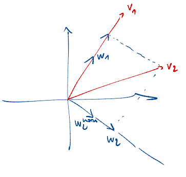

In general, algorithm is as follows:
1. start with $v_1, .., v_n$ any basis of vector space $V$
2. normalize $v_1: v_1 \to w_1 = \frac{v_1}{||v_1||}$
3. $v_2 \to \tilde{w_2} = v_2 - <v_2, w_1>w_1$ (orthogonal to $w_1$)
4. $\tilde{w_2} \to w_2 = \frac{\tilde{w_2}}{||\tilde{w_2}}$
5. $v_3 \to \tilde{w_3} = v_3 - <v_3, w_1>w_1 - <v_3, w_2>w_2$ (orthogonal to $w_1, w_2$)
6. $\tilde{w_3} \to w_3 = \frac{\tilde{w_3}}{||\tilde{w_3}}$
7. ... until $w_n$

*Remark*: if $v_1, ..., v_n$ is a generating set, but not linearly independent, Gram-Schmidt will produce a $0$ vector at some point. Just omit it and continue.

# Linear Maps

Linear maps $f: \mathbb{R}^m \to \mathbb{R}^n$

Linear means:
1. $\forall v,w \in \mathbb{R}^m, f(v + w) = f(v) + f(w)$
2. $\forall v \in \mathbb{R}^m, \forall \alpha \in \mathbb{R}, f(\alpha v) = \alpha f(v)$

$A = Mat_{B, C}(f)$ has the property that if $v \in \mathbb{R}^m$, and $v_B$ is the vector of coordinates of $v$ in $B$, then $A_{v_B}$ is the vector of coordinates of $f(v)$ in $C$. $A_{v_B} = f(v)_C$. If $B = $ canonical basis, then $v_B=v$.

# Change of Basis

$B, C$ bases of $\mathbb{R}^m, \forall f: \mathbb{R}^m \to \mathbb{R}^m, \exists M=Mat_{B,C}(I_d)$
- $Id_m - \mathbb{R}^m (B) \to \mathbb{R}^m (C), v \to v$

$Mat_{B, B}(f) = M^{-1} \cdot Mat_{C, C}(f) \cdot M$

Example:\
$B =$ canonical basis of $\mathbb{R}^2$\
$C = \begin{bmatrix} 1 & -1 \\ 1 & 1\end{bmatrix}$

Write coordinates of $B$ in $C$: \
$\begin{bmatrix}1 \\ 0\end{bmatrix} = \frac{1}{2} \begin{bmatrix}1 \\ 1\end{bmatrix} - \frac{1}{2} \begin{bmatrix}-1 \\ 1\end{bmatrix}$ 

First column of $Mat_{B, C}(Id) = \begin{bmatrix}1/2 \\ -1/2\end{bmatrix}$

$\begin{bmatrix}0 \\ 1\end{bmatrix} = \frac{1}{2} \begin{bmatrix}1 \\ 1\end{bmatrix} + \frac{1}{2} \begin{bmatrix}-1 \\ 1\end{bmatrix}$

Second column of $Mat_{B, C}(Id) = \begin{bmatrix}1/2 \\ 1/2\end{bmatrix}$

Thus:

$Mat_{B, C}(Id) = \begin{bmatrix}1/2 | 1/2 \\ -1/2 | 1/2\end{bmatrix} = \frac{1}{2} \begin{bmatrix}1 | 1 \\ -1 | 1\end{bmatrix}$

$Mat_{C, C}(f) = Mat_{B, C}(Id)^{-1} \cdot Mat_{B, B}(f) \cdot Mat_{B, C}(Id)$

To get $Mat_{B, B}(f)$:
1. Take $b_1$, write the coordinates of $f(b_1)$ in the basis $B$. This gives first column.
2. ... until $m$.

Example:

Let $f : \mathbb{R}^2 \to \mathbb{R}^2$ be defined as follows:

$f(x,y) = (2x, 3y)$

Let $B$ - be basis for $\mathbb{R}^2, B = \begin{bmatrix}1 & -1 \\ 1 & 1\end{bmatrix}, b_1=(1,1), b_2=(-1, 1)$

To calculate $Mat_{B, B}(f)$, we need to find the coordinates of $f(b_1)$ and $f(b_2)$ in the basis $B$, and these coordinates will form the columns of the matrix.

- $f(b_1) = f(1,1) = (2 \cdot 1, 3 \cdot 1) = (2, 3)$.
- express $f(b_1)$ in the basis $B$. We need to find $a, b$ s.t. $f(b_1)_B = a \cdot b_1 + b \cdot b_2$. Solving for $a, b$: $(2,3) = a \cdot (1,1) + b \cdot (-1, 1)$. This gives system of equations: $a - b = 2, a + b = 3$. From this, $a = 5/2, b = 1/2$. Thus, the coordinates of $f(b_1)$ in basis $B$ are: $\begin{bmatrix}5/2 \\ 1/2\end{bmatrix}$
- now for $b_2$: $f(b_2) = (-2, 3)$. $(-2,3) = a \cdot (1,1) + b \cdot (-1, 1)$. $a - b = -2, a + b = 3$. $a = 1/2, b = 5/2$. Thus, the coordinates of $f(b_2)$ in basis $B$ are: $\begin{bmatrix}1/2 \\ 5/2\end{bmatrix}$
- $Mat_{B, B}(f) = \begin{bmatrix}5/2 | 1/2 \\ 1/2 | 5/2\end{bmatrix}$

To get $Mat_{B, C}(f)$:
1. Take $b_1$, write the coordinates of $f(b_1)$ in $C$. This gives first column.
2. ... until $m$.

Example:

$B = \begin{bmatrix}1 & -1 \\ 1 & 1\end{bmatrix}, b_1=(1,1), b_2=(-1, 1)$

$C = \begin{bmatrix}-1 & 2 \\ 1 & 2\end{bmatrix}, c_1=(-1,1), c_2=(2, 2)$

$f(x,y)=(2x, 3y)$

Compute $Mat_{B, C}(f)$.
1. Find $f(b_1)$ in C:
    1. Apply linear transformation $f$ to $b_1$: $f(b_1) = f(1, 1) = (2 \cdot 1, 3 \cdot 1) = (2,3)$
    2. Express $f(b_1)$ as a linear combination of the basis vectors of $C$: $f(b_1) = a \cdot c_1 + b \cdot c_2$.
    3. Solve for coefficients $x$ and $y$:
$$\begin{align}-a + 2b &= 2 \\a + 2b &= 3\end{align}$$ 
$$a = 1/2, b = 5/4$$
$$f(b_1)_C = (1/2, 5/4)$$
2. Find $f(b_2)$ in C:
    1. Apply linear transformation $f$ to $b_2$: $f(b_2) = f(-1, 1) = (2 \cdot -1, 3 \cdot 1) = (-2,3)$
    2. Express $f(b_2)$ as a linear combination of the basis vectors of $C$: $f(b_2) = a \cdot c_1 + b \cdot c_2$.
    3. Solve for coefficients $x$ and $y$: 
$$\begin{align}-a + 2b &= -2 \\a + 2b &= 3\end{align}$$
$$a = 5/2, b = 1/4$$
$$f(b_2)_C = (5/2, 1/4)$$
1. $Mat_{B, C}(f) = \begin{bmatrix} 1/2 & 5/2 \\ 5/4 & 1/4 \end{bmatrix}$

Exercise:

Basis $B \in \mathbb{R}^3 = \begin{bmatrix} 1 & 2 & 1 \\ 2 & 3 & 0 \\ 3 & 4 & 0 \end{bmatrix}$

$b_1 = \begin{bmatrix} 1 \\ 2 \\ 3 \end{bmatrix}$

$b_2 = \begin{bmatrix} 2 \\ 3 \\ 4 \end{bmatrix}$

$b_3 = \begin{bmatrix} 1 \\ 0 \\ 0 \end{bmatrix}$

Basis $C \in \mathbb{R}^2 = \begin{bmatrix} 2 & 1 \\ 1 & 1 \end{bmatrix}$

$c_1 = \begin{bmatrix} 2 \\ 1 \end{bmatrix}$

$c_2 = \begin{bmatrix} 1 \\ 1 \end{bmatrix}$

$f : \mathbb{R}^3 \to \mathbb{R}^2$
$f(b_1) = c_1, f(b_2) = c_2, f(b_3) = c_1 + c_2$

1. Find $Mat_{B, C}(f)$

$f(b_1) = c_1$ \
$f(b_1)_C = x \cdot c_1 + y \cdot c_2 = x \cdot (2, 1) + y \cdot (1,1)$ \
$(2,1) = x \cdot (2, 1) + y \cdot (1,1)$\
$$\begin{align}2x + y &= 2 \\ x + y &= 1\end{align}$$
$x = 1, y = 0$\
$f(b_1)_C = (1,0)$\
$f(b_2)_C = (0,1)$\
$f(b_3)_C = (1,1)$

$Mat_{B, C}(f) = \begin{bmatrix} 1 & 0 & 1 \\ 0 & 1 & 1\end{bmatrix}$

2.

Basis $B' \in \mathbb{R}^3 = \begin{bmatrix} 1 & 0 & 0 \\ 0 & 1 & 0 \\ 0 & 0 & 1 \end{bmatrix}$

Basis $C' \in \mathbb{R}^2 = \begin{bmatrix} 1 & 0 \\ 0 & 1 \end{bmatrix}$

Find: $Mat_{B', C'}(f)$

Solution:

$Mat_{B', C'}(f) = Mat_{C, C'}(Id_n) * Mat_{B, C}(f) * Mat_{B', B}(Id_m)$

TODO: copy from notebook

# Scalar Products

$V$ vector space $/R$

A scalar product is a map $VxV \to \mathbb{R}, (v, w) \to <v,w>$ that is

1. symmetric: $\forall v, w \in V, <v, w> = <w, v>$
2. bilinear:
    - $\forall \alpha \in \mathbb{R}, v, w \in V, <\alpha v, w> = \alpha <v, w>$
    - $\forall \alpha \in \mathbb{R}, v, w \in V, <\alpha v, w> = \alpha <v, w>$
    - linearity on the second argument

Standart scalar product on $\mathbb{R}^n, \mathbb{R}^n \times \mathbb{R}^n \to \mathbb{R}$

$<x,y> := x_1y_1 + x_2y2+ ... + x_ny_n$

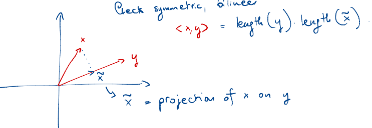

$x$ is **orthogonal** to $y$ $<=> <x, y> = 0$ for $x,y \ne 0$

$<x,x> = len(x)^2$

We require scalar products to be **definite positive**: $<v, v> \ge 0 \forall v \in V$ and $<v, v> = 0 <=> v=0$

In general, scalar products can be described by matricies. Build a matrix $A = (a_{i,j})_{i, j}$, then scalar product is given by:

$$<x, y> = x^TAy$$

, where
- $<x, y> = x^TAy = 1 \times 1 = (1 \times n) (n \times n) (n \times 1)$
- $A = (a_{i,j})_{i, j}$
- $a_{i,j} = <e_i, e_j>$
- $e_1, ..., e_n = E$ - basis of $\mathbb{R}^n$

If $E$ - canonical basis, then $<x, y> = x^Ty$, since $A$ is

$$\begin{bmatrix} 1 & 0 & 0 & ... \\ 0 & 1 & 0 & ...\\ 0 & 0 & 1 & ... \end{bmatrix} = I_{d_{n \times n}}$$

We say a square matrix $A$ is **positive definite** if $<x, y> = x^TAy > 0 \forall x 
\ne 0$

*Special case*: if $A$ is diagonal, then it is positive definite $<=>$ all coefficients on the diagonal are strictly positive.

$A$ has to be symmetric + positive definite in order for $<x, y> = x^TAy$ to be a scalar product. (symmetric: $\begin{bmatrix} 1 & 3\\3 & 1 \end{bmatrix}$)

To check if a matrix $A$ is positive definite, can put it in diagonal form (diagonalize it).

*Remark*: if your vector spaces are $\in C$, inner products = **hermitian** products are not symmetric, instead satisfty:

1. $<x,y> = \overline{<y, x>}$, where $\overline{<>}$ - complex conjugation
2. bilinear + positive definite: $<x,x> = \overline{<x, x>}, <x,x> \in \mathbb{R}$ has to be $>0 \forall x \ne 0$

## Diagonalization

Diagonalziation of matrix $A$ means finding a square invertible matrix $C$ s.t. $CAC^{-1}$ is diagonal (not always possible, but can do it if $A$ is symmetric).

## Norm

$<, >: V \times V \to \mathbb{R}$ is a scalar product, then we define norm $v \in V$ as $||v|| = \sqrt{<v, v>}$ (positive square root).

$||x-y|| = ||y - x||$

# Projections to subspaces

## Orthogonal Projection of a Point onto a Subspace

$x \in \mathbb{R}, \mathbb{R} \supset V$ vector subspace with generators $<v_1, ..., v_n>$

How to compute the projection of $x$ to $V$.

Projection of $x$ to $V$ = point of $V$ that minimizes the distance to $x$ = unique point of $V$ s.t. $P_V(x)$ and $P_V(x) - x$ are orthogonal: $<P_V(x), P_V(x) - x> = 0$

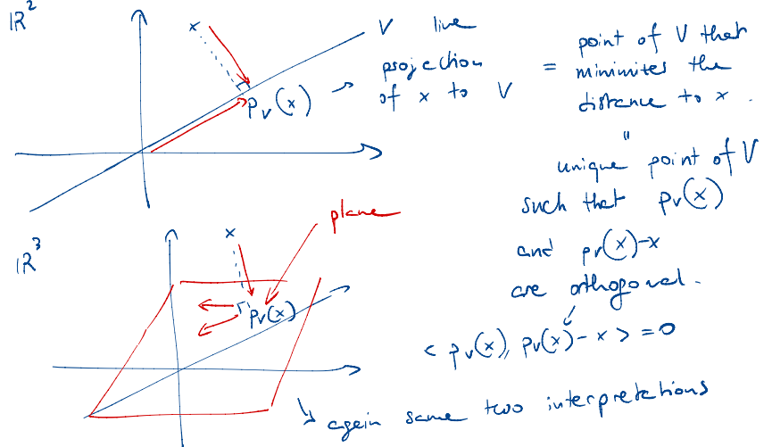

*Defn*: we define the projection of $x$ to $V$ as the point $<P_V(x)$ of $V$ that minimizes the distance $||x - w||$ among $w \in V$

Say that the $v_1, ..., v_n$ is orthonoral basis of $V$. If $w$ is a unit vector, then $<x, w>$ = length of the projection of $x$ on $V$.

Projection:

$$P_V(x) = <x, w>w$$

If $w_1, w_2$ orthonormal basis, then

$P_V(x) = <x, w_1>w_1 + <x, w_2>w_2$

In general, if $v_1, ..., v_n$ is an *orthonormal* basis of $V$, $P_V(x) = <x, v_1>v_1 + <x, v_2>v_2 + <x, v_n>v_n$

In general, if $v_1, ..., v_n$ is a generating set, not orthonormal basis, first use Gram-Schmidt, get orthonormal basis, then compute projection.

Example:

$\mathbb{R}^3 \supset V = <\begin{bmatrix} 1 \\ 0 \\ -1 \end{bmatrix}, <\begin{bmatrix} 0 \\ 2 \\ 0 \end{bmatrix}$ plane

$x = \begin{bmatrix}1\\2\\3\end{bmatrix}$

1. normalize vectors of basis: $w_1 = \frac{1}{\sqrt{2}}\begin{bmatrix}1\\0\\-1\end{bmatrix}, w_2 = \begin{bmatrix}0\\1\\0\end{bmatrix}$
2. $P_V(x) = <x, w_1>w_1 + <x, w_2>w_2 = \begin{bmatrix}-1\\2\\1\end{bmatrix}$

## Projection of a Matrix onto a Subspace | Projection Matrix

$x \in \mathbb{R}^N, \mathbb{R}^N \supset V$ vector subspace with generators $<v_1, ..., v_n>$

Want to project $x$ on $V$.

$V = <v_1, ..., v_m>$

$len(v_m) = n$

Use $v_1, ..., v_m$ as columns of a matrix $A n \times m$

$A = \begin{bmatrix} v_1 | ... | v_m \end{bmatrix}$

$V =$ image of $A =\{A_y | y \in \mathbb{R}^m\} \subset \mathbb{R}^m$

$V -$ space generated by columns of $A$.

$P_V(x) =$ projection of $x$ on $V$.

$x - P_V(x)$ has to be orthogonal to $V$

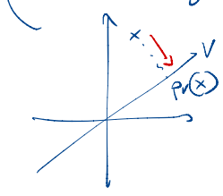

$P_V(x)$ is characterized by $A^T(x - P_V(X)) = 0$

$P_V(x)$ can be written as $Ay$ for some $y \in \mathbb{R}^m$

$y$ has to satisfy the equation:

$$A^T(x - Ay) = 0 <=> A^Tx = A^Tx = A^TAy$$

This linear system always a soluton. If $\{v_1, ..., v_m\}$ is a basis of $V$, then $A^TA$ is invertible.


Solve system, get $y$, then $Ay = P_V(x)$

If $A$ is any matrix with linearly independent columns ($rank(A) =$ # columns) then $A^TA$ is invertible, call $(A^TA)^{-1}$ the pseudoinverse of $A$.

If $\{v_1, ..., v_m \}$ basis, then solution is

$$y = (A^TA)^{-1}A^Tx$$

So, $P_V(x) = Ay = A(A^TA)^{-1}A^Tx$

$(A^TA)^{-1}A^T$ = projection matrix on $V$

Example:

$\mathbb{R}^3 \supset V = <\begin{bmatrix} 1 \\ 0 \\ -1 \end{bmatrix}, <\begin{bmatrix} 0 \\ 2 \\ 0 \end{bmatrix}$ plane

$x = \begin{bmatrix}1&-1\\2&2\\3&4\end{bmatrix}$

1. normalize vectors of basis: $w_1 = \frac{1}{\sqrt{2}}\begin{bmatrix}1\\0\\-1\end{bmatrix}, w_2 = \begin{bmatrix}0\\1\\0\end{bmatrix}, A = \begin{bmatrix}\frac{1}{\sqrt{2}}&0\\0&1\\\frac{-1}{\sqrt{2}}&0\end{bmatrix}$
2. $P_V(x) = Ay, y = (A^TA)^{-1}A^Tx$
3. $y = \begin{bmatrix}-4\sqrt{2}&-10\sqrt{2}\\2&2\end{bmatrix}$
4. $P_V(x) = Ay = \begin{bmatrix}-4&-10\\2&2\\4&10\end{bmatrix}$

# Least Squares Solutions

Problem: $Ax = b$ - linear system

May not have a solution: want "best" possible approximation of a solution.

$Ax=b$ has a solution $<=> b$ is in the image of $A$.

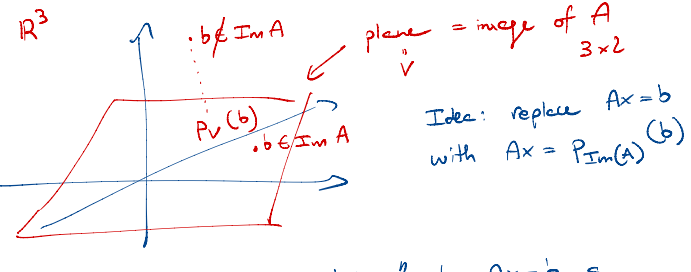

Idea: replace $Ax=b$ with $Ax=P_{Im(A)}(b)$

We call "least squares solution" to $Ax=b$ a solution to $Ax=P_{Im(A)}(b)$

$\begin{bmatrix}a \\ b \end{bmatrix}$ is the solution, means $A\begin{bmatrix}a \\ b \end{bmatrix} = P_{Im(A)}(y)$

$P_{Im(A)}(y)$ is the vector in $Im(A)$ that is closest to $y$.

Thus, $\begin{bmatrix}a \\ b \end{bmatrix}$ minimizes the distance of $y$ to $Im(A)$

Distance from $y$ to $A\begin{bmatrix}a \\ b \end{bmatrix}: ||y - A\begin{bmatrix}a \\ b \end{bmatrix}|| = || \begin{bmatrix}y_1 \\ ... \\ y_n\end{bmatrix} - \begin{bmatrix}ax_1 + b\\...\\ax_n + b \end{bmatrix}|| = ||\begin{bmatrix}y_1 - ax_1 - b\\...\\y_n - ax_n - b \end{bmatrix}|| = \sqrt{(y_1 - ax_1 - b)^2 + ... + (y_n - ax_n - b)^2}$

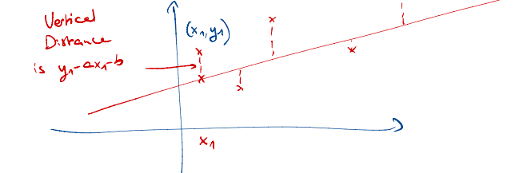

To compute:
1. if $rank(A) =$ # columns, then $P_{I_m(A)}(b) = A(A^TA)^{-1}A^Tb$ is unique and given by $x = (A^TA)^{-1}A^Tb$
2. if $rank(A) <$ columns, either solve a system to get a projection, or modify $A$ by removing columns.

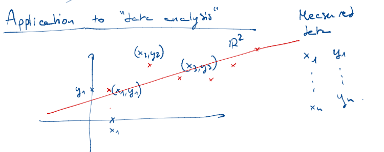

To find best approximation $(a,b)$ (interpolate the data)
1. try to interpolate with a line (usually not the case):
   - ideally, can find (a, b) s.t. 
$$\begin{align}ax_1 + b =y_1 \\ ... \\ ax_n + b =y_n \end{align}$$

If system has solution $(a, b)$ then we have a perfect linear fit.

If it has no solution, we find a least squares solution.

$A\begin{bmatrix} a \\ b \end{bmatrix} = \begin{bmatrix} y_1 \\ ... \\ y_n \end{bmatrix}$

$A = \begin{bmatrix} x_1 & 1 \\ ... & ... \\ x_n & 1 \end{bmatrix}$

Example:

$A = \begin{bmatrix} 0 & 1 \\  1& 1 \\ 2& 1 \\ 3 & 1 \\\end{bmatrix}$

$y = \begin{bmatrix} -1 \\  1 \\ 2 \\ 2 \\\end{bmatrix}$

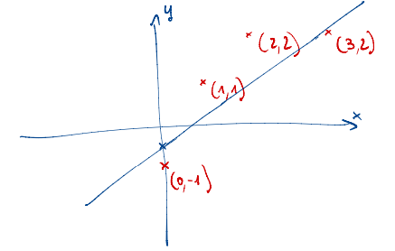

Looking for linear fit $y = ax + b$

$\begin{bmatrix} a\\b\end{bmatrix}$?

Least squares solution is $\begin{bmatrix} a\\b\end{bmatrix} = (A^TA)^{-1}A^Ty$

$\begin{bmatrix} a\\b\end{bmatrix} = \begin{bmatrix} 1\\-1/2\end{bmatrix}$

## Quadratic Fit

We can try the same with fits of higher degree.

$y = ax^2 + bx +c$

$\begin{bmatrix} x_1\\...\\x_n\end{bmatrix},\begin{bmatrix} y_1\\...\\y_n\end{bmatrix}$

$$\begin{align}ax_1^2 + bx_1 + c = y_1\\...\\ax_n^2 + bx_n + c = y_n\end{align}$$

$A = \begin{bmatrix}x_1^2 & x_1 & 1\\...\\x_n^2 & x_n & 1\end{bmatrix}$

Least squares solution is:

$\begin{bmatrix}a\\b\\c\end{bmatrix} = (A^TA)^{-1}A^Ty$

*Remark*: say you have $n$ points. You can always find perfect fit of the form $y=a_{n-1}x^{n-1} + a_{n-2}x^{n-2} + ... + a_0$

## Trigonometric Fit

$y = acos(x) + bsin(x)$

$A = \begin{bmatrix}cos(x_1) & sin(x_1)\\...\\cos(x_n) & sin(x_n)\end{bmatrix}$

## Homogeneous Linear Fit

Homogeneous linear fit is the fit of the form: $f(x,y) = z = \alpha x + by$

To find:

$A = \begin{bmatrix} \alpha x_1 & by_1 \\ ... \\ \alpha x_n & by_n \end{bmatrix}$

$\begin{bmatrix} a \\ b \end{bmatrix} = A \cdot z$

# Diagonizing Matricies / Eigenvalues & Eigenvectors

$A \in \mathbb{R}^{n \times n}$ is a linear map $\phi: \to \mathbb{R}^n \to \mathbb{R}^n, x \to Ax$. In some other bases, $\phi$ might have a simpler matrix, e.g. a diagonal matrix.

Question: $\exist ?$ invertible matrix $M \in \mathbb{R}^{n \times n}$ s.t. $M^{-1}AM$ diagonal.

If $A = \begin{bmatrix} a_1 & ... & ...\\ 0 & a_2 & ... \end{bmatrix}$ is the matrix of $\phi$ in some basis $(b_1, ..., b_n)$

$=> \phi(b_1) = a_1b_1, ..., \phi(b_n) = a_nb_n$

$b_1,...,b_n$ - eigenvectors of $\phi$
$a_1, ..., a_n$ - eigenvalues.

**Defn**: $A \in \mathbb{R}^{n \times n}$, we say that $v \in \mathbb{R}^n$ is an **eigenvector** of $A$ if $Av=\alpha v$ for some $\alpha \in \mathbb{R}$. We say $\alpha \in \mathbb{R}$ is an **eigenvalue** of $A$ if $\exist$ eigenvector $v$ of $A$ s.t. $Av=\alpha v$

If $\phi$ - linear map, then $\phi(v) = \alpha v$

How to find eigenvectors? If we know $\alpha$, then solve $Av = \alpha v$

Tool for finding $\alpha$ of $A$: **characteristic** polynomial.

$det(x Id_{n \times n} - A) \in \mathbb{R}[x]$, where
- $x$ - variable
- $A$ - matrix with coefficients in $\mathbb{R}[x]$
- $\mathbb{R}[x]$ - polynomials in the variable $x$ with real coefficients

Example:

$A = \begin{bmatrix} 1 & 2 & 1\\0 & 1 & 1\\-1 & 2 & 0 \end{bmatrix}$

$xId_{3 \times 3} - A = \begin{bmatrix} x & 0 & 0\\0 & x & 0\\0 & 0 & x \end{bmatrix} - A = \begin{bmatrix} x - 1 & -2 & -1\\0 & x - 1 & -1\\1 & -2 & x \end{bmatrix} \to$ $det$ is polynomial of degree 3.

$$det(A - XId_{n \times n}) = (-1)^n det(XId_{n \times n} - A)$$

**Thm**: the eigenvalues of $A$ are the roots of $P_{car}(A) (P_{car}(A) = 0)$

*Careful*: the real eigenvalues of $A$ are the real roots of $P_{car}(A)$, but not all roots $P_{car}(A)$ have to be real.

So, diagonalizing $A <=>$ finding a basis of $\mathbb{R}^n$ that consists of eigenvectors for $A$.

How to look for it?

1. Compute $P_{car}(A)$ and its roots. If $P_{car}(A)$ has some non-real roots, then cannot diagonalize $A$ over $\mathbb{R}$. Repeated roots are OK. For instance, if $A$ is already diagonalized $A = \begin{bmatrix} a_1 & 0 & 0 & ... \\ 0 & a_2 & 0 & ... \\ 0 & 0 & a_3 & ... \end{bmatrix}$, then $P_{car}(A) = (x - a_1)(x - a_2)...(x - a_n)$. For identity matrix,  $P_{car}(A) = (x - 1)^n$. For repeated roots, $A = \begin{bmatrix} 2 & 0 & 0 & ... \\ 0 & 2 & 0 & ... \\ 0 & 0 & 1 & ... \end{bmatrix}, P_{car}(A) = (x - 2)^1(x - 1)$. If all roots are real, go to Step 2.
2. For every root $\alpha$ of $P_{car}(A)$, cimoute eigenvectors of eigenvalue $\alpha$: solve the system $Av = \alpha v <=> Av - \alpha v = 0 <=> (A - \alpha Id_{n \times n})v = 0$. So we are computing $ker(A - \alpha Id_{n \times n})$. This is **eigenspace** of eigenvalue $\alpha$. To compute, apply row-reduction to $A - \alpha Id_{n \times n}$. Eigenvectors of eigenvalue $\alpha$ are the elements of eigenspace.

**Defn**: $M \in \mathbb{R}^{m \times n}$ matrix $ker(M) = \{ v \in \mathbb{R}^n | Mv=0 \}$

Remember: since $\alpha$ is an eigenvalue, has to have an eigenvector => $ker(A - \alpha Id_{n \times n}) \ne 0$

Once we have computed all eigenspaces we have two cases:

1. all eigenspaces together generate $\mathbb{R}^n <=> \sum dim(ker(A - \alpha Id_{n \times n})) = n <=> A$ diagonalizble. To find basis of $\mathbb{R}^n$ consisting of eigenvectors, take a basis of each eigenspace.
2. "too few eigenvectors" $\sum dim(ker(A - \alpha Id_{n \times n})) < n <=> A$ is not diagonalizble.

Example:

$A = \begin{bmatrix} 0 & 0 & -2 \\ 1 & 2 & 1 \\ 1 & 0 & 5 \end{bmatrix}$

$A$ is diagonalible?

$P_{car}(A) = det(xId_{3 \times 3} - A) = det\begin{bmatrix} x & 0 & 2 \\ -1 & x-2 & -1 \\ -1 & x-5 \end{bmatrix} = (x-2)(x^2 - 5x + 2)$

$\alpha_1 = 2, \alpha_2 = \frac{5-\sqrt{17}}{2}, \alpha_3 = \frac{5+\sqrt{17}}{2}$

Since we have 3 distinct real eigenvalues, then $A$ is diagonalizble: every eigenvalues has at least 1 eigenvector, if $v_1, v_2, v_3$ are eigenvectors for the 3 eigenvalues, then $\{ v_1, v_2, v_3 \}$ is a basis of $\mathbb{R}^3$.

Diagonal form of $A = \begin{bmatrix} 2 & 0 & 0 \\ 0 & \frac{5-\sqrt{17}}{2} & 0 \\ 0 & 0 & \frac{5+\sqrt{17}}{2} \end{bmatrix}$ 

If you want $M$ s.t. $M^{-1}AM$ diagonal, then need to compute $v_1, v_2, v_3$. Then $M = (v_1 | v_2 | v_3)$. For linear maps, this amounts to change of basis from canonical basis to $ \{v_1 | v_2 | v_3\}$

Want to find $v_1$: compute eigenspace for 2.

$ker(A - 2Id_{3 \times 3}) = \begin{bmatrix} -2 & 0 & -2 \\ 1 & 0 & 1 \\ 1 & 0 & 3 \end{bmatrix}$

$A \in \mathbb{R}^{n \times n}, dim(ker(A)) + dim(ImA) = n$. Since $dim(ImA)$ = 2 (remove columns with 0, other 2 columns are lin. indep.), then $dim(ker(A))$ should be 1.

Solving $\begin{bmatrix} -2 & 0 & -2 \\ 1 & 0 & 1 \\ 1 & 0 & 3 \end{bmatrix} \begin{bmatrix} x \\ y \\ z \end{bmatrix} = \begin{bmatrix} 0 \\ 0 \\ 0 \end{bmatrix}$

Perform row-reduction. We get:

$ker(A - 2Id_{3 \times 3}) = \begin{bmatrix} 1 & 0 & 1 \\ 0 & 0 & 1 \\ 0 & 0 & 1 \end{bmatrix}\begin{bmatrix} x \\ y \\ z \end{bmatrix} = \begin{bmatrix} 0 \\ 0 \\ 0 \end{bmatrix}$

$x + z = 0, z = 0, x = 0$

So, $v = \{\begin{bmatrix} 0 \\ y \\ 0 \end{bmatrix}, y \in \mathbb{R}\}$

or generator $<\begin{bmatrix} 0 \\ 1 \\ 0 \end{bmatrix}>$

This is eigenspace for $\alpha = 2, 1$ dimensional.

Example where cannot a matrix cannot be diagonalizable:

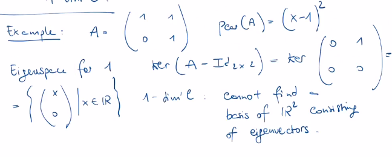

Since we get only 1-dim eigenspace for eigenvalue, but space is $\mathbb{R}^2$, not diagonalizable.

**Jordan Bloc**: $\begin{bmatrix} \alpha & 1 \\ 0 & \alpha \end{bmatrix}$, $\begin{bmatrix} \alpha & 1 & 0 \\ 0 & \alpha & 1 \\ 0 & 0 & \alpha \end{bmatrix}$

**Thm**: $A \in \mathbb{R}^{n \times n}$, assume all eigenvalues of $A$ are real. Then $A$ admits a Jordan form: $\exist M \in \mathbb{R}^{n \times n}$, invertible, s.t.


It's best you can do if matrix is not diagnolizable.

**Real Jordan Form**:


To know if some matrix $A$ is diagonalizable, enough to compute the minimal polynomial $P_{min}(A)$, which is a monic polymonial of smallest degree that "annihilates" A.

Example:

$A = \begin{bmatrix} 1 & 1 \\ 0 & 1 \end{bmatrix}$

$P_{car}(A) = (x - 1)^2$

Compute polynomial with $x = A$, get 0:

$(A - Id_{2 \times 2})^2 = \begin{bmatrix} 0 & 1 \\ 0 & 0 \end{bmatrix} = \begin{bmatrix} 0 & 0 \\ 0 & 0 \end{bmatrix}$.

This matrix cannot be diagonalized since minimal polynomial has multiplicity 2.

Example:

$A = \begin{bmatrix} 1 & 0 \\ 0 & 1 \end{bmatrix}$

$P_{car}(A) = (x - 1)^2$

Compute polynomial with $x = A$, get 0:

$(A - Id_{2 \times 2})^2 = \begin{bmatrix} 0 & 1 \\ 0 & 0 \end{bmatrix} = \begin{bmatrix} 0 & 0 \\ 0 & 0 \end{bmatrix}$

But $P_{min}(A) = x - 1$

$A$ is diagonalizable if and only if $P_{min}(A)$ only has linear factors with multiplicity 1.

*Remark*: if we work over $C, A \in C^{n \times n}, Pcar(A) = C[x]$, degree $n$, has $n$ complex roots with multiplicity.

If $A$ has real coefficients, $Pcar(A)$ has real coefficients. Non-real roots come in conjugate pairs $(a + ib, a -ib)$ same multiplicity.

*Recall*: $Pcar(A)$ is invariant under conjugation:

$Pcar(CAC^{-1})= Pcar(A) => trace(A), det(A)$ also invariant

$trace(A)$ - sum of elements on the diagonal.

If $CAC^{-1}$ diagonal, diagonal = list of eigenvalues of $A$ => $trace(A)$ = sum of eigenvalues.

# Diagonalization and Scalar Products

$\mathbb{R}^n, <,>$ scalar product.

$A \in \mathbb{R}^{n \times n}$

**Defn**: 1. $A$ is self-adjoint with respect to $<,>$ if $\forall v,w \in \mathbb{R}^n, <v, Aw> = <Av, w>$
2. $A$ is orthogonal with respect to $<,>$ if $\forall v,w \in \mathbb{R}^n, <Av, Aw> = <v, w>$

To rewrite 1. its enough to observer that $\forall A in \mathbb{R}$, $\forall v, w \in \mathbb{R}, <v, Aw> = <A^Tv, w>$. For the standart scalar product, $<v, Aw> = v^TAw$

$A$ is self-adjoint $<=> A^T=A => A$ is symmetric.

For 2. can also say that $A$ is an isometry (means $\forall v \in \mathbb{R}, ||Av|| = ||v||$).

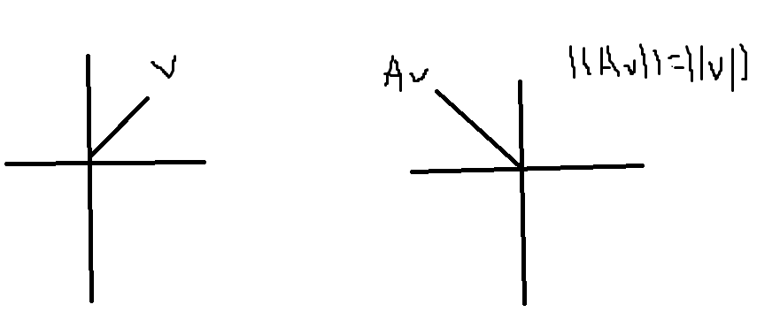

Two conditions are equivalent: $\forall v \in \mathbb{R}, ||Av||=||v|| <=> \forall v,w \in \mathbb{R}, <Av, Aw>=<v,w>, v=w, <Av,Av>=<v,v>, \sqrt{<Av, Av>}=\sqrt{<v,v>}=||Av||=||v||$

Use this trick:

$<v + w, v + w> = <v,v> + <w,v> + <v,w> + <w,w> = <v,v> + 2<v,w> + <w,w> => <v,w> = \frac{||v+w||^2 - ||v||^2 - ||w||^2}{2}$

If $A$ preserves norms:

$<Av, Aw> = \frac{||Av+Aw||^2 - ||Av||^2 - ||Aw||^2}{2}$

Can show $A$ is orthogonal $<=>$ the columns of $A$ form an orthonormal basis.

Also: $<Av, Aw> = <v,w> \forall v, w \in \mathbb{R}^n => <A^TAv, w> = <v,w> <=> A^TA = Id_{n \times n}$

In other words, if $A^TA = Id_{n \times n}$ you have an orthogonal matrix.

**Defn**: $A$ is normal if it is either symmetric(self-adjoint) or orthogonal.

*Remark*: if $A \in C, A$ is self-adjoint if $A=\overline{A}^T$. Also instead of orthogonal we say unitary.

## Spectral Theorem

If $A \in \mathbb{R}^{n \times n}$ is normal (with respect to $<,>$) then it can be diagonalized. Also, can find orthogonal matrix $C$ s.t. $CAC^{-1}$ is diagonal.

Consequence: if $A$ is normal, then $R^n$ admits an orthonormal basis of eigenvectors of $A$.

*Special case*: $A$ symmetric $=>$ can be diagonalizable.

Now, start with any $A$ any size $A \in \mathbb{R}^{m \times n}$, cam compute $A^TA \in \mathbb{R}^{n \times n}$, symmetric. In other words, even if $A$ is not square, can always apply Spectral Theorem $A^TA$. $A^TA$ will be conjugate to some matrix $\begin{bmatrix} \sigma_1 & ... \\ ... & \sigma_n \end{bmatrix}, \sigma \in \mathbb{R}$. If $A$ already diagonalizable, $A ~ \begin{bmatrix} a_1 & ... \\ ... & a_n \end{bmatrix}$, $A^TA ~ \begin{bmatrix} a_1^2 & ... \\ ... & a_n^2 \end{bmatrix}$. Eigenvalues of $A^TA$ are squares of eigenvalues of $A$ (if all eigenvalues of $A \in \mathbb{R}$ are real).

If $A$ has non-real eigenvalues, say $A = \begin{bmatrix} a & b \\ -b & a \end{bmatrix}$, then $A^TA = \begin{bmatrix} a^2 + b^2 & 0 \\ a^2 + b^2 & 0 \end{bmatrix}$. $a^2 + b^2 \to norm(a + ib) = norm(a -ib) = (a +ib)(a - ib)$ 

# Powers of Matrix

$A \in \mathbb{R}^{n \times n}, A^K = A \cdot A \cdot ...$ up to $K$

If $A$ is diagonalizable, can do this computation more efficiently:
1. diagonalize $A$, find $C$, invertible, s.t. $C^{-1}AC$ diagonal.
2. compute power: $\begin{bmatrix} \alpha_1^K & ... \\ 0 & \alpha_n^K \end{bmatrix}$

$(C^{-1}AC)^K = C^{-1}AC \cdot C^{-1}AC \cdot ... = C^{-1}A^KC$

To compute $A^K = C \begin{bmatrix} \alpha_1^K & ... \\ 0 & \alpha_n^K \end{bmatrix} C^{-1}$ 

## Application to Fibonacci Numbers

Goal: write a formula for $a_n$, where $a_{n+1} = a_n + a_{n-1}$

$\begin{bmatrix} a_{n+1} \\ a_n \end{bmatrix} = A \begin{bmatrix} a_{n} \\ a_{n-1} \end{bmatrix}$

$A = \begin{bmatrix} 1  & 1 \\ 1 & 0 \end{bmatrix}$ (is determined by the recursion sequence, multuplication below should give $a_n + a_{n-1}$)

$Pcar(A) = det \begin{bmatrix} x-1  & -1 \\ -1 & x \end{bmatrix} = x(x - 1) + 1 = x^2 - x - 1$

Roots: $3/2 < r_1 = \frac{1 + \sqrt{5}}{2} < 3, -1 < r_2 = \frac{1 - \sqrt{5}}{2} < 0$

Now: $\begin{bmatrix} a_{n+1} \\ a_n \end{bmatrix} = A^n \begin{bmatrix} a_{1} \\ a_0 \end{bmatrix}$

Try to compute $A^n$ by diagonalizing $A$.

Find eigenvectors for $A$:

$r_1 = \frac{1 + \sqrt{5}}{2}, ker(A - \frac{1 + \sqrt{5}}{2}Id) = \begin{bmatrix} \frac{1 - \sqrt{5}}{2} & 1\\ 1 & -\frac{1 + \sqrt{5}}{2} \end{bmatrix}$

Row-reduce ... => $\begin{bmatrix} 1 & -\frac{1 + \sqrt{5}}{2}\\ 0 & 0 \end{bmatrix}$

$\{ (x, y) | x -  \frac{1 + \sqrt{5}}{2}y = 0\} = \{ (r_1y, y), y \in \mathbb{R}\} = <\begin{bmatrix}r_1\\1\end{bmatrix}>$

$\begin{bmatrix}r_1\\1\end{bmatrix}$ is the eigenvectors for eigenvalue $r_1$

...

$\begin{bmatrix}r_2\\1\end{bmatrix}$ is the eigenvectors for eigenvalue $r_2$

$C^{-1}AC = \begin{bmatrix} r_1 & 0 \\ 0 & r_2 \end{bmatrix}$

$C = \begin{bmatrix} r_1 & r_2 \\ 1 & 1 \end{bmatrix}$

$A^n = C \begin{bmatrix} r_1^n & 0 \\ 0 & r_2^n \end{bmatrix} C^{-1}$

$\begin{bmatrix} a_{n+1} \\ a_n \end{bmatrix} = C \begin{bmatrix} r_1^n & 0 \\ 0 & r_2^n \end{bmatrix} C^{-1}$

$\begin{bmatrix}a_{n+1}\\a_n\end{bmatrix} = CAC^-1\begin{bmatrix}a_1\\a_0\end{bmatrix} = CAC^-1\begin{bmatrix}1\\0\end{bmatrix}$

Get a formula for $a_n$

This method can be used for any recursive problem.

# Norms of Matricies

$||v|| = \sqrt{<v,v>}$ - for vectors

The norm of a matrix is a "measure" of the size of its coefficients (some kind of an average).

**Defn**: $A$ norm on $\mathbb{R}^{n \times n}$ is a map $\mathbb{R}^{n \times n} \to \mathbb{R} \ge 0$ s.t.: 1. $||A|| = 0 <=> A =0$, 2. $||\alpha A|| = |alpha| \cdot ||A||$, 3. $||A + B|| \le ||A|| + ||B||$ (triangle inequality). Optionally: "multiplicativity": $||AB|| = ||A|| \cdot ||B||$

## Frobenius Norm

$A = (a_{ij})_{i,j} \in \mathbb{R}^{n\times n}$

$||A||_2 = \sqrt{\sum_{i, j} a^2_{ij}}$

Example:

$||\begin{bmatrix} 2 & 1 \\ -1 & 3 \end{bmatrix}||_2 = \sqrt{2^2 + 1^2 + (-1)^2 + 3^2} = \sqrt{15}$

Could also define: $||A||_m = \sqrt{\sum_{i, j} |a^m_{ij}|}^m$

If $A$ is diagonal, then $||A||_2 = \sqrt{a_1^2 + ... a_n^2}$

If all eigenvalues of $A$ are real, $||A||_ = \sqrt{\alpha_1^2 + ... \alpha_n^2}$

## Operator Norm

The operator norm, also known as the matrix norm or the operator norm induced by a vector norm, is a way to measure the size or magnitude of a linear operator (a matrix) in the context of linear algebra. It quantifies how much a linear transformation can stretch or scale vectors in a vector space. 

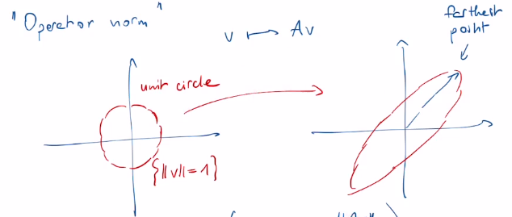

$||A|| = \max{||Av||}_{||v||=1} = \max{\frac{||Av||}{||v||}}, ||v|| \ne 0$

In other words, it's the maximum amplification factor by which the matrix A can stretch a non-zero vector x.

If all eigenvalues of $A$ are real, then $||A|| =$ largest among $|\lambda|$ eigenvalue of $A$

In general, $||A|| =$ largest among $||\lambda||$, where $\lambda$ - eigenvalues of $A$, $||\lambda||$ - complex norm $||a + ib|| = \sqrt{a^2 + b^2}$

$A^TA$, $||A|| =$ largest among $\sqrt{\lambda}$, where $\lambda$ - eigenvalue of $A^TA$

$\sqrt{\lambda}$ - singluar value of a matrix.

Observe $||A|| \le ||A||_2 := \sqrt{\sum_{i,j}a_{ij}^2}$

$A$ diagonal: $||A|| =$ largest $||a_i||$, $||A||_2 = \sqrt{\sum_ia_i^2} \ge ||A||$

# Singular Value Decomposition (SVD)

$A \in \mathbb{R}^{m \times n}$ any matrix (can be $m \ne n$)

Goal: write $A$ as a product: 

$$A = U \cdot D \cdot V^T$$

- $D^{r \times r}$ - diagonal matrix, $D=\begin{bmatrix} \sigma_1 & ... \\ ... & \
\sigma_r \end{bmatrix}$ where $r=rank(A), r \le m, r \le n$, $sigma_1, ..., sigma_r -$ singular values of $A$.
- $U^{m \times r}$ - real matrix, columns form orthonormal basis.
- $V^{r \times n}$ - real matrix, columns form orthonormal basis.

Case when $A$ is of rank 1:

all columns are linearly independent

$u \in \mathbb{R}^m, v \in \mathbb{R}^n$

$u^{m \times 1}, v^{1 \times n}$

$u \cdot v^T = A \in \mathbb{R}^{m \times n}$

Example:

$u = \begin{bmatrix}
    1 \\ 2 \\ 3
\end{bmatrix}, v^T=\begin{bmatrix} 2&-1&1 \end{bmatrix}$

$uv^T=\begin{bmatrix}
    2 & -1 & 1\\4&-2&2\\6&-3&3
\end{bmatrix}$

$3 \times 3, 9$ coefficients

Every matrix of rank 1 is of the form $uv^T$ for some $u,v$.

To find SVD:

$A = \begin{bmatrix}
    a_1 \\...\\a_m
\end{bmatrix}$

$v \in \mathbb{R}^n$

$Av = \begin{bmatrix}
    <a_1, v>\\...\\<a_m, v>
\end{bmatrix}$

If $||v|| = 1$ - unit vectors, then $<a_m, v>$ is the length of the projection of $a_m$ on $v$.

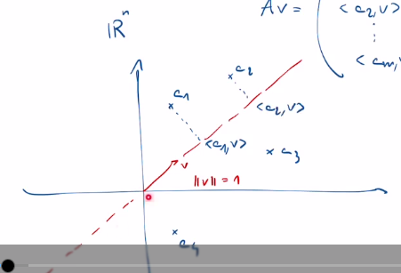

The idea is that we want a single vector $v$, single direction, to capture as much information of the rows of $A$ as possible (look picture above). So that the projections are as large as possible. We want $v$ to "distingiush" the rows $a_i$ as much as possible: we want $<a_i, v>$ to be as large as possible.

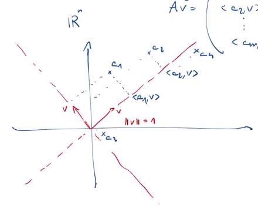

How to find a vector $v$ that maximizes these quantities?

We try to maximize $\sum_i<a_i, v>^2$

$||a_i||^2 = <a_i, v>^2 + ||a_i - <a_i, v>v||^2$

$\sum_i||a_i||^2 = \sum_i<a_i, v>^2 + \sum_i||a_i - <a_i, v>v||^2$

$\sum_i||a_i||^2$ - constant


Want to maximize: $\sum_i<a_i, v>^2$

Thus want to minimize: $\sum_i||a_i - <a_i, v>v||^2$

Maximizing projections = minimizing distances of $a_i$ from $v$.

This is why we are looking for a direction that as close as possible to the $a_i$'s = rows of $A$.

We choose $v$ to be any unit vector s.t. $||A|| = ||Av||$

This $v$ is good because:

$||Av|| = || \begin{bmatrix}
    <a_1, v>\\...\\<a_m, v>
\end{bmatrix} || = \sqrt{<a_1, v>^2 + ... + <a_m, v>^2}$

$\sqrt{<a_1, v>^2 + ... + <a_m, v>^2}$ - want to maximize.

We call this 1st vector $v_1$ (= 1st right singular vector of $A$)

We call $||Av_1|| = \sigma_1$ the 1st singular value of $A$(norm 1)

We define 1st left singular vector $u_1 = \frac{Av}{||Av||}$ (norm 1)

*$Rank(A) = 1 => A = u_1 \cdot \sigma_1 v_1^T$*. It's different from above ($A = u_1 \cdot v_1^T$) because we did not normalize vectors before.

Now we iterate: 

2nd step: we try to maximize the ||Av|| among unit vectors orthogonal to $v_1$.

$v_2 =$ vector achieving $max ||Av||, ||v|| = 1, <v, v_1> = 0$

$v_2$ - 2nd right singular vector.

$u_2 = \frac{Av_2}{||Av_2||}$ - 2nd left singular vector.

3rd step: look for $v_3$ achieving $max ||Av||, ||v|| = 1, <v, v_1> = <v, v_2> = 0$

*Remarks*:
1. Algorithm termiantes: cannot have an orthonormal family with more that $n$ vectors in $\mathbb{R}^n$. Actually, terminates after $r$ steps, where $r = rk(A)$. After that, all singular values will be 0.
2. By construction $\{ v_1, ..., v_r \}$ orthonormal family, $\{ w_1, ..., w_r \}$ orthonormal family
3. $\sigma_1 \ge ... \ge \sigma_r$: at every step we maximize $||Av||$ on a smaller space.
4. Actually get SVD of $A$: $A = \begin{bmatrix}
    u_1 & ... & u_r
\end{bmatrix} \cdot \begin{bmatrix}
    \sigma_1 & ... \\... &\sigma_r
\end{bmatrix} \cdot \begin{bmatrix}
    v_1 & ... & v_r
\end{bmatrix}^T$
Can write this product as:
$A = u_1 \sigma_1 v_1^T + ... + u_r \sigma_r v_r^T$, where $u_r, \sigma_r, v_r^T$ - matricies of rank 1.

$rk(A) = r$, thus it equals to the sum of pieces of rank 1. The amount of data you need to describe $rank(A) = r$ matrix is much smaller than you need to write it coefficient by coefficient.

**If some of the $\sigma_i$ are negligible (smaller than other $\sigma$), we throw them away.**

If you want the best approximation of a matrix of just rank 1(rank 1 of approximation that is), then you just take the first element in the sum of $A = u_1\sigma_1v_1^T$.

This means SVD - approximation of a matrix by rank.

If you want better approximation, then take larger rank of approximation.

*Fact*:
1. $\forall k \le r$, then $Vect(v_1, ..., v_k) \subset \mathbb{R}^n$ maximizes the quantity $\sum^m_{i=1} ||P_v(a_i)||^2$ among all $k$-dimensional subspaces of $\mathbb{R}^n$ (maximize on $Av$ for $v_1$, then maximize $Av$ for the orthogonal $v_2$ of the first vector, ... until $v_k$)
2. 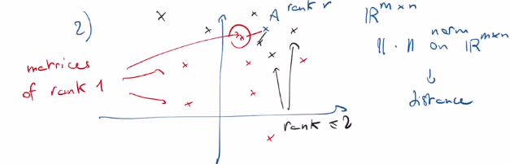\
   (minimize distance between a matrix of rank $k$ and matrix of rank $r$ that we want to decompose)
3. $\sigma_1, ..., \sigma_r$ are the square roots of the eigenvalues of $A^TA$ that $\ne 0$ ($rk(A^TA) = rk(A)=r$), and $v_1, ..., v_r$ are the corresponding eigenvectors of $A^TA$.

To compute the Singular Value Decomposition (SVD) of the matrix $A$ ($A = UDV^T$), you can follow these steps:

1. First, calculate the product of $A^T$ and $A$, $A^TA$.
2. Find the eigenvalues and eigenvectors of $A^TA$.
3. Normalize eigenvectors (you get $V$)
4. Compute $U = AVD^T$
5. Normalize $U$

Example:

Compute SVD of:

$A = \begin{bmatrix}
    -1 & 1 & 0 \\ 1 & 0 & 1
\end{bmatrix}$

1. Find $A^TA$

$A^TA = \begin{bmatrix}
    -1 & 1 \\ 1 & 0 \\ 0 & 1
\end{bmatrix} \cdot \begin{bmatrix}
    -1 & 1 & 0 \\ 1 & 0 & 1
\end{bmatrix} = \begin{bmatrix} 2 & -1 & 1 \\ -1 & 1 & 0 \\ 1 & 0 & 1 \end{bmatrix} = W$

2. Find eigenvalues and eigenvectors of $W$

Eigenvalues:

$det(W - \alpha Id) = 0$

$W - \alpha Id = \begin{bmatrix} 2 - \alpha & -1 & 1 \\ -1 & 1 - \alpha & 0 \\ 1 & 0 & 1 - \alpha \end{bmatrix}$

$-\alpha^3 + 4\alpha^2 - 3\alpha = 0$

$\alpha_1 = 3$\
$\alpha_2 = 1$\
$\alpha_3 = 0$

Eigenvectors:

$ker(W - 3Id) = \begin{bmatrix} -1 & -1 & 1 \\ -1 & -2 & 0 \\ 1 & 0 & -2 \end{bmatrix}$

$v_1 = \begin{bmatrix}
    2\\-1\\1
\end{bmatrix}$

$ker(W - 1Id) = \begin{bmatrix} 1 & -1 & 1 \\ -1 & 0 & 0 \\ 1 & 0 & 0 \end{bmatrix}$

$v_2 = \begin{bmatrix}
    0\\1\\1
\end{bmatrix}$

$ker(W - 0Id) = \begin{bmatrix} 2 & -1 & 1 \\ -1 & 1 & 0 \\ 1 & 0 & 1 \end{bmatrix}$

$v_3 = \begin{bmatrix}
    -1\\-1\\1
\end{bmatrix}$

3. Normalize eigenvectors

The singular values ($\sigma$) are the square roots of the eigenvalues: $\sigma_1 = \sqrt{3}, \sigma_2 = 1, \sigma_3 = 0$

Now, let's normalize the eigenvectors:

For $\sigma_1 = \sqrt{3}$:
Right singular vector $v_1 = \begin{bmatrix}
    \frac{2}{\sqrt{6}}\\\frac{-1}{\sqrt{6}}\\\frac{1}{\sqrt{6}}
\end{bmatrix}$

For $\sigma_2 = 1$:
Right singular vector $v_2 = \begin{bmatrix}
    0\\\frac{1}{\sqrt{2}}\\\frac{1}{\sqrt{2}}
\end{bmatrix}$

For $\sigma_3 = 0$:
Right singular vector $v_3 = \begin{bmatrix}
    \frac{-1}{\sqrt{3}}\\\frac{-1}{\sqrt{3}}\\\frac{1}{\sqrt{3}}
\end{bmatrix}$

4. Find $U = AVD^T$

$A = UDV^T = U \cdot \begin{bmatrix}\sqrt{3} & 0 & 0\\0 & 1 & 0\\0 & 0 & 0\end{bmatrix} \cdot \begin{bmatrix}
    \frac{2}{\sqrt{6}}& 0 & \frac{-1}{\sqrt{3}}\\\frac{-1}{\sqrt{6}} & \frac{1}{\sqrt{2}} & \frac{-1}{\sqrt{3}}\\\frac{1}{\sqrt{6}} & \frac{1}{\sqrt{2}} & \frac{1}{\sqrt{3}}
\end{bmatrix}^T$

$AVD^T = U$

$AV = \begin{bmatrix}
    -1 & 1 & 0 \\ 1 & 0 & 1
\end{bmatrix} \cdot \begin{bmatrix}
    \frac{2}{\sqrt{6}}& 0 & \frac{-1}{\sqrt{3}}\\\frac{-1}{\sqrt{6}} & \frac{1}{\sqrt{2}} & \frac{-1}{\sqrt{3}}\\\frac{1}{\sqrt{6}} & \frac{1}{\sqrt{2}} & \frac{1}{\sqrt{3}}
\end{bmatrix} = \begin{bmatrix}
    \frac{-3}{\sqrt{6}} & \frac{1}{\sqrt{2}} & 0 \\ \frac{3}{\sqrt{6}} & \frac{1}{\sqrt{2}} & 0
\end{bmatrix}$

$AVD^T = U = \begin{bmatrix}
    \frac{-3}{\sqrt{6}} & \frac{1}{\sqrt{2}} & 0 \\ \frac{3}{\sqrt{6}} & \frac{1}{\sqrt{2}} & 0
\end{bmatrix}\cdot \begin{bmatrix}\sqrt{3} & 0 & 0\\0 & 1 & 0\\0 & 0 & 0\end{bmatrix} = \begin{bmatrix}
    \frac{-3}{\sqrt{6}} & \frac{1}{\sqrt{2}} \\ \frac{3}{\sqrt{6}} & \frac{1}{\sqrt{2}}
\end{bmatrix}\cdot \begin{bmatrix}\sqrt{3} & 0\\0 & 1\end{bmatrix} = \begin{bmatrix}
    \frac{-3\sqrt{3}}{\sqrt{6}} & \frac{1}{\sqrt{2}} \\ \frac{3\sqrt{3}}{\sqrt{6}} & \frac{1}{\sqrt{2}}
\end{bmatrix} = \begin{bmatrix}
    \frac{-3}{\sqrt{2}} & \frac{1}{\sqrt{2}} \\ \frac{3}{\sqrt{2}} & \frac{1}{\sqrt{2}}
\end{bmatrix}$

5. Normalize $U$

Now we need to convert $U$ to unit vectors:

$U = \begin{bmatrix}
    \frac{-1}{\sqrt{2}} & \frac{1}{\sqrt{2}} \\ \frac{1}{\sqrt{2}} & \frac{1}{\sqrt{2}}
\end{bmatrix}$

Thus:

$$A = \begin{bmatrix}
    -1 & 1 & 0 \\ 1 & 0 & 1
\end{bmatrix} = UDV^T = \begin{bmatrix}\frac{-1}{\sqrt{2}}&\frac{1}{\sqrt{2}} \\ \frac{1}{\sqrt{2}} & \frac{1}{\sqrt{2}}
\end{bmatrix} \cdot \begin{bmatrix}\sqrt{3}& 0 & 0\\0 & 1 & 0\\0 & 0 & 0\end{bmatrix}\begin{bmatrix}\frac{2}{\sqrt{6}}& 0 & \frac{-1}{\sqrt{3}}\\\frac{-1}{\sqrt{6}} & \frac{1}{\sqrt{2}} & \frac{-1}{\sqrt{3}}\\\frac{1}{\sqrt{6}} & \frac{1}{\sqrt{2}} & \frac{1}{\sqrt{3}}
\end{bmatrix}^T$$

# Principal Component Analysis

The PCA algorithm works by identifying the intrinsic dimension of a dataset, while retaining as much variation as possible. In other words, it identifies the smallest number of features required to make an accurate prediction. To do so, it reduces multicollinearity by determining a new coordinate system using linearly independent orthogonal axes. The goal is to transform correlated features into orthogonal (uncorrelated) components, thus reducing dimensions and end-up with uncorrelated axes. It uses the concept of eigendecomposition to decompose a covariance matrix into eigenvalues and eigenvectors. Next, it finds the variance of the data into the uncorrelated axes and select the N eigenvectors with the highest eigenvalues. Finally, it discards the eigenvectors of lowest variance. The linear mapping of the data to a lower-dimensional space is performed in a way that maximizes the variance of the data.
PCA assumes that features with low variance are irrelevant and features with high variance are informative.


PCA Step-by-Step:

1. Imagine we have a dataset with $n$ samples and $m$ features.


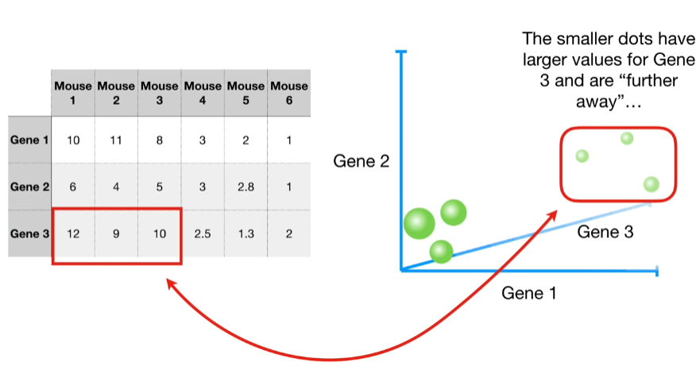

1. PCA will reduce the dimensionality of data (reduce the number of features) and by plotting the PCA we will see that similar data samples will be clustered together.
2. First, we need to standardize the data (z-score): measure average for each feature (thus calculating the center of the data) and then shift the data so that the center of the data is on the origin of the graph (shifting the data does not change how the data points are positioned relative to each other)
### Z-Score
Z-score can be done by subtracting the mean and dividing by the standard deviation for each value of each feature. Once the standardization is done, all the features will have a mean of zero and a standard deviation of one, and thus, the same scale.

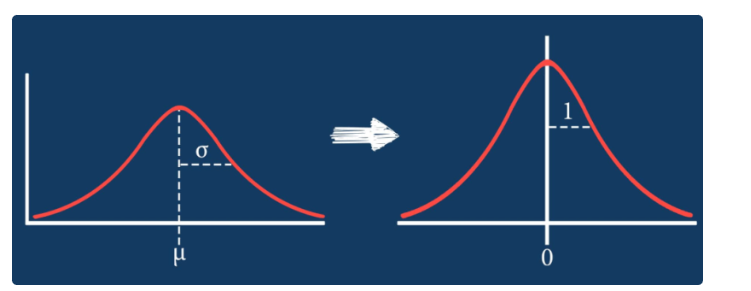

In principal component analysis, features with high variances or wide ranges get more weight than those with low variances, and consequently, they end up illegitimately dominating the first principal components (components with maximum variance). Standardization can prevent this, by giving the same weightage to all features.

3. Then we need to find a line (goes through the origin) that fits data the best. To "fit the best", we project the data on the line, and try to find the line that minimizes the distances from data to the line OR maximizes the distances from the projected points to the origin (same thing: by Pythagoras theorem: $a^2 = b^2 + c^2$: if $b$ gets bigger, then $c$ gets smaller, $b$ is distance from point to line, $c$ is distance from projected point to the origin.).

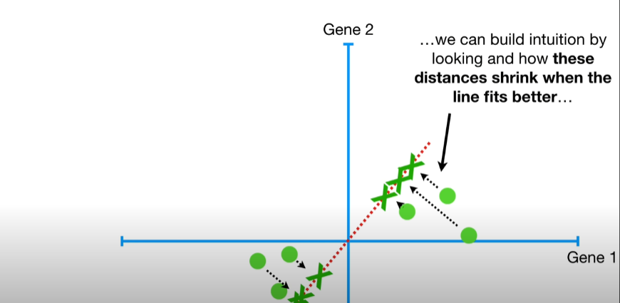

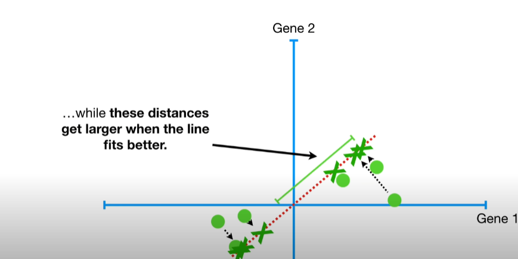

4. It easier to calculate the distance from projected point to origin, so PCA finds the best fitting line by maximizing the sum of the squared (so they do not cancel each other) distances $SS_d$ from the projected points to the origin. **Eigenvalue** here is the average of $SS_d$ for $PC_1$. Square root of eigenvalue or sums of squared distances $SS_d$ is **Singular Value** for $PC_1$.

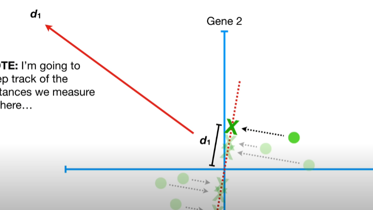

5. We repeat until we end up with the line with the largest sum of squared distances $SS_d$ between the projected points and the origin.
6. Line with largest $SS_d$ is called Principal Component 1 ($PC_1$).

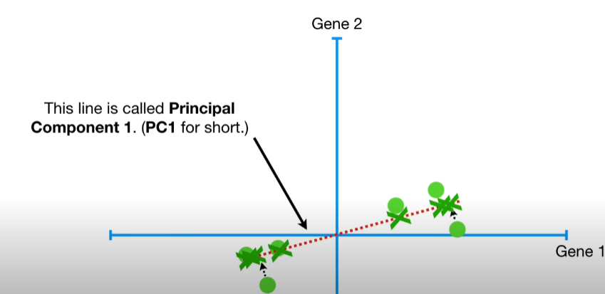

7. E.g. $PC_1$ has a slope of $0.25$, this means that when we go on $x-$axis by 4, we go up only by 1. That means that the data is mostly spread out along the $x-$axis. In other words, $PC_1$ is a linear combination of features.

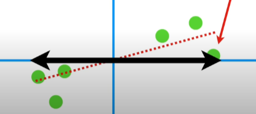

8. We need to scale $PC_1$ by making it a unit vector (divide by $\sqrt{17}$). $PC_1$ now consists of $4/\sqrt{17}$ Gene 1 and $1/\sqrt{17}$ Gene 2, which is called **Singular Vector** or the **Eigenvector** for $PC_1$. Proportions of each gene is called **Loading Scores**.
9.  To find $PC_2$ is simply the line through the origin that orthogonal to $PC_1$ (-1 parts of Gene 1 and 4 parts Gene 2).
10.  Scale $PC_2$ to unit vector, get: $-1/\sqrt{17}$ for Gene 1, $4/\sqrt{17}$ for Gene 2: $\begin{bmatrix}
    -1/\sqrt{17}\\4/\sqrt{17}
\end{bmatrix}$ singular vector for $PC_2$. Loading scores for $PC_2$ tell us that in terms of how the values are projected onto $PC_2$, Gene 2 is 4 times as important as Gene 1. Eigenvalue for $PC_2$ is average of the sum of squared distances between projected points and the origin.

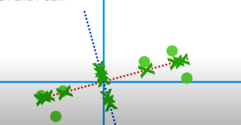

11.  Then find where the projected points go in the PCA plot.

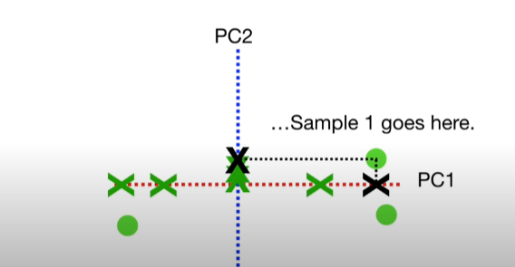

12.  Eigenvalues are measures of variation. Imagine $\alpha_1(PC_1) = 15, \alpha_2(PC_2) = 3$. Then, **Total Variation** around both $PC$s is $15 + 3 = 18$. That means, $PC_1$ accounts for $\frac{15}{18}=83%$ of the total variation around the $PC$s.
13.  A **Scree Plot** is a graphical representation of the percentages of variation that each $PC$ accounts for.


## SVD and PCA

Example above: SVD for $A$ is:

$$A = \begin{bmatrix}
    -1 & 1 & 0 \\ 1 & 0 & 1
\end{bmatrix} = UDV^T = \begin{bmatrix}\frac{-1}{\sqrt{2}}&\frac{1}{\sqrt{2}} \\ \frac{1}{\sqrt{2}} & \frac{1}{\sqrt{2}}
\end{bmatrix} \cdot \begin{bmatrix}\sqrt{3}& 0 & 0\\0 & 1 & 0\\0 & 0 & 0\end{bmatrix}\begin{bmatrix}\frac{2}{\sqrt{6}}& 0 & \frac{-1}{\sqrt{3}}\\\frac{-1}{\sqrt{6}} & \frac{1}{\sqrt{2}} & \frac{-1}{\sqrt{3}}\\\frac{1}{\sqrt{6}} & \frac{1}{\sqrt{2}} & \frac{1}{\sqrt{3}}
\end{bmatrix}^T$$

In the SVD of a matrix $A$, $A$ is factorized into three matrices: $U, D$, and $V^T$.

- $U$ contains the left singular vectors.
- $D$ is a diagonal matrix containing the singular values.
- $V^T$ contains the right singular vectors.

PCA aims to find the principal components of a dataset, which are orthogonal linear combinations of the original features. These principal components are sorted by the amount of variance they explain, with the first principal component explaining the most variance.

The relationship between SVD and PCA lies in the fact that PCA can be performed by using the SVD of the data matrix. Here's how:

- The columns of $$U (left singular vectors) represent the principal components of the data. In the context of PCA, these are your new coordinate axes, the directions along which you project your data to find the principal components.

- The singular values in $D$, when squared and divided by the total sum of squared singular values, represent the proportion of variance explained by each principal component. This is essentially how much each principal component "matters" in terms of capturing variance in the data.

- The matrix $V^T$ (right singular vectors) is not directly related to PCA but is still useful in some contexts, like when you need to reconstruct the original data from the principal components.

In PCA, you often perform dimensionality reduction by selecting only the top $k$ principal components ($k < n$, where $n$ is the original dimensionality) that capture most of the variance. This corresponds to retaining the first $k$ columns of $U$ and the first $k$ singular values and columns of $V^T$.

The first principal component (the first column of $U$) corresponds to the direction in the original feature space along which the data varies the most. The second principal component (the second column of $U$) is orthogonal to the first and captures the second most variance, and so on.

Example:

```
import numpy as np

data = np.array([[1, 2], [2, 3], [3, 4], [4, 5]])

# data = [[1, 2]
#         [2, 3]
#         [3, 4]
#         [4, 5]]

# center the data by subtracting the mean (can standardize it too)
centered_data = data - np.mean(data, axis=0)

U, D, Vt = np.linalg.svd(centered_data)

# U = [[-0.328 -0.576]
#      [-0.467 -0.403]
#      [-0.605 -0.230]
#      [-0.744 -0.057]]
```

The columns of the U matrix represent the principal components. In this case, we have 2 principal components since it's a 2D dataset. The first column of U represents the first principal component, and the second column represents the second principal component.

The singular values in $D$ are $[2.828, 0.828]$. To find the proportion of variance explained by each principal component, you can square the singular values and divide by the total sum of squared singular values:

```
variance explained by PC1 = (2.828^2) / (2.828^2 + 0.828^2) ≈ 0.971
variance explained by PC2 = (0.828^2) / (2.828^2 + 0.828^2) ≈ 0.029
```

This means that the first principal component explains about $97.1%$ of the variance, while the second principal component explains about $2.9%$ of the variance.
