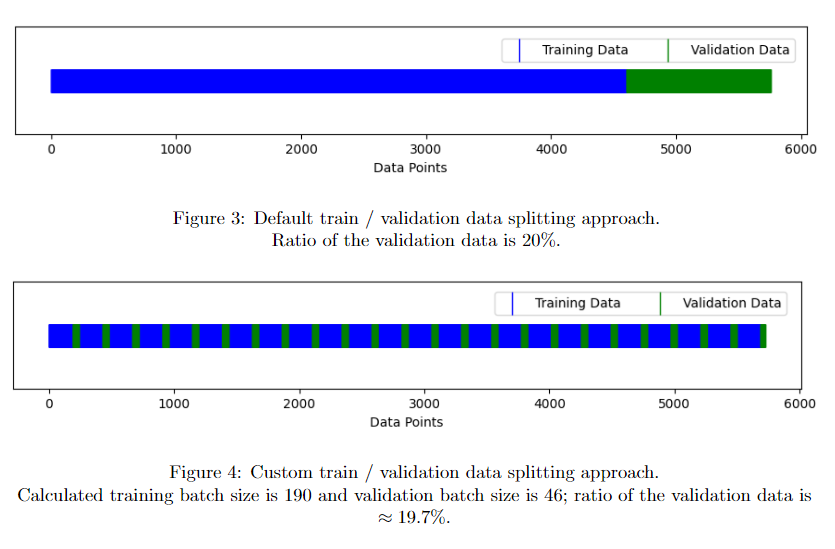
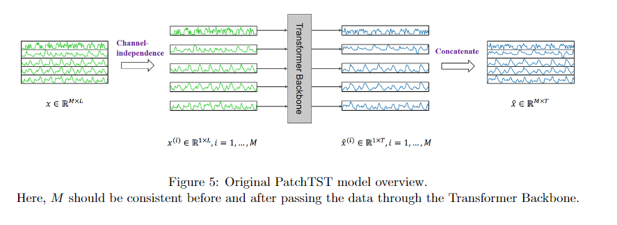
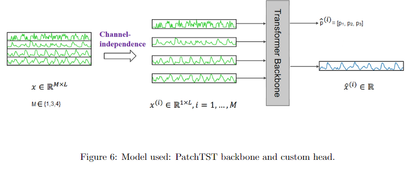
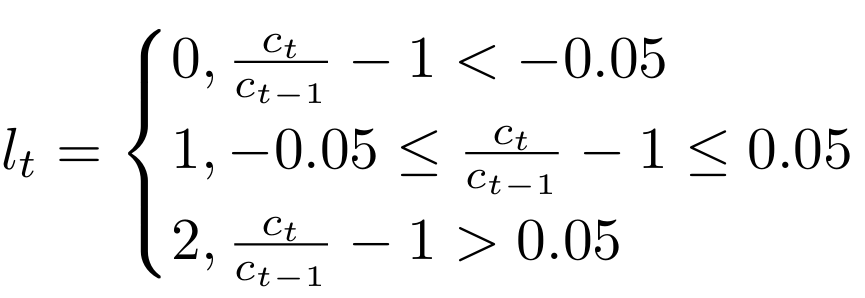
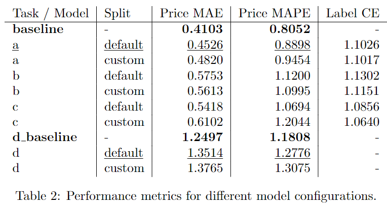

# Financial time series forecasting with Transformers: Impact of additional features and cross-validation on model performance

---

# Motivation & Hypotheses

- Which data should be used to help the deep learning model grasp complex relationships within financial time series data so that it can yield more accurate results?

- How can we design a crossvalidation technique that better captures the temporal nature of nonstationary time series?

---

# Cross-validation

---

# Data

- The study is based on the historical stock market data (all data are available online via https://www.alphavantage.co/ API).
- The dataset comprises historical daily closing prices and volumes for three closely correlated US technology stocks: *ORCL*, *CSCO*, and *QCOM*.
- Additional data includes daily technical indicators (*MACDEXT*, *RSI*, *BBANDS*) and quarterly balance sheet statements (cash flow, earnings, income).

---

# Model

---

# Labels

---

# Results

- task $a$ (univariate): price $\to$ price (single stock)
- task $b$ (univariate): price $+$ additional features $\to$ price (single stock)
- task $c$ (univariate): price $+$ correlated stocks $\to$ price (single stock)
- task $d$ (multivariate): prices of three stocks $\to$ prices of three stocks

---

# Conclusion

- Explored various strategies to enhance the performance of the Transformer-based model for financial time series forecasting task:
  - Utilized PatchTST as the backbone model with a custom-designed head for univariate and multivariate prediction.
  - Proposed a cross-validation technique for time series data
  - Tested whether incorporating additional features in the training data can improve the Transformer model performance

---

# Conclusion

- Ultimately, none of these strategies are proven to be effective:
  - The models trained on the default train/validation splits consistently outperform those trained on custom splits
  - The models trained solely on price data perform better than those trained on prices as well as additional stock features.

---

# Thank you for attention
