

<!-- color: black -->
<!-- _class: title-slide -->

# Paper Review : Modality-agnostic Automated Data Augmentation in the Latent Space (MODALS)

### Anton Zaitsev | Othmane Mahfoud  

###### University of Luxembourg

---

## Problem: Data

- Deep learning models need a lot of **good quality training data**.
- Labelled data is **scarce and expensive**.

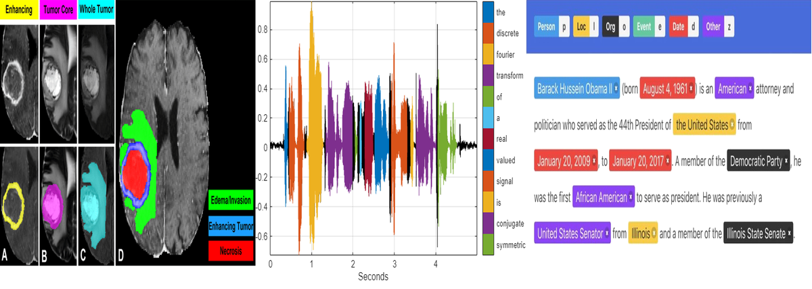

---

## Solution: Data Augmentation

- **Data augmentation** is a way to **increase the size of training datasets**.

---

## Data Augmentation Problems

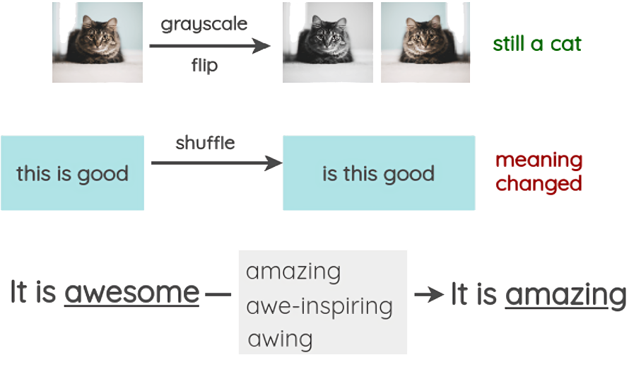

- Data augmentation methods are **manually designed** and evaluated **for different modalities** separately.
- **Modalities are different types of data**, such as images, text, or audio.
- We **cannot use** the **same data augmentation techniques for different modalities**, e.g., images and text.

---

## Solution: MODALS

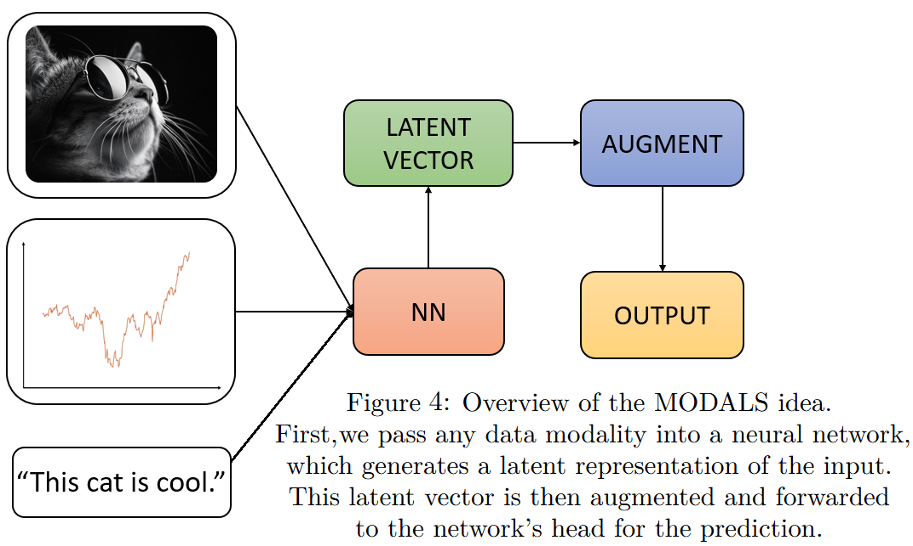

- **MODALS: Modality-agnostic Automated Data Augmentation in the Latent Space**.
- MODALS transforms data in the **latent space**.
- MODALS works with **any data modality**.

---

## MODALS Results Teaser

- MODALS was tested on **text, tabular, time-series, and image** datasets.
- It **outperformed** baseline methods **in most cases**.

---

## MODALS Algorithm: Overview

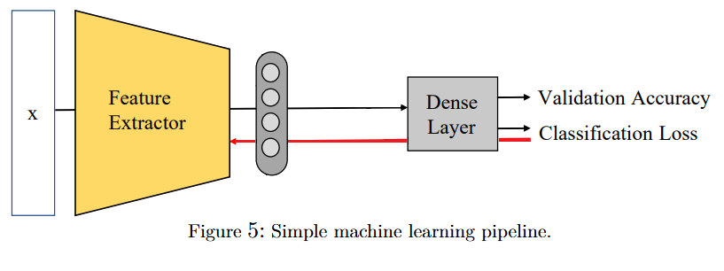

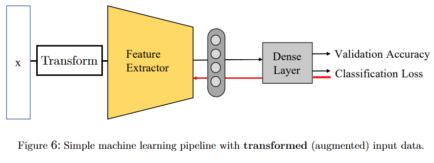

---

## MODALS Algorithm: Overview

---

## MODALS Algorithm: Step 1

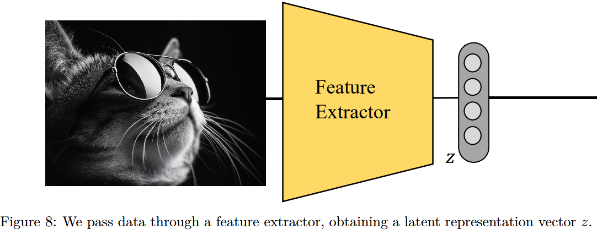

---

## MODALS Algorithm: Step 2

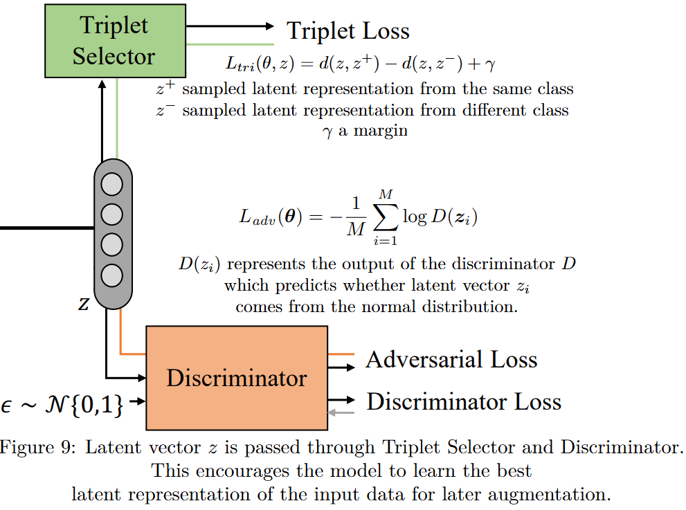

---

## MODALS Algorithm: Step 2, Triplet Loss

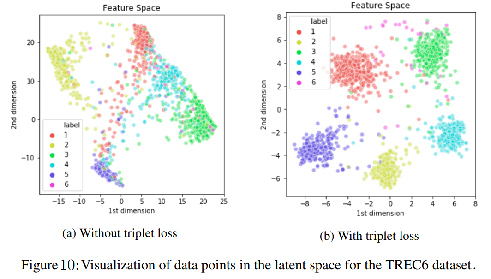

---

## MODALS Algorithm: Step 3

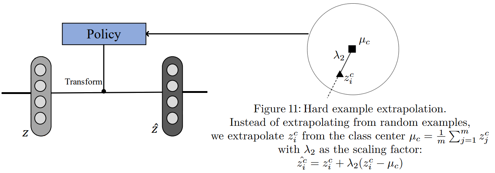

---

## MODALS Algorithm: Step 4

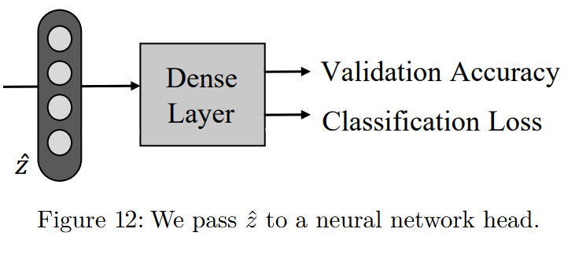

---

## MODALS Algorithm: Step 5

---

## MODALS Results

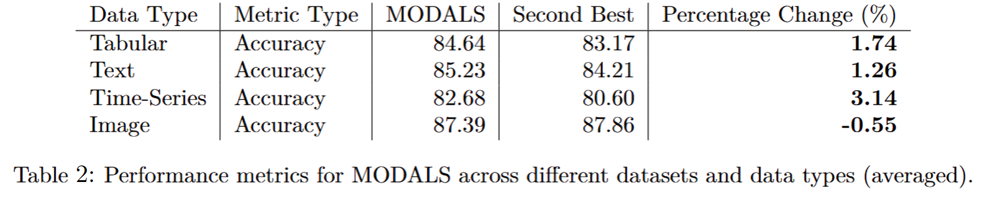

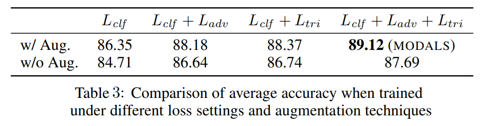

---

## Conclusions

- MODALS is an **automatic data augmentation technique**.
- MODALS can be used for **any data type**, since it transforms data in the **latent space**.
- MODALS achieves **best results** on text, tabular, time-series data and **competitive results** on image data (compared to baseline augmentation techniques).
- MODALS can be **easily intergrated** into any **deep learning pipeline**.
- MODALS might be the **best solution** yet for:
  - Data modalities where input space **augmentation** is **difficult to define**.
  - **Scarce** and **imbalanced** **datasets**.

---

## How MODALS can Impact the ML World?

- Enable deep learning for **new data modalities**.
- Advance deep learning for domains with **difficult data modalities** (e.g., medical imaging or NLP for low-resource languages).
- Boost efficiency in **multi-modal** applications.

---

# Thank you
