# Complex Networks

## 1

### Network Analysis

1. Node-level: node classification, e.g. in a social network.
2. Edge-level: predicting existance of edges in a collaboration network, whether authors will collaborate in the future.
3. Subgraph-level: in a biological network where nodes represent proteins and edges represent interactions between proteins, you might want to detect specific subgraph motifs (e.g., triangles or other small structures) that frequently occur and are known to be biologically significant. 
4. Graph-level: predicting whether a given molecule is toxic or non-toxic
5. Graph generation: Earth's surface as a graph, nodes are wheather stations, edges represent relationships between stations. This approach helps in modeling spatial dependencies across the globe in a more flexible manner than traditional grid-based systems. By combining physics-informed models with data-driven approaches, GraphCast aims to improve both short-term and long-term weather forecasts.

### Tasks

1. Node classification (e.g. misinformation detection).
2. Link prediction (e.g. content recommendation).
3. Community detection.
4. Graph similarity.
5. Graph classification.
6. Graph generation.
7. Graph structure learning.
8. And more...

### Graph Representation

1. Nodes
2. Edges
3. Graphs

### Types of Graphs

1. **Undirected Graph**: A graph where edges have no direction. An edge (u, v) is the same as (v, u).
   
2. **Directed Graph (Digraph)**: A graph where edges have a direction. An edge (u, v) is not the same as (v, u).
   
3. **Weighted Graph**: A graph where edges have weights (or costs) associated with them.
   
4. **Unweighted Graph**: A graph where edges do not have any weight or cost associated with them.
   
5. **Cyclic Graph**: A graph that contains at least one cycle (a path of edges and vertices wherein a vertex is reachable from itself).
   
6. **Acyclic Graph**: A graph that does not contain any cycles.
   
7. **Simple Graph**: A graph that has no loops (edges connecting a vertex to itself) and no multiple edges between the same vertices.
   
8. **Multigraph**: A graph that can have multiple edges (parallel edges) between the same pair of vertices.
   
9. **Complete Graph**: A graph where there is a unique edge between every pair of vertices.
   
10. **Bipartite Graph**: A graph whose vertices can be divided into two disjoint sets such that no two vertices in the same set are adjacent.
    
11. **Planar Graph**: A graph that can be drawn on a plane without any edges crossing.
    
12. **Tree**: A connected acyclic graph. Trees are a specific type of graph used in many applications.
    
13. **Forest**: A disjoint set of trees.
    
14. **Connected Graph**: A graph where there is a path between every pair of vertices.
    
15. **Disconnected Graph**: A graph where at least one pair of vertices does not have a path connecting them.
    
16. **Sparse Graph**: A graph with relatively few edges compared to the number of vertices.
    
17. **Dense Graph**: A graph with many edges compared to the number of vertices.
    
18. **Hypergraph**: A graph where an edge can connect more than two vertices.

19. **Dynamic Graph**: A graph where the structure (vertices and edges) can change over time.
    
20. **Subgraph**: A graph formed from a subset of the vertices and edges of a larger graph.

### Basic Properties and Definitions

1. **Maximum number of edges**:
   1. Undirected network: $\frac{N(N-1)}{2}$
   2. Directed network: $N(N-1)$
2. **Average degree**: 
   1. Undirected: $\overline{k}=<k>=\frac{1}{N}\sum^N_{i=1}k_i=\frac{2E}{N}$
   2. Directed: $\overline{k}=\frac{E}{N}, \overline{k^{\text{in}}}=\overline{k^{\text{out}}}$
3. **Sink node**: $k^{\text{out}}=0$; **Source node**: $k^{\text{in}}=0$
4. **Density** is defined as a fraction of pairs of nodes connected by an edge in a graph. When graphs increase, the average degree increase (slowly), and the density decreases
5. **Bipartite graph** is a graph whose nodes can be divided into two disjoint sets $U$ and $V$ such that every link connects a node in $U$ to one in $V$; that is, $U$ and $V$ are independent sets. E.g. authors-to-papers. **Folded networks**: author collaboration networks. 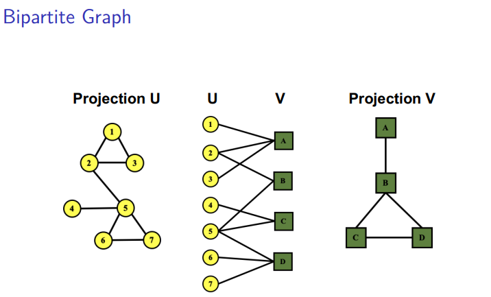
6. **Adjacency matrix**: $A=\begin{bmatrix}0 1 0 1 \\ 1 0 0 1\\ 0 0 0 1 \\ 1 1 1 1\end{bmatrix}$; $A=\begin{bmatrix}0 2 0.5 0 \\ 2 0 1 4 \\ 0.5 1 0 0 \\ 0 4 0 0\end{bmatrix}$ $A_{ij}=01$ if there is no edge from node $i$ to node $j$ (for a directed graph adjacency matrix is not symmetric).
7. Calculating number of edges & average degree:
   1. For **unweighted/weigthed** and **undirected**; **multigraph**: $E=\frac{1}{2}\sum^N_{i,j=1}\text{nonzero}(A_{ij}), \overline{k}=\frac{2E}{N}$
   2. For **self-loops** and **undirected**: $E=\frac{1}{2}\sum^N_{i,j=1, i \neq j}A_{ij} + \sum^N_{i=1}A_{ii}$
8. Connected graph: any two nodes can be jointed by a path.
9. Disconnected graph is made up by two or more connected components. The adjacency matrix of a network with several components can be written in a block-diagonal form: nonzero elements are confined to squares, with all other elements being zero. 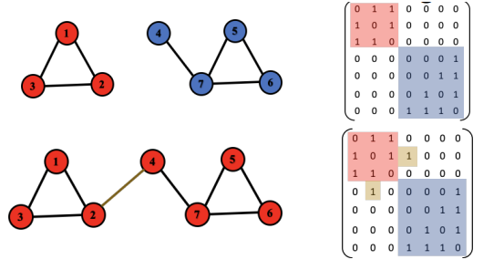.
10. **Strongly connected directed graph** has a path from each node to every other node and vice versa. **Weakly connected directed graph** is connected if we disregard the edge directions. We can identify strongly connected components in a graph. 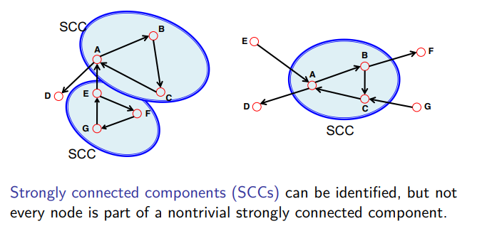

### Representing Graphs

1. As a **list of edges**: $(2,3), (2,4), (5,2), \dots$
2. As a **adjacency list**:
   1. 1:
   2. 2: 3,4
   3. 3: 2,4
   4. 4: 5
   5. 5: 1,2

## 2

### Degree distribution

- **Degree distribution** $P(k)$: probability a randomly chosen node has degree $k$.
- $N_k = \#$ nodes with degree $k$.
- $N_1, N_2, \dots, N_k$ defines the **degree spectrum**
- Normalized histogram $P(k)=\frac{N_k}{N}$ defining the empirical degree distribution. 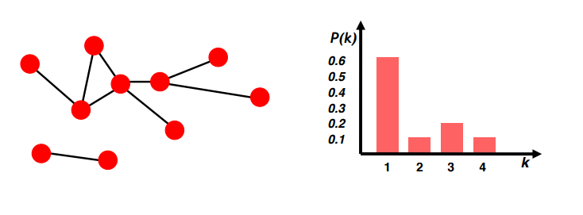
- Example: A global syntactic dependency network (English), nodes: words, edges: syntactic dependencies.
- In a random network degree distribution is almost a normal distribution centered on the average degree. In real networks, it is not the case – a high majority of small degree nodes, a small minority of nodes with very high degree. Often modeled by a **power law**.

### Distance in a Graph

- A path is a sequence of adjancet nodes (edges) in which each node is linked to the next one: $P_n=\{i_0, i_1, \dots, i_n\}, P_n=\{(i_0, i_1), (i_1, i_2), \dots, (i_{n-1}, i_n)\}$.
- Path can intersect itself and pass through the same edge multiple times.
- In a directed graph, a path can only follow the direction.
- **Path length**: number of edges in a path.
- **Weighted path length**: sum of the weights of the edges in a path.
- **Shortest path**: the shortest path between nodes $u$ and $v$ is a path of minimal path length (often it is not unique).
- **Weighted shortest path**: path of minimal weight.
- **Distance**: the distance between nodes $u$ and $v$ is the length of the shortest path.
- In directed graphs, paths need to follow the direction of the arrows. Thus, distance is not symmetric.
- **Diameter**: the maximum (shortest path) distance between any pair of nodes in a graph.
- ****Average path length (distance)****: for a connected graph (component) or a strongly connected (component of a) directed graph: represents the average number of steps along the shortest paths for all possible pairs of nodes in a graph: $\overline{h}=\frac{1}{2E_{\max}}\sum_{i,j \neq i}h_{ij}$, where $h_{ij}$ is the distance from node $i$ to $j$ and $E_{\max}$ is the max number of edges: $E_{\max}=\frac{N(N-1)}{2}$.
- We compute the average over the connected pairs of nodes (ignoring “infinite” length paths).

### Clustering Coefficient

1. Portion of node $i$'s neighbors are connected: node $i$ with degree $k$: $C_i=\frac{2e_i}{k_i(k_i-1)}$, where $e_i$ is the number of edges between node $i$'s neighbors.
2. **Average clustering coefficient**: $\overline{C}=\frac{1}{N}\sum_iC_i$. 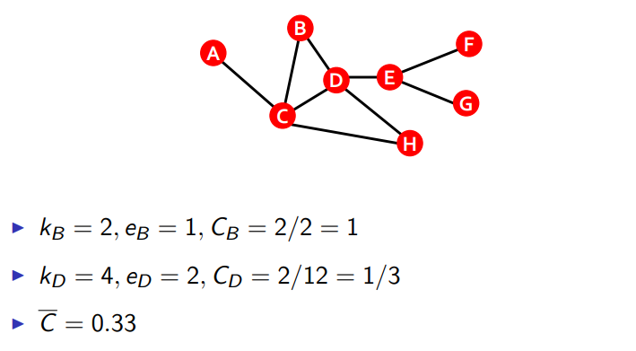

### Connectivity

- **Size of the largest connected component (Giant component)**: largest set where any two vertices/nodes can be joined by a path. Algorithm to find:
    1. Start from a random node and perform BFS.1
    2. Label the nodes BFS visited.
    3. If all nodes are visited, the network is connected.
    4. Otherwise find an unvisited node and repeat BFS.

### Graph Models

- Compare an observed network with a randomised version (Is observed property X “exceptional”, or any similar network with X?).
- Explain a given phenomenon (Such a simple mechanism can reproduce properties X and Y).
- Study some properties in a “controlled environment” (How does property X behave when increasing property Y ?).
- Generate synthetic datasets (Testing an algorithm on 100 variations of the same network).

### Synthetic Networks

- **Deterministic models** are instances of famous graphs or, more commonly, repeated regular patterns, e.g., grids, lattices.
- Generative models assign to each pair of nodes a probability of having an edge according to their properties (degree, label, etc.), e.g., Erdos-Renyi graph model.
- Mechanistic models create networks by following a set of rules, a process defined by an algorithm, e.g., preferential attachment.

### Regular Lattices

1. Graphs where each node has the same degree k.
2. Clustering coefficient depends on the structure (can be large or not).
3. Average path length grows quickly with $N$ when $k << N$.

### Erdos-Renyi Random Graph Model

“If we do not know anything else than the number **N** of nodes and the number **E** of links, the simplest thing to do is to put the links at random (no correlations)”.

The $G(n, p)$ definition:
1. Take $n$ disconnected nodes.
2. Add an edge between any of the nodes independently with probability $p$.
3. Each edge appears i.i.d.
4. Alternatively, pick with probability $p^E(1-p)^{\frac{n(n-1)}{2-E}}$ a graph from the set of all graphs with size $n$.

The graph is a result of a
random process. 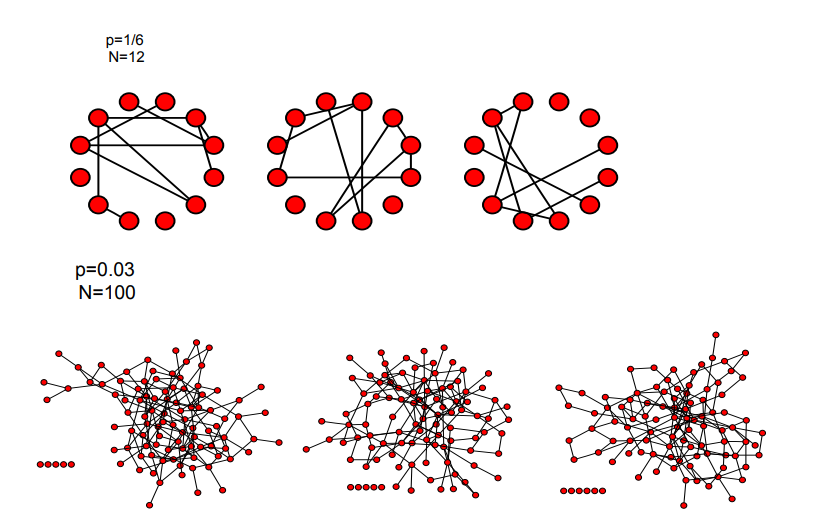

The $G(n, E)$ definition:
1. Take $n$ disconnected nodes.
2. Add $E$ edges uniformly at random.
3. Alternatively, pick uniformly randomly a graph from the set of all graphs with $n$ nodes and $E$ edges.

### Properties of ER Random Graphs

Degree distribution of $G(n,p)$ is binomial. It can be approximated using a Poisson distribution for large $N$ and small $\overline{k}$.

$$P(k)=\begin{bmatrix}N-1\\k\end{bmatrix}p^k(1-p)^{N-1-k}$$

Degree distribution without a tail.

$$\overline{k}=p(N-1), \sigma^2=p(1-p)(N-1)$$

As the network size increases, the distribution becomes increasingly narrow - we are increasingly confident that the degree of a node is in the vicinity of $k$.

$$\mathbb{E}[e_i]=\frac{pk_i(k_i-1)}{2}$$

$$\mathbb{E}[C]=\frac{pk_i(k_i-1)}{k_i(k_i-1)}=p=\frac{\overline{k}}{N-1}\approx \frac{\overline{k}}{N}$$

For a fixed average degree $\mathbb{E}[C]$ is decreasing as $N$ goes large. So clustering coefficient of a random graph is small.

Random graphs tend to have a tree-like topology with almost
constant node degrees.
- Number of first neighbors: $N(u)_1=\overline{k}$
- Number of second neighbors: $N(u)_2=\overline{k}^2$
- Number of neighbors at distance $d$: $N(u)_d=\overline{k}^d$
- At which distance are all nodes reached? $N=\overline{k}^d \to \log_{\overline{k}^d}N = d \to d = \frac{\log{N}}{\log_{\overline{k}^d}}$
- Diameter, average distance is about $O(\log{N})$.

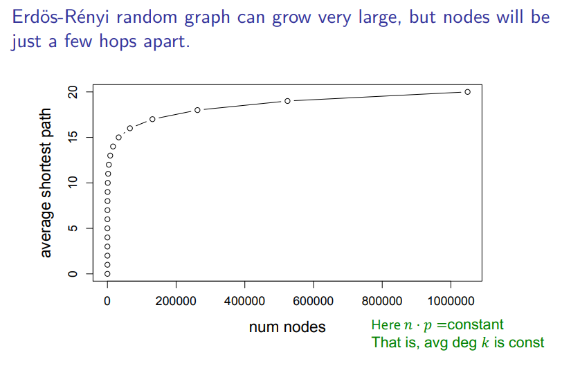

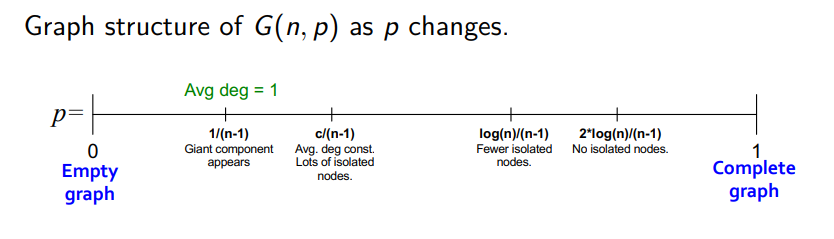

- Emergenceo of a giant component: $\overline{k}=\frac{2E}{N}$ or $p=\frac{\overline{k}}{N-1}$.
  - $\overline{k}=1-\epsilon$: all components are of size $O(\log{N})$
  - $\overline{k}=1+\epsilon$: one component of size $O(N)$, other have size $O(\log{N})$

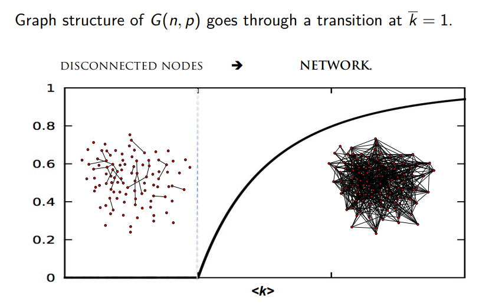
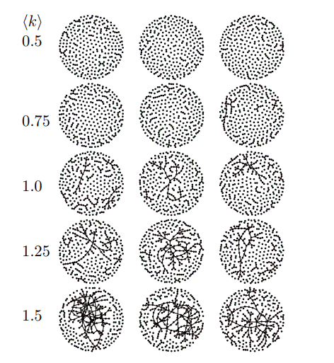

Summary:
- $P(k)=\begin{bmatrix}N-1\\k\end{bmatrix}p^k(1-p)^{N-1-k}$
- $\mathbb{E}[C]=\frac{pk_i(k_i-1)}{k_i(k_i-1)}=p=\frac{\overline{k}}{N-1}\approx \frac{\overline{k}}{N}$
- $\overline{h}$: path length $O(\log{N})$
- $s$: giant component appears $\overline{k}\ge 1$

### Problems with the Random Graph Model

1. Degree distribution differs from that of real networks.
2. The giant component in most real networks does NOT emerge through a phase transition.
3. No local structure — clustering coefficient is too low.

### Why use $G(n,p)$?

- It serves as a reference model for any other network model.
- It will help us calculate many quantities, that can then be compared to the real data.
- It will help us understand to what degree is a particular property the result of some random process.

### Configuation Model

Configuration model: how much of some observed pattern is driven by the degrees alone?

1. Given a sequence $k_1,\dots,k_N$.
2. Assign each node $i \in V$ with $k_i$ numbers of stubs.
3. Select random pairs of unmatched stubs and connect them.
4. Repeat 3 while there are unmatches stubs.

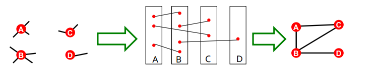

Used as a “null” model of networks: compare the real network $G$ and a random $G'$ which has the same degree sequence.

## 3

### Small-word Model

Goal: high clustering coefficient, low distance (diameter).

### Watts-Strogatz Model

- A model to capture large clustering coefficient and short distances observed in real networks.
- It interpolated between an ordered lattice and a random graph.
- Fixed $N$ (network size), $\overline{k}$ initial coordination number (node degree).
- Variable parameter $p$ (rewiring probability).

#### Algorithm

1. Start with a ring lattice with $N$ nodes, in which every node is connected to its first $\overline{k}$ neighbours ($\frac{\overline{k}}{2}$ on either size).
2. Randomly rewire each edge of the lattice with probability $p$ (self-connections and duplicate edges are excluded).

- With $p=0$: completely orderer structure (ring lattice, high clustering, high diameter), $h=\frac{N}{2\overline{k}}, C=\frac{1}{2}$.
- With $p=1$: completely random structure (low clustering, low diameter), $h=\frac{\log{N}}{\log{\alpha}}, C=\frac{\overline{k}}{N}$.

#### Clustering Coefficient

$$\text{Clustering Coefficient }\overline{C} = \frac{3(\overline{k}-2)}{4(\overline{k}-1)+8\overline{k}p+4\overline{k}p^2}$$

- Independent of $N$.
- It recovers the ring value if $p \to 0$.

#### Average path length: No closed solution

#### Degree distribution

$$P(k) = e^{-\overline{k}p}\frac{(\overline{k}p)^{k-\overline{k}}}{(k-\overline{k})!}, k \ge \overline{k}, P(k) = 0 \text{if} k < \overline{k}$$

- $p=0$: each node has same degree $\overline{k}$
- $p>0$: approximates a Poisson distribution (random graphs).

### Scale-free networks

A network is called scale-free when its degree distribution follows (to some extent) a **Power-law distribution**:

$$P(k) \approx Ck^{-\gamma}, \gamma - \text{exponent of the distribution}$$

- Scale-fee refers specifically to the degree distribution having a **Power-law decay in its tail**, namely for "large" $k$.

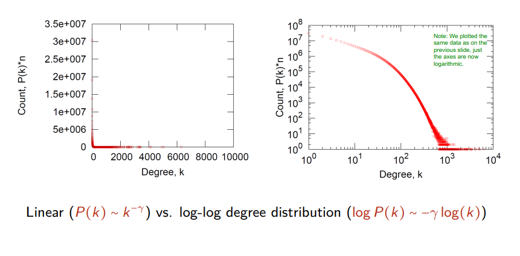

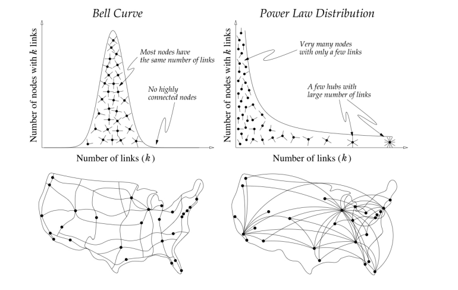

#### Discrete

- Initial definition: $\forall k \in N: P(k) \approx Ck^{-\gamma}$
- $\log{P(k)} = \log{C} - \gamma\log{k}$
- **PDF**: $\sum^\infty_{k=1}P(k)=C\sum^\infty_{k=1}k^{-\gamma}=C\zeta(\gamma)=1, C=\frac{1}{\zeta(\gamma)}$
- Riemann zeta funtion, $\gamma >1: P(k)=\frac{k^{-\gamma}}{\zeta(\gamma)}$

#### Continious

- Initial definition: $\forall k \in N: P(k) \approx Ck^{-\gamma}$
- $\forall k \in \mathbb{R}: \int P(k)=1=C\int k^{-\gamma}$
- In most cases there exists $k_{min}$ from which the law holds: $C=\frac{1}{\int^\infty_{k_{min}}k^{-\gamma}dk}=(\gamma-1)k_{min}^{\gamma-1}$
- **PDF**: $P(k)=\frac{\gamma-1}{k_{min}}\left(\frac{k}{k_{min}}\right)^{-\gamma}$

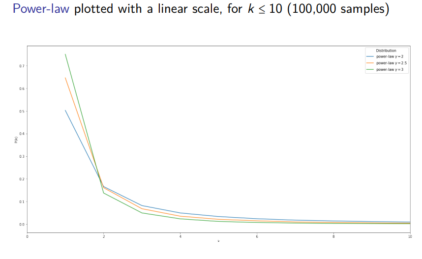

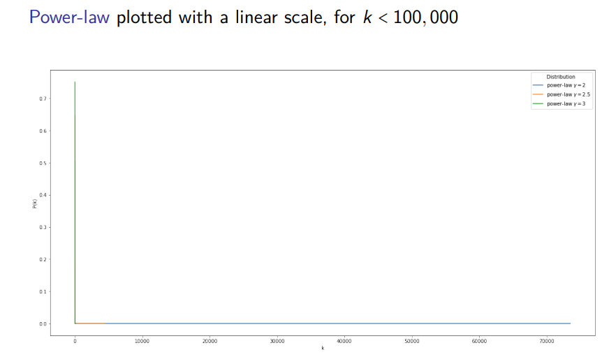

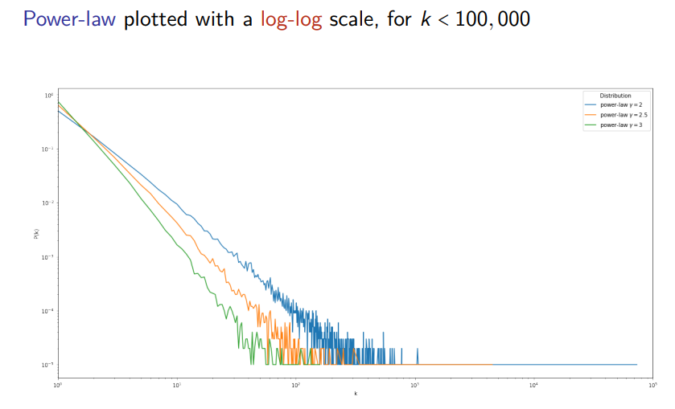

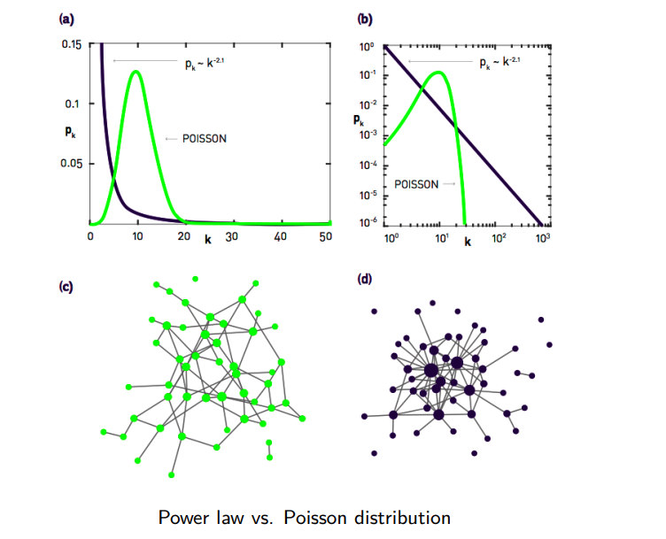

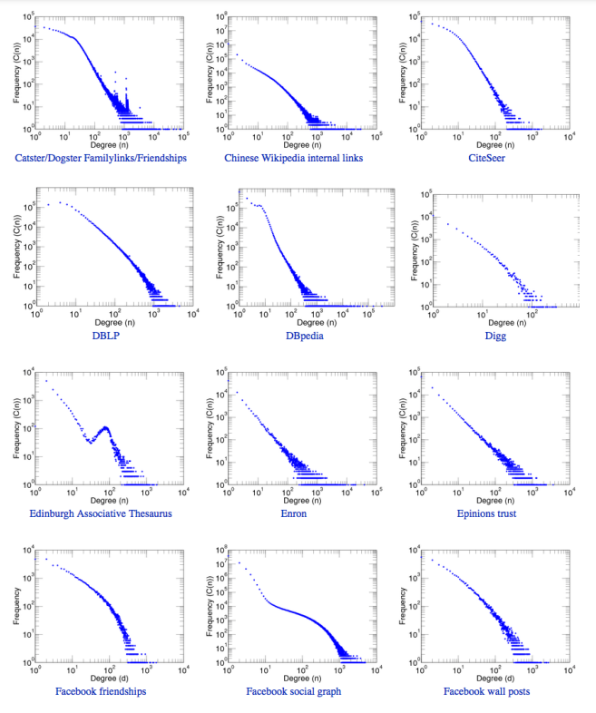

#### Properties

- Probability of network having a node with degree $k\ge k_{max}$: $P(k\ge k_{max})=\int^\infty_{k_{max}}P(k)dk$
- Expected number of nodes with $k\ge k_{max}$: $NP(k\ge k_{max})=1$
- Expected largest node degree in power-law networks: $k_{max}=k_{min}N^\frac{1}{\gamma-1}$ 
- Expected largest node degree in random networks: $k_{max}=k_{min}+\frac{\ln{N}}{\gamma}$ 
- **Exponents** $\gamma$ of real-world networks are usually **between 2 and 3**.
- Why $2\le\gamma\le3$?
  - $\gamma < 2$: The distribution is so skewed that we expect to find nodes with a degree larger than the size of the network (not possible in finite networks).
  - $\gamma > 3$: large degrees become so rare that the size of the sample (i.e., size of observed network) must be enormous to indeed observe such a node.
- Power-law network with $2<\gamma<3$ is **scale-free**: $k = <k> \plusmn \infty$ ($<>$ - average degree) 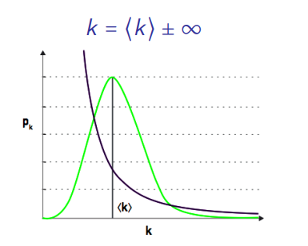

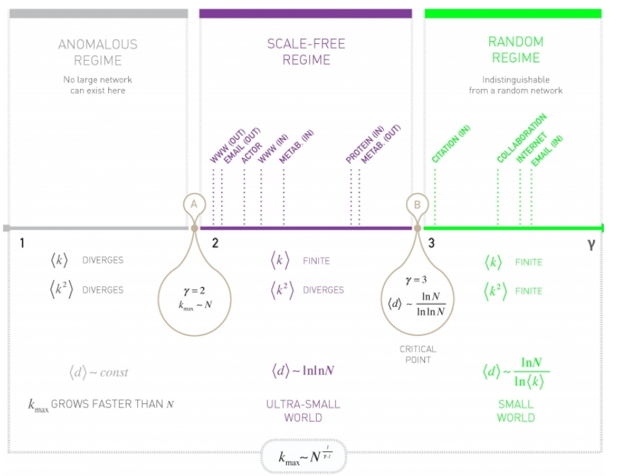

#### Computing $\gamma$ of an Observed Network

- Naive: find the slope of the line of hte log-log plot (overfitting based on a few values in a long tail).
- Maximum likelihood estimation.

#### Problem

- Rigorous statistical tests show that observed degree distributions are not compatible with a Power-law distribution.

### Barabasi-Albert Model

- Networks are not static but **growing in time**, as new nodes are entering the system
- **Preferential attachment**: nodes are not connected randomly, but tend to link to more attractive nodes (**hubs**).
- Preferential attachment is a very simple mechanism, but it implies **arriving nodes have complete knowledge of the existing network’s degree distribution**.

#### Algorithm

1. Start with $m_0$ connected nodes.
2. At each time step we add a new node with $m (\le m_0)$ links that connect it to $m$ nodes already in the network.
3. The probability $P(k)$ that one of the links of the new node connects to node $i$ depends on its degree $k_i$ as $P(k)=\frac{k_i}{\sum_jk_j}$

#### Properties

- The emerging network will be scale-free with $\gamma=3$, independent of $m_0$ and $m$.
- $P(k)=\frac{2m^2}{k^3}$ 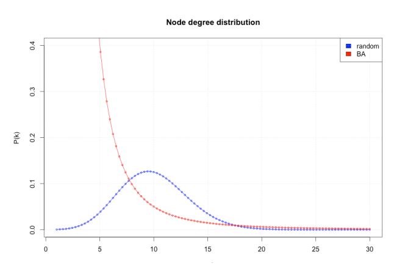 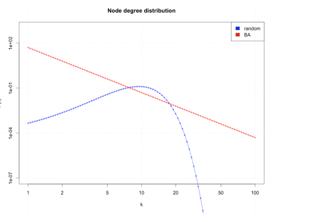
- Path length: $<l>=\frac{\ln{N}}{\ln{\ln{N}}}$ 
- Clustering coefficient: $\overline{C}=\frac{(m-1)(\ln{N})^2}{8N}\approx\frac{(\ln{N})^2}{N}$. It's 5 times more that for random graphs (not large enough).

#### Problem

To solve preferential attachment mechanism:
- Vary attachment kernel.
- Vary mechanisms:
  - Add edge deletion.
  - Add node deletion.
  - Add edge rewiring.

### Vertex-copying Model

- Local explanation to preferential attachment.

#### Algorithm

1. Take a small seed network.
2. Pick a random vertex.
3. Make a copy of it.
4. With probability $p$, move each edge of the copy to a random vertex.
5. Repeat $2-4$ until desired network size $N$.

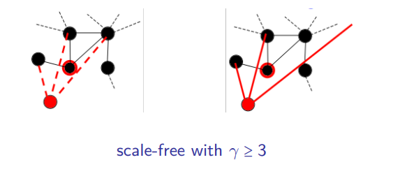

### Holme-Kim Model

More realistic clustering coefficient.

#### Algorithm

1. Take a small seed network.
2. Create a new vertex with degree $m$.
3. Connect the first of the $m$ edges to existing verticies with a probability proportional to their degree $k$.
4. With probability $p$ connect the next edge to a random neighbour of the vertex of step $3$; otherwise to step $3$ again.
5. Repeat $2-4$ until desired network size $N$.

### Models Overview

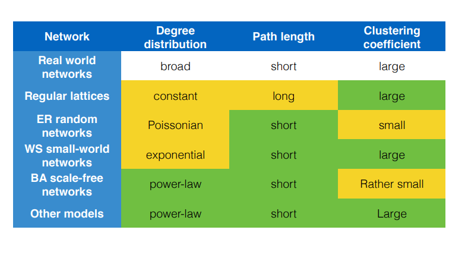

## 4

### Centrality Measures

- A central node is important and/or powerful.
- A central node has an influential position in the network.
- A central node has an advantageous position in the network.

1. **Degree**, Inner Degree, Outer Degree.
2. **Clustering coefficient**: $C_i=\frac{2e_i}{k_i(k_i - 1)}$, with $e_i$: number of edges between node $i$’s neighbours. However, ranking clustering coefficient is not meaningful: node with degree 2 has clustering coefficient value 0 or 1 and node with degree 100 has clustering coefficient not 0 or 1. Still, it can be used as a proxy for "communities" belonging: high value means node belongs to a single group, low value means node belongs to several groups.
3. **Edge clustering $C^e$** of an edge $(i,j)$ is the fraction of the neighbours of at least one of the two nodes which are neighbours of both of them, i.e. $C^e(i,j)=\frac{|N_i\bigcap N_j|}{|N_i\bigcup N_j|-2}$. It is a link property and **defines a fraction of common neighbors of a connected pair**.
4. **Farness**: **average distance to all other nodes in the network**: $\text{Farness}(i)=\frac{1}{N-1}\sum_{j\in V,i\neq j}h_{ij}$.
5. **Closeness: inverse of Farness**, i.e. how close the node is to all other nodes in terms of shortest paths: $\text{Closeness}(i)=\frac{N-1}{\sum_{j\in V,i\neq j}h_{ij}}$.
6. **Harmonic Centrality: the average of the inverse of distance to all other nodes** (harmonic mean): $\text{Harmonic}(i)=\frac{1}{N-1}\sum_{j\in V,i\neq j}\frac{1}{h_{ij}}$.
7. **Betweenness Closeness**: measures how much the node plays the **role of a bridge**. For node $i$ it is defined as a fraction of all the shortest paths between all the pairs of nodes going through $i$: $C_B(i)=\sum_{j\neq i \neq k \in V}\frac{\sigma_{jk}(i)}{\sigma_{jk}}$ with $\sigma_{jk}$ is the number of shortest paths between nodes $j$ and $k$ and $\sigma_{jk}(i)$ is the number of those paths passing through $i$.The betweenness tends to grow with the network size, thus a normalised version is often used: $C_B^{\text{norm}}(i)=\frac{C_B(i)}{(N-1)(N-2)}$. 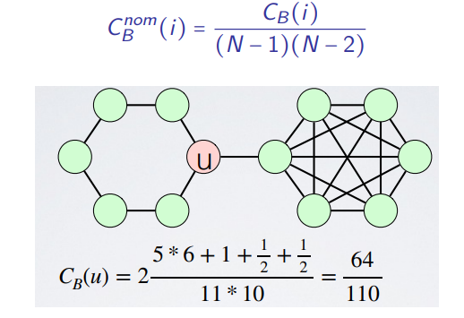. Complexity:
   1. Exact: $O(N^3)$ (time), $O(N^2)$ (space)
   2. Approximate: $O(N(M + N\log{N}))$ (time)

### Recursive Definitions

Recursive importance: 
- Important nodes are those connected to important nodes.
- Several centralities: Eigenvector Centrality, PageRank, etc.

$$C^{t+1}(i)=\alpha\sum_{j\in N_i}C^t(j) = \alpha \sum_{j}A_{ij}C^t(j)$$

- $\alpha$: normalization constant.

#### Power Method

1. Initialize all scores to random values.
2. Each score is updated according to the desired rule until reaching a stable value.
3. Converges for undirected graphs with a single connect component (Perron-Frobenius theorem).

##### Eigenvector Centrality

Power method is eigenvector centraility. A couple eigenvector $x$ and eigenvalue $\lambda$ is defined by

$$Ax=\lambda x$$

- $x$ is a column vector of size $N$, **importance scores**.

What Perron-Frobenius theorem says is that the Power method will always converge to the leading eigenvector, i.e. the one assossiated with the highest eigenvalue. Eigenvector centrality does not work in directed acyclic
networks, e.g., citation networks. Solution: only in strongly connected component.

#### Katz or $\alpha$ Centrality

1. Give each vertex a small amount of centrality for free.

$$
C^{t+1}(i)=\alpha \sum_{j}A_{ij}C^t(j) + \beta
$$

- $\alpha$ and $\beta$ are positive constants.
- $\beta$ s the free contribution for all vertices; hence, no vertex has zero centrality and will contribute at least $\beta$ to other vertices' centrality.
- This works in directed acyclic graphs.
- For DAGs, where there are no cycles, this approach might lead to degenerate behavior over time. Specifically, the recursive update only relies on the values from the previous timestep, which could cause the values $C^t(i)$ to decay to zero (or some small value) or remain stuck in some trivial state if the graph has long paths and nodes farther back contribute very little to the current node's update. $\beta$ acts as a bias that helps retain some level of activity in each node's value update, regardless of what contributions from its neighbors are.

#### PageRank (the Google Algorithm)

PageRank is an improvement over $\alpha$ centrality.

- Nodes: web pages.
- Edges: hyperlinks.
- Give node $v$, which nodes can reach $v$?
- What other nodes can reach $v$?

Two types of directed graphs:
1. Strongly connected: any node can reach any node via a directed graph: $In(v)=Out(v)$
2. Directed Acyclic graph (DAG): no cycles: if $u$ can reach $v$, $v$ cannot reach $u$.
3. Strongly connected component (SCC): a set of nodes $S$ such that
   1. Every pair of nodes in $S$ can reach each other.
   2. There is no larger set containing $S$ with this property.

Every directed graph is a DAG on its SCCs.
1. SCCs partition the nodes of $G$ (each node is in exactly one SCC).
2. If we build a graph $G'$ whose nodes are SCCs and with an edge between nodes of $G'$ if there is an edge between corresponding SCCs in $G$, then $G'$ is a DAG. 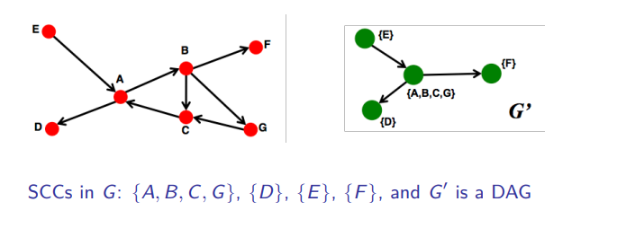

Graph structure of the Web
- There is a single giant SCC (there won’t be two SSCs)
- Assume two large SCCs, it just takes one page from one SCC to link to the other.
- If the two SCCs have millions of pages, the likelihood of this not happening is very very small.

##### Algorithm

- $V=\{1,\dots,n\}$ nodes (pages).
- $(i,j) \in E$ if page $i$ points to page $j$, i.e. $A_{ij}=1$.
- We assossiate to each page $i$ a real value $C(i)$ ($i$'s PageRank).
- We impose $\sum^n_{i=1}C(i)=1$.

$$
C(i)=\alpha\sum^n_{j=1}A_{ji}\frac{C(j)}{k_j^{out}}+\beta=\alpha\sum^n_{j=1}A_{ji}\frac{C(j)}{k_j^{out}}+\frac{1-\alpha}{n}
$$

- $\alpha, \beta > 0$
- $\beta=\frac{1-\alpha}{n}$
- $k_j^{out}$: node $j$'s out degree.

#### Problems

Without $\alpha$ and $\beta$ there are two problems:
1. **Spider trap**: eventually out-links within the group absorb all imporance. 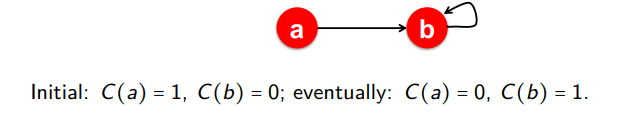
2. **Dead end**: pages having no out-links cause importance to "leak out". 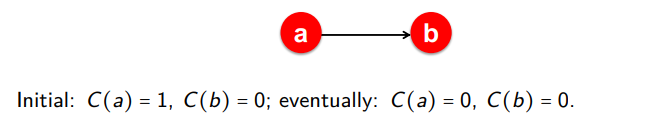

#### Improvements

1. With probability $\alpha$ follow a link at random.
2. With probability $1-\alpha$ jump to a random page.
3. Common values for $\alpha$ are in the range $0.8-0.9$. 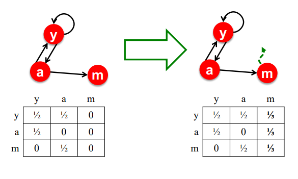
4. $\beta=\frac{1-\alpha}{n}$

#### Matrix Solution

1. Define stochastic matrix $S$ as:
   1. Normalization by columns of the original matrix $A$: This means that for each column $j$ of $A$, the sum of its entries is normalized so that it sums to $1$.
   2. Columns with only $0$ receive $\frac{1}{n}$
1. $G_{ij}=\alpha S_{ij}+\frac{1-\alpha}{n}$
   1. $\alpha$ is the damping factor, which balances between following the links in the graph (matrix $S$) and jumping to a random node (the second term $\frac{1-\alpha}{n}$).
   2. $S_{ij}$ is the entry of the stochastic matrix.
   3. $\frac{1-\alpha}{n}$ ensures that even if a page has no outgoing links (a dead end), the random jump guarantees some probability of transitioning to any other page.

The PageRank vector $\pi$ is a probability vector representing the PageRank scores of all the nodes. The PageRank equation is: 
$$
G\pi=\pi
$$

This is a form of the eigenvector equation: we want to find the vector $\pi$ such that multiplying it by matrix 
$G$ gives back the same vector $\pi$. In other words, $\pi$ is the stationary distribution of the transition matrix $G$.

$G\pi=\pi$ can be solved by the Power method, which converges fast to the PageRank solution:
1. Initialize all scores to random values.
2. Each score is updated according to the desired rule, until reaching a stable value (after normalization): $\pi^{t+1}=G\pi^t$. This is repeated until convergence and after each iteration vector $\pi$ is normalized to ensure that it remains a probability vector (i.e., the sum of its elements is 1).

##### Why it Works

The Power Method works because $G$ is a stochastic matrix with a unique dominant eigenvector (corresponding to the eigenvalue 1). This eigenvector represents the stationary distribution of the random walk defined by the transition matrix $G$, which is precisely the PageRank vector $\pi$.

The matrix $G$ is a stochastic matrix, meaning:
- Each column of $G$ sums to 1 (i.e., it's column-stochastic).
The entries of $G$ are non-negative (i.e. $G_{ij} \ge 0$).

A stochastic matrix models a Markov chain, and in this case, $G$ represents the transition matrix of a random walk on the web. **The key feature of such a matrix is that it has at least one eigenvalue equal to $1$, corresponding to a stationary distribution**, which is the dominant eigenvector that we seek (by Perron-Frobenius theorem: If $M$ is stochastic, then it has at least one stationary vector).

Matrix $G$ is irreducible, meaning that in the graph represented by $G$, it is possible to reach any node from any other node (directly or indirectly). This property comes from the damping factor $\frac{1-\alpha}{n}$, which ensures that every node has a small probability of being transitioned to from any other node.

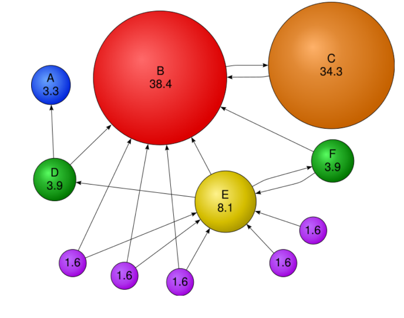

The PageRank computation can be interpreted as a Random Walk
process with restart.
- Teleportation probability: $\alpha$ gives the probability that in the next step of the random walk will follow a Markov process or with probability $1 − \alpha$ it will jump to a random node.
- Pagerank score of a node thus corresponds to the **probability** **of** this **random walker to be on this node after an infinite number of hops**.

### Node Similarity

- Distance: $d(x,y)$
- Inverse of distance: $s(x,y)=\frac{1}{d(x,y)}$
- Euclidean distance: or rather Hamming distance since A is binary (a dissimilarity): $d(i,j)=\sum_k(A_{ik}-A_{jk})^2$
- Common neighbors: $s_{ij}=|N_i\bigcap N_j|$. Based on the common neighbours measure, high-degree nodes are likely to attain large similarity scores, even when only a small fraction of their neighbours is shared.
  - Jaccard similarity (correcting bias): $s(i,j)=\frac{|N_i\bigcap N_j|}{|N_i|+|N_j|-|N_i\bigcap N_j|}$ or $s(i,j)=\frac{\sum_kA_{ik}A_{kj}}{\sum_k(A_{ik}+A_{jk})}$
  - Adamic and Adar score (correcting bias):  weight exclusive neighbours more heavily than neighbours that are shared by many nodes: $s(i,j)=\sum_{k\in N_j \bigcap N_j}\frac{1}{|N_k|}$
  - Cosine similarity: number of common neighbours normalised by the geometric mean of their degrees: $s(i,j)=\frac{|N_i\bigcap N_j|}{\sqrt{|N_i||N_j|}}$

## 5

### Network Metrics

- Macro (network) level: diameter, clustering, size of giant component.
- Micro (node) level: node degree, betweenness, PageRank score.
- Meso (subnetworks): motifs, graphlets, communities.

### Subnetworks

- Subnetworks (subgraphs) are the building blocks of networks.
- They can characterise and discriminate networks.
- They can describe the network structure around a given node.
- For each subgraph, we can use a metric capable of classifying the subgraph’s “significance": negative values = under-representation, positive values = over-representation.

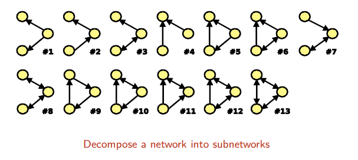

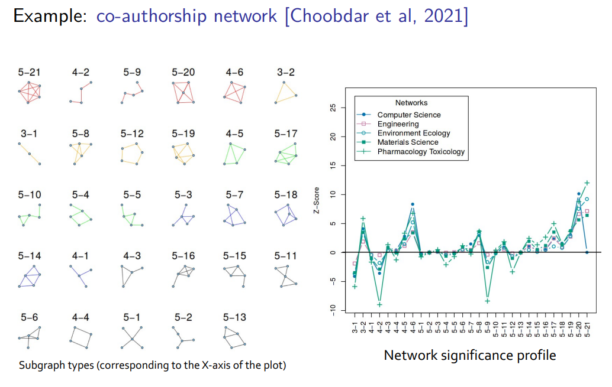

### Motifs

Network motifs: recurring, significant patterns of interconnections.

- Pattern: small induced/non-induced subgraph
- Recurring: found many times, i.e., with high frequency
- Significant: more frequent than expected, i.e. in randomly generated networks.

#### Types

- Feed-forward loops.
- Parallel loops.
- Single-input modules.

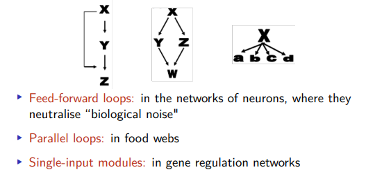

#### Finding Motif

Induced subgraph (motif) of interest: formed from a subset of nodes of the graph and all of the edges connecting pairs of nodes in the subset.

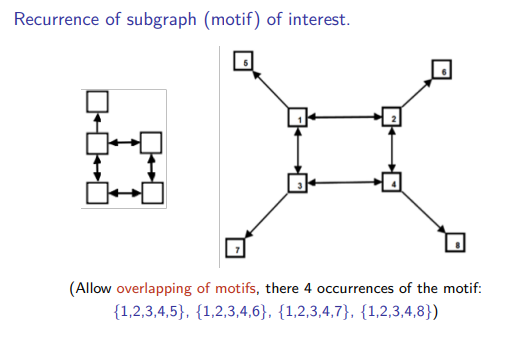

- Motifs are over-represented in a network when compared to a randomized network:

$$
Z_i = \frac{N_i^{real}-\overline{N_i^{rand}}}{str(N_i^{rand})}
$$

- $N_i^{real}$ is the number of subgrapgs of type $i$ in the network $G^{real}$
- $\overline{N_i^{rand}}$ is the average number of subgrapgs of type $i$ in the random network $G^{rand}$
- High $Z$-score: subgraph $i$ is a network motif of $G^{real}$
- Network Significante Profile, normalized $Z$-scores: $SP$ is a vector of normalised $Z$-scores, and it emphasises the relative significance of subgraphs:

$$
\text{SP}_i = \frac{Z_i}{\sqrt{\Sigma Z_j^2}}
$$

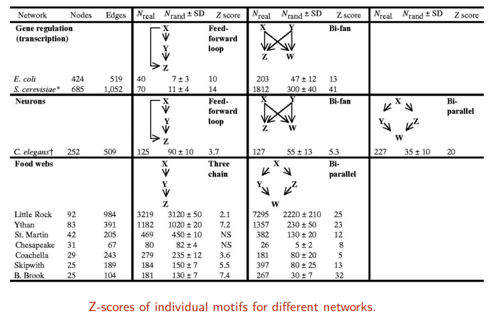

- Network of neurons and a gene network contain similar motifs:
  - Feed-forward loops and bi-fan structures
- Food webs have parallel loops:
  - Prey of a particular predator share prey
- WWW network has bidirectional links:
  - Allowing the shortest path among sets of related pages

### Graphlets

Graphlet - connected non-isomorphic subgraph.

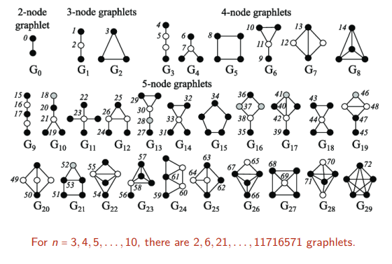

- Use graphlets to obtain node-level subgraph metric.
- **Degree counts**: number of edges that a node touches.
- **Graphlet degree vector**: counts number of  graphlets that a node touches, provides a measure of a node’s local network topology.

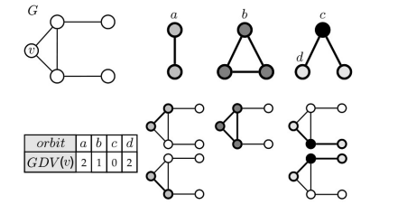

#### Problems with Finding Motifs & Graphlets

- Finding size-$k$ motifs/graphlets requires solving two challenges: 1. Enumerating all size-$k$ connected subgraphs and 2. Counting number of occurrences of each subgraph type.
- Just knowing if a certain subgraph exists in a graph is a hard computational problem ($NP-$complete)!
- Computation time grows exponentially as the size of the motif/graphlet increases (feasible size is usually small $3-8$).

### Communities

Granovetter’s theory suggests that networks are composed of tightly connected sets of nodes. Network **communities** (**clusters**, modules): sets of nodes with lots of internal connections and few external ones.

- Structure:
  - Structurally embedded edges are also socially **strong**.
  - Long-range edges spanning different parts of the network are socially **weak**.
- Information
  - Long-range edges (**weak**) allow you to gather information from different parts of the network and get a job.
  - Structurally embedded edges (**strong**) are heavily redundant in terms of information access.

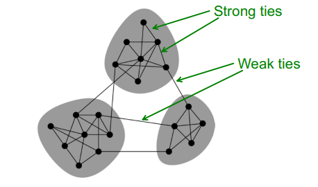

#### Community Detection

- Community detection is equivalent to “clustering" in unstructured data.
- Clustering: unsupervised machine learning:
  - Find groups of elements that are *similar to each other*.
  - Problem: what does *similar to each other* means?
- Find groups of nodes that are strongly connected to each
other, but weakly connected to the rest of the network, no formal definition.

Clustering (community detection) algorithms are either:
- **Hierarchical**:
  - Agglomerative: begin with singleton groups and join
  successively by similarity (e.g., Newman, Louvain)
  - Divisive: begin with one group containing all points and divide successively (e.g., Girvan-Newman)
- **Partitional**: separate points in arbitrary number of groups,
exchange according to similarity (e.g., graph partition).

#### Clustering Algorithms

##### Agglomerative Hierarchical Clustering

Agglomerative hierarchical clustering is based on the similarity measure between nodes, sets of nodes:
1. Assign each node to its own cluster.
2. Find the cluster pair with the highest similarity and join them.
together into a cluster
3. Compute new similarities between new joined cluster and others.
4. Go to step 2 until all nodes form a single cluster.
5. Select clustering (cut the tree at desired level).

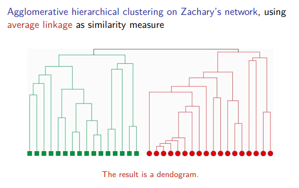

##### Divisive Hierarchical Clustering

Divisive hierarchical clustering is based on edge betweenness:
1. Compute betweenness for all edges in the network.
   - **Edge Betweenness**: The betweenness of an edge is the number
   of shortest-paths in the network that pass through that edge.
   - “Bridges" between communities have high edge betweenness.
2. Remove the edge with highest betweenness.
3. Go to step 1 until no edges left.

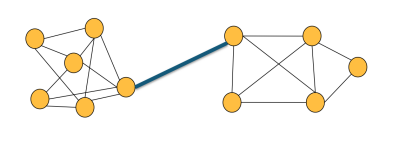

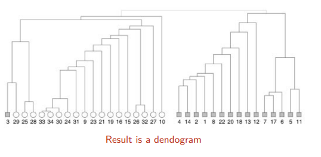

#### Modularity

- The modularity is computed for a partition of a graph (each node belongs to one and only one community).
- It compares the **observed fraction of edges** inside communities **vs**. the **expected fraction of edges** inside communities in a random network.
- Modularity: random graphs are not expected to have community structures, so we will use them as null models.

$$
Q = \sum_{c \in C}\left[\left(\text{\#edges within group c}\right)-\left(\text{expected \#edges within group c}\right)\right]
$$

$$
Q=\frac{1}{2m}\sum_{ij}(A_{ij}- P_{ij})\delta(c_i, c_j)
$$

- $P_{ij}$ is the expected number of edges between nodes $i$ and $j$ under the null model (average number)
- $c_i$ ($c_j$) is the community of node $i$ ($j$)
- $\delta(c_i, c_j) = 1$ if $c_i=c_j$ and $0$ otherwise (within same group).

##### Computing $P_{ij}$

The “configuration" random graph model chooses a graph with the same degree distribution as the original graph with n nodes and m edges uniformly at random.
- $2m$ stubs (edges) in configuration model
- $p_i=\frac{k_i}{2m-1}$ probability of picking at random a stub incident with node $i$ (with degree $k_i$)
- The probability of connecting node $i$ to node $j$ is then $p_ip_j=\frac{k_ik_j}{(2m-1)^2}$
- The probability of an edge existing between $i$ and $j$ $P_{ij}=2m\times p_ip_j\approx\frac{k_ik_j}{2m}$

Then:

$$
Q=\frac{1}{2m}\sum_{ij}(A_{ij}- \frac{k_ik_j}{2m})\delta(c_i, c_j)
$$

- $Q$ depends on nodes in the same clusters only.
- Large modularity means better communities (better than random intra-cluster density).
- Modularity values take range $[−1, 1]$
  - It is positive if the number of edges within groups exceeds the expected number.
  - $Q \ge 0.3 − 0.7$ means significant community structure.
- Modularity can be naturally extended to weighted/multi-edge networks with:
  -  $A_{ij}$ represents the edge weight between nodes $i$ and $j$.
  - $k_i$ and $k_j$ are the sum of the weights of the edges attached to nodes $i$ and $j$, respectively.
  - $2m$ is the sum of all of the edge weights in the network.

##### Using Modality Metric

1. Create a dendrogram by removing edges.
1. Cut the dendrogram at the **best** level using **modularity**.
1. It seems that the objective is to **optimize modularity**.
1. Why not identify communities by maximising modularity directly?

#### Lovain Algorithm for Community Detection

Louvain algorithm greedily maximises modularity.

- Simple, greedy algorithm for community detection ($O(n log n)$, easy to implement).
- Supports weighted graphs (modularity adapted for weighted networks).
- Yield a hierarchical community structure.
- Considered state-of-the-art:
  - Rapid convergence properties.
  - High modularity output, i.e. *better communities*.

1. **Phase 1**: Modularity is optimized by allowing only local changes of communities:
   1.  Assign a different community to each node.
   2.  For each node $i$, the algorithm performs two calculations:
       1. Compute the modularity gain ($\nabla Q$) when putting node $i$ into the community of some neighbour $j$.
       2. Move $i$ to a community of node $j$ that yields the largest modularity gain $\nabla Q$
       3. If no increase is possible, $i$ remains in its original community.
    3. Repeat until no movement yields a modularity gain.
    4. The output depends on the order in which the nodes are considered.
    5. The ordering of the nodes does not have a significant influence on the overall modularity that is obtained.

2. **Phase 2**: The identified communities are aggregated in order to build a new network of communities:
   1. Each partition $c_i$ obtained in **Phase 1** forms a new super-node $i$ (a self-loop with weight corresponds to the intra-community weight).
   2. Super-nodes $i$ and $j$ are connected if there is at least one edge betwee nodes of their corresponding partitions ($c_i$ and $c_j$)
   3. The weight of the edge between new super-nodes $i$ and $j$ is the sum of weights from all edges between their corresponding partitions ($c_i$ and $c_j$).
3. **Phase 3**: Repeated until no increase of modularity is possible.

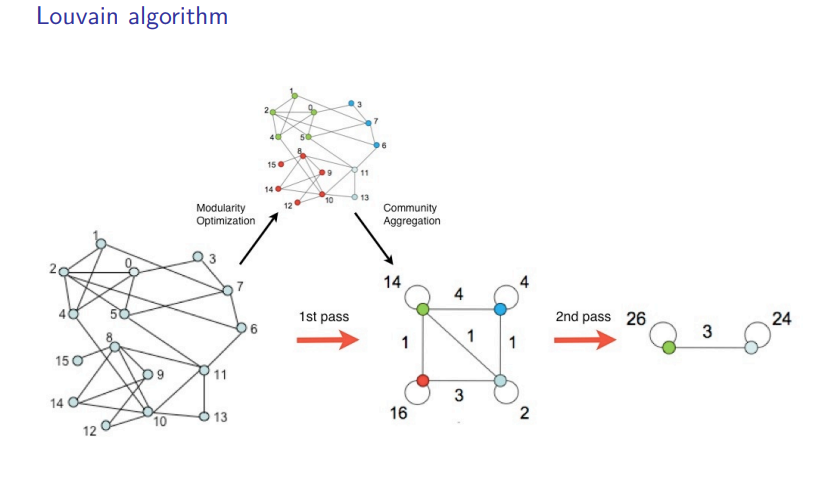

- Louvain produces only non-overlapping communities.
- It may yield arbitrarily badly connected communities.
- In the worst case, communities may even be disconnected, especially when running the algorithm iteratively.
- **Leiden algorithm** [Traag, Waltman, van Eck, 2019]

#### Leiden Algorithm

The **Leiden algorithm** is an improvement on the **Louvain algorithm**, addressing some of Louvain’s issues with disconnected communities. Leiden ensures that every community is well-connected by refining the community structure iteratively.

##### Key Differences from Louvain

- In Louvain, communities can become disconnected, but in Leiden, each community is guaranteed to be internally connected.
- Leiden consists of three main phases, like Louvain, but it performs an additional refinement step to ensure well-connectedness.

##### **Phase 1: Local Movement of Nodes**

1. **Initial Assignment**: Assign each node to its own community.
   - Example: {0: 0, 1: 1, 2: 2, 3: 3}
   
2. **Node Movement**: For each node `i`:
   - Evaluate the modularity gain when moving node `i` to the community of each of its neighbors.
   - Move node `i` to the community that provides the highest modularity gain (or keep it in its current community if no gain is possible).
   - Similar to the Louvain algorithm.

3. **Refinement**: After moving all nodes, **refine** each community to ensure it is connected:
   - If a community splits into multiple disconnected parts, treat each disconnected sub-community as a new community.
   - This guarantees that all resulting communities are internally connected.

4. **Repeat**: Continue the local movement of nodes until no node can move to a different community that increases modularity.

##### **Phase 2: Refinement of Communities**

1. **Community Splitting**:
   - After Phase 1, examine the connectivity within each community.
   - If a community consists of multiple disconnected sub-communities, split the community into those sub-communities.
   - Each new community is guaranteed to be internally connected.

2. **Aggregation**:
   - Like in the Louvain algorithm, after refining the communities, aggregate nodes that belong to the same community into a **super-node**.
   - The edges between these super-nodes correspond to the edges between the original communities.
   - Super-nodes might have self-loops representing intra-community connections.

##### **Phase 3: Re-Apply the Algorithm**

1. Apply the Leiden algorithm to the new graph of super-nodes.
2. Repeat **Phase 1** and **Phase 2** for the new graph until the communities stabilize, and no further modularity gains are possible.

##### Key Advantages of Leiden

- Leiden improves on Louvain by ensuring that communities are **well-connected** and by avoiding disconnected components within a community.
- The algorithm is more robust in terms of both accuracy and speed.

#### Problem with Modularity

Modularity $?=$ Definition of good communities.
- Discovery that modularity has a "favourite scale".
- For a graph of given density and size, communities cannot be smaller/larger than a fraction of nodes.
- Modularity optimization will never discover small (large) communities in large (small) networks
- Unable to find no community (networks without community structure).

## 6: Graph Partitioning

- Bi-partitioning task: divide verticies into two disjoint groups.
- Good partition:
  - Maximize the number of within-group connections
  - Minimize the number of between-group connections.

### Edge Cut

Cut: set of edges with one endpoint in each group:

$$
\text{cut}(A,B)=\sum_{i \in A, j \in B}w_{ij}
$$

- If the graph is weighted, $w_{ij}$ is the weight.

### Conductance

Conductance: connectivity between groups relative to the density of each group:

$$
\phi(A,B)=\frac{\text{cut}(A,B)}{\min{(\text{vol}(A), \text{vol}(B))}}
$$

- $\text{vol}(A)=\sum_{i\in A}k_i$: total (weighted) degree of the nodes in $A$.

This produces balanced partitions:

$$\argmin{_{A,B}\phi(A,B)}$$

- Computing the best conductance cut is NP-hard.
- We use approximation: **spectral graph partitioning**.

### Spectral Graph Partitioning

$$
Ax = \lambda x
$$

- Adjacency matrix:
  - Symmetric matrix.
  - $n$ real eigenvalues.
  - Eigenvectors are real-valued and orthogonal.
- Degree matrix:
  - Diagonal matrix.
- Laplacian matrix $L=D-A$:
  - $n\times n$ symmetric matrix
  - Trivial eigenpair: 
    - $x=(1,1,\dots,1)$
    - Then $Ax=(d,d,\dots,d)=\lambda x$
    - Then $\lambda=d$
    - $x=(1,1,\dots,1)$ and $\lambda = d$ is an eigenpair of $G$, with $\lambda=d$ largest eigenvalue of $A$.
- An $n\times n$ matrix can have up to $n$ eigenpairs.
- Eigenvectors are orthogonal to each other $\to$ ene of the consequences of orthogonality is that the sum of the components of the second eigenvector must equal zero. This is because, in many cases, the first eigenvector corresponds to a constant vector (i.e., all components are equal) and the dot product of this with the second eigenvector would only be zero if the sum of the second eigenvector's components is zero.
- The second eigenvector is called Fiedler vector and can be used to partition the nodes of the graph into two groups. Since the elements in the vector sum up to 0, we have a group of elements that are positive and that are negative. We assossiate nodes with positive elements in the vector (1st group) and nodes with negative elements (second group).

#### Optimization

For any symmetric matrix $M$, the second smallest eigenvalue is a solution to the following:

$$
\lambda_2=\min_x\frac{x^TMx}{x^Tx}
$$

For graph $G$ and $L$ - Laplacian matrix of $G$:

$$\begin{aligned}
   x^TLx
   &=\sum^n_{i,j}L_{ij}x_ix_j \\
   &=\sum^n_{i,j}(D_{ij}-A_{ij})x_ix_j \\
   &=\sum_{i}D_{ii}x_i^2
-\sum_{(i,j)\in E}2x_ix_j \\
   &= \sum_{(i,j)\in E}(x_i^2
+x_j^2-2x_ix_j) \\
   &=\sum_{(i,j)\in E}(x_i
-x_j)^2
\end{aligned}$$

- $x_i^2$ needs to be summed up $D_{ii}$ times. Edge $(i,j)$ has two end points, so $x_i^2 + x_j^2$.

We also know that:
- $x$ is chosen to be a unit vector, i.e. $\sum_ix_i^2=1$
- $x$ is orthogonal to $(1,1,\dots,1)$, $\sum_ix_i\times1=\sum_ix_i=0$

$$
\lambda_2=\min_{x:\sum_ix_i=0}\frac{x^TLx}{x^Tx}=\min_{x:\sum_ix_i=0}\frac{\sum_{(i,j)\in E}(x_i-x_j)^2}{\sum_ix_i^2}=\min_{x:\sum_ix_i=0}\sum_{(i,j)\in E}(x_i-x_j)^2
$$

- We want to asign values $x_i$ to nodes $i$ such that few edges cross $0$.
- We want $x_i$ and $x_j$ to subtract each other.

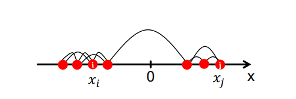

$$
\min_{y\in R^n, \sum_iy_i=0, \sum_iy^2_i=1}f(y)=\sum_{(i,j)\in E}(y_i-y_j)^2=y^TLy
$$

- The minimum value of $f(y)$ is given by the 2nd smallest eigenvalue $\lambda_2$ of the Laplacian matrix.
- The optimal solution for $y$ is given by the corresponding eigenvector $x$, referred to as Fiedler vector.
- Use sign of $x_i$ to determine cluster assignment of node $i$.
- Good partition of a graph $\to$ minimize conductance:
  - Approximate conductance using spectral partitioning.
  - Spectral finds a cut that has at most twice the conductance as the optimal one of conductance $\alpha$: $\lambda_2 \le 2\alpha$

#### Algorithm

1. Pre-processing: construct a matrix representation of the graph (Adjacency matrix $\to$ Degree matrix $\to$ Laplacian matrix)
2. Decomposition:
   1. Compute eigenvalues and eigenvectors of the matrix.
   2. Map each node to a lower-dimensional representation based on one **(or more)** eigenvectors.
3. Grouping: assign nodes to two **(or more)** clusters, based on the new representation representation.

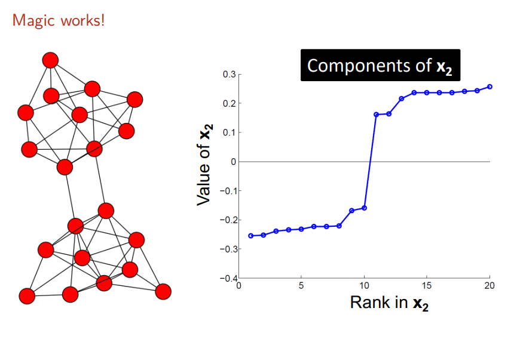

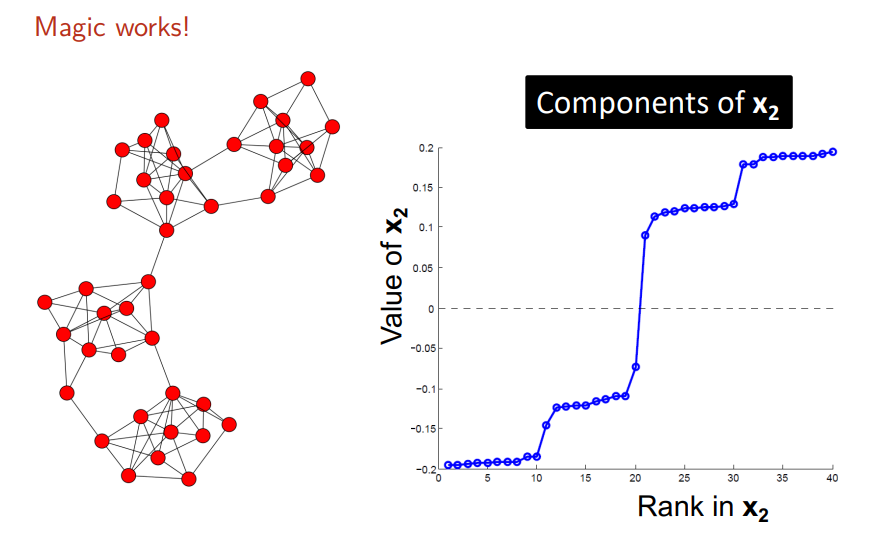

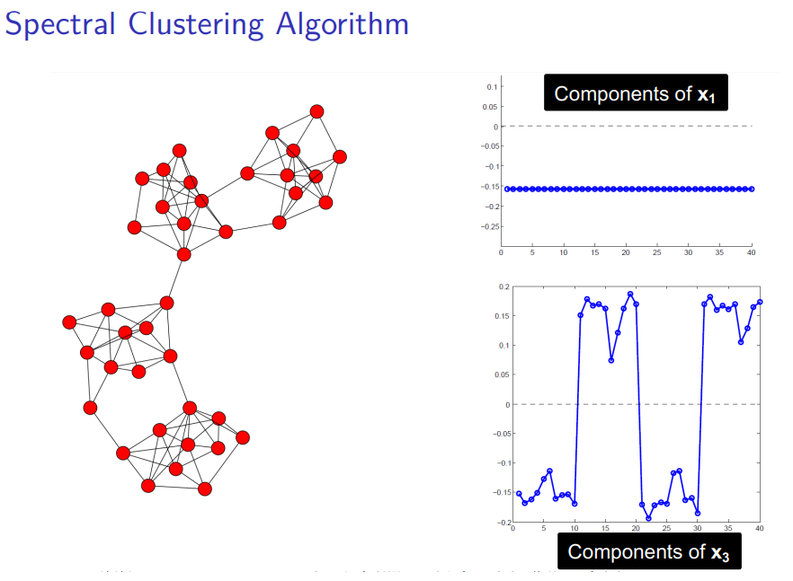

### Partitioning in $k$ Clusters

- Recursive bi-partitioning: apply the bi-partitioning algorithm in a hierarchical divisive manner, but inefficient and unstable.
- Cluster multiple eigenvectors: build a reduced space from multiple eigenvectors. Each node is now represented by $k$ numbers, then cluster the nodes based on their k-dimension representation.
  - he idea behind clustering multiple eigenvectors is to use more than just the second eigenvector.
  - Compute the eigenvectors corresponding to the $k$ smallest eigenvalues of the graph's Laplacian matrix.
  - These $k$ eigenvectors form a new feature space in which each node is represeneted by a vector of length $k$.
  - We can represent each node in $k$ dimensional space and perform standart clustering algorithms.

### Overlapping Communities

- Overlapping community detection is considered much harder.
- Many algorithms: adaptations of modularity.
- Many local methods, unlike global optimisation for non-overlapping methods.
- Main idea:
  - Clique: a subset of vertices (or nodes) within a graph such that every two distinct vertices in the clique are connected by an edge.
  - Internal edges of community likely to form clique.
  - Inter-community edges unlikely to form clique.
   - $k$-clique: complete subgraph on $k$ nodes.
   - Adjacent $k$-cliques: two $k$-cliques that share $k−1$ nodes
   - Module: union of adjacent $k$-cliques

#### Clique Percolation Method

1. Find all $k$-cliques
2. Merge iteratively all adjacent $k$-cliques

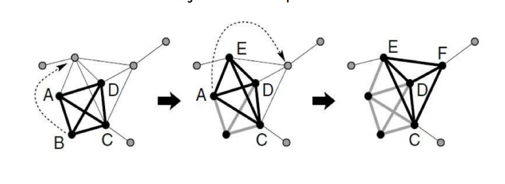

- Pros:
   - Believed to be non-polynomial.
   - But claimed to be efficient on real networks.
   - Widely used for detecting overlapping communities.
- Cons:
   - Failed for graph with few cliques.
   - Give a trivial community structure if too many cliques.
   - Left out nodes.
   - What value of $k$ to choose to give a meaningful structure?

## 7: Network Effects and Cascading Behaviour

Cascading behaviour: Behaviours that cascade from node to node like an epidemic. Examples:

- Biological: diseases via contagion, e.g. COVID-19.
- Technological: cascading failures, spread of information.
- Social: misinformation, news, viral marketing.

### Cascade

- **Contagion** spreads over the edges of the network creating a **propagation tree**, i.e. **cascade**.
- **Contagion**: stuff that spreads.
- **Adaption, infection, activation**: "infection" event.
- **Infected/active nodes, adopters**.

### Model Diffusion

- **Decision-based models**: Models of product adoption, decision making (a node observes the decisions of its neighbours and makes its own decision).
- **Probabilistic models**: Models of influence or disease spreading (an infected node tries to “push” the contagion to an uninfected node).

#### Decision-based Diffusion Models

Based on 2-player coordination game:

- Two players: each chooses option A or B.
- Each player can only adopt one “behaviour”, either A or B.
- The player gains more payoff if his friend has adapted the same behaviour.
- Payoff matrix:
   - If both v and w adopt behaviour A, they each get payoff a > 0.
   - If both v and w adopt behaviour B, they each get payoff b > 0.
   - If both v and w adopt the opposite behaviours, they each get 0.
- In a large network each node v is playing a copy of the game with each of its neighbours. The payoff is the sum of node payoffs per game.

Let v have d neighbors. Assume fraction p of v's neighbours adapt A. Then v chooses A if $p=\frac{a}{d}>\frac{b}{d}=\frac{b}{a+b}=q$ (payoff threshold).

##### Example

1. Step 0:

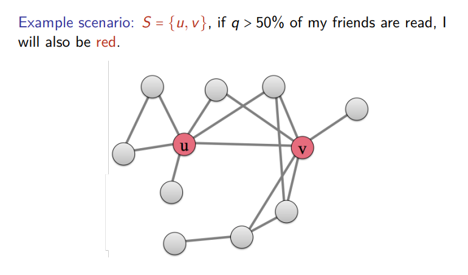

2. Step 4:

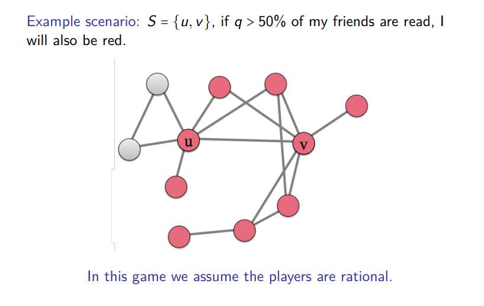

#### Probabilistic Diffusion & Epidemic Models

In high contagion probability the contagion spreads (if a tree, then until the tree leafs). In low contagion probability the contagion dies out.

Two parameters:

- Contagion transmission rate $\beta$ (probability that a susceptible node gets infected by a neighbor )
- Contagion death rate $\delta$ (probability that an infected node heals)

##### General Scheme

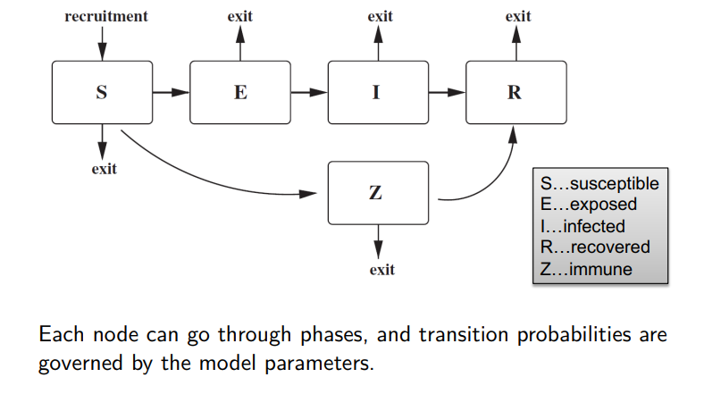

##### Models

1. Susceptible-Infective (SI) model: 
   1. Susceptible $\to_{\beta}$ Infected
   2. $\frac{dS}{dt}=-\beta SI, \frac{dI}{dt}=\beta SI$
   3. 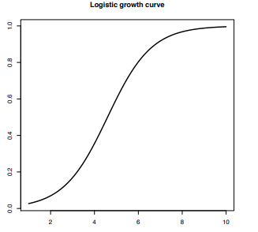
2. Susceptible-Infective-Recovered (SIR) model: 
   1. Susceptible $\to_{\beta}$ Infected $\to_{\delta}$ Recovered
   2. $\frac{dS}{dt}=-\beta SI, \frac{dR}{dt}=\delta I, \frac{dI}{dt}=\beta SI - \delta I$
   3. 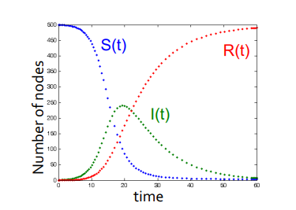
3. Susceptible-Infective-Susceptible (SIS) model:
   - Cured nodes immediately become susceptible.
   - Virus “strength”: $s = \frac{\beta}{\delta}$
   - $\frac{dS}{dt}=-\beta SI+\delta I, \frac{dI}{dt}=\beta SI - \delta I$
   - 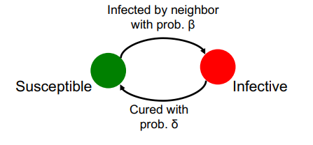
   - 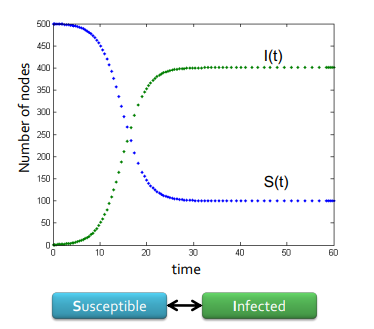
   - Epidemic threshold of an arbitrary graph $G$ is $\tau$, such at if the virus “strength” $s = \frac{\beta}{\delta}<\tau$ , the epidemic cannot happen.
   - Given graph $G$ represented by adjecency matrix $A$, we have **no** epidemic if $\frac{\beta}{\delta}<\tau=\frac{1}{\lambda_{1,A}}$, where $\lambda_{1,A}$ is the largest eigenvale of $A$.
   - 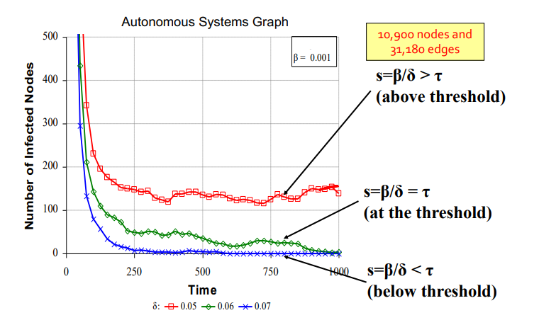
   - In the long run, it does not matter how many people are initially infected. It all converges to the virus strength and threshold.
4. Susceptible-Infective-Exposing-Skeptics (SEIZ) model:
   1. 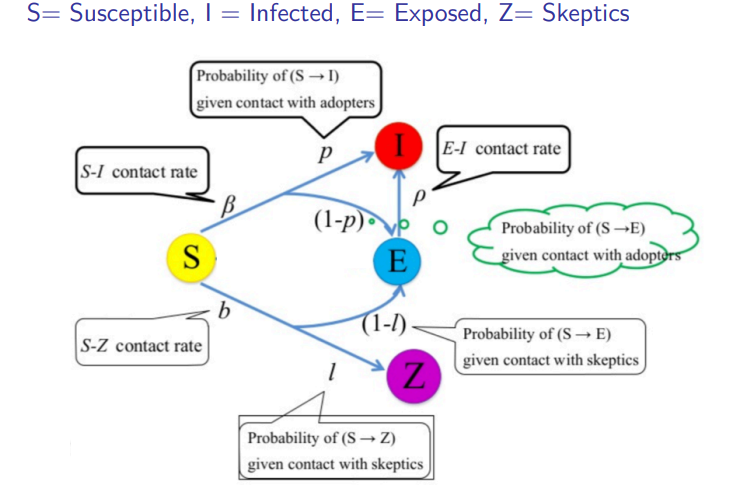
   2. Metric that quantifies whether a cascade is a rumor or not using the fit parameters: $R_{SI}=\frac{(1-p)\beta + (1-I)b}{p = e}$. This metric represents the ratio of the users entering state E to those leaving state E.
   3. Parameter values are found through the grid search for eadch cascade by minimizing $|I(t)-tweets(t)|$, where $tweets(t)$ are the rumour tweets.
   4. 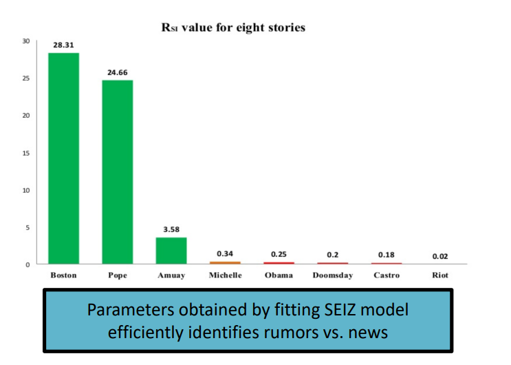

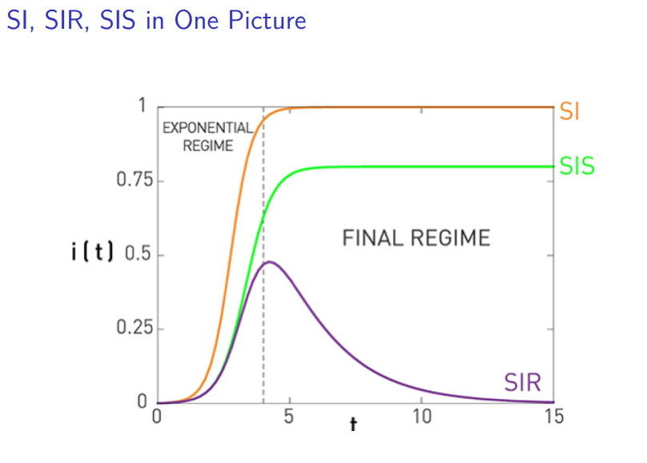

#### Burstness

Is a user more likely to protest if several neighbors become active in a short time period? Calculate the burstiness of active neighbors:

$$
\frac{\nabla k_a}{k_a}=\frac{k_a^{t+1}-k_a^t}{k_a^{t+1}}
$$

- $k_a$: number of active neighbours when a user became active.
- $k_n$: total number of neighbours when a user became active.

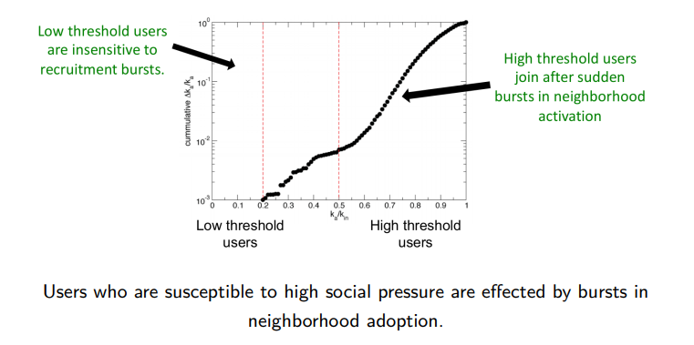

## 8: Exposure & Contagion Models

### Exposure Curves

- **Exposure**: Nodes' neighbor exposes the node to the contagion.
- **Adoption**: The node acts on the contagion.
-  **Exposure curve**: Probability of adopting new behavior depends on the total number of neighbours who have already adopted it. 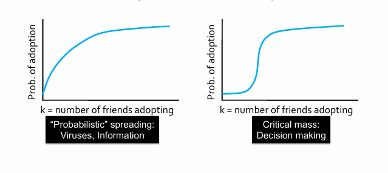
-  As number of neighbors in the group increases, the probability of the node joining also increases.
-  We are influenced more by our friends than strangers.

### Simple Contagion Models

#### Independent Cascade Model

Independent cascade model:

- Directed finite $G = (V,E)$.
- Set $S$ starts out with new behaviour (nodes with this behaviour are “active”).
- Each edge $(v,w)$ has a probability $p_{vw}$.
- If node $v$ is active, it gets one chance to make $w$ active, with probability $p_{vw}$ (each edge fires at most once).
- Scheduling does not matter: 
  - If $u,v$ are both active at the same time, it doesn’t matter which tries to activate $w$ first.
  - Time moves in discrete steps.
- When node $u$ becomes active/infected, it activates each out-neighbor $v$ with probability $p_{vw}$.

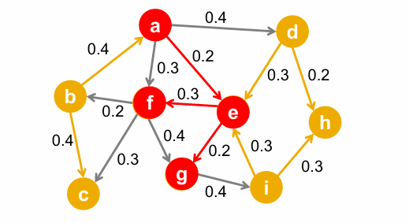

#### Linear Threshold Model

- A node $v$ has a random threshold $\theta_v \sim U[0,1]$.
- $v$ is influenced by each neighbor $u$ according to a weight $w_{uv}.
- All weights for each $v$ sum to 1: $\sum_{u\in N(v)}w_{uv}\le1$
- Node $v$ becomes active when the weighted combination of its active neighbors surpasses the threshold $\theta_v$: $\sum_{u\in N(v)\cap A}w_{uv}\ge\theta_v$

#### Live-Edge Model

- The aforementioned models are stochastic processes.
-  Hence to calculate the exact influence spread in a graph G(V,E), one has to consider all possible $2^{∣E∣}$ combinations that represent different realizations of the graph.
- **The live-edge model**: Flip a coin for each edge and keep the subgraph $g$ formed by the succesfull ones.
-  For every node $v$, the count of nodes reachable by the subgraph’s paths is the influence spread under this realization: $\sigma_g(s)$
-  Compute $\sigma_g(s)$ for all possible graphs weighted by the respective probability, to get the estimated influence spread: $\sigma(v)=\sum_{g \subseteq G}P(g)\sigma_g(s)$
- Remember the example we did in class for a 4 node graph.

### Finding Influences

1. Consider a topological or centrality criterion of the nodes of the network.
2. Rank the nodes accordingly.
3. The top-ranked nodes are candidates for the most influential ones.
4. Simulate the spreading process over the network to examine the performance of the chosen nodes e.g., using the IC or the LT model.

### Graph Degeneracy & K-Core

- Ranking based on degree and pagerank **do not suffice** to detect the most influential nodes.
- **Cascades** **require** the dynamics of close-knit **cliques** to ”convince” the users to adopt them.
- The **k-core** of a graph is the maximum subgraph such that each node has degree $k$ or more in the subgraph.
- The core value of a node $v$ is the maximum number $c(v)$ such that the node $v$ belongs to the $c(v)$-core.
- The **degeneracy** of a graph is the maximum number $c$ such that a c-core exists.
- Users with higher k-core start the most successful cascades.

#### K-Core Decomposition

- Start with $k = 1$ and iterate until all nodes are removed.
- For each k, remove recursively all nodes with degree less than a threshold k.
- Each retrieved subgraph indicates a progressively stronger clique that can support the spreading of a cascade.

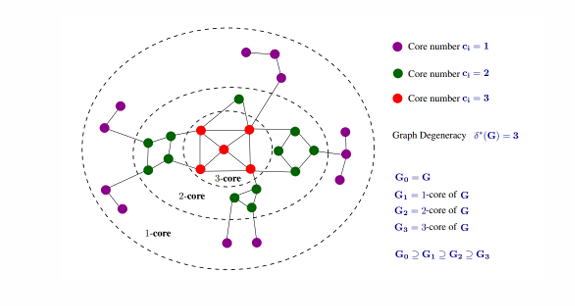

### Most Influential Set

- Most influential set of size k under a diffusion model f : set Sof k nodes producing largest expected cascade size f (S) if activated
- Optimisation problem $\max_Sf(S)$
- Why“expected cascade size”? as said above, $f(a)$ is a result of a random process. So in practice we compute $f(a)$ for many random realisations and then maximise the “average” value $f(S)$
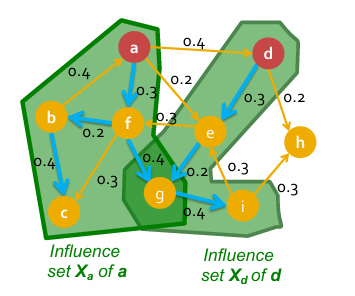
- Set $S$ is more influential if $f(S)$ is larger: $f(\{a,b\}) < f(\{a,c\}) < f(\{a, d\})$ 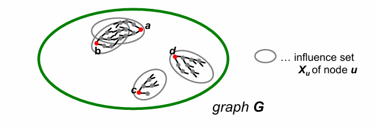
- $\max_Sf(S)$ is NP-Complete.
- The greedy approach is called **Greedy Hill Climbing** algorithm.

#### **Greedy Hill Climbing**

- Start with $S_0=\{\}$
- For $i=1,\dots,k$:
  - Activate the node $u$ that $max_uf(S_{i-1}\cup\{u\})$
  - $S_i=S_{i-1}\cup\{u\}$

Example:
1. Evaluate $f(\{a\}),...f(\{e\})$, pick argmax of them.
2. Evaluate $f(\{d,a\}),...f(\{d,e\})$, pick argmax of them.
3. Evaluate $f(\{d,b,a\}),...f(\{d,b,e\})$, pick argmax of them.

- The Hill climbing produces a solution $S$ where $f(S)\ge(1-\frac{1}{e})\times f(OPT)=0.63\times f(OPT)$
- $\sigma$ is monotone: $\sigma(S\cup\{v\})\ge\sigma(S), \forall v \in V, \forall S \subseteq V$
- This means that **activating more nodes can not diminish the influence spread**, i.e. adding an element to a set gives less improvement than adding it to one of its subsets. 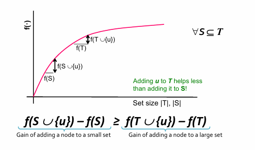

#### Accelerating Greedy

**Cost Effective Lazy Forward**:
- Initially compute the influence spread of every node, sort the list in descending order, and choose the first node as seed.
- At each iteration $t$, start computing the new influence spread from the top.
- If the current spread of the top node is bigger than the previous spread of the second node, e.g., $\sigma_{t+1}(v) \ge \sigma_t(z)$, $v$ is our new seed and we don’t need any other computations.
- This happens because $\sigma_{t}(z) \ge \sigma_{t+1}(z)$ by definition and $\sigma_{t}(z) \ge \sigma_{t}(n), \forall n \in G$ because the list is sorted.
- Compute $\sigma_{t+1}(z) \iff \sigma_{t+1}(v) \le \sigma_{t}(z)$, update the list, resort, and continue this process until the top spread is bigger than the second spread.
-  CELF is up to 700 times faster then greedy in practice, having the same worst case complexity. 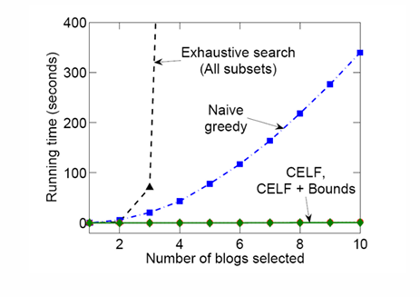

## 9: Machine Learning on Graphs

### Node Classification

Node-level features characterise the structure and position of a node in the network.

- Node degree counts the neighbouring nodes without capturing their importance.
- Node centrality takes the node importance in a graph into account (betweenness centrality, closeness centrality, etc.).
- Clustering coefficient counts the number of triangles in the ego-network.
- Graphlets: generalise "triangles" to "pre-specified" subgraphs (graphlet degree vector counts the number of graphlets that a node touches).
- Importance-based features: useful for predicting influential nodes in a graph.
   - Node degree, different node centrality measures
- Structure-based features: useful for predicting a particular role a node plays in a graph.
  - Node degree, clustering coefficient, graphlet count vector.

### Link Prediction (= Recommendation Systems)

- Observed network: current state.
- Link prediction: what edges:
  - Might appear in the future (future link prediction).
  - Might have been missed (missing link prediction).
- Link prediction based on network structure (local vs. global).
- Link prediction based on node properties & network structure.

#### Link Prediction via Proximity

Link prediction via proximity:

- For each pair of nodes $(x,y)$, compute score $c(x,y)$.
- For example, $c(x,y)$ could be the number of common neighbours of $x$ and $y$.
- Sort pairs $(x,y)$ by the decreasing score $c(x,y)$.
- Predict top n pairs as new links.

Different scoring functions $c(x,y)$:

- Graph distance: (negated) shortest path length.
- Common neighbours: $|N_i\cap N_j|$.
- Jaccard’s coefficient: $\frac{|N_i\cap N_j|}{|N_i|+|N_j|-|N_i\cap N_j|}$.
- Adamic and Adar score: $\sum_{k\in N_i \cap N_j}\frac{1}{|N_k|}$.
- PageRank: $r_x(y)+r_y(x), r_x(y)$ is the stationary distribution score of $y$ under the random walk: with probability $0.15$, jump to $x$; with $0.85$, go to a random neighbour of the current node.

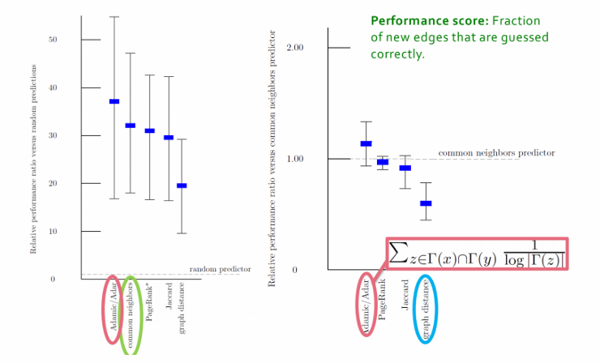

#### Link Prediction via Network Structure

Link prediction via network structure:

- Compute community structure on the whole graph.
- Assign a high score for two nodes in the same community, a low score otherwise.
- For methods based on a quality function optimisation (e.g., modularity), assign a score to each pair proportional to the change in quality function association with adding an edge between them.
- For example, Louvain algorithm optimises modularity:
  - Each edge added between communities decreases in the
   modularity.
  - Each edge added inside community increases in the modularity.

#### Features

- **Distance-based features**: use the shortest path length between two nodes but do not capture how neighbourhood overlaps.
  - Graph distance.
- **Local neighbourhood overlap**: captures how many neighbouring nodes are shared by two nodes.
  - Common neighbours, Jaccard’s coefficient, Adamic and Adar score.
- **Global neighbourhood overlap**: uses global graph structure to score two nodes.
  - PageRank, community structure.

### Graph Level Features

#### Kernel Method

- Kernel $K(G,G') \in R$ measures similarity between data.
- There exists a feature representation $\phi(\cdot)$, such that $K(G,G') = \phi (G)^T\phi(G')$.
- Once the kernel is defined, an off-the-shelf ML model, such as kernel SVM, can be used to make predictions.

Graph kernels measure similarity between two graphs.

- Graphlet kernel
- Weisfeiler-Lehman kernel
- Others: random-walk kernel, shortest-path graph kernel, etc.

#### Graphlet kernel

Graphlet features: count the number of different graphlets.

- The definition of graphlets here is slightly different from node-level features.
- Nodes in graphlets here do not need to be connected (allows for isolated nodes).
- The graphlets here are not rooted.

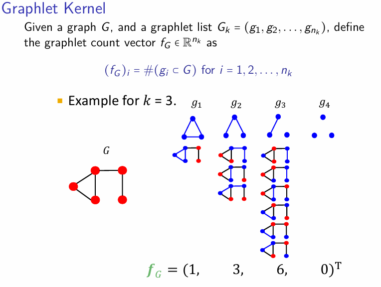

Given two graphs $G$ and $G'$ graph kernel is computed as:

$$
K(G, G')=f_G^Tf_{G'}
$$

If G and G′ have different sizes, that will greatly skew the value, so we normalize each vector:

$$
h(G)=frac{f_G}{\sum(f_G)}, K(G, G')=h_G^Th_{G'}
$$

**Limitation: Counting graphlets is expensive!**

#### Weisfeiler-Lehman Kernel (Color Refinement)

 Colour refinement: given a graph $G$ with a set of nodes $V$

- Assign an initial colour $c^{(0)}(v)$ to each node $v$.
- Iteratively refine node colours by 
  - $c^{(k+1)}(v) = \text{HASH}(\{c^{(k)}(v),\{c^{(k)}(u)\}_{u\in N(v)}\})$
  - where $\text{HASH}$ maps different inputs to different colours.
- After $K$ steps of colour refinement, $c^{(K)}(v)$ summarises the structure of $K$-hop neighbourhood.

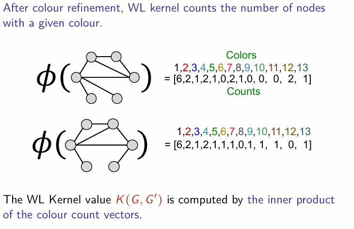
