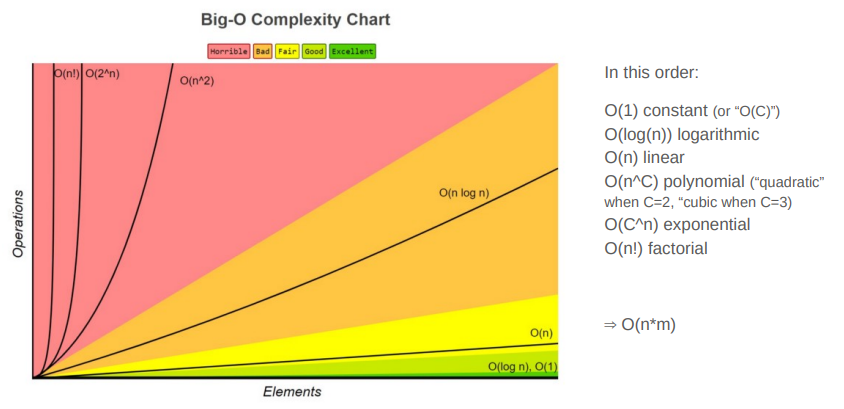
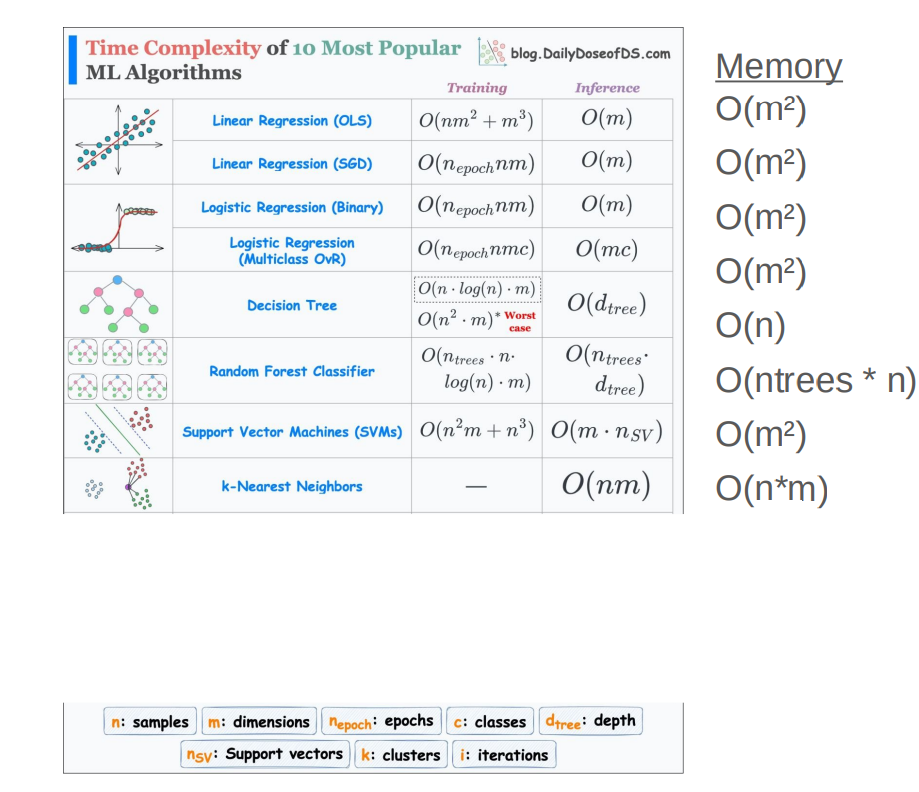
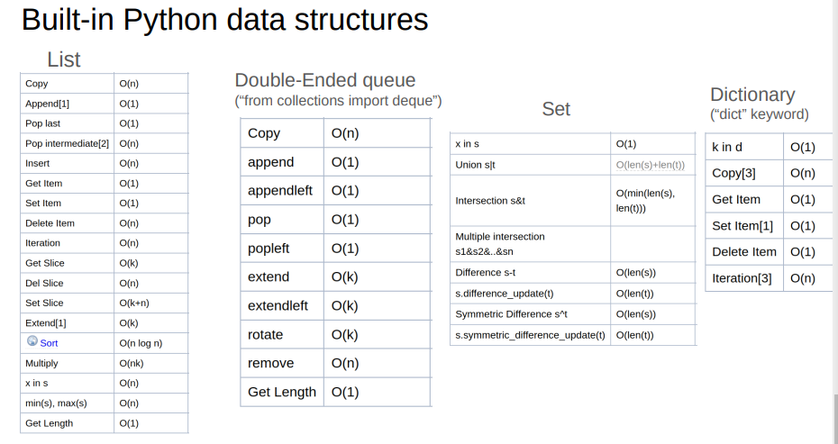

# Python

- Interpreted Language: Python is an interpreted language, meaning the code is executed line by line at runtime.
- Global Interpreter Lock (GIL): Python uses a Global Interpreter Lock, which prevents multiple native threads from executing Python bytecodes simultaneously
    - Lock that allows only one thread to hold the control of the Python
    interpreter $\iff$ only one thread can be in a state of execution at
    any point in time.
    - Why GIL? Python uses reference counting for memory management. It means that objects created in Python have a reference count variable that keeps track of the number of references that point to the object. When this count reaches zero, the memory occupied by the object is released. The problem was that this reference count variable needed protection from race conditions where two threads increase or decrease its value simultaneously. This can cause:
        - It can cause either leaked memory that is never released.
        - Release the memory while a reference to that object still exists.
        - This reference count variable can be kept safe by adding locks to all data structures that are shared across threads so that they are not modified inconsistently.
        - But adding a lock to each object or groups of objects means multiple locks will exist which can cause another problem—Deadlocks (deadlocks can only happen if there is more than one lock) and can also decrease performance.
        - The GIL is a single lock on the interpreter itself which adds a rule that execution of any Python bytecode requires acquiring the interpreter lock. This prevents deadlocks (as there is only one lock) and doesn't introduce much performance overhead. But it effectively makes any CPU-bound Python program single-threaded.
    - Python cannot bring a change as significant as the removal of GIL without causing backward incompatibility issues.
- Dynamic Typing: Python is dynamically typed, meaning that variable types are determined at runtime.
- Memory Management: Python uses automatic memory management (garbage collection).
- High-level Abstractions: Python provides many high-level abstractions, such as list comprehensions, generators, and dynamic data types, which, while easy to use, often come with performance trade-offs compared to lower-level operations.
- Interpreted Nature of Libraries: Python libraries may introduce additional performance bottlenecks.

---------

\pagebreak

# Numpy

- While a Python list can contain different data types within a single
list, all the elements in a NumPy array should be homogeneous.
- NumPy arrays are faster and more compact than Python lists. An
array consumes less memory.
- NumPy uses much less memory to store data, and it provides a
mechanism of specifying the data types. This allows the code to
be optimized even further.
- An array is a central data structure of the NumPy library. It is a grid
of values, and it contains information about the raw data, how to
locate an element, and how to interpret an element.

## Array

- Is usually a fixed-size container of items of the same type and size.
- The number of dimensions and items in an array is defined by its
shape.
- The shape of an array is a tuple of non-negative integers that
specify the sizes of each dimension.
- In NumPy, dimensions are called axes.
- Allows broadcasting. Two dimensions are compatible when
    - they are equal, or
    - one of them is 1.

---------

\pagebreak

# Multiprocessing Basics

## Compiler

Compiler translates whole code into machine code at once. After compilation, the executable can be run without the need for the source code $=>$ fast.

## Interpreter

Interpreter translates code line by line. The source code is required each time the program runs.

## Thread

A thread is a lightweight, smaller execution unit within a process. Multiple threads can exist within a single process, sharing the same memory space. No need to create new processes, but because threads share memory, this can lead to issues like race conditions or deadlocks unless properly managed with synchronization mechanisms.

## Subprocess

A subprocess is an entirely separate process created by a parent process, with its own memory space and resources, thus better isolation & fewer concurrency issues, since memory is not shared, but more overhead due to the need for separate memory allocation.

## Paralellism

- **Process-based**: In process-based parallelism, each parallel task runs in a separate process with its own memory space. This type of parallelism is common in multi-core systems where tasks are completely independent and do not need to share memory. Since processes are isolated, memory corruption or race conditions are less of an issue. **Use** **case**: running multiple independent programs or tasks that don't need to share data. **Advantage**: **stability** and **security** due to **process** **isolation**
- **Thread-based**: In thread-based parallelism, multiple threads are created within a single process, and they all share the same memory space. This approach is more efficient in terms of resource usage since threads share memory and context, allowing faster communication between threads. Threads can run in parallel on multiple CPU cores, but they introduce complexity due to shared memory (e.g., managing race conditions). **Use** **case**: running concurrent tasks that need to communicate or share memory, like handling multiple connections in a web server.

---------

\pagebreak

# Structures

## Process

When can create a process using `Process()`. We will then start the process using `process.start()`. To make the `__main__()` process wait until `process` is finished, we use `process.join()`.

## Queue

Queue is used to share data between processes. When you call `queue.get()`, this will only get the first element in the queue. The order of elements added to the queue is not necessarily straight due to asynchronous nature of multiprocessing.

## Pool

`Pool()` is used to create processes. For example:

```
def f(x):
    return x*x

if __name__ == '__main__':
    with Pool(5) as p:
        print(p.map(f, [1, 2, 3]))
```

Note that we create $5$ processes for $3$ inputs, which is unnecessary. Also note that one process finishes working on the input, it takes next input and processes it.

---------

\pagebreak

# Big O Notation

- "Big": Represents the upper bound of an algorithm’s growth rate for large input sizes.
- "O": Stands for Order of Magnitude, describing how the runtime or space requirements increase with input size.
Why is Big O Important?
- Analyzes Performance Trends:
    - Worst-case performance scenario as input size grows.
    - Provides a theoretical analysis, (does no provide an accurate measurement #iterations, #seconds).
    - May be used for different aspects: computing time, memory, data transfer, …
- Evaluates Algorithm Efficiency:
    - Predicts how algorithms will scale with larger inputs.
    - Helps in comparing different algorithms to choose the best one.
    - Optimizing existing algorithms (bottleneck identification, improvement)
- Key Questions It Helps Answer:
    - Is the algorithm's performance feasible for large data?
    - Does it justify the computational cost?
    - How much computing power (e.g., # of cores) is required for reasonable performance?

Big-O Complexity:

- $O(1)$ - constant.
- $O(\log{n})$ - logarithmic, e.g. Binary Search, Binary Tree traversal (search).
- $O(n)$ - linear, e.g. linear search.
- $O(n\log{n})$, e.g. merge sort.
- $O(n^C)$ - polynomial, e.g. $n^1$ - $1$ for loop, $n^2$ - $2$ for loops.
- $O(C^n)$ - exponentia, e.g. $O(2^n)$, brute force a binary code of $10$ digits.
- $O(n!)$ - factorial.



\pagebreak

## Big-O and ML

1. Large-Scale Datasets
    - What happens if I increase the number of data samples?
        - Can the model process the dataset within a reasonable time?
        - Should we subsample the data for faster processing?
    - What happens if I increase the number of features?
        - Analyzes the impact of high dimensionality on computational cost.
        - Guides the need for dimensionality reduction (e.g., PCA) or feature selection.
2. Large-Scale Models
    - What happens if I increase the model size?
        - Should we use a more efficient model or opt for distributed training?
        - Is the computational cost of increasing model parameters justifiable?
3. Specific Performance Needs
    - Real-time applications (e.g., real-time inference for video streaming, online decision-making):
        - Can the algorithm meet latency requirements?
    - Low-capacity hardware (e.g., drones, mobile devices):
        - Is the data and model lightweight enough to run efficiently on limited hardware?

## Conclusions

1. Useful for describing ML algorithms
    - Describes how an algorithm's performance scales with input size
    - Useful to take quick decisions on data structure, ML algorithm
    - Useful also to describe complex cases where different factor
2. When a code is well optimized, Big O notation is not enough:
    - Ignoring constant factors and lower-order terms
    - Ignoring language performance , and individual operations (example: FP64 operations slower than
INT32 )
    - The performance of algorithms can be affected by various CPU architectures, memory hierarchies,
and parallel processing capabilities
    - Big O notation with HPC methodologies
        - Big O notation of #messages in addition of time and memory consumption
        - Code Profiling: Computing time, Memory, …
        - Strong Scalability Analysis (Fixing the input size, increase the #cores)
        - Weak Scalability Analysis (Increase the input size, increase the #cores)

## Data Structures, ML Algorithms and Big O





---------

\pagebreak

# Linearity

- Simplicity: Linear systems are much easier to solve, analyze, and
understand than nonlinear systems. Linearity ensures that
superpositions of solutions are also solutions, making problems more
tractable.
- Approximation: Many complex, nonlinear systems can be
approximated locally by linear systems. For instance, in calculus,
nonlinear functions are approximated by their linear tangents through
linearization.
- Applications: Linearity plays a key role in many fields. In physics, for
example, linearity is central in quantum mechanics and wave theory. In
machine learning, linear models like linear regression form the basis
for more complex models.

## Properties

1. $f(x_1 + x_2) = f(x_1) + f(x_2)$
1. $f(a \cdot x_1) = a \cdot f(x_1)$
2. $f(ax_1 + bx_2)=af(x_1) + bf(x_2)$
3. Linear functions transform a linear combination of inputs into the same linear combination of outputs.

\pagebreak

# Profiling

- Identify Bottlenecks: Profiling helps you identify which parts of your code are consuming the most time or other resources.
- Data-Driven Optimization: Profiling provides concrete data about your code's performance.
- Prevent Premature Optimization: Profiling helps you avoid the common pitfall of premature optimization, which can lead to code complexity and reduced maintainability.
- Prioritize Efforts: When dealing with limited resources (time, budget, etc.), profiling helps you prioritize which parts of your code to optimize. You can focus on the critical sections that have the most significant impact on overall performance.
- Avoid Over-Engineering: Profiling helps you strike a balance between performance and readability/maintainability.
- Benchmark Improvements: After making changes to your code, profiling allows you to measure the actual impact of those changes.
- Continuous Improvement: Profiling should be an ongoing process. As your codebase evolves, new bottlenecks may emerge, or the performance characteristics may change.
- Debugging: Profilers often provide insights into unexpected behavior or errors in your code. You may discover unintended inefficiencies or even bugs that are only apparent when looking at performance data.

## Profiling Types

- Event based : data collected when events occurs (entry/exit
function, allocate/free memory).
    - Profiler may overhead
- Statistical : data collected periodically. The profiler does not give a overhead, data profiling are only sampled.
- Instrumented manually : developper put keyword to select codes to profiles (`time.time(),%%time, ...`)

## Profiling Features

- Memory usage. Different scale : (process, file, object, line).
- Time usage. Different scale : (process, function, line).
- Hits count : Count number of time line/function are reached.

---------

\pagebreak

# HPC

- High-Performance Computing: A field of computing focused on
aggregating computational power to solve large, complex problems
much faster than standard computing.
- HPC systems often consist of clusters or supercomputers that perform
parallel processing, making them essential for tasks like scientific
simulations, data analysis, and machine learning.
- In parallel computing, parallelization divides a task into smaller parts to
be processed simultaneously, often to improve speed and efficiency. 

## Types of Parallelism

### Data Parallelism

- Description: In data parallelism, the same operation is applied to
different subsets of the data simultaneously. Each processor
handles a portion of the data independently.
- Example: Image processing, where each part of the image is
processed by a separate processor.
- Best For: Applications that perform the same operation on a large
data set, like matrix computations or batch data processing in
machine learning.

### Task Parallelism

- Description: In task parallelism, different tasks or functions are
executed in parallel, often on separate processors or threads.
Each task can perform a unique operation on the same or different
data.
- Example: A web server handling multiple client requests
simultaneously or processing various stages of a pipeline
concurrently.
- Best For: Applications with distinct tasks that can be done in
parallel, like different stages of an algorithm or independent
services in microservices architecture.

### Pipeline Parallelism (Pipeline Processing)

- Description: Pipeline parallelism divides a task into stages, where
each stage is processed in sequence, and each stage is handled
by a different processor or thread. As soon as one stage is
completed, the data is passed to the next stage.
- Example: Assembly lines in manufacturing or stages of data
processing in deep learning (e.g., one stage handles data loading,
another handles processing, and a third stage performs training).
- Best For: Applications with sequential stages that can overlap,
such as data processing pipelines or streaming data applications.

### Hybrid Parallelism

- Description: Hybrid parallelism combines multiple types of
parallelism (often data and task parallelism) to maximize
efficiency. This approach is used to leverage the strengths of
different types of parallelization within a single application.
- Example: Scientific computing applications, where different parts
of a problem (e.g., computation-heavy tasks and data-heavy
tasks) are parallelized differently.
- Best For: Large-scale applications that require both data and task
parallelism, especially on clusters or supercomputers.

### Bit-level Parallelism

- Description: In bit-level parallelism, the hardware processes
multiple bits of data simultaneously. It’s primarily a hardwarelevel approach, where the CPU processes data in larger chunks
(e.g., 32-bit, 64-bit).
- Example: Arithmetic operations on large integers or signal
processing in digital circuits.
- Best For: Low-level hardware optimization to improve processing
speed.

### Loop Parallelism

- Description: Loop parallelism focuses on parallelizing loops
within a program, where iterations are executed in parallel rather
than sequentially.
- Example: Running a loop that performs a similar operation on
each element of an array, where each iteration can be assigned to
a different processor.
- Best For: Computational loops in numerical simulations,
statistical calculations, or vectorized operations in scientific
applications.

### Domain Decomposition (Spatial Parallelism)

- Description: The problem’s domain (e.g., physical space in
simulations) is divided into smaller sub-domains, and each
processor works on a sub-domain. Often used in simulations that
rely on spatial divisions.
- Example: Computational fluid dynamics simulations, where each
processor handles a section of the physical simulation space.
- Best For: Applications like physics simulations, weather
forecasting, and other scientific computing tasks that can be
broken down into independent regions.

---------

\pagebreak

# SLURM

Slurm (Simple Linux Utility for Resource Management): Workload manager used to schedule and manage jobs on HPC clusters. It allocates resources to users, queues job requests, and ensures efficient resource utilization, handling job priorities, dependencies, and distributing tasks across available computing nodes.

1. Cluster Structure.
2. Job Submission.
3. Resource Allocation and Scheduling.
4. Job Execution.
5. Job Monitoring and Management.
6. Completion and Cleanup.

## Allocating a Job

- **sbatch** is used to submit a job script for later execution.
- **salloc** is used to allocate resources for a job in real time.

## Useful Commands

- **squeue** reports the state of jobs or job steps. By default, it reports
the running jobs in priority order and then the pending jobs in
priority order.
- **sstat** is used to get information about the resources utilized by a
running job or job step.
- **scancel** is used to cancel a pending or running job or job step.

## Example of a Batch Job

- `-J my_batch_job`: Job name
- `-N 1`: Number of nodes
- `--ntasks-per-node=1`: Number of tasks per node
- `--output=aipaca_test_4.txt`: Name of output file
- `-c 7`: Cores assigned to each tasks
- `--time=0-48:00:00`: Time to execute the script
- `-p gpu`: Partition
- `--mail-user your.email@uni.lu`: Mail to send notifications
- `--mail-type BEGIN,END,FAIL`: Type of notifications to send

1. Load modulues: `module load lib/UCX/1.9.0-GCCcore-10.2.0-CUDA-11.1.1`
2. Load virtual environment: `conda activate tcc`
3. Run your code: `python large_generate_data_cnn2d.py`

## Example of an Interactive Job

`salloc -t 30 -N 1 -c 7 -p gpu --ntasks-per-node=1`

\pagebreak

# MPI (Distributed Computing)

- The Message Passing Interface (MPI) is a standardized and portable
message-passing standard designed to function on parallel computing
architectures.
- The MPI standard defines the syntax and semantics of library routines
that are useful to a wide range of users writing portable messagepassing programs in C, C++, and Fortran.
- MPI is a communication protocol for programming[4] parallel
computers. Both point-to-point and collective communication are
supported.

## Parts

1. Initialize MPI environment.
2. Get the Rank and Size:
    - Rank is the unique identifier for each process, obtained with MPI_Comm_rank. Each process receives a different rank, starting from 0 up to size - 1.
    - Size is the total number of processes, obtained with `MPI_Comm_size`.
3. Communication (data transfer).
4. Main computation.
5. Finalize MPI environment.

## MPI4py

- MPI for Python provides Python bindings for the Message Passing
Interface (MPI) standard, allowing Python applications to exploit
multiple processors on workstations, clusters and supercomputers.
- This package builds on the MPI specification and provides an object
oriented interface resembling the MPI-2 C++ bindings.
- It supports point-to-point (sends, receives) and collective (broadcasts,
scatters, gathers) communication of any picklable Python object, as
well as efficient communication of Python objects exposing the Python
buffer interface (e.g. NumPy arrays and builtin bytes/array/memoryview
objects).

## Communicating Python Objects and Array Data

MPI for Python can communicate any built-in or user-defined
Python object taking advantage of the features provided by the
pickle module. These facilities will be routinely used to build
binary representations of objects to communicate (at sending
processes), and restoring them back (at receiving processes).

### Communicators

- In MPI for Python, `Comm` is the base class of communicators.
- The number of processes in a communicator and the calling
process rank can be respectively obtained with methods
`Comm.Get_size` and `Comm.Get_rank`.

### Point-to-Point Communications

- Point to point communication is a fundamental capability of
message passing systems. This mechanism enables the
transmission of data between a pair of processes, one side
sending, the other receiving.
- MPI provides a set of send and receive functions allowing the
communication of typed data with an associated tag. 

### Blocking Communications

- MPI provides basic send and receive functions that are blocking. These
functions block the caller until the data buffers involved in the
communication can be safely reused by the application program.
- In MPI for Python, the `Comm.Send`, `Comm.Recv` and `Comm.Sendrecv`
methods of communicator objects provide support for blocking point-to-point communications within `Intracomm` and `Intercomm` instances. These methods can communicate memory buffers.
- The variants `Comm.send`, `Comm.recv` and `Comm.sendrecv` can
communicate general Python objects.

### Nonblocking Communications

- On many systems, performance can be significantly increased by
overlapping communication and computation. This is particularly
true on systems where communication can be executed
autonomously by an intelligent, dedicated communication
controller.
- In MPI for Python, the `Comm.Isend` and `Comm.Irecv` methods
initiate send and receive operations, respectively. These methods
return a `Request` instance, uniquely identifying the started
operation. Its completion can be managed using the `Request.Test`,
`Request.Wait` and `Request.Cancel` methods. 

### Collective Communications

- Collective communications allow the transmittal of data between
multiple processes of a group simultaneously.
- The more commonly used collective communication operations
are the following.
  - Barrier synchronization across all group members.
  - Global communication functions
    - **Broadcast data** from one member to all members of a group. Root sends the same data to all. Each rank receives same data.
    - **Gather data** from all members to one member of a group. For example, the gather operation collects data from all processes and sends it to the root process.
    - **Scatter data** from one member to all members of a group. Root divides data and sends chunks. Each rank receives a unique chunk.
  - Global reduction operations such as `sum`, `maximum`, `minimum`, etc.

## Running Python scripts with MPI

Most MPI programs can be run with the command `mpiexec`. In
practice, running Python programs looks like:
`mpiexec -n 4 python script.py`

## Using MPI4py

1. Load MPI module (every time before running your script): `module load mpi/OpenMPI`
2. Install mpi4py (just once): `pip install mpi4py`
3. Allocate resources from SLURM (every time before running your script).

### Example Point-to-Point Message

1. Allocate resources for using one node, two tasks and each using one CPU:
    - `--nodes 1`
    - `--ntasks-per-node 2`
    - `--cpus-per-task 1`
2. Run interactive job for 30 minutes: `si -t 30 --nodes 1 --ntasks-per-node 2 --cpus-per-task 1`
3. `module load mpi/OpenMPI`
4. `mpiexec -n 2 python point_point.py`

```
from mpi4py import MPI
comm = MPI.COMM_WORLD
rank = comm.Get_rank()
if rank == 0:
    data = {'a': 7, 'b': 3.14}
    comm.send(data, dest=1, tag=11)
    print(f"rank {rank} sends data")
elif rank == 1:
    data = comm.recv(source=0, tag=11)
    print(f"rank {rank} receives {data}")

```

\pagebreak

### Example Point-to-Point Many Tasks

1. `si -t 30 --nodes 1 --ntasks-per-node 128 --cpus-per-task 1`
2. `mpiexec -n 2 python point_point2.py` use just 2 nodes.
3. `mpiexec -n 128 python point_point2.py` ues all 128 nodes.

```
from mpi4py import MPI
comm = MPI.COMM_WORLD
size = comm.Get_size()
rank = comm.Get_rank()
if rank == 0:
    data = {'a': 7, 'b': 3.14}
    for i in range(1, size):
        comm.send(data, dest=i, tag=11)
    print(f"rank {rank} sends data")
elif rank > 0:
    data = comm.recv(source=0, tag=11)
    print(f"rank {rank} receives {data}")
```

### Example Collective Communication Broadcasting

1. `si -t 30 --nodes 1 --ntasks-per-node 10 --cpus-per-task 1`
2. `mpiexec -n 10 python collective_comm1.py`

```
from mpi4py import MPI
comm = MPI.COMM_WORLD
rank = comm.Get_rank()
if rank == 0:
    data = {
        'key1' : [7, 2.72, 2+3j],
        'key2' : ( 'abc', 'xyz')
    }
else:
    data = None
data = comm.bcast(data, root=0)
print(f"rank {rank} has {data}")

```
\pagebreak

### Example Collective Communication Scattering

1. `si -t 30 --nodes 1 --ntasks-per-node 10 --cpus-per-task 1`
2. `mpiexec -n 10 python collective_comm2.py`

```
from mpi4py import MPI
comm = MPI.COMM_WORLD
size = comm.Get_size()
rank = comm.Get_rank()
if rank == 0:
    data = [(i+1)**2 for i in range(size)]
else:
    data = None
data = comm.scatter(data, root=0)
print(f"rank {rank} has {data}")
```

### Example Collective Communication Gather

1. `si -t 30 --nodes 1 --ntasks-per-node 10 --cpus-per-task 1`
2. `mpiexec -n 10 python collective_comm3.py`

```
from mpi4py import MPI
comm = MPI.COMM_WORLD
size = comm.Get_size()
rank = comm.Get_rank()
data = (rank+1)**2
data = comm.gather(data, root=0)
if rank == 0:
    for i in range(size):
        assert data[i] == (i+1)**2
else:
    assert data is None
print(f"rank {rank} has {data}")
```

\pagebreak

### Example MPI4py

```
from mpi4py import MPI
import time
import random
# Initialize MPI
comm = MPI.COMM_WORLD
total_procs = comm.Get_size()
rank = comm.Get_rank()
hostname = MPI.Get_processor_name()
if rank == 0:
    # Step 1: Create data and distribute it
    data = list(range(10 * total_procs)) # Create data (example: a list of integers)
    chunk_size = len(data) // total_procs # Determine slice size
    print(f"Process {rank} on {hostname} has created data: {data}")
    # Step 2: Send slices of data to all other ranks
    for i in range(1, total_procs):
        start = i * chunk_size
        end = (i + 1) * chunk_size
        comm.send(data[start:end], dest=i)
        print(f"Process {rank} sent data slice {data[start:end]} to process {i}")
    # Rank 0 also processes its own slice of data
    local_data = data[0:chunk_size]
    result = sum(local_data) # Example slow computation: sum of elements
    print(f"Process {rank} computed its result: {result}")
    # Step 3: Receive results from all other ranks
    for i in range(1, total_procs):
        result += comm.recv(source=i)
        print(f"Process {rank} received result from process {i}")
    # Step 4: Output the final result
    print(f"Final aggregated result: {result}")
else:
    # Step 5: Receive part of the data
    local_data = comm.recv(source=0)
    print(f"Process {rank} on {hostname} received data slice: {local_data}")
    # Step 6: Run the slow algorithm (e.g., sum of elements)
    local_result = sum(local_data)
    # Simulate long time
    sleep_time = random.randint(1, 5)
    time.sleep(sleep_time)
    print(f"Process {rank} computed its result: {local_result}")
    # Step 7: Send the result back to rank 0
    comm.send(local_result, dest=0)
    print(f"Process {rank} sent result back to process 0")
# Finalize MPI
MPI.Finalize()
```

# Neural Networks

Neural Network applications are expanding with their capability to manage diverse data (not only vector)

Below are the most common deep learning algorithms.

Convolutional Neural Networks (CNNs)
* Core algorithm: **Convolution layer**
* Input Type: Spatial data. E.g., 1D signal such as sound, white&black image, colored image.
* How It Works: CNNs leverage convolution layers to capture spatial hierarchies, using filters (kernels) to detect features like edges, textures, colors, and shapes in images.
* Application examples: Image recognition, object detection, facial recognition, etc.


Graph Neural Networks (GNNs)
* Core algorithm: **Graph Convolution layer**
* Input Type: Graph-structured data, such as molecular graphs (atoms as nodes, bonds as edges), social networks (people as nodes, relationships as edges), or citation networks between documents, or URL between web pages.
* How It Works: GNNs learn node and edge features by iteratively aggregating and updating information from neighboring nodes and their connections (edges). Each node's representation is computed by aggregating features from its neighbors, capturing both local and global structural patterns. This allows GNNs to capture the relationships and dependencies between entities in non-Euclidean spaces.
* Application examples: Molecular property prediction (e.g., drug discovery), social network analysis, traffic prediction, knowledge graph completion, and protein structure prediction.


Auto-Regressive Neural Networks (Example: WaveNet)
* Core algorithm: **Auto-regression** (AR)
* Input Type: Sequential data, typically time-series data (e.g., stock prices, weather data, language).
* How It Works: ARNNs predict future values in a sequence based on a linear combination of prior observed values. The model generates outputs step-by-step, using its own previous predictions as inputs for the next time step. In neural networks, this is often implemented with architectures like RNNs, LSTMs, or Transformers, where the current output depends on previous outputs.
* Application examples: Speech synthesis (text-to-speech), and autoregressive image models (pixel-level image generation).

Recurrent Neural Network (E.g., Long Short-Term Memory Networks)
* Core algorithm: **Recurrent layers with memory cells**
* Input Type: Sequential data, e.g., time-series data (financial data, stock prices), language, and speech data.
* How It Works: LSTMs maintain a memory of past inputs through a system of gates (input, forget, output) that control the flow of information. This allows them to capture long-term dependencies in sequences without losing important context over time.
* Application examples: Time-series forecasting, stock prediction, machine translation, speech recognition, and video analysis.

Q-Learning / Reinforcement Learning
* Core algorithm: Off-policy temporal difference (TD) learning
* Input Type: Interaction data from an environment, typically represented as state-action pairs (S, A), where the agent takes actions in states and receives rewards.
* How It Works: Q-Learning is a reinforcement learning algorithm that seeks to learn the optimal action-selection policy by estimating the Q-values (expected cumulative reward) for each action in each state. The agent updates its Q-values using the Bellman equation based on the reward received from the environment and the maximum future Q-value for the next state. Over time, the agent learns to choose the action that maximizes the cumulative reward, forming an optimal policy.
* Application examples: Robotics control, autonomous navigation, resource management in complex environments, chess.


Physics-Informed Neural Networks (PINNs)
* Core idea: Integration of physical laws (Partial Differential Equations, PDEs) into neural network training
* Input Type: Data governed by physical phenomena, often represented through differential equations. Examples include systems like fluid dynamics, structural mechanics, and heat transfer.
* How It Works: PINNs incorporate known physical laws, expressed as PDEs, directly into the loss function of the neural network. During training, the network not only fits observed data but also minimizes a term representing the residual of the governing equations (e.g., Navier-Stokes for fluid flow). This enables PINNs to make physically consistent predictions, even with sparse or noisy data, by embedding these constraints into the model.
* Application examples: Simulating fluid flows, solving inverse problems in engineering, weather prediction, modeling heat transfer, and structural mechanics simulations.

Concept of Tensors: Tensors are mathematical objects that generalize scalars, vectors (1D), and matrices (2D) to higher dimensions. 

Graph Representation: Neural networks can be visualized as directed graphs:
* Nodes represent tensor operations (e.g., multiplication, addition).
* Edges represent the flow of information (data) between these operations.

Topology of Neural Networks: The specific structure or topology is designed to balance various considerations:
* Prediction Quality: Aim to minimize overfitting (model too complex) and underfitting (model too simple).
* Training/Inference Time: Efficiency in both training the model and making predictions.
* Memory Consumption: Ensuring the model fits within computational limits.
* Simplicity: Keeping the architecture as simple as possible while achieving good performance.

Neural network layers can be viewed as sub-graphs within the overall neural network structure, each designed to perform specific functions.
